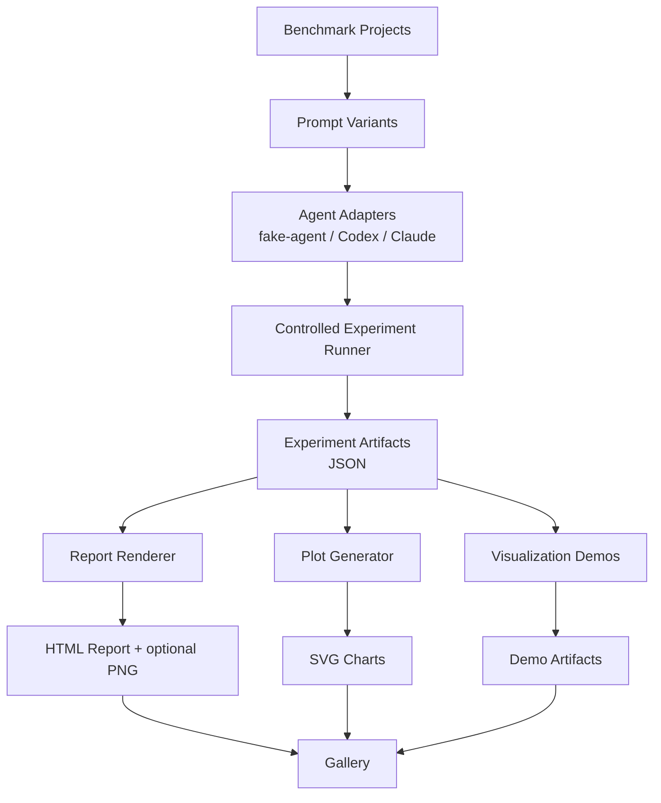

# my-dev-kit-lab

my-dev-kit-lab is the experiment, evidence, reporting, and demo companion for [my-dev-kit](https://github.com/your-org/my-dev-kit). It runs reproducible experiments that test whether my-dev-kit's graph-guided retrieval helps coding-agent workflows, collects metrics, renders reports, generates plots, captures screenshots, and builds gallery outputs.

**my-dev-kit** is the repo indexing and graph-guided retrieval engine.
**my-dev-kit-lab** is the separate lab layer that feeds it benchmark inputs and records evaluation outputs.

---

## Current capabilities

- Benchmark projects at small, medium, and large complexity levels
- Project complexity metrics and benchmark case metadata with answer keys
- Prompt variant generation at `short`, `medium`, `long`, and `multi-step` complexity levels
- Fake-agent adapter for deterministic smoke and demo validation
- Codex and Claude adapters for real-agent campaigns
- Controlled experiment runner comparing `raw-full-file` vs `my-dev-kit-guided` strategies
- Deterministic correctness scoring from answer keys
- Token usage, duration, and status comparisons between matched strategy pairs
- HTML experiment report rendering
- Static SVG plot generation
- Optional PNG screenshot capture
- Gallery manifest and static gallery index output
- Visualization demos using my-dev-kit commands against benchmark projects
- Final demo workflow combining all pipeline stages

---

## Architecture overview



---

## Quickstart

### Install

PowerShell:

```powershell
npm install
```

macOS/Linux shell:

```bash
npm install
```

### Build

```bash
npm run build
```

### Verify the installation

```bash
npm run verify
```

`cmd.exe` users can run the same commands on one line without shell line continuations.

### Run the fake-agent final demo (deterministic, no external agent CLIs required)

PowerShell:

```powershell
npm run run-final-demo -- `
  --cases examples/token-savings-cases.json `
  --out lab-output/final-demo `
  --kit-command "node tests/fixtures/fake-my-dev-kit-cli.js" `
  --agents fake-agent `
  --complexities short `
  --no-screenshot
```

macOS/Linux shell:

```bash
npm run run-final-demo -- \
  --cases examples/token-savings-cases.json \
  --out lab-output/final-demo \
  --kit-command "node tests/fixtures/fake-my-dev-kit-cli.js" \
  --agents fake-agent \
  --complexities short \
  --no-screenshot
```

`cmd.exe` example:

```cmd
npm run run-final-demo -- --cases examples/token-savings-cases.json --out lab-output/final-demo --kit-command "node tests/fixtures/fake-my-dev-kit-cli.js" --agents fake-agent --complexities short --no-screenshot
```

This runs a full pipeline: controlled experiment -> report -> plots -> visualization demos -> gallery.
The lab resolves Windows `.cmd` and `.ps1` npm shims without requiring Bash, and command paths with spaces are supported on Windows, macOS, and Linux.

### Run a real-agent campaign (requires Codex or Claude CLI)

```bash
npm run run-controlled-experiment -- \
  --cases examples/real-agent-campaign-cases.json \
  --agents codex,claude \
  --strategies raw-full-file,my-dev-kit-guided \
  --complexities medium,multi-step \
  --out lab-output/real-agent-campaign \
  --include-real-agents \
  --continue-on-failure \
  --timeout-ms 240000
```

Real-agent runs require local Codex or Claude CLI setup and available usage capacity. Runs that time out, produce invalid output, or hit session limits are recorded as structured outcomes rather than failures.

---

## Where to find outputs

| Artifact | Location |
|---|---|
| Experiment summary | `lab-output/<experiment>/experiment-summary.json` |
| All runs | `lab-output/<experiment>/experiment-runs.json` |
| Strategy comparisons | `lab-output/<experiment>/experiment-comparisons.json` |
| HTML report | `lab-output/<report>/experiment-report.html` |
| Report JSON | `lab-output/<report>/experiment-report.json` |
| Report screenshot | `lab-output/<report>/experiment-report.png` |
| Plot data | `lab-output/<plots>/plot-data.json` |
| SVG charts | `lab-output/<plots>/charts/*.svg` |
| Gallery manifest | `lab-output/<gallery>/gallery-manifest.json` |
| Gallery index | `lab-output/<gallery>/gallery-index.html` |

---

## How to read the main report

Open `experiment-report.html` in a browser. The report shows:

- **Project profile** - benchmark project name, language mix, complexity score, and file tree
- **Benchmark tasks** - task descriptions and answer keys
- **Strategy comparisons** - paired `raw-full-file` vs `my-dev-kit-guided` runs per case
- **Correctness scores** - deterministic answer-key scoring, not semantic LLM judging
- **Token usage** - estimated or reported token totals per run
- **Token savings** - positive means my-dev-kit used fewer tokens; negative means it used more
- **Duration** - wall-clock time per run
- **Status** - completed, timeout, invalid-output, or limit-reached
- **Warnings and limitations** - notes on missing token totals or partial results

See [docs/METRICS.md](docs/METRICS.md) for full metric definitions.

---

## Current limitations

- Token savings shown in fake-agent runs are based on estimated character counts, not provider billing telemetry
- Claude does not expose token totals; token savings comparisons are unavailable for Claude runs
- Codex may expose token totals but can produce timeouts or invalid-output runs
- Small projects may make raw-full-file cheaper than my-dev-kit-guided; larger localized tasks are where my-dev-kit is expected to become more useful
- The current baseline does not yet prove every future value claim; stronger evidence requires future experiment types such as warm-index reuse, incremental-change, and context-window scaling
- Provider telemetry dashboards, semantic LLM judging, and cloud API billing integration are not yet implemented
- `npx my-dev-kit-lab@0.1.1` exposes the final demo entrypoint, but the most reliable validated path remains running from a checked-out lab repository where bundled benchmarks and docs are present

---

## Current baseline release positioning

my-dev-kit-lab is at a working baseline. The raw-vs-indexed experiment pipeline is implemented and produces reproducible artifacts. Real-agent campaign support exists for Codex and Claude. Future roadmap items such as a generic experiment-plugin framework, warm-index reuse experiments, and security-validation reporting remain planned work, not features added in this patch release.

---

## Support

my-dev-kit-lab is an independent project by dailephd LLC, developed and maintained by Dai Le.

If this project helps your workflow, you can support continued development through GitHub Sponsors or PayPal:

- [Sponsor on GitHub](https://github.com/sponsors/dailephd)
- [Support via PayPal](https://paypal.me/daile88)

Support is optional and does not affect access to the project.

---

## Documentation

- [docs/PROJECT_OVERVIEW.md](docs/PROJECT_OVERVIEW.md) - product purpose and target users
- [docs/ARCHITECTURE.md](docs/ARCHITECTURE.md) - current and future architecture
- [docs/WORKFLOWS.md](docs/WORKFLOWS.md) - step-by-step workflows with diagrams
- [docs/COMMANDS.md](docs/COMMANDS.md) - all commands with options and examples
- [docs/TUTORIAL.md](docs/TUTORIAL.md) - first-run walkthrough
- [docs/METRICS.md](docs/METRICS.md) - metric definitions and interpretation
- [docs/ROADMAP.md](docs/ROADMAP.md) - current baseline and future phases
- [docs/GALLERY.md](docs/GALLERY.md) - gallery output explained
