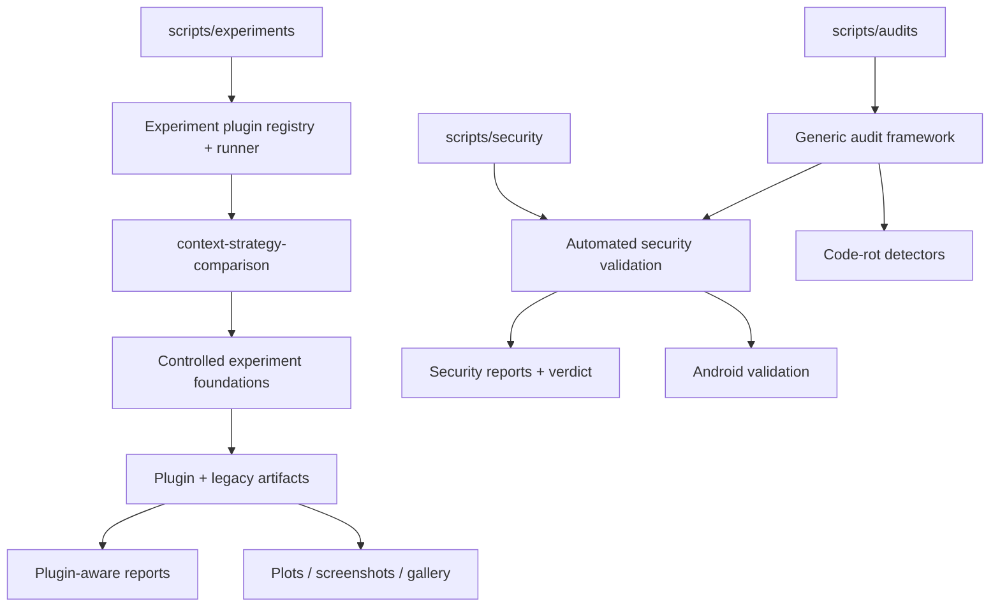

# my-dev-kit-lab

> Current release state: v0.4.1 is the latest published baseline. v0.4.0 delivered the Android validation MVP; v0.4.1 delivered advanced Android security. v0.4.2 is implemented and release-prepared (package metadata `0.4.2`) but not yet published. Manual pentest is post-v1 / version TBD.

my-dev-kit-lab is the experiment, evidence, reporting, security-validation, and audit companion for my-dev-kit. It runs reproducible experiments that test whether my-dev-kit's graph-guided retrieval helps coding-agent workflows, collects metrics, renders reports, generates plots, captures screenshots, builds gallery outputs, performs automated CLI/package security validation, and runs the generic audit framework.

The generic experiment-plugin framework was introduced in `v0.2.0`. Its first plugin, `context-strategy-comparison`, preserves the raw-full-file vs my-dev-kit-guided comparison through the plugin runner. Later releases added the generic audit framework, language-aware code-rot detectors for TypeScript/JavaScript, Python, Java, and Kotlin, a security-validation audit adapter, and Android validation. See [CHANGELOG.md](CHANGELOG.md) for the complete release history.

my-dev-kit is most useful when the repository is larger than the task. It helps coding agents work with large codebases through reusable structural indexing, graph-guided retrieval, targeted source slices, and auditable context selection. Results are scoped evidence; the project does not claim that my-dev-kit always saves tokens.

**my-dev-kit** is the repo indexing and graph-guided retrieval engine.
**my-dev-kit-lab** is the separate lab layer that feeds it benchmark inputs and records evaluation outputs.

---

## Current capabilities

- Benchmark projects at small, medium, and large complexity levels
- Project complexity metrics and benchmark case metadata with answer keys
- Prompt variant generation at `short`, `medium`, `long`, and `multi-step` complexity levels
- Fake-agent adapter for deterministic smoke and demo validation
- Codex and Claude adapters for real-agent campaigns
- Controlled experiment runner comparing `raw-full-file` vs `my-dev-kit-guided` strategies
- Deterministic correctness scoring from answer keys
- Token usage, duration, and status comparisons between matched strategy pairs
- HTML experiment report rendering
- Static SVG plot generation
- Optional PNG screenshot capture
- Gallery manifest and static gallery index output
- Visualization demos using my-dev-kit commands against benchmark projects
- Final demo workflow combining all pipeline stages
- Generic experiment-plugin command surface: `experiment:list`, `experiment:describe`, and `experiment:run`
- First experiment plugin: `context-strategy-comparison`
- Target-aware experiment execution for local projects via `experiment:run -- --target <path>`
- Plugin-aware JSON and HTML reports with plugin, target, variant, metric, artifact, warning, skip, and failure metadata
- Security validation framework: dependency audit, package tarball inspection, CLI adversarial tests, static scans (CodeQL/Semgrep), bounded fuzz smoke, attack-scenario checks, and structured verdict/report output — runnable against any local project via `security:validate --target <path>`. `security:validate` remains the standalone, focused security-validation command; it is not replaced by the audit adapter below.
- Generic audit framework: `npm run audit` runs conservative code-rot and security detectors and writes text/JSON reports under `reports/audits/` by default. `code-rot` and `security` are the currently implemented audit types (`--types code-rot`, `--types security`, or combined `--types code-rot,security`); `quality`, `project`, and `all` audit types are planned and fail cleanly instead of running. Audit does not modify target files and does not auto-fix issues. See [docs/COMMANDS.md](docs/COMMANDS.md) for full flags.
- Language-aware code-rot detectors for TypeScript/JavaScript, Python, Java, and Kotlin, built on a shared source-facts model and normalized language/file-role inventory. Java/Kotlin support is conservative static analysis only: no compiler parsing, type/classpath resolution, or Gradle/Maven execution.
- Security-validation audit adapter: `npm run audit -- --types security` runs the same `security:validate` internals through the shared audit/report surface, mapping findings into audit issues and linking back to the original `reports/security/` report. `security:validate`'s own checks and reports are unaffected.
- Android validation: `security:validate --profile android` runs nineteen static checks against an Android project (manifest, permissions, exported components, network security config, backup/release configuration, secrets, signing, WebView/FileProvider, sensitive storage/logging, and Firebase/Google services), with optional opt-in Gradle operations and external tools (Semgrep, OSV-Scanner, Android Lint, Dependency-Check). Default execution starts zero Gradle processes, zero external tools, and zero network operations.
- Android-aware generic audit: `npm run audit -- --types security --android` runs the same static Android validation through the audit adapter, mapping confirmed findings into audit issues while keeping review-only `CandidateEvidence` separate and never treated as a confirmed issue.

---

## Architecture overview



---

## Quickstart

### Install

```bash
npm install
```

The same command works in PowerShell and `cmd.exe`.

### Build

```bash
npm run build
```

### Verify the installation

```bash
npm run verify
```

### Run the fake-agent final demo (deterministic, no external CLIs required)

```bash
npm run run-final-demo -- \
  --cases examples/token-savings-cases.json \
  --out lab-output/final-demo \
  --kit-command "node tests/fixtures/fake-my-dev-kit-cli.js" \
  --agents fake-agent \
  --complexities short \
  --no-screenshot
```

```powershell
npm run run-final-demo -- `
  --cases examples/token-savings-cases.json `
  --out lab-output/final-demo `
  --kit-command "node tests/fixtures/fake-my-dev-kit-cli.js" `
  --agents fake-agent `
  --complexities short `
  --no-screenshot
```

```bat
npm run run-final-demo -- --cases examples/token-savings-cases.json --out lab-output/final-demo --kit-command "node tests/fixtures/fake-my-dev-kit-cli.js" --agents fake-agent --complexities short --no-screenshot
```

The lab resolves Windows `.cmd` and `.ps1` CLI shims, supports command paths with spaces, and keeps generated artifacts inside the requested output directory.

This runs a full pipeline: controlled experiment → report → plots → visualization demos → gallery.

### Run a real-agent campaign (requires Codex or Claude CLI)

```bash
npm run run-controlled-experiment -- \
  --cases examples/real-agent-campaign-cases.json \
  --agents codex,claude \
  --strategies raw-full-file,my-dev-kit-guided \
  --complexities medium,multi-step \
  --out lab-output/real-agent-campaign \
  --include-real-agents \
  --continue-on-failure \
  --timeout-ms 240000
```

Real-agent runs require local Codex or Claude CLI setup and available usage capacity. Runs that time out, produce invalid output, or hit session limits are recorded as structured outcomes rather than failures.

### List, describe, and run experiment plugins

```bash
npm run experiment:list
npm run experiment:describe -- --experiment context-strategy-comparison
npm run experiment:run -- \
  --experiment context-strategy-comparison \
  --target /path/to/local/project \
  --agents fake-agent \
  --complexities short \
  --no-screenshot
```

```powershell
npm run experiment:list
npm run experiment:describe -- --experiment context-strategy-comparison
npm run experiment:run -- `
  --experiment context-strategy-comparison `
  --target "Z:\Users\newuser\Projects\my-dev-kit-v1" `
  --agents fake-agent `
  --complexities short `
  --no-screenshot
```

When `--target` is omitted, the experiment runs in self mode against my-dev-kit-lab. When `--target <path>` is provided, the lab remains the tool root and the target project is inspected separately. Generated experiment outputs stay under lab-controlled output directories by default, not inside the target project.

---

## Where to find outputs

| Artifact | Location |
|---|---|
| Experiment summary | `lab-output/<experiment>/experiment-summary.json` |
| All runs | `lab-output/<experiment>/experiment-runs.json` |
| Strategy comparisons | `lab-output/<experiment>/experiment-comparisons.json` |
| HTML report | `lab-output/<report>/experiment-report.html` |
| Report JSON | `lab-output/<report>/experiment-report.json` |
| Report screenshot | `lab-output/<report>/experiment-report.png` |
| Plugin experiment report JSON | `lab-output/experiments/<plugin>/<target>/<run>/report.json` |
| Plugin experiment report HTML | `lab-output/experiments/<plugin>/<target>/<run>/report.html` |
| Plot data | `lab-output/<plots>/plot-data.json` |
| SVG charts | `lab-output/<plots>/charts/*.svg` |
| Gallery manifest | `lab-output/<gallery>/gallery-manifest.json` |
| Gallery index | `lab-output/<gallery>/gallery-index.html` |

---

## How to read the main report

Open `experiment-report.html` in a browser. The report shows:

- **Project profile** — benchmark project name, language mix, complexity score, and file tree
- **Benchmark tasks** — task descriptions and answer keys
- **Strategy comparisons** — paired `raw-full-file` vs `my-dev-kit-guided` runs per case
- **Correctness scores** — deterministic answer-key scoring (not semantic LLM judging)
- **Token usage** — estimated or reported token totals per run
- **Token savings** — positive means my-dev-kit used fewer tokens; negative means it used more
- **Duration** — wall-clock time per run
- **Status** — completed, timeout, invalid-output, or limit-reached
- **Warnings and limitations** — notes on missing token totals or partial results

See [docs/METRICS.md](docs/METRICS.md) for full metric definitions.

---

## Current limitations

- Token savings shown in fake-agent runs are based on estimated character counts, not provider billing telemetry
- Claude does not expose token totals; token savings comparisons are unavailable for Claude runs
- Codex may expose token totals but can produce timeouts or invalid-output runs
- Small projects may make raw-full-file cheaper than my-dev-kit-guided; larger localized tasks are where my-dev-kit is expected to become more useful
- The generic experiment-plugin framework currently ships one plugin, `context-strategy-comparison`; future plugins such as warm-index reuse, incremental-change, and context-window scaling are not implemented yet
- The current baseline does not prove token savings are guaranteed; it produces auditable evidence for specific cases, targets, agents, and strategies
- Provider telemetry dashboards, semantic LLM judging, and cloud API billing integration are not yet implemented

---

## Roadmap direction

my-dev-kit-lab is at a working baseline. The raw-vs-indexed experiment pipeline is fully implemented and produces reproducible artifacts, and real-agent campaign support exists for Codex and Claude. Recent releases added language-aware code-rot detectors (TypeScript/JavaScript, Python, Java, Kotlin), a security-validation audit adapter, and Android validation with an Android-aware extension of that same adapter.

- `v0.4.0` and `v0.4.1`: Android automated security validation (published)
- `v0.4.2`: Android-aware extension of the existing security audit adapter (see [CHANGELOG.md](CHANGELOG.md) for release status)
- manual pentest: post-v1 / version TBD

See [docs/ROADMAP.md](docs/ROADMAP.md) for the complete, versioned plan.

---

## Security validation

my-dev-kit-lab owns a release-security validation track for **my-dev-kit**. This work is separate from the experiment pipeline and does not replace the generic experiment-plugin roadmap. Its purpose is to generate release-validation evidence for the local CLI/package before release preparation.

`security:validate` remains the standalone, focused command for this validation and is unaffected by the current checked-out state. `npm run audit -- --types security` additionally adapts the same `security:validate` internals into the shared audit/report surface (mapped issues, a `securitySummary` field, and links to the original `reports/security/` output) — it does not replace or duplicate `security:validate`'s own checks or reports.

This is not a web application pentest framework. **my-dev-kit** is a local CLI/package, so the validation model is CLI/package adversarial testing focused on whether it remains:

- local-first
- deterministic
- read-only with respect to user source files
- network-free during normal CLI operation
- LLM-free
- database-free
- safe to run on local repositories

The automated validation gate is implemented. It combines static scans, dependency/package checks, adversarial CLI tests, bounded fuzz smoke tests, and attack-scenario checks with structured text/JSON reports and a four-category verdict.

### Security commands

| Command | Description |
|---|---|
| `npm run security:deps` | npm audit, OSV-Scanner (if available), outdated packages |
| `npm run security:package` | npm pack --dry-run, forbidden content detection |
| `npm run security:codeql` | CodeQL CLI availability check; skipped gracefully when absent |
| `npm run security:semgrep` | Semgrep scan via local binary or npx; skipped gracefully when both absent |
| `npm run test:security` | Automated security and adversarial CLI tests (path traversal, read-only boundaries, malformed artifacts, JSON safety, and related checks) |
| `npm run test:fuzz:smoke` | 9 bounded fuzz targets, seeded PRNG, completes in under 1 second |
| `npm run security:validate` | Runs selected security checks, applies profile-aware defaults when requested, and writes text/JSON reports according to `--format` |

CodeQL, Semgrep, and OSV-Scanner are optional. When unavailable locally, they are recorded as `skipped` in the report, not as passed. That can lead to `ready except optional manual checks`; it does not silently turn missing tooling into a clean pass.

Each security command can validate my-dev-kit-lab itself or another local project via `--target <path>`. When `--target` is omitted, the framework performs self-validation. Target projects are inspected in place: their source files are not modified by default, generated artifacts stay under `reports/security/` unless `--out` is used, and external-target reports identify the tool root, target root, target package metadata, target git metadata, command cwd, exit code, and stdout/stderr summaries.

`security:validate` supports `--checks`, `--profile`, `--format`, `--fail-on`, `--out`, and `--report-prefix`. The no-flag path remains backward compatible and still runs the classic implemented check groups: `deps`, `package`, `static`, `cli-adversarial`, and `fuzz`. Supplying `--profile` without `--checks` swaps in that profile's default checks; supplying explicit `--checks` always wins over profile defaults.

The current attack-scenario checks cover boundary, subprocess, secrets, and network assumptions. They are automated adversarial checks, not a manual pentest. Manual pentest is deferred until after `v1.0.0`. `verdictImpact` metadata from each registered scenario drives blocker categorization in report reasoning, and narrowed `--checks` runs are labeled as scoped rather than described as a full release gate.

JSON report poisoning/config-injection checks use a baseline-diff schema guard so legitimate additive JSON fields do not fail the guard while payload-created trusted top-level fields still do. Text reports are sanitized to strip ANSI/control-byte payloads before rendering.

Known limits remain intentionally explicit: secret scanning is bounded rather than exhaustive, the network/local-first check is a bounded static assumption check rather than proof of runtime isolation, package-boundary severity is still result-level rather than per-evidence-item, and profile-specific scenario behavior is limited to profile-based scenario selection/default checks.

For external-target validation, `security:validate` reads the target `package.json`, detects `scripts.test:security`, and runs `npm run test:security` in the target project root when that script exists. This behavior is validated both from the source checkout and from an installed packed tarball because published-package execution differs from local source execution.

Generated security reports under `reports/security/` are excluded from git by default. They are produced locally or in CI as release-gate evidence and are not committed to the repository.

See [docs/COMMANDS.md](docs/COMMANDS.md) for full command options and [docs/security-validation-framework.md](docs/security-validation-framework.md) for the security model, implemented modules, and release verdicts.

---

## License

MIT License. See [LICENSE](LICENSE) for the full text.

---

## Support

my-dev-kit-lab is an independent project by dailephd LLC, developed and maintained by Dai Le.

If this project helps your workflow, you can support continued development through GitHub Sponsors or PayPal:

- [Sponsor on GitHub](https://github.com/sponsors/dailephd)
- [Support via PayPal](https://paypal.me/daile88)

Support is optional and does not affect access to the project.

---

## Documentation

- [docs/PROJECT_OVERVIEW.md](docs/PROJECT_OVERVIEW.md) — product purpose and target users
- [docs/ARCHITECTURE.md](docs/ARCHITECTURE.md) — current and future architecture
- [docs/WORKFLOWS.md](docs/WORKFLOWS.md) — step-by-step workflows with diagrams
- [docs/COMMANDS.md](docs/COMMANDS.md) — all commands with options and examples
- [docs/TUTORIAL.md](docs/TUTORIAL.md) — first-run walkthrough
- [docs/METRICS.md](docs/METRICS.md) — metric definitions and interpretation
- [docs/ROADMAP.md](docs/ROADMAP.md) — current baseline and future phases
- [docs/GALLERY.md](docs/GALLERY.md) — gallery output explained
