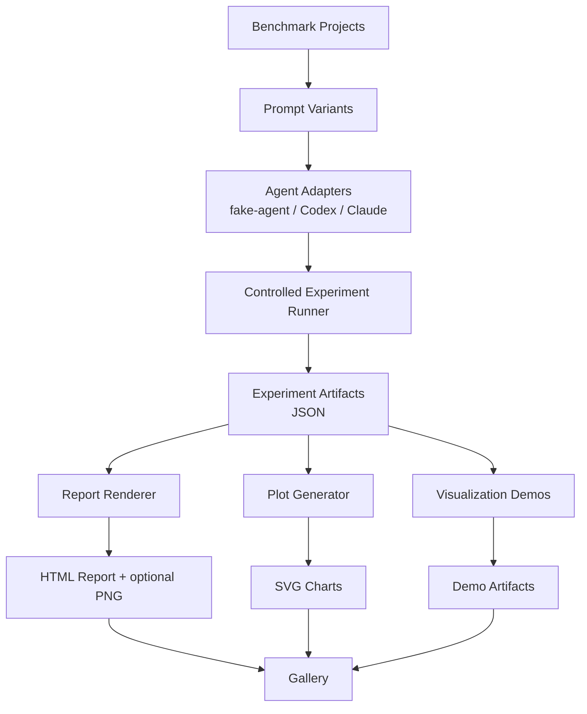

# my-dev-kit-lab

my-dev-kit-lab is the experiment, evidence, reporting, and demo companion for [my-dev-kit](https://github.com/your-org/my-dev-kit). It runs reproducible experiments that test whether my-dev-kit's graph-guided retrieval helps coding-agent workflows, collects metrics, renders reports, generates plots, captures screenshots, and builds gallery outputs.

As of v0.2.1, my-dev-kit-lab also exposes a generic experiment-plugin framework for validating local developer tools, security checks, codebase workflows, retrieval strategies, and experiment outcomes. The first plugin is `context-strategy-comparison`, which preserves the existing raw-full-file vs my-dev-kit-guided workflow through the plugin runner.

**my-dev-kit** is the repo indexing and graph-guided retrieval engine.
**my-dev-kit-lab** is the separate lab layer that feeds it benchmark inputs and records evaluation outputs.

---

## Current capabilities

- Benchmark projects at small, medium, and large complexity levels
- Project complexity metrics and benchmark case metadata with answer keys
- Prompt variant generation at `short`, `medium`, `long`, and `multi-step` complexity levels
- Fake-agent adapter for deterministic smoke and demo validation
- Codex and Claude adapters for real-agent campaigns
- Controlled experiment runner comparing `raw-full-file` vs `my-dev-kit-guided` strategies
- Deterministic correctness scoring from answer keys
- Token usage, duration, and status comparisons between matched strategy pairs
- HTML experiment report rendering
- Static SVG plot generation
- Optional PNG screenshot capture
- Gallery manifest and static gallery index output
- Visualization demos using my-dev-kit commands against benchmark projects
- Final demo workflow combining all pipeline stages
- Generic experiment-plugin command surface: `experiment:list`, `experiment:describe`, and `experiment:run`
- First experiment plugin: `context-strategy-comparison`
- Target-aware experiment execution for local projects via `experiment:run -- --target <path>`
- Plugin-aware JSON and HTML reports with plugin, target, variant, metric, artifact, warning, skip, and failure metadata
- Security validation framework: dependency audit, package tarball inspection, CLI adversarial tests, static scans (CodeQL/Semgrep), bounded fuzz smoke, and release verdict — runnable against any local project via `security:validate --target <path>`

---

## Architecture overview



---

## Quickstart

### Install

```bash
npm install
```

```powershell
npm install
```

`cmd.exe` users should run the same command on one line.

### Build

```bash
npm run build
```

### Verify the installation

```bash
npm run verify
```

### Run the fake-agent final demo (deterministic, no external CLIs required)

```bash
npm run run-final-demo -- \
  --cases examples/token-savings-cases.json \
  --out lab-output/final-demo \
  --kit-command "node tests/fixtures/fake-my-dev-kit-cli.js" \
  --agents fake-agent \
  --complexities short \
  --no-screenshot
```

```powershell
npm run run-final-demo -- `
  --cases examples/token-savings-cases.json `
  --out lab-output/final-demo `
  --kit-command "node tests/fixtures/fake-my-dev-kit-cli.js" `
  --agents fake-agent `
  --complexities short `
  --no-screenshot
```

```bat
npm run run-final-demo -- --cases examples/token-savings-cases.json --out lab-output/final-demo --kit-command "node tests/fixtures/fake-my-dev-kit-cli.js" --agents fake-agent --complexities short --no-screenshot
```

The lab resolves Windows `.cmd` and `.ps1` CLI shims, supports command paths with spaces, and keeps generated artifacts inside the requested output directory.

This runs a full pipeline: controlled experiment → report → plots → visualization demos → gallery.

### Run a real-agent campaign (requires Codex or Claude CLI)

```bash
npm run run-controlled-experiment -- \
  --cases examples/real-agent-campaign-cases.json \
  --agents codex,claude \
  --strategies raw-full-file,my-dev-kit-guided \
  --complexities medium,multi-step \
  --out lab-output/real-agent-campaign \
  --include-real-agents \
  --continue-on-failure \
  --timeout-ms 240000
```

Real-agent runs require local Codex or Claude CLI setup and available usage capacity. Runs that time out, produce invalid output, or hit session limits are recorded as structured outcomes rather than failures.

### List, describe, and run experiment plugins

```bash
npm run experiment:list
npm run experiment:describe -- --experiment context-strategy-comparison
npm run experiment:run -- \
  --experiment context-strategy-comparison \
  --target /path/to/local/project \
  --agents fake-agent \
  --complexities short \
  --no-screenshot
```

```powershell
npm run experiment:list
npm run experiment:describe -- --experiment context-strategy-comparison
npm run experiment:run -- `
  --experiment context-strategy-comparison `
  --target "Z:\Users\newuser\Projects\my-dev-kit-v1" `
  --agents fake-agent `
  --complexities short `
  --no-screenshot
```

When `--target` is omitted, the experiment runs in self mode against my-dev-kit-lab. When `--target <path>` is provided, the lab remains the tool root and the target project is inspected separately. Generated experiment outputs stay under lab-controlled output directories by default, not inside the target project.

---

## Where to find outputs

| Artifact | Location |
|---|---|
| Experiment summary | `lab-output/<experiment>/experiment-summary.json` |
| All runs | `lab-output/<experiment>/experiment-runs.json` |
| Strategy comparisons | `lab-output/<experiment>/experiment-comparisons.json` |
| HTML report | `lab-output/<report>/experiment-report.html` |
| Report JSON | `lab-output/<report>/experiment-report.json` |
| Report screenshot | `lab-output/<report>/experiment-report.png` |
| Plugin experiment report JSON | `lab-output/experiments/<plugin>/<target>/<run>/report.json` |
| Plugin experiment report HTML | `lab-output/experiments/<plugin>/<target>/<run>/report.html` |
| Plot data | `lab-output/<plots>/plot-data.json` |
| SVG charts | `lab-output/<plots>/charts/*.svg` |
| Gallery manifest | `lab-output/<gallery>/gallery-manifest.json` |
| Gallery index | `lab-output/<gallery>/gallery-index.html` |

---

## How to read the main report

Open `experiment-report.html` in a browser. The report shows:

- **Project profile** — benchmark project name, language mix, complexity score, and file tree
- **Benchmark tasks** — task descriptions and answer keys
- **Strategy comparisons** — paired `raw-full-file` vs `my-dev-kit-guided` runs per case
- **Correctness scores** — deterministic answer-key scoring (not semantic LLM judging)
- **Token usage** — estimated or reported token totals per run
- **Token savings** — positive means my-dev-kit used fewer tokens; negative means it used more
- **Duration** — wall-clock time per run
- **Status** — completed, timeout, invalid-output, or limit-reached
- **Warnings and limitations** — notes on missing token totals or partial results

See [docs/METRICS.md](docs/METRICS.md) for full metric definitions.

---

## Current limitations

- Token savings shown in fake-agent runs are based on estimated character counts, not provider billing telemetry
- Claude does not expose token totals; token savings comparisons are unavailable for Claude runs
- Codex may expose token totals but can produce timeouts or invalid-output runs
- Small projects may make raw-full-file cheaper than my-dev-kit-guided; larger localized tasks are where my-dev-kit is expected to become more useful
- The generic experiment-plugin framework currently ships one plugin, `context-strategy-comparison`; future plugins such as warm-index reuse, incremental-change, and context-window scaling are not implemented yet
- The current baseline does not prove token savings are guaranteed; it produces auditable evidence for specific cases, targets, agents, and strategies
- Provider telemetry dashboards, semantic LLM judging, and cloud API billing integration are not yet implemented

---

## Current baseline release positioning

my-dev-kit-lab is at a working baseline. The raw-vs-indexed experiment pipeline is fully implemented and produces reproducible artifacts. Real-agent campaign support exists for Codex and Claude. v0.2.1 keeps the generic experiment-plugin framework, preserves `context-strategy-comparison` as the first plugin, and fixes target-aware security validation so installed-package checks run `npm run test:security` in the external target project root.

---

## Security validation

my-dev-kit-lab owns a release-security validation track for **my-dev-kit**. This work is separate from the experiment pipeline and does not replace the generic experiment-plugin roadmap. Its purpose is to generate release-validation evidence for the local CLI/package before release preparation.

This is not a web application pentest framework. **my-dev-kit** is a local CLI/package, so the validation model is CLI/package adversarial testing focused on whether it remains:

- local-first
- deterministic
- read-only with respect to user source files
- network-free during normal CLI operation
- LLM-free
- database-free
- safe to run on local repositories

The release gate is implemented as of v0.1.4. It combines static scans, dependency/package checks, adversarial CLI tests, bounded fuzz smoke tests, and a structured release security report with a four-category verdict.

### Security commands

| Command | Description |
|---|---|
| `npm run security:deps` | npm audit, OSV-Scanner (if available), outdated packages |
| `npm run security:package` | npm pack --dry-run, forbidden content detection |
| `npm run security:codeql` | CodeQL CLI availability check; skipped gracefully when absent |
| `npm run security:semgrep` | Semgrep scan via local binary or npx; skipped gracefully when both absent |
| `npm run test:security` | 165 adversarial CLI tests (path traversal, read-only boundaries, malformed artifacts, JSON safety, fuzz targets) |
| `npm run test:fuzz:smoke` | 9 bounded fuzz targets, seeded PRNG, completes in under 1 second |
| `npm run security:validate` | Full release gate — runs all checks and writes `reports/security/<prefix>-security-validation.{txt,json}` |

CodeQL, Semgrep, and OSV-Scanner are optional. When unavailable locally, they are recorded as `skipped` in the report — not as failures — and the verdict is `ready except optional manual checks` rather than `not ready`.

Each security command can validate my-dev-kit-lab itself or another local project via `--target <path>`. When `--target` is omitted, the framework performs self-validation. Target projects are inspected in place: their source files are not modified, generated artifacts stay under `reports/security/`, and external-target reports identify the tool root, target root, target package metadata, target git metadata, command cwd, exit code, and stdout/stderr summaries.

For external-target validation, `security:validate` reads the target `package.json`, detects `scripts.test:security`, and runs `npm run test:security` in the target project root when that script exists. This behavior is validated both from the source checkout and from an installed packed tarball because published-package execution differs from local source execution.

Generated security reports under `reports/security/` are excluded from git by default. They are produced locally or in CI as release-gate evidence and are not committed to the repository.

See [docs/COMMANDS.md](docs/COMMANDS.md) for full command options and [docs/security-validation-framework.md](docs/security-validation-framework.md) for the security model, implemented modules, and release verdicts.

---

## Support

my-dev-kit-lab is an independent project by dailephd LLC, developed and maintained by Dai Le.

If this project helps your workflow, you can support continued development through GitHub Sponsors or PayPal:

- [Sponsor on GitHub](https://github.com/sponsors/dailephd)
- [Support via PayPal](https://paypal.me/daile88)

Support is optional and does not affect access to the project.

---

## Documentation

- [docs/PROJECT_OVERVIEW.md](docs/PROJECT_OVERVIEW.md) — product purpose and target users
- [docs/ARCHITECTURE.md](docs/ARCHITECTURE.md) — current and future architecture
- [docs/WORKFLOWS.md](docs/WORKFLOWS.md) — step-by-step workflows with diagrams
- [docs/COMMANDS.md](docs/COMMANDS.md) — all commands with options and examples
- [docs/TUTORIAL.md](docs/TUTORIAL.md) — first-run walkthrough
- [docs/METRICS.md](docs/METRICS.md) — metric definitions and interpretation
- [docs/ROADMAP.md](docs/ROADMAP.md) — current baseline and future phases
- [docs/GALLERY.md](docs/GALLERY.md) — gallery output explained
