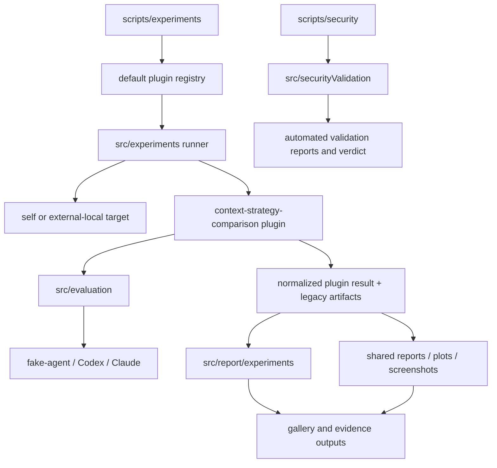
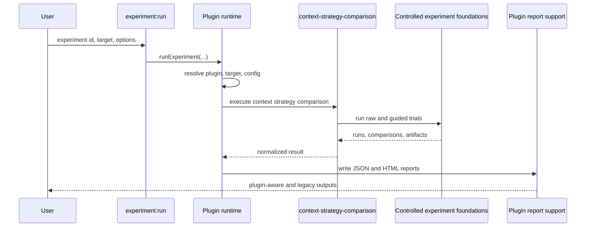
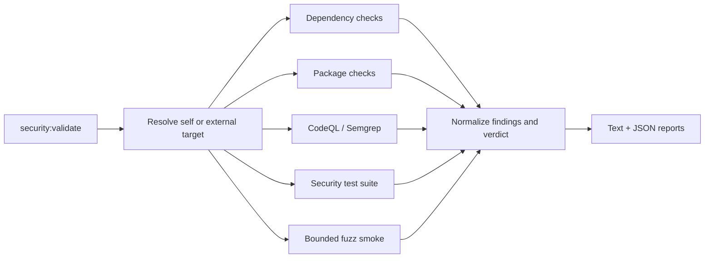

# Architecture

## Current implemented architecture

my-dev-kit-lab is the experiment, evidence, reporting, visualization, gallery, and automated security-validation companion for my-dev-kit. The generic experiment-plugin architecture is implemented; it is not a future migration.

### Module map

```text
src/
  core/                                      shared process, path, token, and target utilities
  experiments/                               plugin runtime
    config.ts                                shared configuration loading
    defaultRegistry.ts                       built-in plugin registration
    registry.ts                              plugin lookup and uniqueness
    runner.ts                                generic execution lifecycle
    target.ts                                self/external-local target resolution
    types.ts                                 plugin contracts and normalized results
    plugins/contextStrategyComparison/       first implemented plugin
  evaluation/                                benchmark, controlled-run, scoring, and metrics logic
  agents/                                    fake-agent, Codex, and Claude adapters
  report/
    experiments/                             plugin-aware JSON/HTML report support
    ...                                      shared and legacy report infrastructure
  securityValidation/                        automated security validation
    dependencies/                            npm and OSV checks
    packageChecks/                           npm package-content inspection
    cliAdversarial/                          CLI/path/read-only/malformed/subprocess checks
    staticScans/                             CodeQL and Semgrep integration
    fuzz/                                    bounded deterministic fuzz smoke
    validate/                                targets, orchestration, and verdicts
    report/                                  text and JSON security reports
  plots/ screenshot/ gallery/                evidence presentation
  visualizationDemos/                        my-dev-kit visualization runs

scripts/
  experiments/                               experiment:list, experiment:describe, experiment:run
  security/                                  security checks and security:validate
  ...                                        legacy/demo/report/plot/gallery entrypoints
```

### System diagram



## Experiment-plugin runtime

`src/experiments/defaultRegistry.ts` registers `context-strategy-comparison`. `src/experiments/runner.ts` resolves the requested plugin and target, validates configuration, executes the plugin, normalizes output, and invokes plugin-aware report generation.

The current plugin delegates trial execution and comparison logic to the established controlled-experiment infrastructure. This preserves:

- `raw-full-file` and `my-dev-kit-guided` variants
- benchmark cases and answer-key correctness
- fake-agent and real-agent adapters
- partial-outcome handling
- legacy experiment summary, run, and comparison artifacts
- `run-controlled-experiment` compatibility



## Target model

Experiment and security commands distinguish the tool root from the target root. Omitting `--target` selects self mode. Supplying `--target <path>` selects an external local project. Experiment outputs remain in lab-controlled output directories by default; security reports remain under `reports/security` unless an explicit output directory is provided.

`src/core/localProjectTarget.ts` supplies shared local-project metadata. Experiment target resolution lives in `src/experiments/target.ts`; security target resolution lives in `src/securityValidation/validate/resolveTarget.ts`.

## Automated security-validation architecture

The current security framework is automated CLI/package validation. It combines dependency and package inspection, adversarial CLI tests, static-tool integrations, bounded fuzz smoke, and report/verdict generation. It is target-aware and preserves `npm run security:validate` self mode.



For an external target, dependency, package, and supported static checks use the target project. If the target declares `test:security`, validation runs that script in the target root. The framework records command cwd, exit status, and bounded output summaries. Tool-specific self-tests remain clearly labeled.

Optional local tools can be reported as skipped; absence alone does not make the framework crash. This automation is not equivalent to a complete manual pentest.

## Shared report and evidence infrastructure

`src/report` remains the shared report layer. `src/report/experiments` extends it for plugin metadata rather than creating a parallel reporting product. Plots, screenshots, visualization demos, and gallery output consume experiment artifacts and remain reusable across future plugins.

## Future architecture

The following layers are planned and must not be treated as current:

- generic audit contracts and detector registry
- code rot and code quality detectors
- adapters that include current security results in unified audit reports
- a project-wide audit command
- a human-led manual pentest framework beside automated validation
- additional experiment plugins for warm indexes, freshness, scale, retrieval quality, and agent success
- normalized telemetry, scheduling, prompt hardening, and generalized report/gallery publication

Future audit and pentest work should reuse `src/core`, current target metadata, normalized findings, and shared report infrastructure. It should not replace the experiment plugin runtime or duplicate report/gallery systems.

## Key contracts

| Contract | Location |
|---|---|
| Plugin and result types | `src/experiments/types.ts` |
| Plugin registry | `src/experiments/registry.ts` |
| Generic runner | `src/experiments/runner.ts` |
| Current plugin | `src/experiments/plugins/contextStrategyComparison/plugin.ts` |
| Plugin report model | `src/report/experiments/experimentReportModel.ts` |
| Controlled experiment types | `src/evaluation/controlledExperimentTypes.ts` |
| Shared local target metadata | `src/core/localProjectTarget.ts` |
| Security result types | `src/securityValidation/types.ts` |
| Security orchestrator | `src/securityValidation/validate/runSecurityValidation.ts` |
