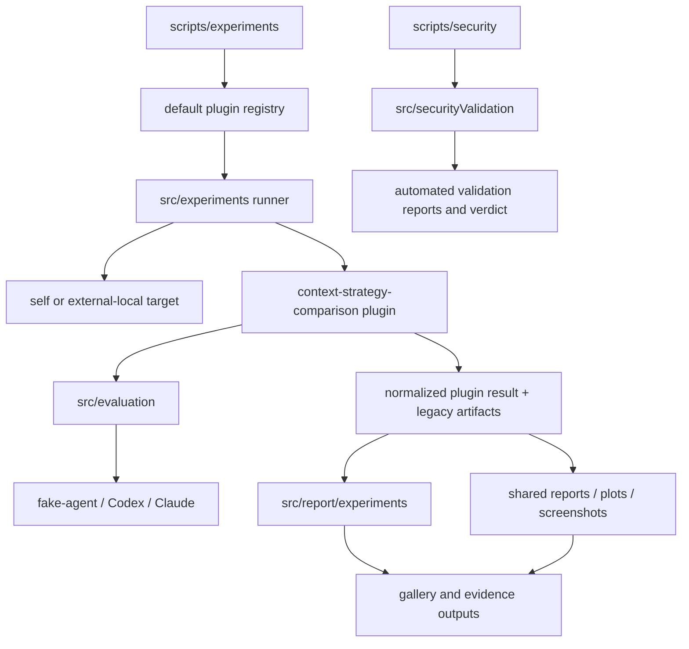
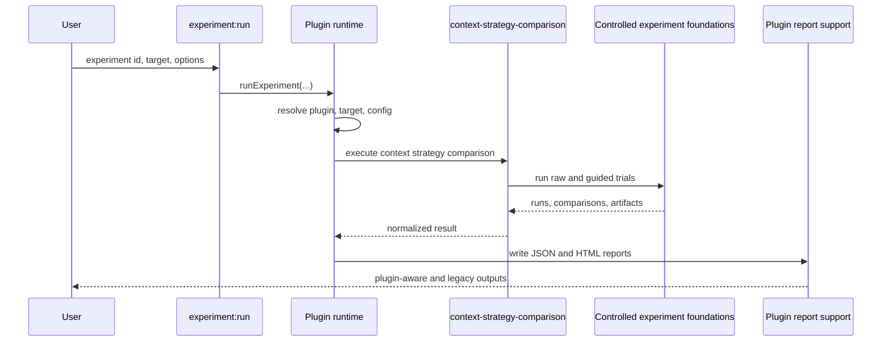
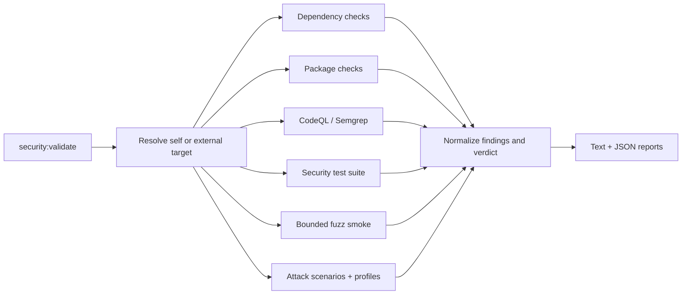
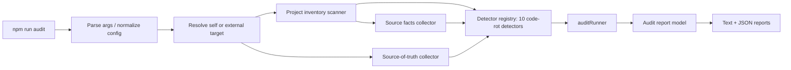

# Architecture

## Current implemented architecture

my-dev-kit-lab is the experiment, evidence, reporting, visualization, gallery, automated security-validation, and audit companion for my-dev-kit. The generic experiment-plugin architecture is fully implemented, not a migration in progress. The generic audit framework (code-rot audit type only) is implemented in the current published `v0.3.0` baseline. The checked-out package is release-prepared for `v0.3.1` language-aware code-rot substrate work; it is not published.

### Module map

```text
src/
  core/                                      shared process, path, token, and target utilities
  experiments/                               plugin runtime
    config.ts                                shared configuration loading
    defaultRegistry.ts                       built-in plugin registration
    registry.ts                              plugin lookup and uniqueness
    runner.ts                                generic execution lifecycle
    target.ts                                self/external-local target resolution
    types.ts                                 plugin contracts and normalized results
    plugins/contextStrategyComparison/       first implemented plugin
  evaluation/                                benchmark, controlled-run, scoring, and metrics logic
  agents/                                    fake-agent, Codex, and Claude adapters
  prompts/                                   prompt variant generation and prompt complexity metrics
  audits/                                    generic audit framework (v0.3.0, code-rot audit type only)
    core/                                    target resolution, config, registry, inventory, source-of-truth, source facts, exit-code policy, runner
    codeRot/                                 code-rot audit type
      detectors/                             10 code-rot detector families
      utils/                                 shared detector helpers (bounded reads, doc-claim/command-reference parsing, text-line utilities)
    report/                                  audit report model, JSON/text renderers, writer, text sanitizer
  report/
    experiments/                             plugin-aware JSON/HTML report support
    ...                                      shared and legacy report infrastructure
  securityValidation/                        automated security validation
    dependencies/                            npm and OSV checks
    packageChecks/                           npm package-content inspection
    cliAdversarial/                          CLI/path/read-only/malformed/subprocess checks
    attackScenarios/                         adversarial scenario contracts, profiles, runner, scenarios, schema guard
    staticScans/                             CodeQL and Semgrep integration
    fuzz/                                    bounded deterministic fuzz smoke
    validate/                                targets, orchestration, and verdicts
    report/                                  text and JSON security reports
  plots/ screenshot/ gallery/                evidence presentation
  visualizationDemos/                        my-dev-kit visualization runs

scripts/
  experiments/                               experiment:list, experiment:describe, experiment:run
  security/                                  security checks and security:validate
  audits/                                    runAudit.ts — npm run audit entrypoint
  ...                                        legacy/demo/report/plot/gallery entrypoints
```

### System diagram



## Experiment-plugin runtime

`src/experiments/defaultRegistry.ts` registers `context-strategy-comparison`. `src/experiments/runner.ts` resolves the requested plugin and target, validates configuration, executes the plugin, normalizes output, and invokes plugin-aware report generation.

The current plugin delegates trial execution and comparison logic to the established controlled-experiment infrastructure. This preserves:

- `raw-full-file` and `my-dev-kit-guided` variants
- benchmark cases and answer-key correctness
- fake-agent and real-agent adapters
- partial-outcome handling
- legacy experiment summary, run, and comparison artifacts
- `run-controlled-experiment` compatibility



## Target model

Experiment and security commands distinguish the tool root from the target root. Omitting `--target` selects self mode. Supplying `--target <path>` selects an external local project. Experiment outputs remain in lab-controlled output directories by default; security reports remain under `reports/security` unless an explicit output directory is provided.

`src/core/localProjectTarget.ts` supplies shared local-project metadata. Experiment target resolution lives in `src/experiments/target.ts`; security target resolution lives in `src/securityValidation/validate/resolveTarget.ts`.

## Automated security-validation architecture

The current security framework is automated CLI/package validation. It combines dependency and package inspection, adversarial CLI tests, static-tool integrations, bounded fuzz smoke, attack-scenario execution, and report/verdict generation. It is target-aware and preserves `npm run security:validate` self mode.



For an external target, dependency, package, and supported static checks use the target project. If the target declares `test:security`, validation runs that script in the target root. The framework records command cwd, exit status, and bounded output summaries. Tool-specific self-tests remain clearly labeled.

`src/securityValidation/attackScenarios` is now part of the implemented validation layer. It contains the `AttackScenario` contract, `AttackResult` bridge model, reusable profiles, payload/evidence helpers, the integrated attack runner, and concrete scenarios for boundary, subprocess, secrets, and network checks.

`src/securityValidation/attackScenarios/reportSchemaGuard.ts` protects JSON report structure against payload-created top-level injection by comparing a clean baseline render with a payload-bearing render. This is schema/report hardening for the current report format, not a general renderer-safety proof.

`src/securityValidation/types.ts` defines `VerdictImpact`, which flows from `AttackScenario` to `AttackResult` to `SecurityCheckResult`. `src/securityValidation/validate/verdict.ts` reads that metadata directly when summarizing blocker categories, so the verdict layer no longer owns a hand-maintained scenario-impact map.

Profile behavior remains intentionally narrow in the current implementation: profiles drive default check selection and scenario applicability filtering, but they do not yet introduce deeper per-profile scenario branching beyond that selection metadata.

Optional local tools can be reported as skipped; absence alone does not make the framework crash. This automation is not equivalent to a manual pentest.

## Audit framework architecture

`src/audits/` is the implemented generic project-audit framework in the current published `v0.3.0` baseline. It is a separate framework from experiments and from automated security validation; it does not call `security:validate` and `security:validate` does not call it. Only the `code-rot` audit type is implemented. `quality`, `security`, `project`, and `all` audit types remain planned — supplying them to `--types` fails cleanly with exit code 2 and a clear message rather than running.



`src/audits/core/` supplies:
- `auditConfig.ts` — `--target`, `--types`, `--include`, `--format`, `--fail-on`, `--out` flag parsing and normalization
- `auditTarget.ts` — target resolution (self or external local project), non-destructive with respect to the target
- `projectInventory.ts` — project inventory scanner (files by category/extension, normalized language, file role, excluded directories)
- `sourceOfTruth.ts` — source-of-truth collector (package metadata, scripts, docs, CI, build tooling, tests, security, experiment truth)
- `sourceFacts.ts` / `collectSourceFacts.ts` — source facts model and collector for source/test files
- `languageAnalyzerRegistry.ts` / `typescriptJavaScriptAnalyzer.ts` — syntax-only language analyzer registry with the TypeScript/JavaScript analyzer registered for `.ts`, `.tsx`, `.mts`, `.cts`, `.js`, `.jsx`, `.mjs`, and `.cjs`
- `auditRegistry.ts` — `DEFAULT_AUDIT_REGISTRY`, detector contract, and `selectDetectors()` filtering by type/include area
- `auditRunner.ts` — executes selected detectors against the collected inventory/source-of-truth
- `auditExitCode.ts` — exit-code policy: `0` no issue met the `--fail-on` threshold, `1` at least one issue met or exceeded it, `2` invalid config/target or a runtime failure (never returned by the pure exit-code calculator itself; the CLI script's own try/catch blocks return it directly)

`src/audits/codeRot/detectors/` implements the 10 registered code-rot detector families, in registry order:
1. `stale-command-reference` — stale command/workflow references in docs
2. `docs-code-mismatch` — documentation/code mismatch
3. `package-release-rot` — package/release metadata rot
4. `duplicate-implementation-candidate` — duplicate or parallel implementation candidates
5. `dead-code-candidate` — dead-code candidates from deterministic evidence
6. `test-rot` — test rot signals
7. `architecture-drift` — architecture drift between docs and implemented modules
8. `dependency-environment-rot` — dependency/environment rot
9. `cross-platform-rot` — cross-platform rot
10. `security-validation-assumption-rot` — stale documentation *claims* about security-validation (this detector checks claims about security-validation; it does not itself perform security validation)

`src/audits/report/` builds and writes the stable, versioned report:
- `auditReportModel.ts` — pure `AuditResult -> AuditReportModel` transform; `AUDIT_REPORT_SCHEMA_VERSION = "1.0"`; the release-prepared `v0.3.1` package state includes 14 top-level fields (`schemaVersion`, `metadata`, `target`, `config`, `summary`, `inventory`, `sourceOfTruth`, `sourceFacts`, `detectors`, `issues`, `skippedDetectors`, `detectorErrors`, `recommendations`, `exit`); `metadata.auditType` (joined string) and `metadata.auditTypes` (string array) are both present
- `renderAuditJsonReport.ts` / `renderAuditTextReport.ts` — JSON and text renderers; the text renderer sanitizes all issue/recommendation text through `sanitizeAuditText.ts` before printing and renders both an evidence message and excerpt when both are present
- `writeAuditReports.ts` — writes the selected `--format` outputs
- Reports are written under `reports/audits/code-rot/` by default (`code-rot-audit.json`, `code-rot-audit.txt`), or under `--out <path>` when supplied

`scripts/audits/runAudit.ts` is a thin CLI entrypoint: parse args → normalize config → resolve target → `runAudit()` → `buildAuditReportModel()` → `writeAuditReports()` → console summary → set `process.exitCode`. It mirrors the structure of `scripts/security/validate.ts` but shares no code with it.

Fail-on policy: `--fail-on blocker|high|medium|low|none` (default `blocker`; see `docs/COMMANDS.md` for full threshold semantics). External-target audits are non-destructive — target resolution and the runner do not write or delete files inside the target root; generated reports stay under the tool root's `reports/audits/` unless `--out` redirects them.

### v0.3.1 audit substrate

The checked-out package is release-prepared for language-aware code-rot substrate work in `v0.3.1`. It extends the audit core with normalized language/file-role inventory, a language analyzer registry, a source facts model, source facts collection, and TypeScript/JavaScript analyzer support. This work is not part of the published `v0.3.0` package until `v0.3.1` is published.

The TypeScript/JavaScript analyzer is syntax-only and single-file. It uses the TypeScript compiler API to parse supported TS/JS extensions and records imports, exports, declarations, bare call references, line counts, diagnostics, and parse status. Files over 1 MB fall back to file-level facts. Files with syntax diagnostics are marked `parse-error` while retaining best-effort facts. Python, Java, and Kotlin are inventory-classified but fallback-only in `v0.3.1`; no analyzer is registered for them.

The code-rot integrations use source facts as additional conservative evidence only. They do not prove unused code, semantic duplicate implementations, test coverage, full module resolution, `tsconfig` path alias resolution, type-checker semantics, or runtime reachability.

## Shared report and evidence infrastructure

`src/report` remains the shared report layer. `src/report/experiments` extends it for plugin metadata rather than creating a parallel reporting product. Plots, screenshots, visualization demos, and gallery output consume experiment artifacts and remain reusable across future plugins.

## Future architecture

The following layers are planned and must not be treated as current published behavior:

- completion of the `v0.3.x` language-aware code-rot track across Python, Java, Kotlin, and cross-language stability
- Android/mobile validation profiles for `v0.4.x`
- a future audit bridge that can summarize Android validation findings after Android reports are stable enough to consume
- a human-led manual pentest workflow after `v1.0.0`
- additional experiment plugins for warm indexes, freshness, scale, retrieval quality, and agent success
- normalized telemetry, scheduling, prompt hardening, and generalized report/gallery publication

Future audit and Android-validation work should reuse `src/audits/core`, current target metadata, the normalized audit issue schema, and shared report infrastructure. Planned Android validation belongs in future/planned sections until code exists. This work should not replace the experiment plugin runtime, duplicate report/gallery systems, or fold `security:validate` into the audit framework prematurely.

## Key contracts

| Contract | Location |
|---|---|
| Plugin and result types | `src/experiments/types.ts` |
| Plugin registry | `src/experiments/registry.ts` |
| Generic runner | `src/experiments/runner.ts` |
| Current plugin | `src/experiments/plugins/contextStrategyComparison/plugin.ts` |
| Plugin report model | `src/report/experiments/experimentReportModel.ts` |
| Controlled experiment types | `src/evaluation/controlledExperimentTypes.ts` |
| Shared local target metadata | `src/core/localProjectTarget.ts` |
| Security result types | `src/securityValidation/types.ts` |
| Security orchestrator | `src/securityValidation/validate/runSecurityValidation.ts` |
| Audit issue / result types | `src/audits/core/auditIssue.ts` / `src/audits/core/auditRunner.ts` |
| Audit detector registry | `src/audits/core/auditRegistry.ts` |
| Audit report model | `src/audits/report/auditReportModel.ts` |
| Source facts model | `src/audits/core/sourceFacts.ts` |
| Language analyzer registry | `src/audits/core/languageAnalyzerRegistry.ts` |
| TypeScript/JavaScript analyzer | `src/audits/core/typescriptJavaScriptAnalyzer.ts` |
