# Architecture

## Current implemented architecture

The existing experiment, audit, and security-validation systems remain independent but reuse local-target and report conventions. Android validation is an additional `security:validate` profile path on the v0.4.0 feature branch.

```mermaid
flowchart LR
  CLI[scripts/security/validate.ts] --> Help{--help or -h?}
  Help -->|yes| Usage[Print usage; exit 0]
  Help -->|no| Options[cliOptions.ts]
  Options --> Target[Resolve local target]
  Target --> Profile{profile android?}
  Profile -->|no| Classic[Existing security validation]
  Profile -->|yes| Detect[detectAndroidProject]
  Detect --> Metadata[Android target metadata]
  Metadata --> Manifest[Independent manifest parsing]
  Manifest --> Audits[Permission, component, intent-filter, deep-link audits]
  Audits --> Gradle[Static Gradle metadata]
  Gradle --> Optional[Optional allowlisted Gradle validation]
  Optional --> Mutation[Target mutation evidence]
  Mutation --> Result[Android result, verdict, Play placeholders]
  Result --> Reports[reports/security text + JSON]
```

## Android owners

- CLI and option normalization: `scripts/security/validate.ts`, `src/securityValidation/validate/cliOptions.ts`.
- Profile identity and public exports: `src/mobile/android/profile.ts`, `src/mobile/index.ts`.
- Detection/classification: `src/mobile/android/detect/`.
- Manifest parsing: `src/mobile/android/manifest/`.
- Initial audits: `src/mobile/android/audit/`.
- Gradle metadata and optional execution planning: `src/mobile/android/gradle/`.
- Orchestration, verdicts, mutation evidence, and Play-readiness placeholders: `src/mobile/android/validate/`.
- Report model/render/write: `src/mobile/android/report/`.

## Runtime flow

`security:validate` first honors help before resolving defaults or writing state. Ordinary Android invocations resolve a local target, capture a target snapshot, detect/classify the project, parse each discovered manifest independently, run the four static audit families, extract Gradle metadata without evaluating build scripts, optionally run only requested allowlisted wrapper operations, then assemble check results, findings, release metadata, Play-readiness placeholders, verdict reasons, and reports.

Reports are written under the tool's existing `reports/security/` root by default, not inside the target. Optional Gradle operations are disabled by default. Their fixed operations are `wrapper-version`, `tasks`, `assemble-debug`, `unit-test-debug`, and `lint-debug`; task discovery gates applicable work and mutation evidence distinguishes expected generated outputs from unexpected changes.

## Verdict and report boundaries

Android reuses the existing `ReleaseVerdict` vocabulary. Precedence is security blocker, environment incomplete, optional-manual-checks, then release-preparation evidence. A verdict is not a publication, signing, runtime-security, Google Play compliance, or Play-readiness certification.

The report includes target/detection/manifest/component/permission/intent-filter/deep-link/Gradle summaries, optional operation results, release metadata, Play-readiness placeholders, findings, check statuses, mutation evidence, verdict/reasons, recommended next step, and limitations. Output is bounded and avoids sensitive-data collection.

## Boundaries and future architecture

v0.4.0 does not merge manifests, resolve manifest placeholders/resources, evaluate Gradle, inspect APK/AAB files, validate signing, execute emulators/devices, verify Digital Asset Links/domain ownership, or perform live Google Play policy checks.

`src/audits/security` remains the existing general security adapter. Android-specific `SecurityFinding` to `AuditIssue` mapping and Android status beside `securitySummary` are planned v0.4.2 work; Android does not route through that adapter today. v0.4.1 advanced Android checks and manual pentest are also future work.
