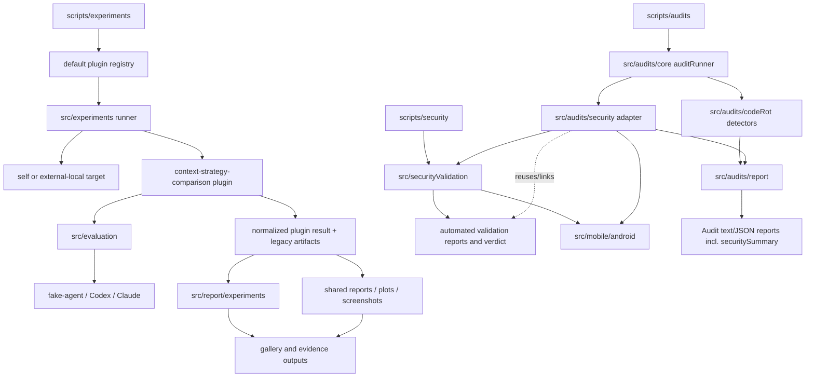
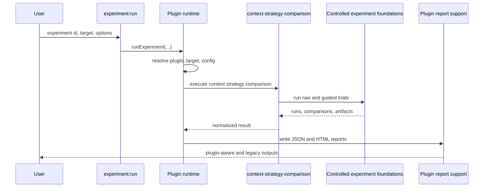
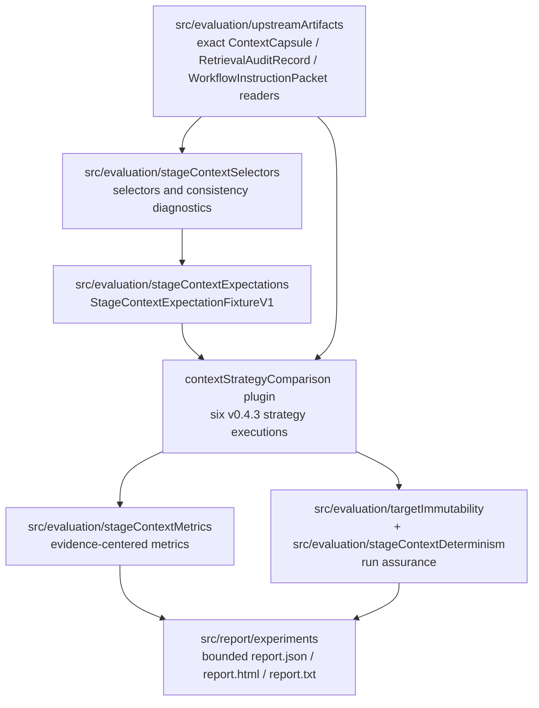
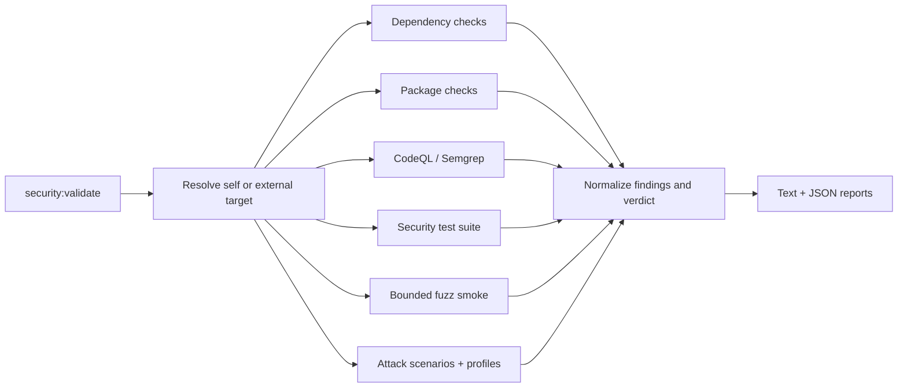
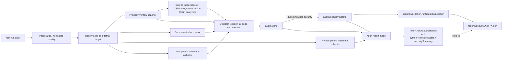

# Architecture

## Android architecture

`src/mobile/android` adds Android validation to the existing security, audit, and evidence systems. Validation is non-destructive and static by default. Gradle operations, external tools, and network requests require explicit opt-in.

`src/audits/security` adds Android summaries and report references to the existing security audit adapter through `--android`. It does not create a parallel adapter or map `CandidateEvidence` to `AuditIssue`.

## Current implemented architecture

my-dev-kit-lab is the experiment, evidence, audit, and validation companion for my-dev-kit. The generic experiment-plugin architecture is implemented rather than being a migration in progress. The audit framework provides `code-rot` and `security`, including the Android-aware extension, over language-aware source facts for TypeScript/JavaScript, Python, Java, and Kotlin.

### Module map

```text
src/
  core/                                      shared process, path, token, and target utilities
  experiments/                               plugin runtime
    config.ts                                shared configuration loading
    defaultRegistry.ts                       built-in plugin registration
    registry.ts                              plugin lookup and uniqueness
    runner.ts                                generic execution lifecycle
    target.ts                                self/external-local target resolution
    types.ts                                 plugin contracts and normalized results
    plugins/contextStrategyComparison/       first implemented plugin; also owns the six v0.4.3 stage-context strategies
  evaluation/                                benchmark, controlled-run, scoring, and metrics logic
    upstreamArtifacts/                       exact ContextCapsule/RetrievalAuditRecord/WorkflowInstructionPacket mirrors, validators, and readers (v0.4.3)
    stageContextSelectors/                   selectors and consistency diagnostics over exact reader output (v0.4.3)
    stageContextExpectations/                StageContextExpectationFixtureV1 contract and validation (v0.4.3)
    stageContextMetrics/                     evidence-centered evaluation metrics (v0.4.3)
    targetImmutability/                      read-only target snapshot and mutation comparison (v0.4.3)
    stageContextDeterminism/                 canonicalization and repeated-run digest comparison (v0.4.3)
  agents/                                    fake-agent, Codex, and Claude adapters
  prompts/                                   prompt variant generation and prompt complexity metrics
  audits/                                    generic audit framework (code-rot and security audit types implemented)
    core/                                    target resolution, config, registry, inventory, source-of-truth, source facts, language analyzer registry, Python + JVM project metadata, exit-code policy, runner
    codeRot/                                 code-rot audit type
      detectors/                             10 code-rot detector families (TS/JS-, Python-, and Java/Kotlin-aware where source facts are available)
      utils/                                 shared detector helpers (bounded reads, doc-claim/command-reference parsing, JVM source-facts helpers, text-line utilities)
    security/                                security audit adapter: adapts securityValidation results into audit issues/report summary, including the Android-aware extension
    report/                                  audit report model, JSON/text renderers, writer, text sanitizer
  report/
    experiments/                             plugin-aware JSON/HTML/text report support (text renderer and the v0.4.3 stage-context section)
    ...                                      shared and legacy report infrastructure
  mobile/android/                            Android detection, manifest parsing, static Gradle metadata, and advanced security checks
  securityValidation/                        automated security validation
    dependencies/                            npm and OSV checks
    packageChecks/                           npm package-content inspection
    cliAdversarial/                          CLI/path/read-only/malformed/subprocess checks
    attackScenarios/                         adversarial scenario contracts, profiles, runner, scenarios, schema guard
    staticScans/                             CodeQL and Semgrep integration
    fuzz/                                    bounded deterministic fuzz smoke
    validate/                                targets, orchestration, and verdicts
    report/                                  text and JSON security reports; buildSecurityReport.ts assembles the report object shared by scripts/security/validate.ts and the audits/security adapter
  plots/ screenshot/ gallery/                evidence presentation
  visualizationDemos/                        my-dev-kit visualization runs

scripts/
  experiments/                               experiment:list, experiment:describe, experiment:run
  security/                                  security checks and security:validate
  audits/                                    runAudit.ts — npm run audit entrypoint
  ...                                        legacy/demo/report/plot/gallery entrypoints
```

The supporting ownership roots are `src/agents` for provider adapters, `src/prompts` for prompt variants/complexity, and `src/visualizationDemos` for visualization runs. They remain shared by the experiment/report flow rather than becoming separate pipelines.

### System diagram



### Subsystem responsibilities and boundaries

| Subsystem | Responsibility | Inputs | Outputs | Primary owners | Extension points | Invariants and failure boundary |
|---|---|---|---|---|---|---|
| Core and target model | Resolve commands, paths, tokens, and local targets | CLI values and local paths | Normalized process/path/target metadata | `src/core` | Shared target helpers | Tool and target roots stay distinct; target source is not modified by default |
| Experiment runtime | Select and execute experiment plugins | Plugin ID, target, configuration, benchmark cases | Normalized results and legacy-compatible artifacts | `src/experiments` | Plugin registry and plugin contracts | One runner; invalid plugin/configuration fails before execution |
| Evaluation, prompts, and agents | Build trials, prompts, scores, and agent outcomes | Benchmarks, strategies, prompt variants, adapter output | Runs, correctness, token/duration/status metadata | `src/evaluation`, `src/prompts`, `src/agents` | New metrics and adapters | Partial outcomes remain explicit; missing telemetry is not fabricated |
| Reports and presentation | Render evidence for review | Normalized experiment and validation artifacts | JSON/HTML/text reports, plots, screenshots, gallery | `src/report`, `src/plots`, `src/screenshot`, `src/gallery`, `src/visualizationDemos` | Additive report sections and gallery entries | Presentation does not reinterpret missing data as success |
| Generic audit | Collect project facts and run registered audit types | Local target, audit configuration | Audit issues, summaries, text/JSON reports | `src/audits` | Detector and audit-type registries | Findings are conservative; no auto-fix; invalid configuration exits cleanly |
| Security validation | Run automated CLI/package checks and scenarios | Local target, checks/profile/options | `SecurityFinding` records, skips, verdict, security reports | `src/securityValidation`, `scripts/security` | Check/scenario/profile registries | Optional tools may skip; bounded evidence is not exhaustive proof |
| Android validation | Detect and statically inspect Android targets | Android project plus explicit opt-ins | Android checks, findings, CandidateEvidence, report sections | `src/mobile/android` | Closed checks and opt-in operations | Zero Gradle, external-tool, and network processes by default; CandidateEvidence is review-only |
| Security audit adapter | Reuse security results in audit output | Security-validation result and optional Android result | Mapped issues, summaries, report links | `src/audits/security` | Finding-to-issue mappings | One adapter; `security:validate` remains separate and authoritative for full evidence |
| Documentation preservation | Enforce required structure and lifecycle facts | Preservation manifest and tracked documentation | Actionable consistency errors | `scripts/check-docs.mjs`, `tests/scripts/checkDocs.test.ts` | Manifest structural requirements | Checks may be strengthened, not weakened to hide contradictions |

## Experiment-plugin runtime

`src/experiments/defaultRegistry.ts` registers `context-strategy-comparison`. `src/experiments/runner.ts` resolves the requested plugin and target, validates configuration, executes the plugin, normalizes output, and invokes plugin-aware report generation.

The current plugin delegates trial execution and comparison logic to the established controlled-experiment infrastructure. This preserves:

- `raw-full-file` and `my-dev-kit-guided` variants
- benchmark cases and answer-key correctness
- fake-agent and real-agent adapters
- partial-outcome handling
- legacy experiment summary, run, and comparison artifacts
- `run-controlled-experiment` compatibility



## Stage-context evaluation architecture (v0.4.3)

Implemented and published. It extends the `context-strategy-comparison` plugin and its report layer rather than creating a parallel runner, evaluation system, or report system.



Dependency direction is one-way: readers depend on nothing else in this list; selectors depend on readers; expectations depend on selectors; strategy execution depends on readers, selectors, and expectations; metrics depend on strategy execution output; run assurance depends on strategy execution and evaluation; reports depend on execution, evaluation, and assurance results and do not feed back into any earlier layer.

This architecture does not introduce a normalized upstream observation layer — readers preserve exact upstream field names, nesting, optionality, nullability, array order, and unknown additive fields, and never merge or reshape `ContextCapsule`/`RetrievalAuditRecord`/`WorkflowInstructionPacket` objects. Metrics are not upstream artifact properties; they are a separate, additive evaluation layer computed from reader output plus expectation fixtures. Reports do not recalculate execution results, metrics, target immutability, or determinism; the report layer only renders a bounded, deterministic view of already-computed results and never reruns a strategy.

## Target model

Experiment and security commands distinguish the tool root from the target root. Omitting `--target` selects self mode. Supplying `--target <path>` selects an external local project. Experiment outputs remain in lab-controlled output directories by default; security reports remain under `reports/security` unless an explicit output directory is provided.

`src/core/localProjectTarget.ts` supplies shared local-project metadata. Experiment target resolution lives in `src/experiments/target.ts`; security target resolution lives in `src/securityValidation/validate/resolveTarget.ts`.

## Automated security-validation architecture

The current security framework is automated CLI/package validation. It combines dependency and package inspection, adversarial CLI tests, static-tool integrations, bounded fuzz smoke, attack-scenario execution, and report/verdict generation. It is target-aware and preserves `npm run security:validate` self mode.



For an external target, dependency, package, and supported static checks use the target project. If the target declares `test:security`, validation runs that script in the target root. The framework records command cwd, exit status, and bounded output summaries. Tool-specific self-tests remain clearly labeled.

`src/securityValidation/attackScenarios` is now part of the implemented validation layer. It contains the `AttackScenario` contract, `AttackResult` bridge model, reusable profiles, payload/evidence helpers, the integrated attack runner, and concrete scenarios for boundary, subprocess, secrets, and network checks.

`src/securityValidation/attackScenarios/reportSchemaGuard.ts` protects JSON report structure against payload-created top-level injection by comparing a clean baseline render with a payload-bearing render. This is schema/report hardening for the current report format, not a general renderer-safety proof.

`src/securityValidation/types.ts` defines `VerdictImpact`, which flows from `AttackScenario` to `AttackResult` to `SecurityCheckResult`. `src/securityValidation/validate/verdict.ts` reads that metadata directly when summarizing blocker categories, so the verdict layer no longer owns a hand-maintained scenario-impact map.

Profile behavior remains intentionally narrow in the current implementation: profiles drive default check selection and scenario applicability filtering, but they do not yet introduce deeper per-profile scenario branching beyond that selection metadata.

Optional local tools can be reported as skipped; absence alone does not make the framework crash. This automation is not equivalent to a manual pentest.

## Audit framework architecture

`src/audits/` is the implemented generic project-audit framework. `code-rot` (since `v0.3.0`) and `security` (since `v0.3.2`) are the currently implemented audit types. `quality`, `project`, and `all` audit types remain planned — supplying them to `--types` fails cleanly with exit code 2 and a clear message rather than running.

The audit framework and automated security validation (`src/securityValidation`) remain distinct systems. `src/audits/security` is an adapter, not another scanner family. It calls `runSecurityValidation()` directly, maps resulting `SecurityFinding` records into audit issues, and preserves the existing `reports/security/*.txt` and `.json` outputs.

The audit framework never invokes `security:validate` as a subprocess, and `security:validate` never calls the audit framework. The adapter only reuses exported security-validation functions.



`src/audits/core/` supplies:
- `auditConfig.ts` — `--target`, `--types`, `--include`, `--format`, `--fail-on`, `--out` flag parsing and normalization
- `auditTarget.ts` — target resolution (self or external local project), non-destructive with respect to the target
- `projectInventory.ts` — project inventory scanner (files by category/extension, normalized language, file role, excluded directories)
- `sourceOfTruth.ts` — source-of-truth collector (package metadata, scripts, docs, CI, build tooling, tests, security, experiment truth)
- `sourceFacts.ts` / `collectSourceFacts.ts` — source facts model and collector for source/test files
- `languageAnalyzerRegistry.ts` / `typescriptJavaScriptAnalyzer.ts` / `pythonAnalyzer.ts` / `javaAnalyzer.ts` / `kotlinAnalyzer.ts` — language analyzer registry with TypeScript/JavaScript, Python, Java, and Kotlin analyzers registered for their supported extensions
- `pythonProjectMetadata.ts` — presence/simple-text-extraction collector for Python project/config files (`pyproject.toml`, `requirements.txt`, `setup.py`, `setup.cfg`, `tox.ini`, `pytest.ini`); never executes Python tooling
- `jvmProjectMetadata.ts` — static Gradle/Maven/wrapper/source-set presence detection and best-effort project-name extraction; never executes Gradle, Maven, compilers, or target tests
- `auditRegistry.ts` — `DEFAULT_AUDIT_REGISTRY`, detector contract, and `selectDetectors()` filtering by type/include area
- `auditRunner.ts` — executes selected detectors against the collected inventory/source-of-truth
- `auditExitCode.ts` — exit-code policy: `0` no issue met the `--fail-on` threshold, `1` at least one issue met or exceeded it, `2` invalid config/target or a runtime failure (never returned by the pure exit-code calculator itself; the CLI script's own try/catch blocks return it directly)

`src/audits/codeRot/detectors/` implements the 10 registered code-rot detector families, in registry order:
1. `stale-command-reference` — stale command/workflow references in docs
2. `docs-code-mismatch` — documentation/code mismatch
3. `package-release-rot` — package/release metadata rot
4. `duplicate-implementation-candidate` — duplicate or parallel implementation candidates
5. `dead-code-candidate` — dead-code candidates from deterministic evidence
6. `test-rot` — test rot signals
7. `architecture-drift` — architecture drift between docs and implemented modules
8. `dependency-environment-rot` — dependency/environment rot
9. `cross-platform-rot` — cross-platform rot
10. `security-validation-assumption-rot` — stale documentation *claims* about security-validation (this detector checks claims about security-validation; it does not itself perform security validation)

`src/audits/report/` builds and writes the stable, versioned report:
- `auditReportModel.ts` — pure `AuditResult -> AuditReportModel` transform; `AUDIT_REPORT_SCHEMA_VERSION = "1.0"`; the published `v0.3.2` package state includes 16 top-level fields (`schemaVersion`, `metadata`, `target`, `config`, `summary`, `inventory`, `sourceOfTruth`, `sourceFacts`, `pythonProjectMetadata`, `securitySummary`, `detectors`, `issues`, `skippedDetectors`, `detectorErrors`, `recommendations`, `exit`) — `v0.3.1` had 14 (no `pythonProjectMetadata`/`securitySummary`); `metadata.auditType` (joined string) and `metadata.auditTypes` (string array) are both present
- `renderAuditJsonReport.ts` / `renderAuditTextReport.ts` — JSON and text renderers; the text renderer sanitizes all issue/recommendation text through `sanitizeAuditText.ts` before printing and renders both an evidence message and excerpt when both are present
- `writeAuditReports.ts` — writes the selected `--format` outputs
- Reports are written under `reports/audits/code-rot/` by default (`code-rot-audit.json`, `code-rot-audit.txt`), or under `--out <path>` when supplied

`scripts/audits/runAudit.ts` is a thin CLI entrypoint: parse args → normalize config → resolve target → `runAudit()` → `buildAuditReportModel()` → `writeAuditReports()` → console summary → set `process.exitCode`. It mirrors the structure of `scripts/security/validate.ts` but shares no code with it.

Fail-on policy: `--fail-on blocker|high|medium|low|none` (default `blocker`; see `docs/COMMANDS.md` for full threshold semantics). External-target audits are non-destructive — target resolution and the runner do not write or delete files inside the target root; generated reports stay under the tool root's `reports/audits/` unless `--out` redirects them.

### Language-analyzer boundary

The source-facts layer registers TypeScript/JavaScript, Python, Java, and Kotlin analyzers. TypeScript/JavaScript parsing is syntax-only and single-file; Python and JVM analyzers use conservative, dependency-free scanning. Detector groups remain analyzer-scoped, and JVM metadata is static presence/text extraction rather than a report-schema field.

These analyzers provide candidate evidence. They do not provide type checking, full module or classpath resolution, runtime reachability, clone detection, coverage analysis, compiler execution, Gradle/Maven execution, target-test execution, or dependency-freshness proof. See [CHANGELOG.md](../CHANGELOG.md) for the release-by-release history of this substrate.

## Shared report and evidence infrastructure

`src/report` remains the shared report layer. `src/report/experiments` extends it for plugin metadata rather than creating a parallel reporting product. Plots, screenshots, visualization demos, and gallery output consume experiment artifacts and remain reusable across future plugins.

## Future architecture

The following layers are planned and must not be treated as current published or checked-out behavior:

- JVM package/environment rot or Gradle/Maven dependency freshness checks
- the `quality`, `project`, and `all` audit types, and any project-wide default audit behavior combining multiple audit types
- cross-type issue deduplication or release-readiness aggregation across audit families beyond the current per-type additive report fields
- a human-led manual pentest workflow after `v1.0.0`
- additional experiment plugins for warm indexes, freshness, scale, retrieval quality, and agent success (`v0.5.0` and later)
- normalized telemetry, scheduling, prompt hardening, and generalized report/gallery publication

`v0.4.3` stage-specific bounded-context and workflow-instruction evaluation is implemented and published (see "Stage-context evaluation architecture (v0.4.3)" above).

Future audit work should reuse `src/audits/core`, `src/audits/security`, target metadata, the normalized issue schema, and shared reports. It must not replace the experiment runtime, duplicate report/gallery systems, or absorb `security:validate` into the audit framework.

## Key contracts

| Contract | Location |
|---|---|
| Plugin and result types | `src/experiments/types.ts` |
| Plugin registry | `src/experiments/registry.ts` |
| Generic runner | `src/experiments/runner.ts` |
| Current plugin | `src/experiments/plugins/contextStrategyComparison/plugin.ts` |
| Plugin report model | `src/report/experiments/experimentReportModel.ts` |
| Controlled experiment types | `src/evaluation/controlledExperimentTypes.ts` |
| Shared local target metadata | `src/core/localProjectTarget.ts` |
| Security result types | `src/securityValidation/types.ts` |
| Security orchestrator | `src/securityValidation/validate/runSecurityValidation.ts` |
| Audit issue / result types | `src/audits/core/auditIssue.ts` / `src/audits/core/auditRunner.ts` |
| Audit detector registry | `src/audits/core/auditRegistry.ts` |
| Audit report model | `src/audits/report/auditReportModel.ts` |
| Source facts model | `src/audits/core/sourceFacts.ts` |
| Language analyzer registry | `src/audits/core/languageAnalyzerRegistry.ts` |
| TypeScript/JavaScript analyzer | `src/audits/core/typescriptJavaScriptAnalyzer.ts` |
| Python analyzer | `src/audits/core/pythonAnalyzer.ts` |
| Java analyzer | `src/audits/core/javaAnalyzer.ts` |
| Kotlin analyzer | `src/audits/core/kotlinAnalyzer.ts` |
| Python project metadata | `src/audits/core/pythonProjectMetadata.ts` |
| JVM project metadata | `src/audits/core/jvmProjectMetadata.ts` |
| Security audit adapter | `src/audits/security/securityAuditAdapter.ts` |
| Security finding → audit issue mapping | `src/audits/security/mapSecurityFindingToAuditIssue.ts` |
| v0.4.3 upstream artifact readers | `src/evaluation/upstreamArtifacts/` |
| v0.4.3 strategy input contracts and IDs | `src/experiments/plugins/contextStrategyComparison/v043StrategyInputContracts.ts` / `v043StrategyIds.ts` |
| v0.4.3 expectation fixture contract | `src/evaluation/stageContextExpectations/types.ts` |
| v0.4.3 evidence-centered metrics | `src/evaluation/stageContextMetrics/` |
| v0.4.3 target immutability | `src/evaluation/targetImmutability/` |
| v0.4.3 repeated-run determinism | `src/evaluation/stageContextDeterminism/` |
| v0.4.3 bounded report model | `src/report/experiments/contextStrategyComparisonV043ReportModel.ts` |
