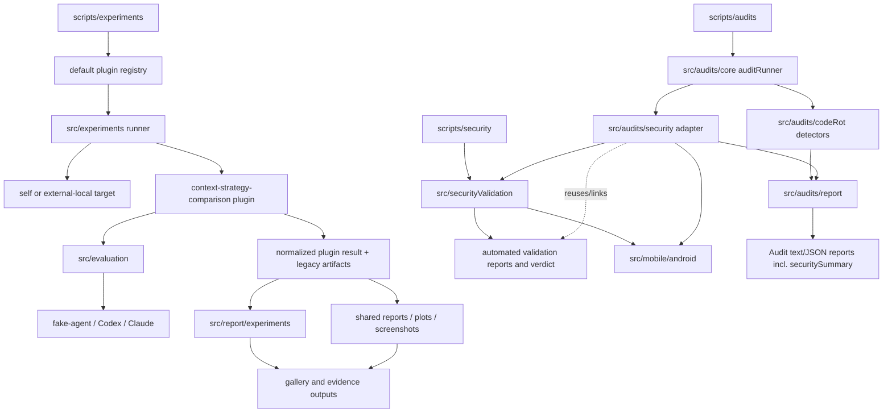
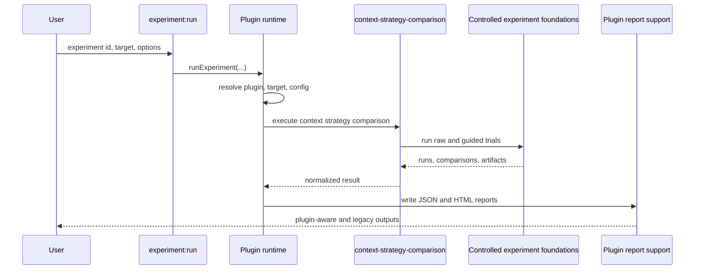
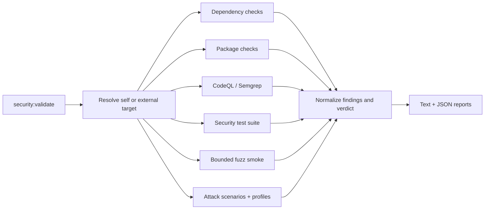
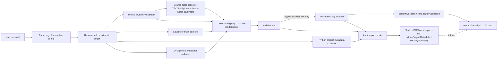

# Architecture

## Android architecture

`src/mobile/android` adds Android validation to the existing experiment, evaluation, audit, security-validation, report, plot, screenshot, and gallery systems. Android validation is non-destructive and static by default; Gradle operations, external tools, and network requests require explicit opt-in. `src/audits/security` extends the same security audit adapter directly with Android validation summaries and report references (`--android`); it does not create a parallel adapter and does not map `CandidateEvidence` to `AuditIssue`.

## Current implemented architecture

my-dev-kit-lab is the experiment, evidence, reporting, visualization, gallery, automated security-validation, Android-validation, and audit companion for my-dev-kit. The generic experiment-plugin architecture is fully implemented, not a migration in progress. The generic audit framework is implemented, with `code-rot` and `security` (including its Android-aware extension) as the currently implemented audit types, built on a language-aware source-facts substrate covering TypeScript/JavaScript, Python, Java, and Kotlin.

### Module map

```text
src/
  core/                                      shared process, path, token, and target utilities
  experiments/                               plugin runtime
    config.ts                                shared configuration loading
    defaultRegistry.ts                       built-in plugin registration
    registry.ts                              plugin lookup and uniqueness
    runner.ts                                generic execution lifecycle
    target.ts                                self/external-local target resolution
    types.ts                                 plugin contracts and normalized results
    plugins/contextStrategyComparison/       first implemented plugin
  evaluation/                                benchmark, controlled-run, scoring, and metrics logic
  agents/                                    fake-agent, Codex, and Claude adapters
  prompts/                                   prompt variant generation and prompt complexity metrics
  audits/                                    generic audit framework (code-rot and security audit types implemented)
    core/                                    target resolution, config, registry, inventory, source-of-truth, source facts, language analyzer registry, Python + JVM project metadata, exit-code policy, runner
    codeRot/                                 code-rot audit type
      detectors/                             10 code-rot detector families (TS/JS-, Python-, and Java/Kotlin-aware where source facts are available)
      utils/                                 shared detector helpers (bounded reads, doc-claim/command-reference parsing, JVM source-facts helpers, text-line utilities)
    security/                                security audit adapter: adapts securityValidation results into audit issues/report summary, including the Android-aware extension
    report/                                  audit report model, JSON/text renderers, writer, text sanitizer
  report/
    experiments/                             plugin-aware JSON/HTML report support
    ...                                      shared and legacy report infrastructure
  mobile/android/                            Android detection, manifest parsing, static Gradle metadata, and advanced security checks
  securityValidation/                        automated security validation
    dependencies/                            npm and OSV checks
    packageChecks/                           npm package-content inspection
    cliAdversarial/                          CLI/path/read-only/malformed/subprocess checks
    attackScenarios/                         adversarial scenario contracts, profiles, runner, scenarios, schema guard
    staticScans/                             CodeQL and Semgrep integration
    fuzz/                                    bounded deterministic fuzz smoke
    validate/                                targets, orchestration, and verdicts
    report/                                  text and JSON security reports; buildSecurityReport.ts assembles the report object shared by scripts/security/validate.ts and the audits/security adapter
  plots/ screenshot/ gallery/                evidence presentation
  visualizationDemos/                        my-dev-kit visualization runs

scripts/
  experiments/                               experiment:list, experiment:describe, experiment:run
  security/                                  security checks and security:validate
  audits/                                    runAudit.ts — npm run audit entrypoint
  ...                                        legacy/demo/report/plot/gallery entrypoints
```

The supporting ownership roots are `src/agents` for provider adapters, `src/prompts` for prompt variants/complexity, and `src/visualizationDemos` for visualization runs. They remain shared by the experiment/report flow rather than becoming separate pipelines.

### System diagram



## Experiment-plugin runtime

`src/experiments/defaultRegistry.ts` registers `context-strategy-comparison`. `src/experiments/runner.ts` resolves the requested plugin and target, validates configuration, executes the plugin, normalizes output, and invokes plugin-aware report generation.

The current plugin delegates trial execution and comparison logic to the established controlled-experiment infrastructure. This preserves:

- `raw-full-file` and `my-dev-kit-guided` variants
- benchmark cases and answer-key correctness
- fake-agent and real-agent adapters
- partial-outcome handling
- legacy experiment summary, run, and comparison artifacts
- `run-controlled-experiment` compatibility



## Target model

Experiment and security commands distinguish the tool root from the target root. Omitting `--target` selects self mode. Supplying `--target <path>` selects an external local project. Experiment outputs remain in lab-controlled output directories by default; security reports remain under `reports/security` unless an explicit output directory is provided.

`src/core/localProjectTarget.ts` supplies shared local-project metadata. Experiment target resolution lives in `src/experiments/target.ts`; security target resolution lives in `src/securityValidation/validate/resolveTarget.ts`.

## Automated security-validation architecture

The current security framework is automated CLI/package validation. It combines dependency and package inspection, adversarial CLI tests, static-tool integrations, bounded fuzz smoke, attack-scenario execution, and report/verdict generation. It is target-aware and preserves `npm run security:validate` self mode.



For an external target, dependency, package, and supported static checks use the target project. If the target declares `test:security`, validation runs that script in the target root. The framework records command cwd, exit status, and bounded output summaries. Tool-specific self-tests remain clearly labeled.

`src/securityValidation/attackScenarios` is now part of the implemented validation layer. It contains the `AttackScenario` contract, `AttackResult` bridge model, reusable profiles, payload/evidence helpers, the integrated attack runner, and concrete scenarios for boundary, subprocess, secrets, and network checks.

`src/securityValidation/attackScenarios/reportSchemaGuard.ts` protects JSON report structure against payload-created top-level injection by comparing a clean baseline render with a payload-bearing render. This is schema/report hardening for the current report format, not a general renderer-safety proof.

`src/securityValidation/types.ts` defines `VerdictImpact`, which flows from `AttackScenario` to `AttackResult` to `SecurityCheckResult`. `src/securityValidation/validate/verdict.ts` reads that metadata directly when summarizing blocker categories, so the verdict layer no longer owns a hand-maintained scenario-impact map.

Profile behavior remains intentionally narrow in the current implementation: profiles drive default check selection and scenario applicability filtering, but they do not yet introduce deeper per-profile scenario branching beyond that selection metadata.

Optional local tools can be reported as skipped; absence alone does not make the framework crash. This automation is not equivalent to a manual pentest.

## Audit framework architecture

`src/audits/` is the implemented generic project-audit framework. `code-rot` (since `v0.3.0`) and `security` (since `v0.3.2`) are the currently implemented audit types. `quality`, `project`, and `all` audit types remain planned — supplying them to `--types` fails cleanly with exit code 2 and a clear message rather than running.

The audit framework and automated security validation (`src/securityValidation`) remain two distinct systems. `src/audits/security` is an *adapter*, not a new security-scanner family: it calls `runSecurityValidation()` (the same internals `security:validate` uses) directly, maps the resulting `SecurityFinding`s into audit issues, and writes the same `reports/security/*.txt`/`*.json` report family `security:validate` already writes. `security:validate` is never called by the audit framework as a subprocess, and it does not call the audit framework — the adapter only reuses `securityValidation`'s exported functions.



`src/audits/core/` supplies:
- `auditConfig.ts` — `--target`, `--types`, `--include`, `--format`, `--fail-on`, `--out` flag parsing and normalization
- `auditTarget.ts` — target resolution (self or external local project), non-destructive with respect to the target
- `projectInventory.ts` — project inventory scanner (files by category/extension, normalized language, file role, excluded directories)
- `sourceOfTruth.ts` — source-of-truth collector (package metadata, scripts, docs, CI, build tooling, tests, security, experiment truth)
- `sourceFacts.ts` / `collectSourceFacts.ts` — source facts model and collector for source/test files
- `languageAnalyzerRegistry.ts` / `typescriptJavaScriptAnalyzer.ts` / `pythonAnalyzer.ts` / `javaAnalyzer.ts` / `kotlinAnalyzer.ts` — language analyzer registry with TypeScript/JavaScript, Python, Java, and Kotlin analyzers registered for their supported extensions
- `pythonProjectMetadata.ts` — presence/simple-text-extraction collector for Python project/config files (`pyproject.toml`, `requirements.txt`, `setup.py`, `setup.cfg`, `tox.ini`, `pytest.ini`); never executes Python tooling
- `jvmProjectMetadata.ts` — static Gradle/Maven/wrapper/source-set presence detection and best-effort project-name extraction; never executes Gradle, Maven, compilers, or target tests
- `auditRegistry.ts` — `DEFAULT_AUDIT_REGISTRY`, detector contract, and `selectDetectors()` filtering by type/include area
- `auditRunner.ts` — executes selected detectors against the collected inventory/source-of-truth
- `auditExitCode.ts` — exit-code policy: `0` no issue met the `--fail-on` threshold, `1` at least one issue met or exceeded it, `2` invalid config/target or a runtime failure (never returned by the pure exit-code calculator itself; the CLI script's own try/catch blocks return it directly)

`src/audits/codeRot/detectors/` implements the 10 registered code-rot detector families, in registry order:
1. `stale-command-reference` — stale command/workflow references in docs
2. `docs-code-mismatch` — documentation/code mismatch
3. `package-release-rot` — package/release metadata rot
4. `duplicate-implementation-candidate` — duplicate or parallel implementation candidates
5. `dead-code-candidate` — dead-code candidates from deterministic evidence
6. `test-rot` — test rot signals
7. `architecture-drift` — architecture drift between docs and implemented modules
8. `dependency-environment-rot` — dependency/environment rot
9. `cross-platform-rot` — cross-platform rot
10. `security-validation-assumption-rot` — stale documentation *claims* about security-validation (this detector checks claims about security-validation; it does not itself perform security validation)

`src/audits/report/` builds and writes the stable, versioned report:
- `auditReportModel.ts` — pure `AuditResult -> AuditReportModel` transform; `AUDIT_REPORT_SCHEMA_VERSION = "1.0"`; the published `v0.3.2` package state includes 16 top-level fields (`schemaVersion`, `metadata`, `target`, `config`, `summary`, `inventory`, `sourceOfTruth`, `sourceFacts`, `pythonProjectMetadata`, `securitySummary`, `detectors`, `issues`, `skippedDetectors`, `detectorErrors`, `recommendations`, `exit`) — `v0.3.1` had 14 (no `pythonProjectMetadata`/`securitySummary`); `metadata.auditType` (joined string) and `metadata.auditTypes` (string array) are both present
- `renderAuditJsonReport.ts` / `renderAuditTextReport.ts` — JSON and text renderers; the text renderer sanitizes all issue/recommendation text through `sanitizeAuditText.ts` before printing and renders both an evidence message and excerpt when both are present
- `writeAuditReports.ts` — writes the selected `--format` outputs
- Reports are written under `reports/audits/code-rot/` by default (`code-rot-audit.json`, `code-rot-audit.txt`), or under `--out <path>` when supplied

`scripts/audits/runAudit.ts` is a thin CLI entrypoint: parse args → normalize config → resolve target → `runAudit()` → `buildAuditReportModel()` → `writeAuditReports()` → console summary → set `process.exitCode`. It mirrors the structure of `scripts/security/validate.ts` but shares no code with it.

Fail-on policy: `--fail-on blocker|high|medium|low|none` (default `blocker`; see `docs/COMMANDS.md` for full threshold semantics). External-target audits are non-destructive — target resolution and the runner do not write or delete files inside the target root; generated reports stay under the tool root's `reports/audits/` unless `--out` redirects them.

### v0.3.1 audit substrate (published)

`v0.3.1` extended the audit core with normalized language/file-role inventory, a language analyzer registry, a source facts model, source facts collection, and TypeScript/JavaScript analyzer support.

The TypeScript/JavaScript analyzer is syntax-only and single-file. It uses the TypeScript compiler API to parse supported TS/JS extensions and records imports, exports, declarations, bare call references, line counts, diagnostics, and parse status. Files over 1 MB fall back to file-level facts. Files with syntax diagnostics are marked `parse-error` while retaining best-effort facts.

The code-rot integrations use source facts as additional conservative evidence only. They do not prove unused code, semantic duplicate implementations, test coverage, full module resolution, `tsconfig` path alias resolution, type-checker semantics, or runtime reachability.

### v0.3.2 audit substrate (published)

`v0.3.2` adds a Python analyzer alongside the `v0.3.1` TypeScript/JavaScript analyzer. It is dependency-free and regex/line-based (no Python runtime, no `ast` module, no third-party parser): it extracts `import`/`from...import` statements (including relative dotted imports), `__all__`, and module-level/class-body `def`/`class` declarations. It leaves `references` empty (no call/identifier tracking) to avoid overclaiming. `pythonProjectMetadata.ts` separately collects presence/simple-text-extraction metadata from common Python project files.

The same source-facts-aware `dead-code-candidate`, `duplicate-implementation-candidate`, and `test-rot` detectors extended in `v0.3.1` for TypeScript/JavaScript now also consume Python source facts (a Python-specific relative-import resolver for `test-rot`, and an analyzer-id-scoped grouping key for `duplicate-implementation-candidate` so the pre-existing TypeScript/JavaScript grouping is unaffected). Python-derived findings use the same conservative "candidate"/"may indicate" wording as the rest of the code-rot family.

`v0.3.2` also adds the security-validation audit adapter described above (`src/audits/security/`), making `security` the second implemented audit type alongside `code-rot`.

### v0.3.3 audit substrate (published, current baseline)

The published `v0.3.3` implementation adds Java and Kotlin analyzers alongside the `v0.3.1` TypeScript/JavaScript analyzer and the `v0.3.2` Python analyzer. Both JVM analyzers are conservative, dependency-free scanners: they record package/import/declaration facts with regex and brace-depth tracking, not compiler or AST-backed semantic analysis. Java supports `.java`; Kotlin supports `.kt` and `.kts`.

`jvmProjectMetadata.ts` separately collects static JVM project metadata: Gradle build/settings/wrapper presence, Maven `pom.xml` presence, conventional `src/main|test/{java,kotlin}` source-set directories, and a best-effort project name. This is presence/simple-text-extraction only. It never executes Gradle, Maven, Java, Kotlin, Android tooling, or target-project tests.

The existing code-rot detectors are extended conservatively rather than replaced:

- `dead-code-candidate` adds Java/Kotlin top-level declaration checks using import simple-name evidence and JVM naming/lifecycle exclusions; it does not attempt method- or constructor-level dead-code detection.
- `duplicate-implementation-candidate` adds Java/Kotlin duplicate declaration candidate checks while keeping duplicate groups analyzer-scoped, so Java, Kotlin, Python, and TypeScript/JavaScript findings do not merge into one cross-language group.
- `test-rot` adds best-effort Java/Kotlin missing-import checks using analyzer-recorded JVM imports plus recognized source/test-set directories, without compiler/classpath resolution.
- `docs-code-mismatch` adds Java/Kotlin symbol-claim checks and static Gradle/Maven command/feature-claim checks against JVM metadata. This detector does not own Android validation; the implemented Android subsystem remains separate under `src/mobile/android`.

No audit command changed and no report schema field was added for `v0.3.3`. `pythonProjectMetadata` and `securitySummary` remain the additive top-level fields from `v0.3.2`; JVM metadata is detector input, not a new report field.

## Shared report and evidence infrastructure

`src/report` remains the shared report layer. `src/report/experiments` extends it for plugin metadata rather than creating a parallel reporting product. Plots, screenshots, visualization demos, and gallery output consume experiment artifacts and remain reusable across future plugins.

## Future architecture

The following layers are planned and must not be treated as current published or checked-out behavior:

- JVM package/environment rot or Gradle/Maven dependency freshness checks
- the `quality`, `project`, and `all` audit types, and any project-wide default audit behavior combining multiple audit types
- cross-type issue deduplication or release-readiness aggregation across audit families beyond the current per-type additive report fields
- a human-led manual pentest workflow after `v1.0.0`
- `v0.4.3` stage-specific bounded-context and workflow-instruction evaluation (see below)
- additional experiment plugins for warm indexes, freshness, scale, retrieval quality, and agent success
- normalized telemetry, scheduling, prompt hardening, and generalized report/gallery publication

Future audit work should reuse `src/audits/core`, `src/audits/security`, current target metadata, the normalized audit issue schema, and shared report infrastructure. Android validation and the v0.4.2 audit integration already reuse those foundations. This work must not replace the experiment plugin runtime, duplicate report/gallery systems, or fold `security:validate` into the audit framework — the audit framework only adapts and links to `securityValidation`; it does not absorb it.

### v0.4.3 — stage-specific bounded-context and workflow-instruction evaluation (planned)

Not implemented. See [ROADMAP.md](ROADMAP.md) for the full plan, ownership boundaries, and acceptance criteria. Planned module names below are candidates, subject to confirmation against current registry/type conventions at implementation time.

Planned additive modules:

- `src/evaluation` (or an adjacent module) — a context-capsule reader, a retrieval-audit reader, and a `WorkflowInstructionPacket` reader, each validating a supported schema major and rejecting unsupported majors/malformed input without silent reinterpretation.
- A normalized observation model built on top of reader output, additive to existing types in `src/evaluation/types.ts`.
- `src/experiments/plugins/contextStrategyComparison/` — extended with candidate strategy IDs (architecture-only, architecture-plus-implementation-refresh, architecture-plus-implementation-and-test-refresh, full-workflow-library baseline, bounded-workflow-packet, combined-bounded-stage-context), preserving the existing `raw-full-file` and `my-dev-kit-guided` strategies.
- An explicit fixture-expectation schema (required/allowed/forbidden evidence, stable case/requirement IDs), extending `BenchmarkTaskAnswerKey`/`ExpectedContextTarget` in `src/evaluation/types.ts`.
- Deterministic evidence-centered metrics (required-evidence recall, irrelevant-file/instruction inclusion, responsibility-mapping completeness, provenance completeness, truncation, adequacy, freshness, full-file-fallback, unnecessary reads, determinism), each reporting explicit numerator/denominator/rate and unavailable-vs-zero status.
- Target-immutability before/after snapshot evidence for experiment targets, extending the read-only pattern already used by `src/securityValidation/attackScenarios/targetSnapshot.ts` (which currently captures git-status entries and a timestamp, not branch/commit/file hashes).
- Additive `src/report`/`src/report/experiments` sections, and optional `src/plots`/`src/screenshot`/`src/gallery` reuse.

This work depends on stable output contracts from `my-dev-kit` `1.10.1` (role-aware context capsule and retrieval-audit record extensions) and `my-dev-kit-orchestrator` `1.2.1` (`WorkflowInstructionPacket`). It consumes those contracts via versioned fixtures or configurable local commands — it does not add a permanent local path dependency to `package.json`, and neither upstream project becomes a required runtime dependency of my-dev-kit-lab. It must not replace `src/experiments/runner.ts`, duplicate `src/report`/`src/plots`/`src/gallery`, or alter `src/audits` or `src/securityValidation` behavior.

## Key contracts

| Contract | Location |
|---|---|
| Plugin and result types | `src/experiments/types.ts` |
| Plugin registry | `src/experiments/registry.ts` |
| Generic runner | `src/experiments/runner.ts` |
| Current plugin | `src/experiments/plugins/contextStrategyComparison/plugin.ts` |
| Plugin report model | `src/report/experiments/experimentReportModel.ts` |
| Controlled experiment types | `src/evaluation/controlledExperimentTypes.ts` |
| Shared local target metadata | `src/core/localProjectTarget.ts` |
| Security result types | `src/securityValidation/types.ts` |
| Security orchestrator | `src/securityValidation/validate/runSecurityValidation.ts` |
| Audit issue / result types | `src/audits/core/auditIssue.ts` / `src/audits/core/auditRunner.ts` |
| Audit detector registry | `src/audits/core/auditRegistry.ts` |
| Audit report model | `src/audits/report/auditReportModel.ts` |
| Source facts model | `src/audits/core/sourceFacts.ts` |
| Language analyzer registry | `src/audits/core/languageAnalyzerRegistry.ts` |
| TypeScript/JavaScript analyzer | `src/audits/core/typescriptJavaScriptAnalyzer.ts` |
| Python analyzer | `src/audits/core/pythonAnalyzer.ts` |
| Java analyzer | `src/audits/core/javaAnalyzer.ts` |
| Kotlin analyzer | `src/audits/core/kotlinAnalyzer.ts` |
| Python project metadata | `src/audits/core/pythonProjectMetadata.ts` |
| JVM project metadata | `src/audits/core/jvmProjectMetadata.ts` |
| Security audit adapter | `src/audits/security/securityAuditAdapter.ts` |
| Security finding → audit issue mapping | `src/audits/security/mapSecurityFindingToAuditIssue.ts` |
