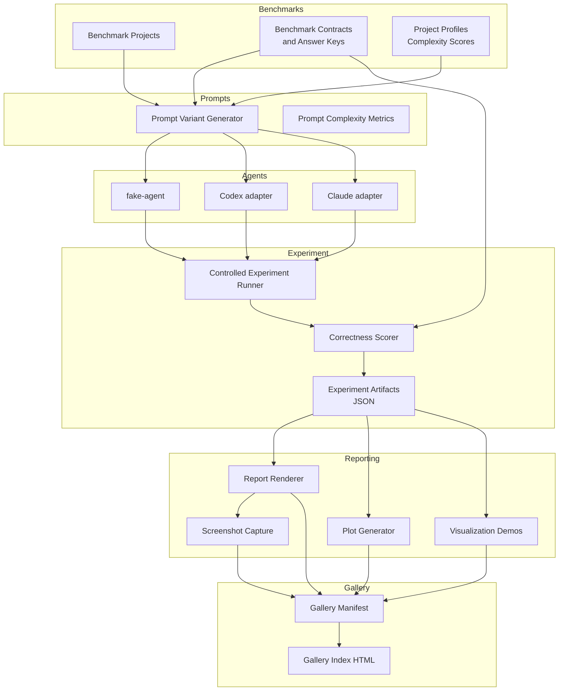
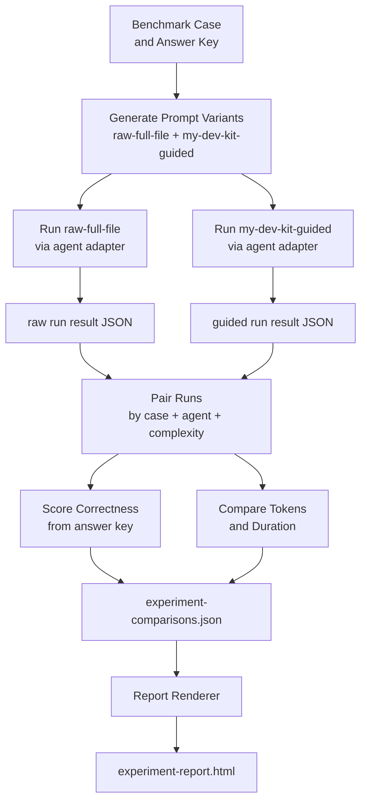
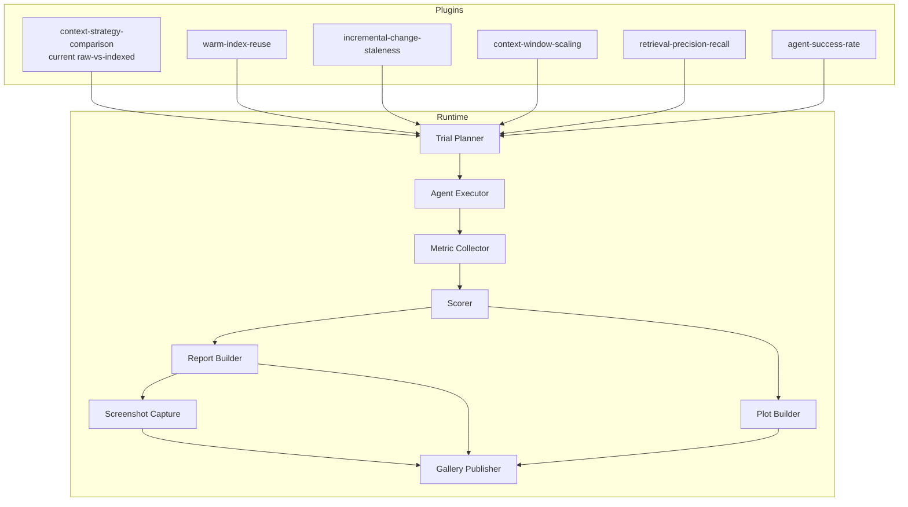
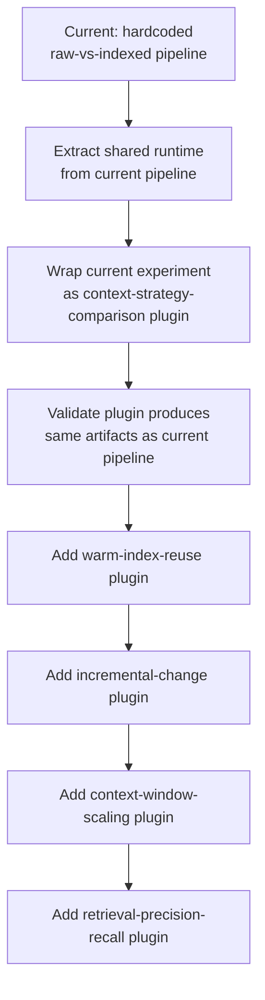

# Architecture

## Current architecture

my-dev-kit-lab is organized as a layered pipeline. Each layer has a focused responsibility and writes structured artifacts that the next layer consumes.

### Module map

| Module | Path | Responsibility |
|---|---|---|
| Benchmarks | `benchmarks/` | Deterministic benchmark projects, contracts, and answer keys |
| Core utilities | `src/core/` | Token counting, safe paths, file glob collection, subprocess execution |
| Evaluation | `src/evaluation/` | File tree building, complexity scoring, benchmark metadata validation |
| Prompts | `src/prompts/` | Raw-full-file and my-dev-kit-guided prompt generation, prompt complexity metrics |
| Agents | `src/agents/` | fake-agent, Codex, and Claude adapter interfaces |
| Experiment runner | `src/commands/` | Controlled experiment orchestration, correctness scoring, artifact writing |
| Report | `src/report/` | Experiment report input model, HTML rendering, artifact writing |
| Screenshot | `src/screenshot/` | Optional PNG capture from generated local HTML reports |
| Plots | `src/plots/` | Plot-ready data generation and deterministic SVG chart rendering |
| Visualization demos | `src/visualizationDemos/` | Bounded my-dev-kit visualization command demos |
| Gallery | `src/gallery/` | Gallery manifest types and writer |
| Scripts | `scripts/` | Command entrypoints and verification helpers |
| Tests | `tests/` | Validation and parity tests |

---

### Current architecture diagram

---

## How data moves through the system

### 1. Benchmark layer

Benchmark projects under `benchmarks/projects/` provide stable, version-controlled source trees at different complexity levels. Benchmark contracts in `benchmarks/contracts/` define task descriptions, expected files, expected symbols, and answer keys. Project profiles in `benchmarks/contracts/benchmark-project-profiles.json` store complexity metrics and complexity scores.

### 2. Prompt layer

The prompt variant generator reads benchmark cases and produces instruction text at `short`, `medium`, `long`, and `multi-step` complexity levels. Each variant is either a `raw-full-file` prompt (full file contents inlined) or a `my-dev-kit-guided` prompt (instructions to use my-dev-kit retrieval commands). Prompt complexity metrics are computed alongside each variant.

### 3. Agent layer

Agent adapters execute a single prompt against a benchmark case and return a structured result. The fake-agent adapter returns deterministic outputs without any external CLI. The Codex and Claude adapters invoke local CLI tools and capture stdout, stderr, token totals (when available), and duration. Runs that time out, produce invalid output, or hit session limits are recorded as structured outcomes.

### 4. Experiment runner

The controlled experiment runner pairs `raw-full-file` and `my-dev-kit-guided` runs for each combination of case, agent, and complexity level. It scores correctness against answer keys, computes token and duration comparisons for matched pairs, and writes `experiment-summary.json`, `experiment-runs.json`, and `experiment-comparisons.json`.

### 5. Reporting layer

The report renderer reads experiment artifacts and produces `experiment-report.json` and `experiment-report.html`. The plot generator reads experiment artifacts and produces `plot-data.json` and SVG charts. Visualization demos run bounded my-dev-kit commands against a benchmark project and write demo artifacts. Screenshot capture optionally produces a PNG from the HTML report.

### 6. Gallery layer

The gallery writer collects report, plot, visualization demo, and screenshot artifacts into a `gallery-manifest.json` and a static `gallery-index.html`.

---

## Raw-vs-indexed experiment data path

---

## Future experiment-plugin architecture

The next major development phase refactors my-dev-kit-lab into a generic experiment framework. The current pipeline becomes the first experiment plugin.

### Plugin model

Each experiment plugin declares:
- **Trial plan** — which cases, agents, strategies, and complexity levels to run
- **Agent execution** — how to invoke agents and collect results
- **Metric collection** — which metrics to record per run
- **Scoring** — how to evaluate run outputs
- **Report sections** — which sections to include in the HTML report
- **Plot sections** — which charts to generate
- **Screenshot capture** — whether to capture a PNG
- **Gallery publishing** — which artifacts to include in the gallery

### Future plugin architecture diagram

### Migration path

---

## Benchmark projects

| Project | Size | Languages |
|---|---|---|
| `todo-ts` | small | TypeScript |
| `todo-js` | small | JavaScript |
| `todo-python` | small | Python |
| `todo-mixed-ts-py` | small | TypeScript + Python |
| `task-workflow-medium-ts` | medium | TypeScript |
| `task-analytics-large-mixed` | large | TypeScript + Python |

---

## Key contract files

| File | Purpose |
|---|---|
| `benchmarks/contracts/benchmark-project-profiles.json` | Project descriptions, complexity metrics, complexity scores |
| `benchmarks/contracts/todo-benchmark-case.json` | Task definitions, expected files, expected symbols, answer keys |
| `examples/real-agent-campaign-cases.json` | Bounded real-agent campaign evaluation cases |
| `docs/METRICS.md` | Canonical metric glossary |
