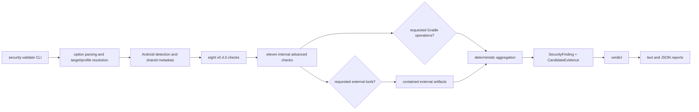

# Architecture

Owners: CLI options are in `src/securityValidation/validate/cliOptions.ts` and `scripts/security/validate.ts`; detection/manifest/initial audits are under `src/mobile/android/`; advanced checks are under `src/mobile/android/advancedSecurity/`; shared sensitive helpers are under `advancedSecurity/sensitiveData/`; optional Gradle execution is under `gradle/validate/`; external tools are under `advancedSecurity/externalTools/`; active orchestration and verdicts are under `validate/`; report model/render/write are under `report/`.

Runtime order is target/profile resolution, detection and shared evidence, original checks, eleven internal checks, requested Gradle operations, requested external tools, deterministic aggregation, verdict, then contained artifacts and reports. Failures are isolated so one check or tool cannot erase other results.

AndroidCheckResult remains canonical. SecurityFinding and CandidateEvidence remain distinct. External rule IDs preserve provenance; semantic cross-check deduplication is not performed. Report fields are additive. Android AuditIssue mapping is not implemented in v0.4.1.

The default path starts no child process. Gradle and external-tool IDs are closed, arguments are fixed, environments and output are bounded, network is denied by default, installers and updates are forbidden, artifacts are contained, mutations are reported, and cleanup is not attempted.
