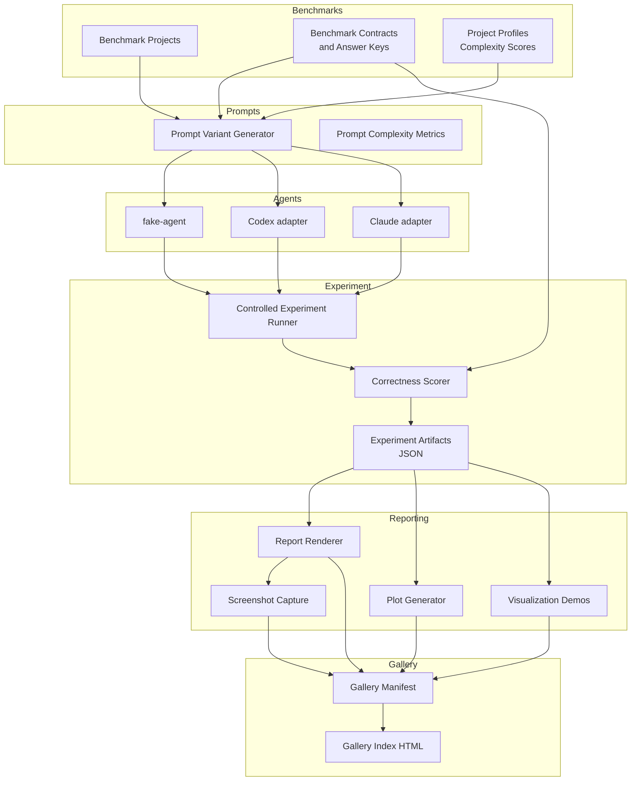
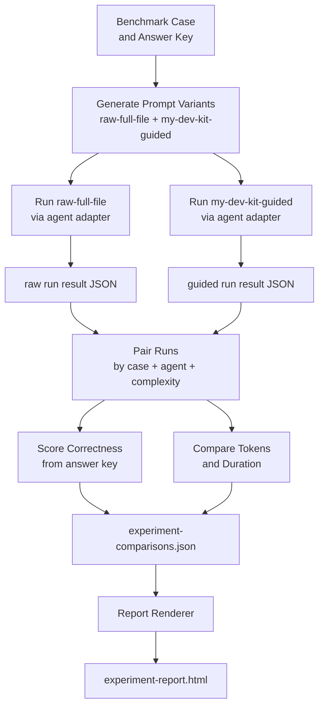
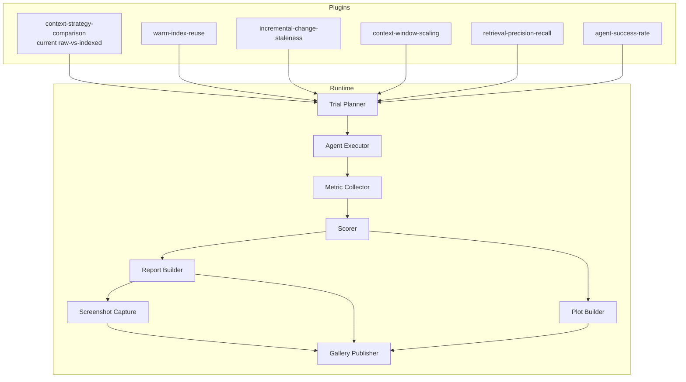
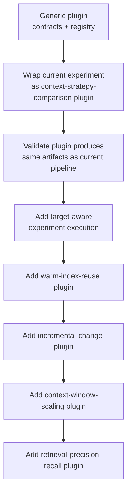
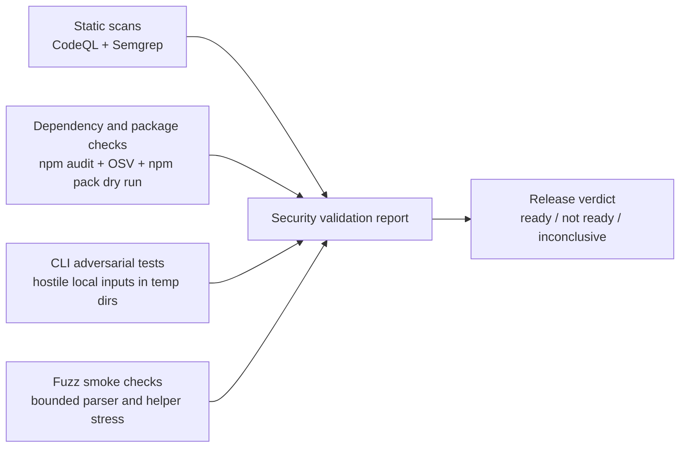
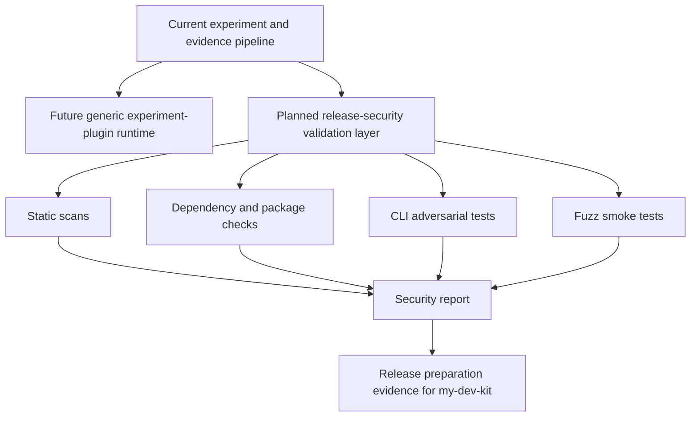

# Architecture

## Current architecture

my-dev-kit-lab is organized as a layered pipeline. Each layer has a focused responsibility and writes structured artifacts that the next layer consumes.

### Module map

| Module | Path | Responsibility |
|---|---|---|
| Benchmarks | `benchmarks/` | Deterministic benchmark projects, contracts, and answer keys |
| Core utilities | `src/core/` | Token counting, safe paths, file glob collection, subprocess execution |
| Evaluation | `src/evaluation/` | File tree building, complexity scoring, benchmark metadata validation |
| Experiments | `src/experiments/` | Generic experiment plugin contracts, registry, target metadata, config validation, normalized run results, and the first `context-strategy-comparison` plugin |
| Prompts | `src/prompts/` | Raw-full-file and my-dev-kit-guided prompt generation, prompt complexity metrics |
| Agents | `src/agents/` | fake-agent, Codex, and Claude adapter interfaces |
| Experiment runner | `src/commands/` | Controlled experiment orchestration, correctness scoring, artifact writing |
| Report | `src/report/` | Legacy controlled-experiment report rendering plus plugin-aware report models, HTML/JSON rendering, and artifact writing |
| Screenshot | `src/screenshot/` | Optional PNG capture from generated local HTML reports |
| Plots | `src/plots/` | Plot-ready data generation and deterministic SVG chart rendering |
| Visualization demos | `src/visualizationDemos/` | Bounded my-dev-kit visualization command demos |
| Gallery | `src/gallery/` | Gallery manifest types and writer |
| Security validation | `src/securityValidation/` | Types, config, test matrix, dependency checks, package checks, CLI adversarial harness, static scans, fuzz smoke tests, release gate orchestrator, report renderer |
| Scripts | `scripts/` | Command entrypoints and verification helpers |
| Tests | `tests/` | Validation, parity, adversarial, and fuzz smoke tests |

---

### Current architecture diagram

---

## How data moves through the system

### 1. Benchmark layer

Benchmark projects under `benchmarks/projects/` provide stable, version-controlled source trees at different complexity levels. Benchmark contracts in `benchmarks/contracts/` define task descriptions, expected files, expected symbols, and answer keys. Project profiles in `benchmarks/contracts/benchmark-project-profiles.json` store complexity metrics and complexity scores.

### 2. Prompt layer

The prompt variant generator reads benchmark cases and produces instruction text at `short`, `medium`, `long`, and `multi-step` complexity levels. Each variant is either a `raw-full-file` prompt (full file contents inlined) or a `my-dev-kit-guided` prompt (instructions to use my-dev-kit retrieval commands). Prompt complexity metrics are computed alongside each variant.

### 3. Agent layer

Agent adapters execute a single prompt against a benchmark case and return a structured result. The fake-agent adapter returns deterministic outputs without any external CLI. The Codex and Claude adapters invoke local CLI tools and capture stdout, stderr, token totals (when available), and duration. Runs that time out, produce invalid output, or hit session limits are recorded as structured outcomes.

### 4. Experiment runner

The controlled experiment runner pairs `raw-full-file` and `my-dev-kit-guided` runs for each combination of case, agent, and complexity level. It scores correctness against answer keys, computes token and duration comparisons for matched pairs, and writes `experiment-summary.json`, `experiment-runs.json`, and `experiment-comparisons.json`.

### 5. Reporting layer

The legacy report renderer reads controlled-experiment artifacts and produces `experiment-report.json` and `experiment-report.html`. The plugin-aware report renderer reads normalized `ExperimentRun` results plus plugin metadata and produces target-aware `report.json` and `report.html` under the experiment output root. The plot generator reads experiment artifacts and produces `plot-data.json` and SVG charts. Visualization demos run bounded my-dev-kit commands against a benchmark project and write demo artifacts. Screenshot capture optionally produces a PNG from the HTML report.

### 6. Gallery layer

The gallery writer collects report, plot, visualization demo, and screenshot artifacts into a `gallery-manifest.json` and a static `gallery-index.html`.

---

## Raw-vs-indexed experiment data path

---

## Experiment-plugin architecture

my-dev-kit-lab now includes a generic experiment framework. The existing raw-full-file vs my-dev-kit-guided pipeline is registered as the first plugin: `context-strategy-comparison`.

### Plugin model

Each experiment plugin declares:
- **Metadata** - stable id, name, description, schema version, status, supported targets, and supported outputs
- **Config definition and validation** - required and optional fields plus normalized defaults
- **Lifecycle hooks** - optional prepare and cleanup steps around `run`
- **Execution behavior** - the plugin-specific experiment implementation
- **Normalized result data** - variants, cases, outcomes, metrics, artifacts, warnings, failures, and summary

The `context-strategy-comparison` plugin delegates to the existing controlled experiment engine, preserving fake-agent, Codex, Claude, scoring, report, plot, screenshot, and gallery behavior. It also emits normalized plugin result metadata in `experiment-plugin-result.json` next to the existing legacy experiment artifacts.

Target-aware plugin execution passes a context with separate tool and target roots. Lab-owned outputs default to `lab-output/experiments/<plugin-id>/<target>/<run-id>/`, and plugin-aware reports in that directory include plugin, target, variant, case, metric, artifact, warning, skip, and failure metadata.

The user-facing command surface is:
- `npm run experiment:list`
- `npm run experiment:describe -- --experiment <plugin-id>`
- `npm run experiment:run -- --experiment <plugin-id> [--target <path>]`

### Plugin architecture diagram

### Migration path

---

## Planned security validation architecture

The release-security framework described here is planned architecture, not a current implementation. It is intended to sit alongside the experiment system as a lab-owned validation layer for **my-dev-kit** release preparation.

The security-validation track does not replace the current pipeline and does not depend on my-dev-kit becoming a hosted service. The target remains a local CLI/package, so the architecture is centered on static analysis, dependency/package checks, adversarial CLI tests, bounded fuzz smoke checks, and release reporting.

### Security validation module map

| Module | Path | Status | Responsibility |
|---|---|---|---|
| Security validation core | `src/securityValidation/` | Foundational types implemented | Shared models, policy boundaries, report assembly, release verdict logic |
| Types | `src/securityValidation/types.ts` | **Implemented** | Severity, verdict, check result, finding, validation summary |
| Config | `src/securityValidation/config.ts` | **Implemented** | Report paths, timeouts, forbidden patterns, optional tool toggles |
| Test matrix | `src/securityValidation/testMatrix.ts` | **Implemented** | Structured adversarial test case catalog |
| Dependencies | `src/securityValidation/dependencies/` | **Implemented** | npm audit, npm outdated, npm ls, OSV-Scanner wrappers |
| Package checks | `src/securityValidation/packageChecks/` | **Implemented** | npm pack dry-run, forbidden-content detection |
| Static scans | `src/securityValidation/staticScans/` | **Implemented** | CodeQL availability check and Semgrep wrappers with target-aware scanning |
| Security scripts | `scripts/security/` | **Implemented** | npm script entrypoints for `security:deps`, `security:package`, `security:codeql`, `security:semgrep`, and `security:validate` |
| Adversarial CLI tests | `tests/security/` | **Implemented** | Type/matrix tests plus adversarial boundary, malformed-input, JSON-safety, subprocess-safety, and validate-gate coverage |
| Fuzz smoke tests | `tests/fuzz/` | **Implemented** | Bounded parser and helper stress tests used by `test:fuzz:smoke` |
| Security reports | `reports/security/` | Generated (not committed) | Target-aware dependency, package, raw command, and release-validation artifacts |

### Security validation pipeline

### Relationship to the existing lab architecture

### Planned validation boundaries

The future security-validation modules are intended to verify that my-dev-kit remains:

- local-first
- deterministic
- read-only with respect to user source files
- network-free during normal CLI operation
- LLM-free
- database-free
- safe to run on local repositories

Expected safe behavior includes clear failures for hostile input, writes limited to explicit output paths, non-destructive artifact refresh behavior, safe subprocess execution without shell-string interpolation, and valid JSON output behavior when machine-readable modes are used.

See [security-validation-framework.md](security-validation-framework.md) for the canonical framework description and phased release-gate plan.

---

## Benchmark projects

| Project | Size | Languages |
|---|---|---|
| `todo-ts` | small | TypeScript |
| `todo-js` | small | JavaScript |
| `todo-python` | small | Python |
| `todo-mixed-ts-py` | small | TypeScript + Python |
| `task-workflow-medium-ts` | medium | TypeScript |
| `task-analytics-large-mixed` | large | TypeScript + Python |

---

## Key contract files

| File | Purpose |
|---|---|
| `benchmarks/contracts/benchmark-project-profiles.json` | Project descriptions, complexity metrics, complexity scores |
| `benchmarks/contracts/todo-benchmark-case.json` | Task definitions, expected files, expected symbols, answer keys |
| `examples/real-agent-campaign-cases.json` | Bounded real-agent campaign evaluation cases |
| `docs/METRICS.md` | Canonical metric glossary |
