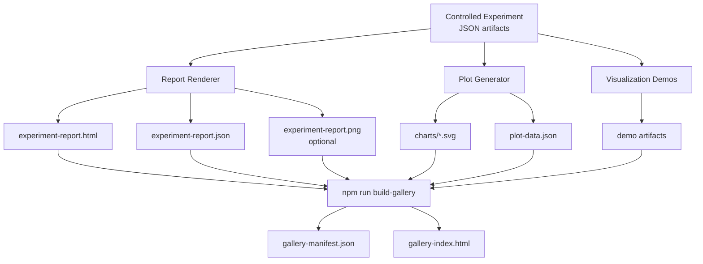
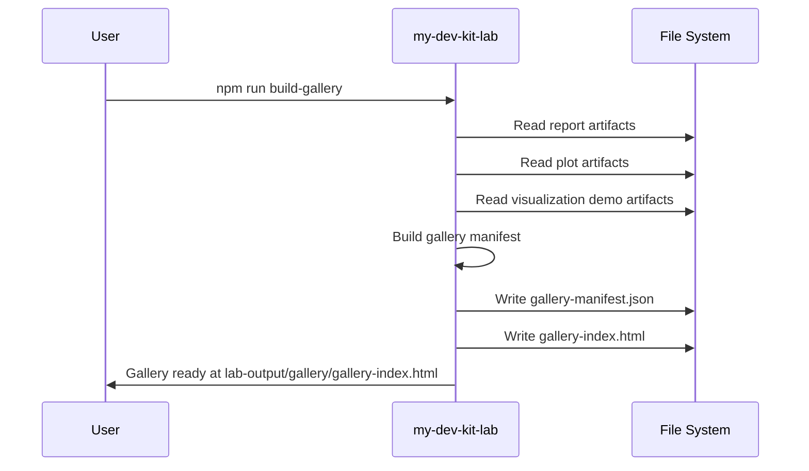

# Gallery

The gallery is a browsable collection of all artifacts produced by a my-dev-kit-lab experiment run. It brings together the experiment report, SVG charts, visualization demos, and optional screenshots into a single navigable index.

---

## What the gallery contains

A gallery output directory contains:

| Artifact | Description |
|---|---|
| `gallery-manifest.json` | Structured list of all gallery entries with paths, types, and metadata |
| `gallery-index.html` | Static HTML page linking to all gallery entries |

The gallery manifest references artifacts from:
- The experiment report (`experiment-report.html`, `experiment-report.json`, optional `experiment-report.png`)
- SVG charts from the plot generator (`charts/*.svg`)
- Visualization demo artifacts
- Any additional screenshots captured during the pipeline

---

## How the gallery relates to other outputs



---

## Gallery manifest structure

The `gallery-manifest.json` file lists every artifact in the gallery. Each entry includes:

- **type** — the artifact type: `report`, `plot`, `screenshot`, `demo`, or `index`
- **path** — relative path to the artifact file
- **label** — human-readable label for the gallery index
- **metadata** — additional context such as experiment name, agent, strategy, or complexity level

---

## How to build a gallery

After running a controlled experiment and generating a report and plots:

```bash
npm run build-gallery -- \
  --report lab-output/experiment-report-fake \
  --plots lab-output/experiment-plots \
  --visualizations lab-output/visualization-demos \
  --out lab-output/gallery
```

Open `lab-output/gallery/gallery-index.html` in a browser to browse all artifacts.

---

## Gallery publishing diagram



---

## Gallery in the final demo

The `npm run run-final-demo` command builds the gallery automatically as the last step of the pipeline. The gallery output is written to the same directory as all other final demo artifacts.

---

## Current limitations

- The gallery index is a static HTML file with no interactive filtering or search
- Gallery entries are linked by relative path; moving the output directory breaks links
- Richer gallery UI with filtering, tagging, and comparison views is planned for a future phase

See [ROADMAP.md](ROADMAP.md) for the gallery UI roadmap item.
