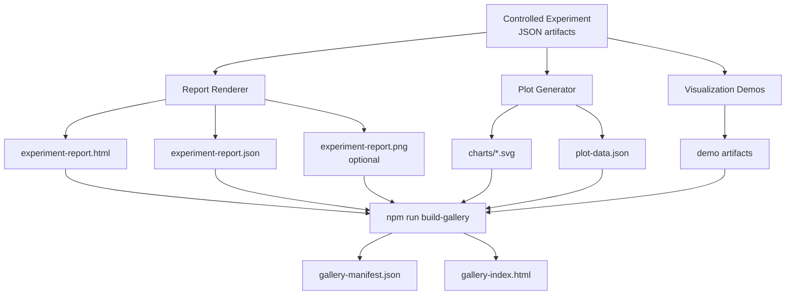
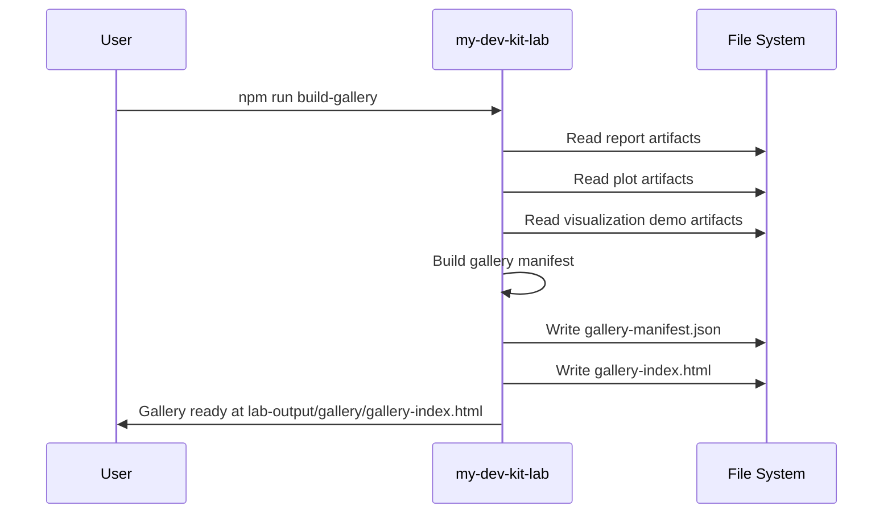

# Gallery

The gallery is a static, browsable index of evidence produced by a my-dev-kit-lab experiment. It links reports, SVG charts, visualization demos, and optional screenshots without copying or reinterpreting their contents.

---

## What the gallery contains

A gallery output directory contains:

| Artifact | Description |
|---|---|
| `gallery-manifest.json` | Structured list of all gallery entries with paths, types, and metadata |
| `gallery-index.html` | Static HTML page linking to all gallery entries |

The gallery manifest references artifacts from:
- The experiment report (`experiment-report.html`, `experiment-report.json`, optional `experiment-report.png`)
- SVG charts from the plot generator (`charts/*.svg`)
- Visualization demo artifacts
- Any additional screenshots captured during the pipeline

Tutorial runs also produce a separate `tutorial-manifest.json`, WebM, screenshots, subtitles, and Markdown. v0.4.7 generates those tutorial artifacts but the current gallery does not consume or browse tutorial manifests; tutorial-manifest gallery integration remains future scope.

---

## How the gallery relates to other outputs


```mermaid
flowchart TD
  A[Controlled Experiment\nJSON artifacts] --> B[Report Renderer]
  A --> C[Plot Generator]
  A --> D[Visualization Demos]
  B --> E[experiment-report.html]
  B --> F[experiment-report.json]
  B --> G[experiment-report.png\noptional]
  C --> H[charts/*.svg]
  C --> I[plot-data.json]
  D --> J[demo artifacts]
  E --> K[npm run build-gallery]
  F --> K
  G --> K
  H --> K
  I --> K
  J --> K
  K --> L[gallery-manifest.json]
  K --> M[gallery-index.html]
```

---

## Gallery manifest structure

The `gallery-manifest.json` file lists every artifact in the gallery. Each entry includes:

- **type** — the artifact type: `report`, `plot`, `screenshot`, `demo`, or `index`
- **path** — relative path to the artifact file
- **label** — human-readable label for the gallery index
- **metadata** — additional context such as experiment name, agent, strategy, or complexity level

---

## How to build a gallery

Prerequisites:

- a rendered experiment report
- generated plot artifacts
- visualization artifacts when included

Build the gallery with:

```bash
npm run build-gallery -- \
  --report lab-output/experiment-report-fake \
  --plots lab-output/experiment-plots \
  --visualizations lab-output/visualization-demos \
  --out lab-output/gallery
```

Open `lab-output/gallery/gallery-index.html` in a browser to browse all artifacts.

If the command reports a missing input, generate that artifact first or remove the corresponding optional input. Completion means `gallery-manifest.json` and `gallery-index.html` exist and every relative link resolves from the gallery directory.

---

## Gallery publishing diagram


```mermaid
sequenceDiagram
  participant User
  participant Lab as my-dev-kit-lab
  participant FS as File System

  User->>Lab: npm run build-gallery
  Lab->>FS: Read report artifacts
  Lab->>FS: Read plot artifacts
  Lab->>FS: Read visualization demo artifacts
  Lab->>Lab: Build gallery manifest
  Lab->>FS: Write gallery-manifest.json
  Lab->>FS: Write gallery-index.html
  Lab->>User: Gallery ready at lab-output/gallery/gallery-index.html
```

---

## Gallery in the final demo

The `npm run run-final-demo` command builds the gallery automatically as the last step of the pipeline. The gallery output is written to the same directory as all other final demo artifacts.

---

## Warm-index campaign gallery (v0.5.2, implemented/unreleased)

Implemented on the unreleased v0.5.2 implementation (`feature/v0.5.2-warm-index-real-agent-campaigns`, `src/gallery/writeWarmIndexCampaignGallery.ts`); not exposed by the installed v0.5.1 CLI. Unlike an ordinary `warm-index-reuse` run, a `--campaign` run that completes automatically produces its own bounded gallery — there is no separate `gallery build` invocation for it, and it does not reuse the generic `writeExperimentGalleryManifest()` contract, whose artifact names (`experiment-report.html`, `experiment-summary.json`, `experiment-runs.json`) do not match the warm-index plugin's own frozen artifact set.

The campaign gallery contains exactly three items, in this order:

1. `warm-index-campaign-report` — the campaign report (`report.html`/`report.json`/`report.txt`), tagged with the campaign agent id, with a screenshot when one was captured.
2. `warm-index-campaign-plots` — the same four warm-index charts (amortized index build cost, context size, correctness, cumulative token usage) as an ordinary warm-index run.
3. `warm-index-execution` — the bounded `warm-index-execution.json` execution evidence.

All paths in the manifest are relative POSIX paths under the gallery output directory; the manifest links to no raw agent stdout/stderr/telemetry file. The report item's status is `pass` only when the report screenshot was actually captured; a skipped or failed screenshot is recorded as a warning on that item rather than failing the gallery.

## Current limitations

- The gallery index is a static HTML file with no interactive filtering or search
- Gallery entries are linked by relative path; moving the output directory breaks links
- Filtering, tagging, search, and comparison views are not implemented
- An ordinary `warm-index-reuse` run (deterministic fake agent, `v0.5.0`/`v0.5.1`) has no dedicated gallery integration: `gallery build --plots` lists any `charts/*.svg` generically under the experiment-plots entry, and the plugin's `report.json`/`report.html` are not gallery entries for that path. A real-agent warm-index **campaign** run (`--campaign`, implemented on the unreleased v0.5.2 implementation) is the exception — see "Warm-index campaign gallery" below

See [ROADMAP.md](ROADMAP.md) for the gallery UI roadmap item.
