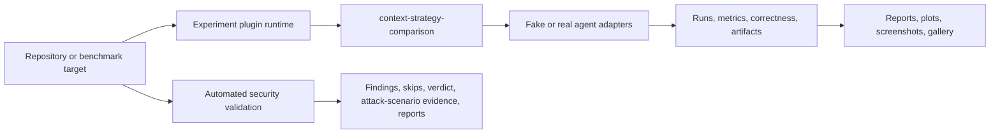

# Project Overview

## What is my-dev-kit-lab?

my-dev-kit-lab is the experiment, evidence, reporting, security-validation, and future audit companion for my-dev-kit.

my-dev-kit is a local-first repository indexing and graph-guided retrieval CLI. It helps coding agents work with large codebases through reusable structural indexing, graph-guided retrieval, targeted source slices, and auditable context selection. Its strongest use case is when the repository is larger than the task; the project does not assume or claim that guided retrieval always saves tokens.

The lab supplies controlled benchmarks, agent adapters, metrics, reports, plots, screenshots, galleries, and automated CLI/package security checks.

## Current baseline

The current package is version `0.2.1`. The generic experiment-plugin runtime introduced in `v0.2.0` is implemented. Its first and currently only registered plugin is `context-strategy-comparison`.

That plugin preserves the established raw-full-file versus my-dev-kit-guided experiment through the generic registry and runner. It supports self and explicit local-project targets, plugin-aware reports, deterministic fake-agent runs, and optional Codex or Claude campaigns. Existing legacy commands and artifacts remain supported.

Automated security validation is also implemented. It supports dependency and package checks, adversarial CLI checks, static scanning integrations, bounded fuzz smoke, structured verdicts, explicit local-project targets, and an attack-scenario layer with profiles, evidence, and report hardening. It is not a complete manual pentest framework.

## Product flow

## Users

- maintainers evaluating my-dev-kit behavior
- coding-agent workflow researchers
- teams comparing context-selection strategies
- release engineers collecting local CLI/package security evidence
- contributors adding future experiment or audit capabilities

## What the evidence can establish

The lab can compare matched strategies for a defined target, task, agent, and configuration. It can record correctness, context size, reported or estimated tokens, duration, status, and partial outcomes. It can also preserve the retrieval and report artifacts needed to audit a result.

Results are scoped evidence, not a universal performance claim. Small repositories or broad tasks may favor raw reading. Reused indexes and localized tasks in larger repositories are stronger candidates for graph-guided retrieval.

## Next phases

The immediate direction is:

1. carry the implemented `v0.2.2` security-validation fortification through separate pre-release readiness work
2. add a generic audit framework and code rot detector
3. add code quality detection
4. integrate security results into unified audit reports
5. add a project-wide audit command
6. add a separate manual pentest framework

The experiment evidence track then expands through warm-index reuse, freshness and stale-index detection, context-window scaling, retrieval precision/recall, agent success, normalized telemetry, scheduling, prompt hardening, and generalized report/gallery publication.

See [CURRENT_STATE.md](CURRENT_STATE.md) for implemented-versus-planned status and [ROADMAP.md](ROADMAP.md) for semantic version ordering.
