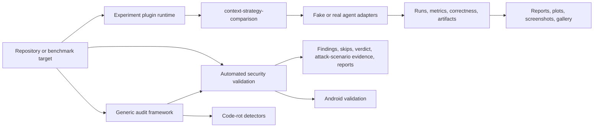

# Project Overview

## Current v0.4.x state

The current published baseline is v0.4.2. The project remains the experiment, evidence, report, plot/gallery, generic-audit, automated security-validation, and Android-validation companion to my-dev-kit. v0.4.0 published the Android validation MVP; v0.4.1 published advanced Android security; v0.4.2 published an Android-aware extension of the existing general security audit adapter. v0.4.3, adding deterministic evaluation of stage-specific bounded repository context and workflow-instruction strategies, is planned and unreleased/not implemented; see [ROADMAP.md](ROADMAP.md). Future experiment work remains planned and manual pentest remains post-v1 / version TBD.

## What is my-dev-kit-lab?

my-dev-kit-lab is the experiment, evidence, reporting, security-validation, and audit companion for my-dev-kit. It includes four areas of validated capability: experiment/evidence, automated security validation, Android validation, and a generic audit framework (`code-rot` audit type with language-aware TypeScript/JavaScript, Python, Java, and Kotlin source facts, plus a `security` audit type via the security-validation audit adapter, including its Android-aware extension). The audit framework does not perform code-quality analysis; that remains a planned, unimplemented audit type.

my-dev-kit is a local-first repository indexing and graph-guided retrieval CLI. It helps coding agents work with large codebases through reusable structural indexing, graph-guided retrieval, targeted source slices, and auditable context selection. Its strongest use case is when the repository is larger than the task; the project does not assume or claim that guided retrieval always saves tokens.

The lab supplies controlled benchmarks, agent adapters, metrics, reports, plots, screenshots, galleries, and automated CLI/package security checks.

## Current baseline

The generic experiment-plugin runtime introduced in `v0.2.0` is implemented. Its first and currently only registered plugin is `context-strategy-comparison`, which preserves the raw-full-file versus my-dev-kit-guided experiment through the generic registry and runner. It supports self and explicit local-project targets, plugin-aware reports, deterministic fake-agent runs, and optional Codex or Claude campaigns.

Automated security validation is implemented, supporting dependency and package checks, adversarial CLI checks, static scanning integrations, bounded fuzz smoke, structured verdicts, explicit local-project targets, and an attack-scenario layer with profiles, evidence, and report hardening. It is not a manual pentest framework. `security:validate` remains its standalone, focused command.

Android validation is implemented as a `security:validate --profile android` option: project detection, manifest parsing, permission/exported-component/deep-link audits, static Gradle metadata, and eleven advanced internal checks, for nineteen default checks with zero default Gradle, external-tool, or network activity.

The generic audit framework is implemented, covering the language-aware `code-rot` detector family (TypeScript/JavaScript, Python, Java, Kotlin) and the `security` audit type via the security-validation audit adapter. That adapter calls `security:validate`'s internals directly, maps findings into audit issues, and preserves `security:validate`'s original `reports/security/` output unchanged; its Android-aware extension (`--android`) maps confirmed Android findings the same way while keeping `CandidateEvidence` separate. Audit is a separate tool from both the experiment pipeline and `security:validate`, and does not replace or duplicate either.

Java/Kotlin support is conservative and static only: no compiler parsing, no type/classpath resolution, and no Gradle/Maven execution. Android validation is likewise static and read-only; see [security-validation-framework.md](security-validation-framework.md) for its full limits.

Code-quality audit, project-wide combined audit defaults, framework-aware profiles, JVM package/environment rot, Gradle/Maven dependency freshness checks, and manual pentest remain future roadmap work.

## Product flow

## Users

- maintainers evaluating my-dev-kit behavior
- coding-agent workflow researchers
- teams comparing context-selection strategies
- release engineers collecting local CLI/package security evidence
- contributors adding future experiment or audit capabilities

## What the evidence can establish

The lab can compare matched strategies for a defined target, task, agent, and configuration. It can record correctness, context size, reported or estimated tokens, duration, status, and partial outcomes. It can also preserve the retrieval and report artifacts needed to audit a result.

Results are scoped evidence, not a universal performance claim. Small repositories or broad tasks may favor raw reading. Reused indexes and localized tasks in larger repositories are stronger candidates for graph-guided retrieval.

## Next phases

The current published npm baseline is `v0.4.2`. v0.3.4 remains the published cross-language audit-stability baseline. The immediate direction is:

1. preserve the published Android validation MVP from `v0.4.0`
2. preserve the published advanced Android security checks from `v0.4.1`
3. preserve the published Android-aware extension of the existing security audit adapter completed in `v0.4.2`
4. plan and, once approved, implement `v0.4.3` (deterministic evaluation of stage-specific bounded repository context and workflow-instruction strategies), which is currently unreleased and not implemented
5. keep manual pentest deferred until after `v1.0.0`

The experiment evidence track then expands through warm-index reuse, freshness and stale-index detection, context-window scaling, retrieval precision/recall, agent success, normalized telemetry, scheduling, prompt hardening, and generalized report/gallery publication.

See [CURRENT_STATE.md](CURRENT_STATE.md) for implemented-versus-planned status and [ROADMAP.md](ROADMAP.md) for semantic version ordering.
