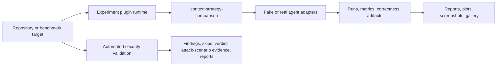

# Project Overview

## Current v0.4.x state

The current published baseline is v0.4.1. The project remains the experiment, evidence, report, plot/gallery, generic-audit, automated security-validation, and Android-validation companion to my-dev-kit. v0.4.0 published the Android validation MVP; v0.4.1 published advanced Android security. v0.4.2 is implemented on its feature branch but unreleased and extends the existing general security audit adapter. Future experiment work remains planned and manual pentest remains post-v1 / version TBD.

## What is my-dev-kit-lab?

my-dev-kit-lab is the experiment, evidence, reporting, security-validation, and audit companion for my-dev-kit. It now includes three areas of validated capability: experiment/evidence, automated security validation, and a generic audit framework in the published `v0.3.4` audit baseline (`code-rot` audit type with language-aware TypeScript/JavaScript, Python, Java, and Kotlin source facts, plus a `security` audit type via the security-validation audit adapter). `v0.3.3` (previous published baseline) extends the code-rot track to Java/Kotlin and static JVM metadata without changing the command surface. `v0.3.4` (package metadata `0.3.4`) hardens cross-language/path/line-ending behavior on top of that baseline. The audit framework does not perform code-quality analysis; that remains a planned, unimplemented audit type.

my-dev-kit is a local-first repository indexing and graph-guided retrieval CLI. It helps coding agents work with large codebases through reusable structural indexing, graph-guided retrieval, targeted source slices, and auditable context selection. Its strongest use case is when the repository is larger than the task; the project does not assume or claim that guided retrieval always saves tokens.

The lab supplies controlled benchmarks, agent adapters, metrics, reports, plots, screenshots, galleries, and automated CLI/package security checks.

## Current baseline

The current published npm baseline is version `0.3.4`. The generic experiment-plugin runtime introduced in `v0.2.0` is implemented. Its first and currently only registered plugin is `context-strategy-comparison`.

That plugin preserves the established raw-full-file versus my-dev-kit-guided experiment through the generic registry and runner. It supports self and explicit local-project targets, plugin-aware reports, deterministic fake-agent runs, and optional Codex or Claude campaigns. Existing legacy commands and artifacts remain supported.

Automated security validation is also implemented. It supports dependency and package checks, adversarial CLI checks, static scanning integrations, bounded fuzz smoke, structured verdicts, explicit local-project targets, and an attack-scenario layer with profiles, evidence, and report hardening. It is not a manual pentest framework. `security:validate` remains its standalone, focused command.

The generic audit framework is implemented in the current published baseline. `v0.3.0` added `npm run audit` with one audit type, `code-rot`, covering 10 heuristic detector families and writing stable text/JSON reports; `v0.3.1` added a language-aware source-facts substrate and TypeScript/JavaScript analyzer for those same detectors. Audit is a separate tool from both the experiment pipeline and `security:validate`.

`v0.3.2` adds a Python analyzer and Python project metadata extending the language-aware source-facts substrate to Python, and a security-validation audit adapter that makes `security` the second implemented audit type. The adapter calls `security:validate`'s internals directly, maps its findings into audit issues, adds a `securitySummary` report field, and preserves `security:validate`'s original `reports/security/` output unchanged. It does not replace or duplicate that command.

`v0.3.3` adds Java and Kotlin analyzers, JVM project metadata detection for static Gradle/Maven/source-set shape, Java/Kotlin support in the existing code-rot detectors, and Java/Kotlin/Gradle/Maven docs-code-mismatch checks. This is the current published package state: package metadata is `0.3.3`, `v0.3.2` remains the previous published baseline, and the same `npm run audit` / `--types code-rot|security|code-rot,security` command surface is preserved. Java/Kotlin support is conservative and static only: no compiler parsing, no type/classpath resolution, no Gradle/Maven execution, no Android validation, and no target-project test execution.

Code-quality audit, project-wide combined audit defaults, Android automated security validation, framework-aware profiles, JVM package/environment rot, Gradle/Maven dependency freshness checks, and manual pentest remain future roadmap work.

## Product flow

## Users

- maintainers evaluating my-dev-kit behavior
- coding-agent workflow researchers
- teams comparing context-selection strategies
- release engineers collecting local CLI/package security evidence
- contributors adding future experiment or audit capabilities

## What the evidence can establish

The lab can compare matched strategies for a defined target, task, agent, and configuration. It can record correctness, context size, reported or estimated tokens, duration, status, and partial outcomes. It can also preserve the retrieval and report artifacts needed to audit a result.

Results are scoped evidence, not a universal performance claim. Small repositories or broad tasks may favor raw reading. Reused indexes and localized tasks in larger repositories are stronger candidates for graph-guided retrieval.

## Next phases

The current published npm baseline is `v0.4.1` (package metadata `0.4.1`); v0.3.4 remains the published cross-language audit-stability baseline. The immediate direction is:

1. preserve the published Android validation MVP from `v0.4.0`
2. preserve the published advanced Android security checks from `v0.4.1`
3. complete the unreleased Android-aware extension of the existing security audit adapter in `v0.4.2`
4. keep manual pentest deferred until after `v1.0.0`

The experiment evidence track then expands through warm-index reuse, freshness and stale-index detection, context-window scaling, retrieval precision/recall, agent success, normalized telemetry, scheduling, prompt hardening, and generalized report/gallery publication.

See [CURRENT_STATE.md](CURRENT_STATE.md) for implemented-versus-planned status and [ROADMAP.md](ROADMAP.md) for semantic version ordering.
