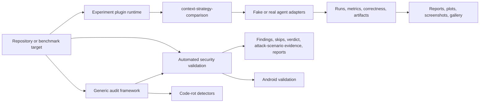

# Project Overview

## What is my-dev-kit-lab?

my-dev-kit-lab is for maintainers, release engineers, coding-agent researchers, and contributors who need evidence about repository-context choices and local project health. A retrieval strategy can look efficient without selecting the right evidence. A project can also appear release-ready without consistent package, CLI, audit, or Android checks.

The project combines controlled experiments, deterministic fixtures, agent adapters, conservative audits, automated security validation, and reviewable reports. It records what ran, what evidence was available, what was skipped, and which limitations apply.

[my-dev-kit](https://www.npmjs.com/package/@dailephd/my-dev-kit) is the local-first indexing and graph-guided retrieval CLI being evaluated. my-dev-kit-lab is the separate experiment and validation layer. Workflow-packet inputs from my-dev-kit-orchestrator are read by the implemented v0.4.3 stage-context strategies through exact, non-normalizing readers; the orchestrator is not a runtime dependency.

The strongest retrieval use case is a localized task in a repository that is larger than the task. The project measures that claim under defined conditions rather than assuming that guided retrieval always saves tokens.

## Current baseline

The latest published release is v0.4.3 (stage-specific bounded-context and workflow-instruction evaluation). See [CURRENT_STATE.md](CURRENT_STATE.md) for operational details, [CHANGELOG.md](../CHANGELOG.md) for release history, and [ROADMAP.md](ROADMAP.md) for future scope.

The generic experiment-plugin runtime has one registered plugin, `context-strategy-comparison`. It compares raw-full-file and my-dev-kit-guided strategies through a common runner and supports deterministic fake-agent runs, optional Codex or Claude campaigns, self-validation, and explicit local-project targets.

Automated security validation is implemented, supporting dependency and package checks, adversarial CLI checks, static scanning integrations, bounded fuzz smoke, structured verdicts, explicit local-project targets, and an attack-scenario layer with profiles, evidence, and report hardening. It is not a manual pentest framework. `security:validate` remains its standalone, focused command.

Android validation is implemented as a `security:validate --profile android` option: project detection, manifest parsing, permission/exported-component/deep-link audits, static Gradle metadata, and eleven advanced internal checks, for nineteen default checks with zero default Gradle, external-tool, or network activity.

The generic audit framework provides language-aware `code-rot` detectors for TypeScript/JavaScript, Python, Java, and Kotlin. Its `security` type adapts the standalone validator's results into audit issues while preserving the original `reports/security/` output.

The `--android` extension maps confirmed Android findings through that same adapter and keeps `CandidateEvidence` separate. Audit remains distinct from both experiments and `security:validate`.

Java/Kotlin support is conservative and static only: no compiler parsing, no type/classpath resolution, and no Gradle/Maven execution. Android validation is likewise static and read-only; see [security-validation-framework.md](security-validation-framework.md) for its full limits.

Code-quality audit, project-wide combined audit defaults, framework-aware profiles, JVM package/environment rot, Gradle/Maven dependency freshness checks, and manual pentest remain future roadmap work.

## Product flow

## Users

- maintainers evaluating my-dev-kit behavior
- coding-agent workflow researchers
- teams comparing context-selection strategies
- release engineers collecting local CLI/package security evidence
- contributors adding future experiment or audit capabilities

## What the evidence can establish

The lab can compare matched strategies for a defined target, task, agent, and configuration. It can record correctness, context size, reported or estimated tokens, duration, status, and partial outcomes. It can also preserve the retrieval and report artifacts needed to audit a result.

Results are scoped evidence, not a universal performance claim. Small repositories or broad tasks may favor raw reading. Reused indexes and localized tasks in larger repositories are stronger candidates for graph-guided retrieval.

## Next phases

Version v0.4.3 evaluates stage-specific bounded repository context and workflow instructions through the existing experiment infrastructure and is published. The next planned patch is v0.5.0, warm-index reuse. Later planned work covers freshness and stale-index detection, context-window scaling, retrieval precision and recall, agent success, normalized telemetry, scheduling, prompt hardening, and a generalized evidence portal.

These later items remain planned. Manual pentest remains a human-led post-v1/version-TBD workflow and is not part of the current automated validation system.

See [CURRENT_STATE.md](CURRENT_STATE.md) for implemented-versus-planned status and [ROADMAP.md](ROADMAP.md) for semantic version ordering.
