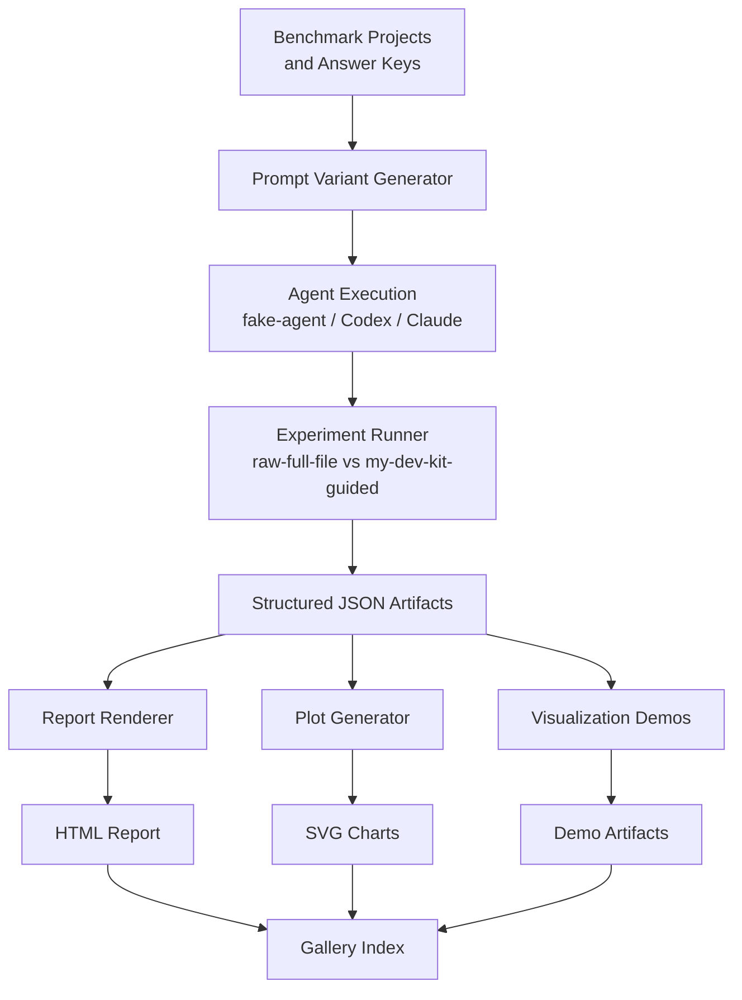

# Project Overview

## What is my-dev-kit-lab?

my-dev-kit-lab is the experiment and evidence companion for my-dev-kit. It provides a reproducible environment for running controlled experiments, collecting metrics, rendering reports, and publishing gallery outputs that demonstrate how my-dev-kit's graph-guided retrieval compares with raw full-file context strategies.

**my-dev-kit** indexes a code repository and provides graph-guided retrieval so that coding agents can locate relevant source context without reading every file.

**my-dev-kit-lab** feeds benchmark inputs to that retrieval engine, runs agents against those benchmarks under controlled conditions, and records structured evaluation outputs.

---

## Target users

- Developers evaluating whether my-dev-kit improves agent workflows on their codebase
- Researchers comparing context strategies across different project sizes and task types
- Teams building evidence for adopting or extending my-dev-kit in their toolchain

---

## Problems my-dev-kit-lab helps solve

### Reproducibility
Benchmark projects, answer keys, and experiment configurations are version-controlled. Anyone can re-run the same experiment and get the same structured outputs.

### Controlled comparison
The raw-vs-indexed experiment pairs each agent run under `raw-full-file` and `my-dev-kit-guided` strategies so comparisons are fair: same task, same agent, same complexity level, different context strategy.

### Evidence collection
Experiment artifacts — JSON summaries, HTML reports, SVG plots, PNG screenshots, and gallery indexes — provide shareable evidence of how the two strategies compare on correctness, token usage, and duration.

### Scalable benchmarking
Benchmark projects range from small Todo fixtures to medium and large multi-language projects, so experiments can be run at meaningfully different complexity levels.

---

## Product flow

---

## Why raw-vs-indexed is only the first experiment

The raw-vs-indexed experiment establishes the infrastructure and shows how the two strategies compare on a cold start. It does not yet capture the full value of my-dev-kit because:

- **Warm-index reuse** — the cost of indexing is paid once; subsequent queries reuse the index. Cold-start comparisons do not reflect this amortized benefit.
- **Incremental-change experiments** — real codebases change incrementally. Experiments that measure how well a stale or partially updated index still guides retrieval are not yet implemented.
- **Context-window scaling** — as projects grow, raw full-file context eventually exceeds agent context windows. Experiments that measure this boundary are not yet implemented.
- **Retrieval precision and recall** — measuring whether my-dev-kit retrieves the right files and symbols, not just fewer tokens, requires dedicated precision/recall experiments.

The current baseline does not yet prove every future value claim. It establishes the experiment infrastructure and shows how to run reproducible comparisons. Stronger evidence will come from the future experiment types described in [docs/ROADMAP.md](docs/ROADMAP.md).

---

## Why a generic experiment-plugin framework matters

The next major development phase refactors my-dev-kit-lab into a generic experiment framework. Instead of a single hardcoded pipeline, each experiment type becomes a plugin that declares its trial plan, agent execution parameters, metric collection, scoring logic, and report sections. The current raw-vs-indexed experiment becomes the first plugin under this framework.

This makes it straightforward to add warm-index reuse, incremental-change, context-window scaling, and retrieval precision experiments without rebuilding the pipeline each time.

See [docs/ROADMAP.md](docs/ROADMAP.md) for the full roadmap.

---

## Support

my-dev-kit-lab is developed independently as part of the dailephd LLC toolchain. Users who want to support continued development can sponsor the project through GitHub Sponsors or PayPal.

- [Sponsor on GitHub](https://github.com/sponsors/dailephd)
- [Support via PayPal](https://paypal.me/daile88)
