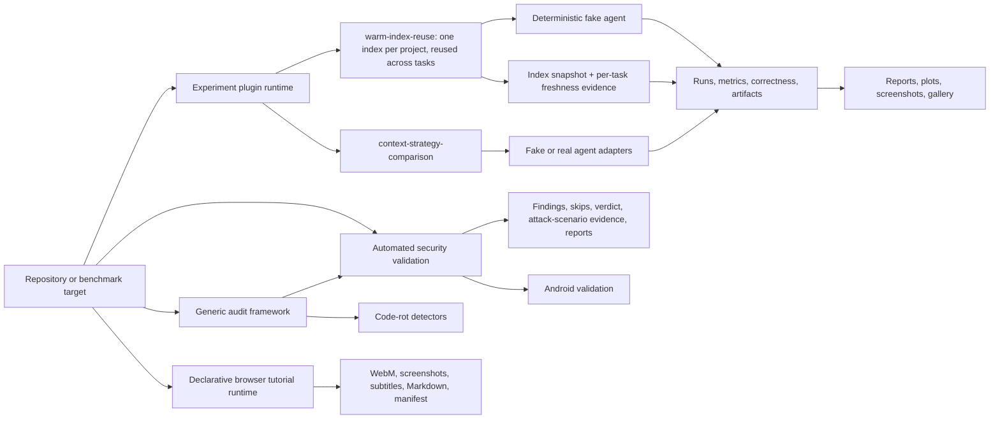

# Project Overview

## What is my-dev-kit-lab?

my-dev-kit-lab is for maintainers, release engineers, coding-agent researchers, and contributors who need evidence about repository-context choices and local project health. A retrieval strategy can look efficient without selecting the right evidence. A project can also appear release-ready without consistent package, CLI, audit, or Android checks.

The project combines controlled experiments, deterministic fixtures, agent adapters, conservative audits, automated security validation, and reviewable reports. It records what ran, what evidence was available, what was skipped, and which limitations apply.

[my-dev-kit](https://www.npmjs.com/package/@dailephd/my-dev-kit) is the local-first indexing and graph-guided retrieval CLI being evaluated. my-dev-kit-lab is the separate experiment and validation layer. Workflow-packet inputs from my-dev-kit-orchestrator are read by the implemented v0.4.3 stage-context strategies through exact, non-normalizing readers; the orchestrator is not a runtime dependency.

Cross-repository workflows are documented once in [my-dev-kit/docs/ECOSYSTEM_DEVELOPMENT_WORKFLOWS.md](https://github.com/dailephd/my-dev-kit/blob/main/docs/ECOSYSTEM_DEVELOPMENT_WORKFLOWS.md). That guide combines static evidence from my-dev-kit, Orchestrator lifecycle, rendered evidence from my-frontend-observer, project tests, and risk-based Lab assurance. This repository retains its own [command reference](COMMANDS.md) and [Lab workflows](WORKFLOWS.md), not a duplicate ecosystem guide.

The compositions are externally executed recipes, not new Lab commands or a claim of a validated four-tool runtime pipeline. Field-failure feedback must be converted into a supported experiment/test contract before Lab can evaluate it. The installed CLI does not automatically ingest arbitrary workflow-feedback or Observer artifacts. Required assurance failures and unavailable required evidence cannot be counted as passed feature gates.

The strongest retrieval use case is a localized task in a repository that is larger than the task. The project measures that claim under defined conditions rather than assuming that guided retrieval always saves tokens.

## Current baseline

The latest release is v0.6.0 (index freshness and changed-file detection); v0.5.2 (warm-index real-agent campaigns) is the previous release. Earlier releases added the tutorial actions and warm-index campaign capabilities described below. Version v0.6.0 (index freshness and changed-file detection) is released/current, and version v0.6.1 (affected-neighborhood experiments) is the next planned product version. See [CURRENT_STATE.md](CURRENT_STATE.md) for operational details, [CHANGELOG.md](../CHANGELOG.md) for release history, and [ROADMAP.md](ROADMAP.md) for future scope.

Context-integrity evaluation compares condition-aware producer evidence against orchestrator run-integrity evidence for a fixed request, target, and index identity, reporting agreement or contradiction between them rather than re-deriving either project's own verdict. It runs deterministically against a frozen, hash-verified regression fixture pair and produces bounded reports; it introduces no CLI, no live workflow replay, and no composite score, grade, ranking, or winner.

The generic experiment-plugin runtime has two registered plugins. `context-strategy-comparison` compares raw-full-file and my-dev-kit-guided strategies through a common runner and supports deterministic fake-agent runs, optional Codex or Claude campaigns, self-validation, and explicit local-project targets.

`warm-index-reuse`, shipped in v0.5.0 and expanded in v0.5.1, evaluates the case where my-dev-kit is expected to pay off most: it builds one my-dev-kit index per benchmark project, reuses that index across several tasks, and pairs every task with a matched raw-full-file baseline. It separates the one-time index-build cost from per-task retrieval cost and shows how that fixed cost is amortized as more tasks reuse the index. In the published v0.5.1 release, correctness and token totals come from the deterministic fake agent and are simulated harness evidence, not real-model or provider measurements; estimated context tokens stay a separate context-size estimate. The v0.5.1 release adds a dedicated six-plus-six task benchmark corpus for observing that amortization as task count grows; its results remain scoped fake-agent benchmark evidence, not universal performance claims. See [METRICS.md](METRICS.md) for the warm-index metrics.

Selectable Codex/Claude real-agent warm-index campaigns, with their own report/plots/screenshot/gallery presentation, are current installed-CLI capabilities.

The released v0.6.0 extends the warm-index experiment with index freshness evidence: after the one index build per project, the run captures an index snapshot (the exact files the my-dev-kit index lists, each with SHA-256 identity, size, and modified-time metadata, plus my-dev-kit version and index-command evidence), and immediately before each task's warm retrieval it assesses whether those files still match, as `fresh`, `stale`, `partially-stale`, or `unknown`. The flow is index preparation, index snapshot, task-boundary freshness assessment, warm retrieval, then evidence and reporting. The assessment is observational: it never gates or alters retrieval, execution or provider status, correctness, or token evidence, and it recommends no reindexing. It appears in the warm-index execution artifact and the existing report; it adds no CLI flag, metric, plot, or gallery item.

Automated security validation is implemented, supporting dependency and package checks, adversarial CLI checks, static scanning integrations, bounded fuzz smoke, structured verdicts, explicit local-project targets, and an attack-scenario layer with profiles, evidence, and report hardening. It is not a manual pentest framework. The installed command is `my-dev-kit-lab security validate`. `npm run security:validate` remains the source-checkout alias into the same focused command owner.

Android validation is implemented through `security validate --profile android` (or the source-checkout `security:validate` alias): project detection, manifest parsing, permission/exported-component/deep-link audits, static Gradle metadata, and eleven advanced internal checks, for nineteen default checks with zero default Gradle, external-tool, or network activity.

The generic audit framework provides language-aware `code-rot` detectors for TypeScript/JavaScript, Python, Java, and Kotlin. Its `security` type adapts the standalone validator's results into audit issues while preserving the original `reports/security/` output.

The `--android` extension maps confirmed Android findings through that same adapter and keeps `CandidateEvidence` separate. Audit remains distinct from both experiments and `security:validate`.

Java/Kotlin support is conservative and static only: no compiler parsing, no type/classpath resolution, and no Gradle/Maven execution. Android validation is likewise static and read-only; see [security-validation-framework.md](security-validation-framework.md) for its full limits.

Code-quality audit, project-wide combined audit defaults, framework-aware profiles, JVM package/environment rot, Gradle/Maven dependency freshness checks, and manual pentest remain future roadmap work.

The current tutorial capability executes `TutorialScenarioV1` scenarios through a persistent Playwright browser session against a trusted local target contract. It supports bounded actions and assertions, visual overlays, WebM recording, step screenshots, SRT/VTT subtitles, Markdown, and a versioned tutorial manifest. In v0.4.7, tutorial automation was introduced with element-to-element `drag`. Released v0.4.8 completes a missing visual-editor interaction class by adding bounded `pointer-click` and `pointer-drag` actions anchored to one existing locator with normalized fraction coordinates, while retaining the no-arbitrary-JavaScript/no-page-coordinate boundary. Released v0.4.9 adds a value-only `select-option` action through the existing locator/action/session owners, backed by Playwright `Locator.selectOption({ value })`. It identifies one option by stable HTML value, resolves the element through the existing `TutorialLocatorV1` resolver, validates a closed field set with a required non-empty value, and succeeds only when the browser reports exactly the requested single selected value. It adds no keyboard fallback, no arbitrary JavaScript, no index-based selection, no multi-select, and no product-specific behavior; `press` remains real keyboard input. The generic packaged example is owned by this lab; product-specific demo sites and scenario definitions remain in their owning repositories.

## Product flow

```mermaid
flowchart LR
  Target[Repository or benchmark target] --> Experiment[Experiment plugin runtime]
  Experiment --> Plugin[context-strategy-comparison]
  Experiment --> WarmPlugin[warm-index-reuse: one index per project, reused across tasks]
  Plugin --> Agents[Fake or real agent adapters]
  WarmPlugin --> FakeAgent[Deterministic fake agent]
  FakeAgent --> Evidence
  WarmPlugin --> IndexSnapshotFreshness[Index snapshot + per-task freshness evidence]
  IndexSnapshotFreshness --> Evidence
  Agents --> Evidence[Runs, metrics, correctness, artifacts]
  Evidence --> Reports[Reports, plots, screenshots, gallery]

  Target --> Security[Automated security validation]
  Security --> SecurityEvidence[Findings, skips, verdict, attack-scenario evidence, reports]
  Security --> Android[Android validation]

  Target --> Audit[Generic audit framework]
  Audit --> CodeRot[Code-rot detectors]
  Audit --> Security

  Target --> Tutorial[Declarative browser tutorial runtime]
  Tutorial --> TutorialEvidence[WebM, screenshots, subtitles, Markdown, manifest]
```

## Users

- maintainers evaluating my-dev-kit behavior
- coding-agent workflow researchers
- teams comparing context-selection strategies
- release engineers collecting local CLI/package security evidence
- contributors adding future experiment or audit capabilities

## What the evidence can establish

The lab can compare matched strategies for a defined target, task, agent, and configuration. It can record correctness, context size, reported or estimated tokens, duration, status, and partial outcomes. It can also preserve the retrieval and report artifacts needed to audit a result.

Results are scoped evidence, not a universal performance claim. Small repositories or broad tasks may favor raw reading. Reused indexes and localized tasks in larger repositories are stronger candidates for graph-guided retrieval.

In the released v0.6.0 evidence, the lab can also show whether the files represented by an index snapshot still match their captured content identities, which represented files were modified or missing, and whether freshness is unknown or only partly assessable because evidence was incomplete. This does not establish whole-repository freshness: files outside the snapshot, including new files, are not part of the comparison, and freshness says nothing about whether retrieval would be correct.

## Next phases

Version v0.4.3 evaluates stage-specific bounded repository context and workflow instructions through the existing experiment infrastructure and is published. Version v0.4.4 added the producer-readiness bridge through programmatically configured inputs while preserving upstream producer and readiness ownership. Version v0.4.5 evaluates agreement between condition-aware producer evidence and orchestrator run-integrity evidence against a frozen, deterministic, hash-verified regression fixture pair. Version v0.4.6 added the installed-package CLI and runtime-boundary correction. Version v0.4.7 introduced the generic persistent-browser runtime, managed demo processes, bounded scenario actions and assertions, visible tutorial overlays, WebM recording, synchronized screenshots/subtitles/Markdown, a tutorial manifest, and clean-consumer package acceptance while keeping product-specific demo sites and scenarios in their owning repositories. Version v0.4.8 completes a missing visual-editor interaction class by adding locator-anchored fraction `pointer-click` and `pointer-drag` using real Playwright mouse input, keeping existing `drag` unchanged, extending the generic real-browser/packed-package fixture, and preserving all current safety boundaries. Version v0.4.9 closes the next downstream portability gap with one value-only semantic `select-option` action for native HTML `<select>` controls, reusing the existing tutorial action/result/cursor/security architecture, and is validated by the Windows/Linux/macOS real-browser and exact packed-package gates. Version v0.5.0 introduced the warm-index reuse experiment plugin, amortization and cumulative metrics, fake-agent evidence, report section, and four plots. Version v0.5.1, an expanded warm-index benchmark suite, is published and remains implemented in v0.5.2; it is the previous release: it adds a dedicated 12-task corpus (six medium and six large/mixed tasks with locality metadata, answer keys, and expected files and symbols) and proves the unchanged v0.5.0 runtime, reports, and plots at six tasks per project. Version v0.5.2, real-agent warm-index campaigns, is the previous release; version v0.6.0, index freshness and changed-file detection, is released/current; version v0.6.1, affected-neighborhood experiments, is the next planned product version.

Later work builds on the implemented v0.6.0 freshness evidence with affected-neighborhood experiments (v0.6.1), incremental-change and staleness experiments (v0.6.2), and partial-refresh planning (v0.6.3), followed by context-window scaling, retrieval precision and recall, agent success, normalized telemetry, scheduling, prompt hardening, tutorial-manifest gallery consumption, and a generalized evidence portal.

These later items remain planned. Manual pentest remains a human-led post-v1/version-TBD workflow and is not part of the current automated validation system.

See [CURRENT_STATE.md](CURRENT_STATE.md) for implemented-versus-planned status and [ROADMAP.md](ROADMAP.md) for semantic version ordering.
