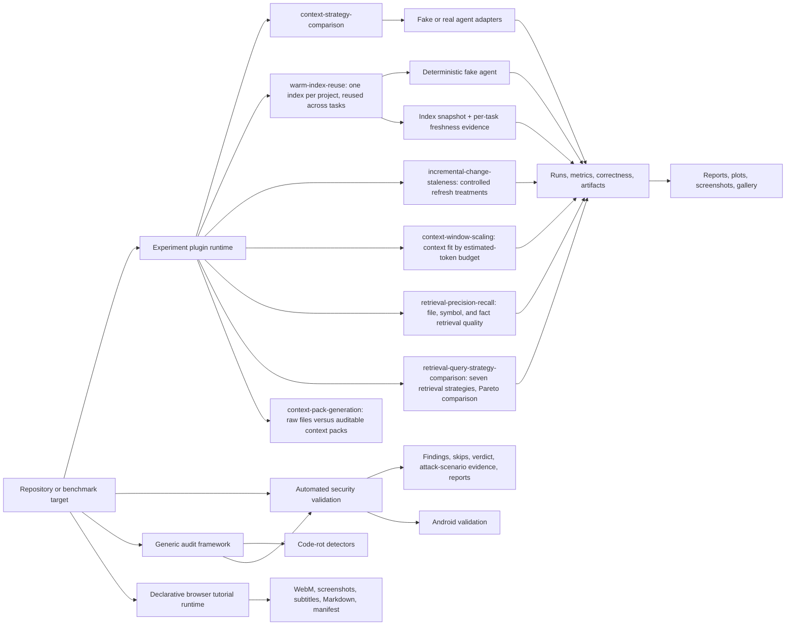

# Project Overview

## What is my-dev-kit-lab?

my-dev-kit-lab is for maintainers, release engineers, coding-agent researchers, and contributors who need evidence about repository-context choices and local project health. A retrieval strategy can look efficient without selecting the right evidence. A project can also appear release-ready without consistent package, CLI, audit, or Android checks.

The project combines controlled experiments, deterministic fixtures, agent adapters, conservative audits, automated security validation, and reviewable reports. It records what ran, what evidence was available, what was skipped, and which limitations apply.

[my-dev-kit](https://www.npmjs.com/package/@dailephd/my-dev-kit) is the local-first indexing and graph-guided retrieval CLI being evaluated. my-dev-kit-lab is the separate experiment and validation layer. Workflow-packet inputs from my-dev-kit-orchestrator are read by the implemented v0.4.3 stage-context strategies through exact, non-normalizing readers; the orchestrator is not a runtime dependency.

Cross-repository workflows are documented once in [my-dev-kit/docs/ECOSYSTEM_DEVELOPMENT_WORKFLOWS.md](https://github.com/dailephd/my-dev-kit/blob/main/docs/ECOSYSTEM_DEVELOPMENT_WORKFLOWS.md). That guide combines static evidence from my-dev-kit, Orchestrator lifecycle, rendered evidence from my-frontend-observer, project tests, and risk-based Lab assurance. This repository retains its own [command reference](COMMANDS.md) and [Lab workflows](WORKFLOWS.md), not a duplicate ecosystem guide.

The compositions are externally executed recipes, not new Lab commands or a claim of a validated four-tool runtime pipeline. Field-failure feedback must be converted into a supported experiment/test contract before Lab can evaluate it. The installed CLI does not automatically ingest arbitrary workflow-feedback or Observer artifacts. Required assurance failures and unavailable required evidence cannot be counted as passed feature gates.

The strongest retrieval use case is a localized task in a repository that is larger than the task. The project measures that claim under defined conditions rather than assuming that guided retrieval always saves tokens.

## Current baseline

The latest published release is v0.8.2 (context-pack generation experiments); v0.8.1 (retrieval query strategy comparison) is the previous release. The repository package version is 0.8.2. The `retrieval-query-strategy-comparison`, `retrieval-precision-recall`, and `context-window-scaling` plugins, including its optional synthetic-repository input and local-repository mode, are released and available in the current published package. Earlier releases added the tutorial actions and warm-index campaign capabilities described below. The `incremental-change-staleness` plugin compares controlled stale-index, changed-files partial refresh, affected-neighborhood partial refresh, and full-refresh treatments after deterministic source changes across six scenario families. Full refresh is a comparison reference, not a winner. Partial refresh extended that plugin from two treatments to four; it did not add another plugin. See [CURRENT_STATE.md](CURRENT_STATE.md) for operational details, [CHANGELOG.md](../CHANGELOG.md) for release history, and [ROADMAP.md](ROADMAP.md) for the detailed future scope.

The v0.8.1 release added the `retrieval-query-strategy-comparison` plugin as the sixth experiment plugin. It compares seven deterministic my-dev-kit retrieval workflows without running any coding agent, keeps execution evidence and scientific analysis in separate artifacts, and in external-local mode preserves the read-only and privacy boundaries of the local-repository subject model.

v0.8.2 (context-pack generation experiments) is the current release. It adds the `context-pack-generation` plugin as the seventh experiment plugin. Both `raw-full-file` and `context-pack` always run. The pack contains a task summary, relevant files and symbols, bounded source slices, call relationships, tests, and evidence notes. Analysis reuses retrieval-quality metrics, estimates context size, and reports paired token savings and objective deltas without a composite winner or ranking. Bundled runs persist packs; external-local runs analyze real identities before redaction, persist no pack body, and present a redacted preview.

Context-integrity evaluation compares condition-aware producer evidence against orchestrator run-integrity evidence for a fixed request, target, and index identity, reporting agreement or contradiction between them rather than re-deriving either project's own verdict. It runs deterministically against a frozen, hash-verified regression fixture pair and produces bounded reports; it introduces no CLI, no live workflow replay, and no composite score, grade, ranking, or winner.

The generic experiment-plugin runtime has eight registered plugins (the eighth, `agent-success-rate`, is implemented but unreleased). `context-strategy-comparison` compares raw-full-file and my-dev-kit-guided strategies through a common runner and supports deterministic fake-agent runs, optional Codex or Claude campaigns, self-validation, and explicit local-project targets.

`warm-index-reuse`, shipped in v0.5.0 and expanded in v0.5.1, evaluates the case where my-dev-kit is expected to pay off most: it builds one my-dev-kit index per benchmark project, reuses that index across several tasks, and pairs every task with a matched raw-full-file baseline. It separates the one-time index-build cost from per-task retrieval cost and shows how that fixed cost is amortized as more tasks reuse the index. In the published v0.5.1 release, correctness and token totals come from the deterministic fake agent and are simulated harness evidence, not real-model or provider measurements; estimated context tokens stay a separate context-size estimate. The v0.5.1 release adds a dedicated six-plus-six task benchmark corpus for observing that amortization as task count grows; its results remain scoped fake-agent benchmark evidence, not universal performance claims. See [METRICS.md](METRICS.md) for the warm-index metrics.

`context-window-scaling` is included in the released package (v0.7.0, with `--synthetic-config` added in v0.7.1 and `--local-subject-config` in v0.7.2) and registered as an experimental plugin that runs against the Lab itself in bundled and synthetic mode. It runs the `raw-full-file` and `my-dev-kit-guided` treatments against standard 8k/16k/32k/64k or custom positive-integer estimated-token budgets. It records context fit, budget utilization, existing deterministic correctness and derived success evidence, plus benchmark-expected files omitted from each treatment's observed context. It writes a versioned execution artifact and JSON/text/HTML reports; the existing `plots generate` command recognizes that artifact and writes exactly three context-window plot families. Estimated tokens use the Lab's character-divided-by-four heuristic, and the current fake-agent correctness path is context-independent, so results do not model provider tokenizers or semantic model sensitivity. In bundled and synthetic mode it accepts no external target; v0.7.2 adds an explicitly selected local Git repository mode (`--target` with `--local-subject-config`). It has no real-agent campaign or dedicated gallery integration. See [COMMANDS.md](COMMANDS.md), [WORKFLOWS.md](WORKFLOWS.md), and [METRICS.md](METRICS.md).

`retrieval-precision-recall` (released in v0.8.0) measures retrieval quality without any agent. For each case it runs the existing my-dev-kit search, lookup, slice, and source lifecycle and compares the retrieved files and symbols with a deterministic answer key, reporting file and symbol precision and recall, fact coverage from explicit fact-to-context mappings, irrelevant context ratio, estimated retrieved tokens, and the missed files and symbols. The default run uses a bundled 12-case corpus over two benchmark projects; it can also run over an explicitly selected local Git repository (`--target` with `--local-subject-config`) with the repository treated as read-only and its path and file, symbol, and fact identities redacted from durable output. These are set-based measures with no ranking, winner, or composite score, and comparing retrieval strategies is provided separately by the v0.8.1 plugin described next (released in v0.8.1). See [COMMANDS.md](COMMANDS.md), [WORKFLOWS.md](WORKFLOWS.md), and [METRICS.md](METRICS.md).

`retrieval-query-strategy-comparison` (released in v0.8.1) compares seven fixed retrieval strategies — `keyword-search`, `symbol-lookup`, `graph-neighborhood`, `source-slice`, `data-model-graph`, `model-view-lineage`, and `combined-graph-guided` — over the same frozen 12-case corpus, without any agent. Every selected case receives all seven strategies. Retrieval quality reuses the inherited file, symbol, and fact-coverage measures, adds balanced file and symbol F1, and compares strategies as macro means over matched complete cases for the overall scope and for the existing localized, cross-module, and broad-change task-locality scopes. Strategies are compared by Pareto dominance; a best strategy is named only when exactly one strategy is nondominated, and otherwise the result is an explicit tradeoff. There is no composite score and no total ranking. The execution evidence and the scientific analysis are written as two separate artifacts, with typed JSON, text, and HTML reports. The plugin can also run over an explicitly selected local Git repository with the same read-only, privacy-redacted boundary as the other local-repository plugins. See [COMMANDS.md](COMMANDS.md), [WORKFLOWS.md](WORKFLOWS.md), and [METRICS.md](METRICS.md).

Selectable Codex/Claude real-agent warm-index campaigns, with their own report/plots/screenshot/gallery presentation, are current installed-CLI capabilities.

The released v0.6.0 extends the warm-index experiment with index freshness evidence: after the one index build per project, the run captures an index snapshot (the exact files the my-dev-kit index lists, each with SHA-256 identity, size, and modified-time metadata, plus my-dev-kit version and index-command evidence), and immediately before each task's warm retrieval it assesses whether those files still match, as `fresh`, `stale`, `partially-stale`, or `unknown`. The flow is index preparation, index snapshot, task-boundary freshness assessment, warm retrieval, then evidence and reporting. The assessment is observational: it never gates or alters retrieval, execution or provider status, correctness, or token evidence, and it recommends no reindexing. It appears in the warm-index execution artifact and the existing report; it adds no CLI flag, metric, plot, or gallery item.

Automated security validation is implemented, supporting dependency and package checks, adversarial CLI checks, static scanning integrations, bounded fuzz smoke, structured verdicts, explicit local-project targets, and an attack-scenario layer with profiles, evidence, and report hardening. It is not a manual pentest framework. The installed command is `my-dev-kit-lab security validate`. `npm run security:validate` remains the source-checkout alias into the same focused command owner.

Android validation is implemented through `security validate --profile android` (or the source-checkout `security:validate` alias): project detection, manifest parsing, permission/exported-component/deep-link audits, static Gradle metadata, and eleven advanced internal checks, for nineteen default checks with zero default Gradle, external-tool, or network activity.

The generic audit framework provides language-aware `code-rot` detectors for TypeScript/JavaScript, Python, Java, and Kotlin. Its `security` type adapts the standalone validator's results into audit issues while preserving the original `reports/security/` output.

The `--android` extension maps confirmed Android findings through that same adapter and keeps `CandidateEvidence` separate. Audit remains distinct from both experiments and `security:validate`.

Java/Kotlin support is conservative and static only: no compiler parsing, no type/classpath resolution, and no Gradle/Maven execution. Android validation is likewise static and read-only; see [security-validation-framework.md](security-validation-framework.md) for its full limits.

Code-quality audit, project-wide combined audit defaults, framework-aware profiles, JVM package/environment rot, Gradle/Maven dependency freshness checks, and manual pentest remain future roadmap work.

The current tutorial capability executes `TutorialScenarioV1` scenarios through a persistent Playwright browser session against a trusted local target contract. It supports bounded actions and assertions, visual overlays, WebM recording, step screenshots, SRT/VTT subtitles, Markdown, and a versioned tutorial manifest. In v0.4.7, tutorial automation was introduced with element-to-element `drag`. Released v0.4.8 completes a missing visual-editor interaction class by adding bounded `pointer-click` and `pointer-drag` actions anchored to one existing locator with normalized fraction coordinates, while retaining the no-arbitrary-JavaScript/no-page-coordinate boundary. Released v0.4.9 adds a value-only `select-option` action through the existing locator/action/session owners, backed by Playwright `Locator.selectOption({ value })`. It identifies one option by stable HTML value, resolves the element through the existing `TutorialLocatorV1` resolver, validates a closed field set with a required non-empty value, and succeeds only when the browser reports exactly the requested single selected value. It adds no keyboard fallback, no arbitrary JavaScript, no index-based selection, no multi-select, and no product-specific behavior; `press` remains real keyboard input. The generic packaged example is owned by this lab; product-specific demo sites and scenario definitions remain in their owning repositories.

## Product flow


```mermaid
flowchart LR
  Target[Repository or benchmark target] --> Experiment[Experiment plugin runtime]
  Experiment --> Plugin[context-strategy-comparison]
  Experiment --> WarmPlugin[warm-index-reuse: one index per project, reused across tasks]
  Experiment --> StalenessPlugin[incremental-change-staleness: controlled refresh treatments]
  Experiment --> ScalingPlugin[context-window-scaling: context fit by estimated-token budget]
  Experiment --> RetrievalPlugin[retrieval-precision-recall: file, symbol, and fact retrieval quality]
  Experiment --> StrategyPlugin[retrieval-query-strategy-comparison: seven retrieval strategies, Pareto comparison]
  Experiment --> PackPlugin[context-pack-generation: raw files versus auditable context packs]
  Plugin --> Agents[Fake or real agent adapters]
  WarmPlugin --> FakeAgent[Deterministic fake agent]
  StalenessPlugin --> Evidence
  ScalingPlugin --> Evidence
  RetrievalPlugin --> Evidence
  StrategyPlugin --> Evidence
  FakeAgent --> Evidence
  WarmPlugin --> IndexSnapshotFreshness[Index snapshot + per-task freshness evidence]
  IndexSnapshotFreshness --> Evidence
  Agents --> Evidence[Runs, metrics, correctness, artifacts]
  Evidence --> Reports[Reports, plots, screenshots, gallery]

  Target --> Security[Automated security validation]
  Security --> SecurityEvidence[Findings, skips, verdict, attack-scenario evidence, reports]
  Security --> Android[Android validation]

  Target --> Audit[Generic audit framework]
  Audit --> CodeRot[Code-rot detectors]
  Audit --> Security

  Target --> Tutorial[Declarative browser tutorial runtime]
  Tutorial --> TutorialEvidence[WebM, screenshots, subtitles, Markdown, manifest]
```

The `retrieval-query-strategy-comparison` path (v0.8.1) in bundled mode:

```text
task + answer key
  -> one prepared index state
  -> seven retrieval treatments
  -> strategy-neutral identity evidence
  -> inherited v0.8.0 retrieval-quality metrics
  -> balanced F1
  -> matched-complete-case scope aggregation
  -> Pareto interpretation
  -> execution artifact + analysis artifact
  -> JSON / text / HTML report
```

For an external local subject the same plugin adds the safety lifecycle:

```text
local-subject configuration
  -> safe inventory and exclusions
  -> private per-case index
  -> isolated semantic copies
  -> target immutability
  -> science before redaction
  -> privacy projection
  -> durable artifacts and reports
```

No source text is persisted in either mode.

The `context-pack-generation` path (released in v0.8.2) runs both `raw-full-file` and `context-pack` for each selected case, then calculates retrieval coverage, estimated size, paired token savings, and objective deltas. Bundled runs persist the pack artifact and a bounded report preview. External-local runs calculate science on real identities, redact before persistence, omit the durable pack body, and show only a redacted preview. See [WORKFLOWS.md](WORKFLOWS.md#context-pack-generation-experiment).

The `agent-success-rate` path (implemented for v0.9.0, unreleased) evaluates implementation tasks rather than retrieval. For each task in a bundled six-task corpus it runs both `raw-full-file` and `context-pack` treatments in disposable benchmark copies, applies a patch (a reference patch in the default deterministic mode, or a diff proposed by an explicitly selected Codex or Claude provider), and decides success from trusted checks on the actual changed code, with edit-scope, blast-radius, duration, and token evidence and optional bounded repair attempts. The Lab applies every patch itself; providers never edit the benchmark. Deterministic runs validate the pipeline and the corpus, not agent ability, and a live paid-provider campaign has not yet been run. See [COMMANDS.md](COMMANDS.md#agent-success-rate-v090-implemented-unreleased) and [WORKFLOWS.md](WORKFLOWS.md#agent-success-rate-evaluation-v090-implemented-unreleased).

## Users

- maintainers evaluating my-dev-kit behavior
- coding-agent workflow researchers
- teams comparing context-selection strategies
- release engineers collecting local CLI/package security evidence
- contributors adding future experiment or audit capabilities

## What the evidence can establish

The lab can compare matched strategies for a defined target, task, agent, and configuration. It can record correctness, context size, reported or estimated tokens, duration, status, and partial outcomes. It can also preserve the retrieval and report artifacts needed to audit a result.

Results are scoped evidence, not a universal performance claim. Small repositories or broad tasks may favor raw reading. Reused indexes and localized tasks in larger repositories are stronger candidates for graph-guided retrieval.

In the released v0.6.0 evidence, the lab can also show whether the files represented by an index snapshot still match their captured content identities, which represented files were modified or missing, and whether freshness is unknown or only partly assessable because evidence was incomplete. This does not establish whole-repository freshness: files outside the snapshot, including new files, are not part of the comparison, and freshness says nothing about whether retrieval would be correct.

## Next phases

Version v0.4.3 evaluates stage-specific bounded repository context and workflow instructions through the existing experiment infrastructure and is published. Version v0.4.4 added the producer-readiness bridge through programmatically configured inputs while preserving upstream producer and readiness ownership. Version v0.4.5 evaluates agreement between condition-aware producer evidence and orchestrator run-integrity evidence against a frozen, deterministic, hash-verified regression fixture pair. Version v0.4.6 added the installed-package CLI and runtime-boundary correction. Version v0.4.7 introduced the generic persistent-browser runtime, managed demo processes, bounded scenario actions and assertions, visible tutorial overlays, WebM recording, synchronized screenshots/subtitles/Markdown, a tutorial manifest, and clean-consumer package acceptance while keeping product-specific demo sites and scenarios in their owning repositories. Version v0.4.8 completes a missing visual-editor interaction class by adding locator-anchored fraction `pointer-click` and `pointer-drag` using real Playwright mouse input, keeping existing `drag` unchanged, extending the generic real-browser/packed-package fixture, and preserving all current safety boundaries. Version v0.4.9 closes the next downstream portability gap with one value-only semantic `select-option` action for native HTML `<select>` controls, reusing the existing tutorial action/result/cursor/security architecture, and is validated by the Windows/Linux/macOS real-browser and exact packed-package gates. Version v0.5.0 introduced the warm-index reuse experiment plugin, amortization and cumulative metrics, fake-agent evidence, report section, and four plots. Version v0.5.1, an expanded warm-index benchmark suite, is published and remains implemented in v0.5.2; it is an earlier published release: it adds a dedicated 12-task corpus (six medium and six large/mixed tasks with locality metadata, answer keys, and expected files and symbols) and proves the unchanged v0.5.0 runtime, reports, and plots at six tasks per project. Version v0.5.2 added real-agent warm-index campaigns; version v0.6.0 added index freshness and changed-file detection; v0.6.1 adds released affected-neighborhood experiments. Version v0.6.2 adds the `incremental-change-staleness` plugin, comparing matched stale-index and complete full-refresh treatments across six deterministic controlled-change scenario families while preserving v0.6.1 metrics and warm-index behavior; partial-refresh treatments shipped in `v0.6.3`.

The v0.6.0 freshness evidence and released v0.6.1 affected-neighborhood evidence (a one-hop baseline graph neighborhood of confirmed changed files and symbols, task overlap, and a categorical reindex recommendation, all observational) are the foundation for incremental-change and staleness experiments (`v0.6.2`, released). Partial-refresh experiments in v0.6.3 extended that plugin to four treatments and remain in the current package. Context-window scaling was released in v0.7.0, and synthetic large-repository generation was added to it in v0.7.1.

v0.7.1 synthetic large-repository generation (deterministic TypeScript/Python benchmark repositories for `context-window-scaling` via `--synthetic-config`) is released in v0.7.1; v0.7.2 adds explicitly selected local Git repositories as `context-window-scaling` subjects and is released in v0.7.2 (the Lab treats the repository as read-only and keeps its path, source text, and file names out of durable artifacts; operational compatibility is not a retrieval-quality claim).

v0.8.0 retrieval precision/recall and v0.8.1 retrieval query strategy comparison are published.

Context-pack generation experiments shipped in v0.8.2.

Version v0.9.0 (the agent-success-rate plugin) is implemented locally and unreleased; pre-release readiness is pending. Planned after it are v0.9.1 and v0.9.2.

Normalized provider telemetry, campaign scheduling, prompt hardening, tutorial-manifest gallery consumption, and a generalized evidence portal remain planned. Manual pentest remains a human-led post-v1/version-TBD workflow and is not part of the current automated validation system.

See [CURRENT_STATE.md](CURRENT_STATE.md) for implemented-versus-planned status and [ROADMAP.md](ROADMAP.md) for semantic version ordering.
