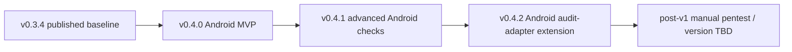

# Roadmap

## Version sequence

## Completed baselines

`v0.3.4` is the current published package baseline. It includes the generic experiment framework, automated CLI/package security validation, generic audit framework, and language-aware code-rot work.

## v0.4.x Android automated security-validation track

### v0.4.0 — Android validation MVP

**Status: release-prepared; publication pending.** It is implemented on `release/v0.4.0`, not published.

- Android/mobile substrate, canonical profile, target/detection/manifest/Gradle/check/result/report contracts.
- Android detection and classification, module/source/manifest discovery, Compose/XML/mixed UI evidence.
- Independent manifest parsing; permission, exported-component, intent-filter, and deep-link audits.
- Conservative `SecurityFinding` reuse, stable finding identifiers, status/verdict reasons, and static Gradle metadata.
- Explicitly opt-in safe Gradle validation with five fixed operation IDs.
- Release metadata and Play-readiness checklist placeholders.

Not included: advanced Android audits, APK/AAB/signing/emulator/device work, live Play policy validation or publication, Android audit-adapter mapping, and automatic fixes.

### v0.4.1 — advanced Android security checks

**Planned.**

- Cleartext traffic and Network Security Config.
- Backup/data extraction and debuggable/release configuration.
- Redacted secret scanning and signing-config leak detection.
- WebView, FileProvider, sensitive storage/logging/clipboard, and Firebase/Google services review.
- Optional Android-specific Semgrep, OSV, Android Lint, and dependency-check evidence.
- Report stability for new fields.

### v0.4.2 — Android extension of the security audit adapter

**Planned.** Extend the existing general v0.3.2 security audit adapter without replacing `security:validate`.

- Reuse SecurityFinding-to-AuditIssue mapping and preserve original Android report references.
- Represent skipped checks correctly and add Android status alongside `securitySummary`.
- Add planned Android profile passthrough only through the existing adapter path.
- Do not create a parallel mapping implementation or replace standalone Android validation.

## Deferred

Manual pentest is not assigned to v0.4.0, v0.4.1, or v0.4.2. It remains a human-led post-v1 / version-TBD workflow. Release preparation, publication, Google Play upload, and automatic fixes are not roadmap deliverables of this branch.
