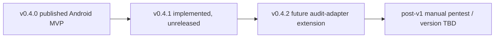

# Roadmap

### v0.4.0

Completed and published Android validation MVP: detection, manifest parsing, four initial audits, static Gradle metadata, optional closed Gradle operations, verdicts, reports, mutation evidence, and Play-readiness placeholders.

### v0.4.1

Implementation-complete but unreleased. Batches 1-8 implement the advanced substrate, Network Security Config, backup/data extraction, release/debuggable configuration, secrets/signing, WebView/FileProvider, sensitive storage/logging/clipboard, Firebase/Google services, Semgrep/OSV/Android Lint/Dependency-Check adapters, nineteen active checks, CLI flags, CandidateEvidence, and text/JSON integration. Batch 9 reconciles documentation and completeness. No version bump, release preparation, or publication has occurred.

### v0.4.2

Future Android-aware extension of the general security audit adapter, including SecurityFinding-to-AuditIssue mapping. It will not replace `security:validate`.

### Deferred

Runtime instrumentation, APK/AAB inspection, signing verification, emulator/device analysis, live Digital Asset Links and Play policy, automatic fixes, remote Firebase verification, and manual pentest remain deferred. Manual pentest is not assigned to v0.4.0, v0.4.1, or v0.4.2.
