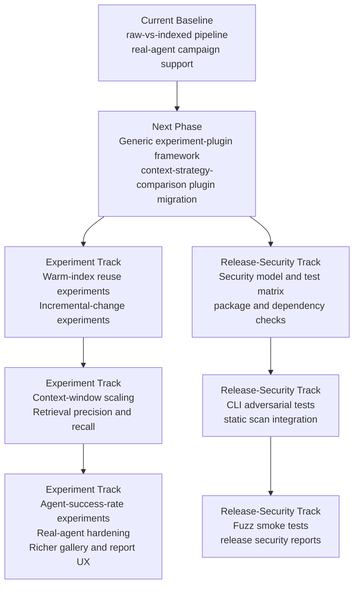
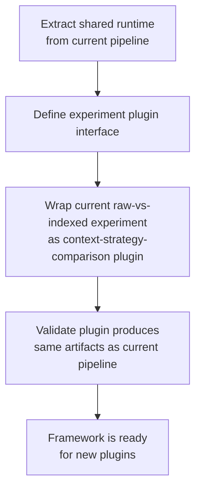
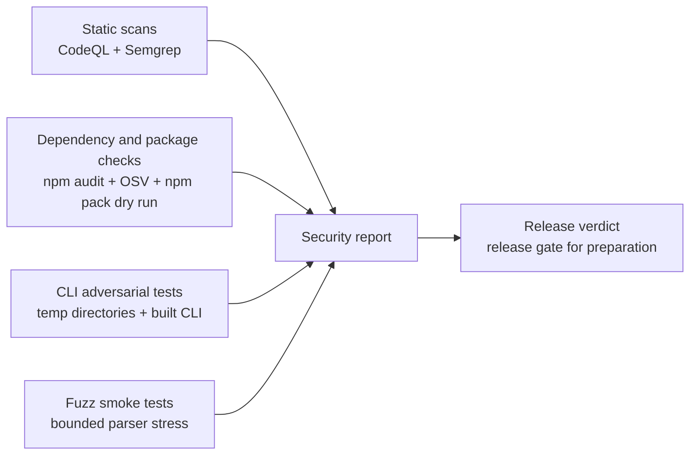
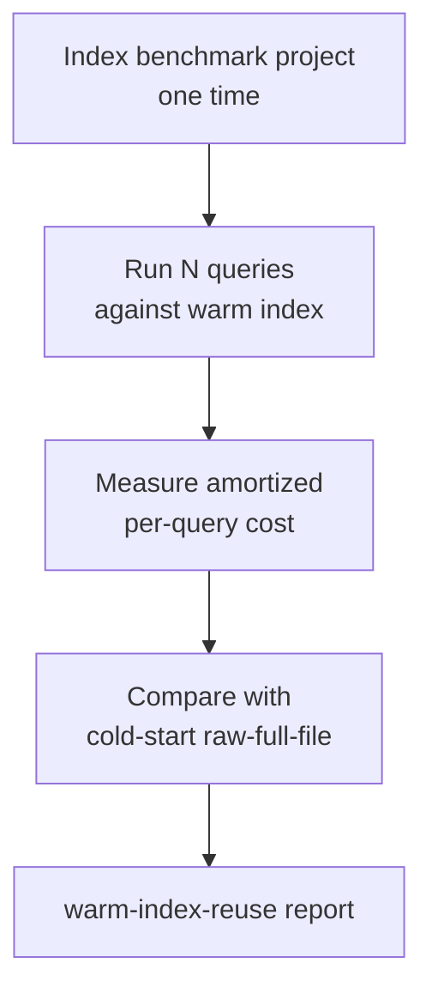
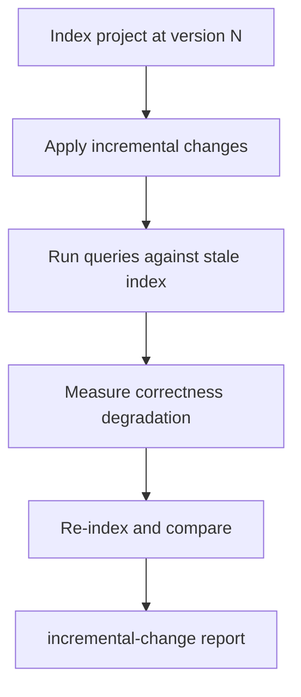
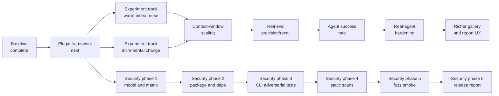

# Roadmap

This document describes the current baseline state of my-dev-kit-lab and the planned development phases ahead.

---

## Roadmap overview

---

## Current baseline

The current baseline is a fully working experiment pipeline for the raw-vs-indexed context comparison.

### What is implemented

- **Benchmark projects** — small, medium, and large benchmark projects with version-controlled source trees
- **Project complexity metrics** — weighted 0-100 complexity scores, file counts, line counts, language counts, import counts, and symbol estimates
- **Benchmark case metadata** — task descriptions, expected files, expected symbols, and answer keys
- **Prompt variant generation** — raw-full-file and my-dev-kit-guided variants at `short`, `medium`, `long`, and `multi-step` complexity levels with prompt complexity metrics
- **Agent adapters** — fake-agent (deterministic), Codex, and Claude
- **Windows-safe CLI command resolution** — safe subprocess execution on Windows
- **Controlled experiment runner** — pairs raw-full-file and my-dev-kit-guided runs by case, agent, and complexity; scores correctness from answer keys; computes token and duration comparisons
- **Report rendering** — HTML experiment report with project profiles, benchmark tasks, strategy comparisons, correctness scores, token usage, duration, status, warnings, and limitations
- **Plot generation** — static SVG charts from experiment data
- **Screenshot capture** — optional PNG capture from generated HTML reports
- **Gallery output** — gallery manifest and static gallery index
- **Visualization demos** — bounded my-dev-kit command demos against benchmark projects
- **Final demo workflow** — single command that runs the complete pipeline
- **Real-agent campaign support** — Codex and Claude campaigns with structured outcomes for timeouts, invalid output, and session limits
- **Metric glossary** — [METRICS.md](METRICS.md)

### Current benchmark projects

| Project | Size | Languages |
|---|---|---|
| `todo-ts` | small | TypeScript |
| `todo-js` | small | JavaScript |
| `todo-python` | small | Python |
| `todo-mixed-ts-py` | small | TypeScript + Python |
| `task-workflow-medium-ts` | medium | TypeScript |
| `task-analytics-large-mixed` | large | TypeScript + Python |

### Current limitations

- Token savings in fake-agent runs are estimated from character counts, not provider billing telemetry
- Claude does not expose token totals
- Codex may produce timeouts or invalid-output runs
- The current baseline does not yet prove every future value claim for my-dev-kit
- Provider telemetry dashboards, semantic LLM judging, and cloud API billing integration are not yet implemented
- The experiment pipeline is currently hardcoded for the raw-vs-indexed comparison; adding new experiment types requires significant pipeline changes

---

## Next phase: Generic experiment-plugin framework

The next major development item is to refactor my-dev-kit-lab into a generic experiment framework.

### What this means

Instead of a single hardcoded pipeline, each experiment type becomes a plugin. The shared runtime handles trial planning, agent execution, metric collection, scoring, report building, plot building, screenshot capture, and gallery publishing. Each plugin declares what it needs from the runtime.

The current raw-vs-indexed experiment becomes the first plugin: **context-strategy-comparison**.

### Migration steps

### Why this matters

- New experiment types can be added as plugins without rebuilding the pipeline
- The shared runtime handles common concerns: agent execution, metric collection, report sections, gallery publishing
- Each plugin focuses only on what makes its experiment type unique

---

## Parallel track: Release-security validation for my-dev-kit

my-dev-kit-lab will also add a planned release-security track for **my-dev-kit**. This track is separate from the generic experiment-plugin framework and does not replace it. The goal is to produce repeatable security-validation evidence that release preparation for the local CLI/package can consume.

This is not a web-application pentest roadmap. The target under validation is a local CLI/package, so the correct model is CLI/package adversarial testing and release-gate evidence around these boundaries:

- local-first
- deterministic
- read-only with respect to user source files
- network-free during normal CLI operation
- LLM-free
- database-free
- safe to run on local repositories

The planned framework is described in [security-validation-framework.md](security-validation-framework.md). The milestones below describe how it fits into the roadmap.

### Security validation flow

### Phase 1: Security model and test matrix

Define the threat model, scope boundary, and initial release-security matrix for my-dev-kit as a local CLI/package.

Acceptance criteria:

- Security model clearly documents local-first, deterministic, read-only, network-free, LLM-free, and database-free boundaries
- Threat model distinguishes CLI/package adversarial testing from web-application pentesting
- Initial attack-surface matrix exists for CLI flags, artifact readers, subprocess paths, and package contents
- Planned report format, severities, and release verdicts are documented

### Phase 2: Package and dependency checks

Add planned dependency and publication-safety checks for release preparation.

Acceptance criteria:

- Roadmap defines dependency checks using `npm audit`, `npm audit --omit=dev`, OSV-Scanner, `npm outdated`, and `npm ls --all`
- Package review includes `npm pack --dry-run` and tarball-content inspection
- Validation scope explicitly covers accidental publication of generated artifacts, private notes, secrets, local tarballs, and machine-specific files
- This phase is documented as release-gate evidence rather than a current shipping feature

### Phase 3: CLI adversarial tests

Design a harness that behaves like an attacker or careless user while staying inside temporary directories.

Acceptance criteria:

- Test plan covers hostile values for `--root`, `--src`, `--out`, `--index`, `--file`, `--node`, `--symbol`, `--contains`, `--query`, `--graph`, `--format`, `--path`, `--react-region`, and related inclusion flags
- Cases include path traversal, unsafe output paths, symlink/junction escape, malformed artifacts, huge inputs, Graphviz label escaping, and JSON stdout/stderr contamination
- Expected safe behavior is defined for read-only boundaries, clear errors, non-destructive cleanup, and bounded writes
- No test is expected to write outside temporary directories or require network access

### Phase 4: Static scan integration

Integrate planned static security scans into the release-security process.

Acceptance criteria:

- CodeQL and Semgrep are documented as planned checks
- Focus areas include unsafe subprocess use, unsafe Graphviz invocation, path traversal, unsafe deletion, unbounded reads, unbounded artifact generation, secret indexing, and tainted argument flows
- Results are intended to feed the release security report rather than stand alone
- Documentation keeps these scans separate from the generic experiment-plugin runtime

### Phase 5: Fuzz smoke tests

Add bounded fuzzing for parsers, artifact readers, and path/escaping helpers.

Acceptance criteria:

- Initial target list includes manifest, symbol index, code graph, data model, frontend semantic, CLI parsing, `--contains` matching, path normalization, DOT label escaping, and selected analyzers/renderers
- Fuzzing is explicitly smoke-level and time-bounded in the initial phase
- The roadmap does not require long-running fuzz infrastructure as a release prerequisite yet
- Results roll into the security report as a smoke signal, not as a full coverage claim

### Phase 6: Release report generator

Generate a release-security report and verdict that release preparation can consume.

Acceptance criteria:

- Planned output includes `reports/v<version>-security-validation.txt` or an equivalent release artifact
- Report format includes executive summary, audited commit, tool results, adversarial-test results, fuzz smoke result, findings by severity, release verdict, and recommended next step
- Severity classes are defined as Blocker, Major, Minor, Informational, and Skipped
- Verdict options are defined and clearly separated from ordinary experiment output

### Planned command concepts

The following command names are reserved as roadmap concepts only unless they are implemented later:

- `security:codeql`
- `security:semgrep`
- `security:deps`
- `security:package`
- `test:security`
- `test:fuzz:smoke`
- `security:validate`

`security:validate` is intended to be the future release-gate entry point that assembles the security-validation evidence for release preparation.

---

## Future phases

### Warm-index reuse experiments

The warm-index-reuse plugin will measure the amortized cost of my-dev-kit indexing when the index is reused across multiple queries. Cold-start comparisons understate this benefit because the indexing cost is paid only once.

### Incremental-change and stale-index experiments

The incremental-change plugin will measure how well a partially stale index still guides retrieval after code changes, and how quickly correctness recovers after re-indexing.

### Context-window scaling experiments

This plugin will measure what happens as project size grows toward and beyond agent context window limits. Raw-full-file becomes infeasible at large scale; my-dev-kit-guided retrieval is expected to remain viable.

### Retrieval precision and recall experiments

This plugin will measure whether my-dev-kit retrieves the right files and symbols for a given task, not just fewer tokens. Precision and recall against answer keys will provide a more direct measure of retrieval quality.

### Agent-success-rate experiments

This plugin will measure overall agent task success rates across strategies, agents, and project sizes, going beyond token counts to measure whether agents actually complete tasks correctly.

### Real-agent campaign hardening

Improvements to real-agent campaign reliability: better timeout handling, retry logic, structured outcome reporting, and support for additional agent CLIs.

### Richer gallery and report UX

Interactive gallery with filtering, tagging, and side-by-side comparison views. Richer report sections with drill-down into individual runs.

### Dependency maintenance

Regular updates to Node.js, TypeScript, Playwright, and other dependencies.

---

## Roadmap sequence

---

## Project support

Sponsorships and donations help support continued independent development, maintenance, documentation, and future experiment-framework work.

- [Sponsor on GitHub](https://github.com/sponsors/dailephd)
- [Support via PayPal](https://paypal.me/daile88)
