# Roadmap

This roadmap separates the implemented baseline from planned work. A version listed here is not released or implemented unless explicitly marked as current or completed.

The roadmap follows semantic version order. `v1.0.0` is the stable release after the complete `v0.x` development track; it is newer than every `v0.x` release.

## Version sequence

```mermaid
flowchart LR
  V020[v0.2.0] --> V021[v0.2.1] --> V022[v0.2.2]
  V022 --> V030[v0.3.0] --> V031[v0.3.1] --> V032[v0.3.2] --> V033[v0.3.3] --> V034[v0.3.4]
  V034 --> V040[v0.4.0] --> V041[v0.4.1] --> V042[v0.4.2] --> V043[v0.4.3]
  V043 --> V050[v0.5.0] --> V051[v0.5.1] --> V052[v0.5.2]
  V052 --> V060[v0.6.0] --> V061[v0.6.1] --> V062[v0.6.2] --> V063[v0.6.3]
  V063 --> V070[v0.7.0] --> V071[v0.7.1] --> V072[v0.7.2]
  V072 --> V080[v0.8.0] --> V081[v0.8.1] --> V082[v0.8.2]
  V082 --> V090[v0.9.0] --> V091[v0.9.1] --> V092[v0.9.2]
  V092 --> V100[v1.0.0] --> V110[v1.1.0] --> V120[v1.2.0] --> V130[v1.3.0] --> V140[v1.4.0]
  V100 -. deferred .-> PT[Post-v1 / version TBD manual pentest]
```

## Product direction

my-dev-kit-lab is the experiment, evidence, reporting, security-validation, audit, and release-readiness companion for my-dev-kit.

my-dev-kit-lab should remain validation-first, evidence-first, and non-destructive by default. It should not become a project generator, app publisher, signing tool, Play Console uploader, or automatic fixer.

The strongest product thesis remains:

* my-dev-kit helps when a repository is larger than the task.
* my-dev-kit-lab should prove when my-dev-kit is useful, not claim that my-dev-kit always saves tokens.
* The most important usefulness cases are large repositories, localized tasks, warm index reuse, context-window limits, retrieval precision, stale-index risk detection, and better coding-agent edit quality.
* Security validation, audit reporting, code rot detection, code quality checks, mobile validation, and manual pentest support should strengthen release-readiness and implementation-readiness workflows around this evidence system.

## Release continuity and planned sequence

### v0.2.0 — completed

Status: **published**.

Purpose:

* Introduce the reusable experiment-plugin framework without breaking the raw-versus-guided baseline.

Completed scope:

* Generic experiment-plugin contracts, registry, runner, configuration, target model, and normalized results.
* `context-strategy-comparison` as the first experiment plugin.
* Existing raw-full-file versus my-dev-kit-guided behavior preserved through the plugin.
* Target-aware experiment execution.
* Plugin-aware JSON and HTML reports.
* Backward-compatible `experiment:list`, `experiment:describe`, `experiment:run`, and legacy controlled-experiment workflows.
* Reusable target-aware automated security validation carried forward from earlier security work.

Acceptance:

* Plugin and legacy workflows produce compatible artifacts, explicit local targets remain non-destructive, and existing security validation remains available.

### v0.2.1 — previous package baseline

Status: **the npm registry lists `0.2.1`**; no matching Git tag or GitHub Release was found during this recovery.

Purpose:

* Correct external-target security-test execution, including execution from an installed package, and synchronize documentation with the plugin architecture.

Completed scope:

* Correct target-project execution of `test:security` during external-target validation, including installed-package execution.
* Documentation synchronized with the implemented plugin and security-validation architecture.
* Fortification continues after this baseline without changing the backward-compatible `security:validate` command.
* The current package baseline is not the final security, audit, mobile, or pentest architecture.

Dependencies:

* Builds on the v0.2.0 plugin and target model.

Acceptance:

* External targets run their declared security test from the correct working directory in both source and installed-package execution.

### v0.2.2 — fortified automated security validation (published)

Status: **published**.

Purpose:

* Strengthen the existing automated security-validation framework so it moves closer to a reusable adversarial security framework, not just dependency scanning or package validation.
* Keep `security:validate` backward compatible.
* Do not merge this work into the audit framework yet.

Features:

* Add `security:validate` config-surface flags: `--checks`, `--profile`, `--format`, `--fail-on`, and `--out`, while preserving backward-compatible `--target` and no-flag behavior.
* Add automated attack-scenario model, reusable security profiles, payload corpus, and explicit exploit-evidence model.
* Add integrated attack runner and report support for attack scenarios.
* Add concrete target sandbox, package boundary, output boundary, path traversal, config injection, subprocess injection, secret leakage, report poisoning, and network/local-first assumption scenarios.
* Add profile-aware default check selection and scoped-run reporting.
* Add fail-on threshold behavior plus clearer separation between scanner findings, adversarial failures, optional skipped tools, release blockers, target-project blockers, and tool-framework blockers.
* Add metadata-driven `verdictImpact` categorization and remove the hand-maintained scenario-impact map.
* Add `reportSchemaGuard` baseline-diff structural-injection protection for JSON report poisoning/config injection.
* Add schema/report hardening, output-format/location consistency validation, text-report sanitization, and non-destructive target validation coverage.

Acceptance:

* The standalone command remains backward compatible and all accepted check IDs have implementation coverage.
* Attack scenarios produce structured, sanitized evidence and metadata.
* Target source remains unchanged by default, unavailable optional tools remain skipped, and experiment behavior remains compatible.

Explicit exclusions:

* This release did not merge security validation into the generic audit framework or add manual pentesting.

## Planned v0.x development track

### v0.3.0 — generic audit framework and code rot detector (published)

Status: **published**.

Purpose:

* Add a generic audit framework for project health, implementation-readiness, refactor-readiness, and release-readiness.
* Add code rot detection as the first audit detector family.
* Keep this separate from experiments and separate from direct security validation.

Features:

* Add reusable audit contracts, target resolution, registry, severity model, issue model, and report infrastructure.
* Add project inventory scanner.
* Add source-of-truth collector.
* Add normalized audit issue schema.
* Add code rot detector.
* Add stable text and JSON reports.
* Add configurable fail-on severity.
* Add false-positive and confidence labels.
* Add suggested fix strategy and validation commands per finding.
* Write reports under `reports/audits/code-rot/`.

Code rot detector scope:

* Stale command and workflow references.
* Documentation/code mismatch.
* Duplicate or parallel implementation candidates.
* Dead-code candidates from deterministic evidence.
* Test rot signals.
* Architecture drift signals.
* Package/release rot.
* Dependency/environment rot.
* Cross-platform rot.
* Security/validation assumption rot.

Acceptance:

* `npm run audit -- --target <path> --types code-rot` works.
* Reports include target metadata, tool metadata, timestamp, summary, issue counts, evidence, severity, confidence, recommended action, validation commands, release-blocking flag, implementation-blocking flag, and auto-fix eligibility.
* No target files are modified.
* Invalid targets fail cleanly.
* JSON schema is stable.
* Windows paths work.
* Existing experiment commands still work.
* Existing `security:validate` still works.

Explicit exclusions:

* Security, quality, project, and combined audit types were not part of this release's completed scope.

### v0.3.1 — language-aware TypeScript/JavaScript code-rot support

Status: **published**.

Purpose:

* Add a language-aware source-facts substrate and TypeScript/JavaScript support to the existing code-rot audit family without introducing a new audit type.

Completed scope:

* Added normalized source facts, analyzer registration, TypeScript/JavaScript parsing, source-facts-aware dead-code/duplicate/test-rot signals, and report summaries.
* Preserved the existing `npm run audit` surface, stable issue model, and non-destructive target boundary.

Dependencies:

* Builds on the `v0.3.0` generic audit framework and code-rot detector registry.

Acceptance:

* TypeScript/JavaScript evidence is deterministic and conservative; unsupported or ambiguous semantics are not overclaimed.
* Existing experiment and standalone security-validation behavior remains compatible.

Explicit exclusion:

* The `quality` audit type and deterministic code-quality detector family remain planned, unimplemented work; `v0.3.1` does not own them.

### v0.3.2 — security results in unified audit reports

Status: **published**. This release also added Python source-facts support.

Purpose:

* Integrate existing automated security-validation results into the audit framework as a report source.
* Preserve standalone `security:validate`.

Features:

* Add audit adapter for securityValidation.
* Convert security validation findings into the shared audit issue model.
* Preserve original security report output.
* Add security summary section to audit reports.
* Distinguish scanner findings, adversarial scenario failures, package/release findings, and optional skipped checks.
* Add audit report links to generated security validation reports.

Acceptance:

* `security:validate` remains backward compatible.
* `npm run audit -- --target <path> --types security` works.
* Audit reports include security findings in the shared issue model.
* Audit reports link or reference generated security reports.
* Optional skipped security tools are represented correctly.
* Existing security reports remain available.
* Existing experiment framework remains unchanged.

Explicit exclusions:

* This release did not implement the `quality`, `project`, or `all` audit types and did not add audit passthrough for standalone security check/profile selection.

### v0.3.3 — Java/Kotlin language-aware code-rot support

Status: **published**.

Purpose:

* Extend the language-aware code-rot substrate to Java and Kotlin while preserving conservative, dependency-free analysis.

Completed scope:

* Added Java/Kotlin analyzers, JVM project metadata, detector integration, and static Gradle/Maven documentation-claim checks.

Dependencies:

* Builds on the `v0.3.1` source-facts substrate and the `v0.3.2` additive report fields.

Acceptance:

* Java/Kotlin findings remain analyzer-scoped and do not claim compiler, classpath, runtime, Android, or dependency-freshness proof.
* Existing command and report schemas remain compatible.

Explicit exclusion:

* Project-wide combined audit defaults, audit profiles, cross-type deduplication, and the `quality`, `project`, and `all` audit types remain planned and unimplemented.

### v0.3.4 — cross-language code-rot fixture and stability pass

Status: **published**.

Purpose:

* Harden the shared TypeScript/JavaScript, Python, Java, and Kotlin source-facts substrate.
* Preserve deterministic path normalization, report schemas, cross-platform fixtures, and documentation/code consistency.

Acceptance:

* Mixed-language fixtures and reports remain deterministic across supported platforms.
* Existing experiment, audit, security-validation, report, plot, screenshot, and gallery behavior remains available.

### v0.4.0 — Android validation MVP

Status: **published**.

Purpose:

* Deliver the non-destructive Android validation MVP.

Implemented capabilities:

* Android project detection, module detection, and Compose/XML/mixed UI classification.
* Android manifest parsing and the original Android audit checks.
* Static Gradle metadata plus closed, explicitly opted-in Gradle operations.
* Android verdicts, text and JSON reports, target mutation evidence, and Play-readiness placeholders.
* Non-destructive defaults: no Gradle process, external tool, or network activity unless explicitly requested.

Acceptance:

* `security:validate --profile android` detects and validates Android targets.
* Default validation remains static, local, deterministic, report-first, and source-preserving.

### v0.4.1 — advanced Android security

Status: **published**.

Purpose:

* Extend the Android MVP with advanced shared substrate and deeper static security evidence.

Implemented capabilities:

* Network Security Config; backup and data-extraction; release/debug configuration.
* Redacted secret candidates and signing-configuration evidence.
* WebView, FileProvider, sensitive storage, sensitive logging, clipboard, and Firebase/Google services checks.
* Optional Semgrep, OSV, Android Lint, and Dependency-Check evidence.
* Nineteen active default checks, `CandidateEvidence`, CLI/report/verdict integration, and stable text/JSON output.
* Zero Gradle operations, zero external tools, and zero network requests by default.

Acceptance:

* Advanced checks feed the same Android validation result, verdict, and reports.
* Optional operations remain closed and auditable; standalone `security:validate` remains available.

### v0.4.2 — Android-aware general security audit adapter

Status: **published**; current npm baseline.

Purpose:

* Extend the existing general security audit adapter directly with Android-aware validation without creating a parallel adapter.

Completed scope:

* Reuse the existing `SecurityFinding -> AuditIssue` mapping for general security findings.
* Invoke Android validation programmatically through the existing security audit adapter.
* Add Android status/completeness and `CandidateEvidence` summaries plus Android report references.
* Add an explicit public `audit` CLI opt-in and generic audit text/JSON integration.
* Preserve standalone `security:validate` and default static zero-process behavior.
* Do not map `CandidateEvidence` records to `AuditIssue`; only Android security findings become audit issues.
* Do not add a parallel adapter.

Acceptance:

* The opt-in audit path exposes Android summaries, report references, and mapped Android security findings.
* Generic audit output remains schema-stable and the standalone validator remains authoritative for complete Android validation evidence.
* Package metadata, the `v0.4.2` tag, and the GitHub Release are published; `v0.4.2` is the current npm baseline.

### v0.4.3 — stage-specific bounded-context and workflow-instruction evaluation

Status: **planned, unreleased, and not implemented**. Candidate identifiers and field names require confirmation against current registry, type, and CLI conventions during a separately authorized implementation.

Purpose:

* Extend the existing experiment and report infrastructure so it can deterministically compare broad and bounded stage-context strategies against identical immutable targets, using explicit fixture expectations and structured packet evidence, without joining or replacing the production execution path of my-dev-kit or my-dev-kit-orchestrator.

Cross-repository dependency order (each repository remains independently releasable; my-dev-kit-lab has no runtime/package dependency on the other two):

1. `my-dev-kit` `1.10.1` — adds architecture/implementation/test-implementation context roles, structured `ContextRequest` input, changed-file/symbol intake, before/after index identities, evidence groups, bounded test-infrastructure discovery, deterministic responsibility mapping, and adequacy/truncation/freshness/provenance reporting on top of the existing context capsule (schema `1.0.0`) and retrieval-audit record (schema `1.0.0`).
2. `my-dev-kit-orchestrator` `1.2.1` — adds a structured workflow/command/rule/report-contract catalog with stable IDs, a deterministic reference resolver, `WorkflowInstructionPacket` assembly, and manual (non-automatic) implementation/test-implementation context-refresh integration into the existing ten-stage feature workflow.
3. `my-dev-kit-lab` `0.4.3` (this repository) — the scope described below.

Ownership boundaries approved for this patch:

* my-dev-kit-lab owns: controlled context-strategy experiments and strategy matrices, explicit fixture expectations, context-size measurement, required-evidence recall, irrelevant-file/irrelevant-instruction inclusion, test-responsibility-mapping completeness, provenance completeness, truncation/adequacy/freshness evaluation, full-file-fallback and unnecessary-read measurement (where source packet/audit data exposes it), repeated-run determinism, target immutability, machine- and human-readable reports, and optional plots/screenshots. It also continues to own the existing security-validation and code-rot-audit systems, unmodified by this patch.
* my-dev-kit owns: repository indexing, architecture/implementation/test-implementation role context, `ContextRequest`, context capsules, retrieval-audit records, changed-file/changed-symbol evidence, before/after index evidence, graph-diff evidence, and repository-evidence adequacy/provenance/test-responsibility-mapping-to-repository-evidence.
* my-dev-kit-orchestrator owns: workflow catalog content, stable workflow/stage/command/rule/report-contract IDs, exact workflow selection and dependency resolution, `WorkflowInstructionPacket`, stage prompt assembly, `TaskState`, stage order, artifact lifecycle, manual context-freshness rules, correction routing, judge interpretation, and publication authorization.
* Explicit non-owner boundaries: my-dev-kit-lab must not become the production repository indexer, the normal context-packet generator, or the workflow-instruction resolver; must not assemble production coding-agent prompts, control stage progression, mark orchestrator stages complete, execute normal production implementation workflows, automatically edit target repositories, become a required production dependency of either upstream project, or authorize publication. my-dev-kit must not own lab strategy verdicts, experiment scoring, or report comparisons. The orchestrator must not own lab metrics, lab report generation, or lab target-immutability evidence.

Problem being solved:

* Current evaluation (`src/evaluation/scoreCorrectness.ts` and the `context-strategy-comparison` plugin) is primarily agent-answer and broad-context-size oriented; it does not directly measure whether selected evidence contains required files, symbols, workflow-instruction IDs, contracts, validators, errors, tests, test infrastructure, responsibility mappings, or provenance. It does not yet measure whether full workflow-library or broad-repository-dump baselines waste context or include irrelevant material relative to a bounded alternative — that must be measured, not assumed. It does not yet compare architecture-only context against implementation-refreshed and test-refreshed context under identical target conditions to evaluate staleness. It does not yet evaluate explicit test-responsibility mappings for test-writing stages. It explicitly excludes subjective LLM-based quality/relevance/usefulness judging from this patch's scope.

In scope for `v0.4.3`:

* Extend the existing `src/experiments` plugin/registry/runner infrastructure (do not create a second runner). Extend the existing `context-strategy-comparison` plugin (`src/experiments/plugins/contextStrategyComparison/`) rather than duplicating it; existing strategy IDs `raw-full-file` and `my-dev-kit-guided` are preserved.
* Candidate new strategy IDs (planned, subject to registry-convention confirmation): an architecture-context-only strategy; an architecture-plus-implementation-refresh strategy; an architecture-plus-implementation-and-test-refresh strategy; a full-workflow-library baseline; a bounded workflow-instruction-packet strategy; and a combined bounded-stage-context strategy (`TaskState`/equivalent fixture plus `WorkflowInstructionPacket` plus repository-evidence packet or context capsule).
* Readers for the my-dev-kit context capsule, the my-dev-kit retrieval-audit record, and the orchestrator `WorkflowInstructionPacket`, each with schema-major validation, compatible-optional-field handling, and explicit failure (not silent reinterpretation) on malformed input or unsupported schema majors. These are new modules; the existing adapter `src/evaluation/runMyDevKitRetrieval.ts` currently invokes only `index`, `search`, `lookup`, `slice`, and `source` and does not parse any of these three structured payloads today.
* A normalized internal observation model over reader output (additive to, and following the conventions of, existing types such as those in `src/evaluation/types.ts`).
* An explicit fixture-expectation schema (required/allowed/forbidden evidence, expected adequacy/freshness/truncation/warnings/unresolved items, stable case and requirement IDs) — extending, not replacing, the existing `BenchmarkTaskAnswerKey`/`ExpectedContextTarget` concepts in `src/evaluation/types.ts`.
* Deterministic, evidence-centered metrics: character count (reusing `src/core/countTokens.ts` conventions), estimated tokens (`ceil(characters / 4)`, explicitly labeled as an estimate), required-evidence recall, irrelevant-file inclusion, irrelevant-instruction inclusion, responsibility-mapping completeness, provenance completeness, truncation, adequacy classification (correctly adequate / correctly inadequate / false adequate / false inadequate / unknown), freshness classification (fresh / stale / unknown), full-file-fallback measurement, unnecessary-read measurement (both only where source audit data supports them), and repeated-run determinism. Every recall/inclusion metric reports numerator, denominator, and rate explicitly; missing data is reported as unavailable, never coerced to zero; zero-denominator cases have explicit, documented behavior.
* Target-immutability before/after snapshot evidence, extending the existing read-only, non-destructive snapshot pattern in `src/securityValidation/attackScenarios/targetSnapshot.ts` (which currently captures git-status entries and a timestamp, not branch/commit/file hashes) to the experiment-target context, or an equivalent additive mechanism under `src/experiments/`. Any target mutation caused by an experiment is a failure; the target is never auto-cleaned or reset.
* Machine-readable (JSON) and human-readable (text) reports through the existing `src/report`/`src/report/experiments` infrastructure, with bounded/deterministic detail lists, explicit missing/not-applicable/zero-occurrence distinctions, and additive schema evolution (no new report schema major solely for new optional fields).
* Optional plot data and SVG plots (`src/plots`) and optional screenshot/gallery reuse (`src/screenshot`, `src/gallery`), consistent with current usage — not required for core correctness.
* Regression coverage for the existing audit framework (`src/audits`), security-validation framework (`src/securityValidation`), and benchmark/evaluation infrastructure (`src/evaluation`), none of which this patch may weaken or replace.

Explicitly out of scope / deferred for `v0.4.3`:

* Production repository indexing, production context generation, workflow-catalog ownership or selection, workflow-stage progression, production prompt assembly, coding-agent execution, or automatic target editing (all remain owned by my-dev-kit or the orchestrator).
* LLM-based strategy grading, assertion-quality scoring, relevance judgment, general prose-usefulness scoring, human-equivalent manual-troubleshooting scoring, and any broad semantic precision/recall platform — these remain deferred pending a future, separately approved decision, and are distinct from the deterministic, fixture-explicit oracle/failure-path evidence this patch does evaluate.
* A shared cross-repository schema package, a production dependency on my-dev-kit or the orchestrator, automatic publication, and any replacement of the existing security or code-rot systems.
* Broader `v0.8.0` retrieval-precision/recall platform work (see the `v0.8.0` entry below) — this patch must not absorb that scope, and that scope must not be used to shrink this patch's required evidence-centered metrics.

Acceptance criteria:

* Every strategy runs against an identical, immutable target and case-expectation set; strategy order, tool versions, and inputs are recorded and fixed.
* Every metric derives from explicit fixture expectations and/or parsed packet/audit data, never from subjective judgment; missing data is reported as unavailable rather than zero.
* Repeated canonical runs (normalizing only timestamps, temporary paths, and timing) produce identical selected evidence, metrics, warnings, adequacy, truncation, and report structure.
* Unsupported context-capsule/retrieval-audit/`WorkflowInstructionPacket` schema majors fail clearly rather than being silently reinterpreted.
* Existing audits, benchmarks, reports, security validation, and CLI behavior regress cleanly; no existing experiment plugin, strategy, report path, or command is removed or broken.
* my-dev-kit-lab remains outside the production execution path of my-dev-kit and the orchestrator, and never becomes a required runtime dependency of either.
* This section's publication-state wording is accurate as of `v0.4.2` (published) at the time `v0.4.3` planning was written; `v0.4.3` itself is not published, tagged, or released by this planning update.

### Post-v1 / version TBD — manual pentest

Status: **deferred**.

* Manual pentest is no longer assigned to v0.4.0 and is not assigned to v0.4.1 or v0.4.2.
* It remains a human-led post-v1 / version-TBD workflow.
* Automated security or Android validation must never be described as manual pentesting.

### v0.5.0 — warm-index reuse experiment support

Status: **planned; not implemented**.

Purpose:

* Add a plugin for testing the strongest my-dev-kit value case: indexing once and reusing the index across multiple tasks.

Features:

* Add warm-index-reuse experiment plugin.
* Add setup step to index a project once.
* Run multiple benchmark tasks using the same index.
* Compare against raw-full-file context per task.
* Measure index build time, retrieval time per task, raw context size, retrieved context size, amortized index cost, correctness, duration, and token usage when available.
* Add report section explaining cold cost versus warm cost.
* Add plots for amortized index cost, raw versus retrieved context size, correctness, and cumulative token usage.

Acceptance:

* Warm-index experiment runs with fake-agent.
* Reports clearly separate one-time index cost from per-task retrieval cost.
* Results do not overclaim token savings when token totals are unavailable.

### v0.5.1 — expanded warm-index benchmark suite

Status: **planned; not implemented**.

Purpose:

* Add enough tasks to make warm-index reuse meaningful.

Features:

* Add multiple cases per benchmark project.
* Add localized tasks.
* Add cross-module tasks.
* Add broad-change tasks as negative controls.
* Add answer keys for all new tasks.
* Add expected relevant files and symbols for retrieval evaluation.
* Add benchmark metadata for task locality.

Acceptance:

* At least five tasks exist for the medium benchmark project.
* At least five tasks exist for the large/mixed benchmark project.
* Reports can compare warm-index behavior as task count increases.

### v0.5.2 — warm-index real-agent campaigns

Status: **planned; not implemented**.

Purpose:

* Run Codex and Claude on warm-index experiments with structured partial-outcome reporting.

Features:

* Add real-agent warm-index campaign presets.
* Add reduced-size campaign for Codex timeout isolation.
* Add Claude token-unavailable explanation.
* Add partial-result friendly report sections.
* Add screenshots and gallery output.

Acceptance:

* Campaigns can run with Codex and Claude.
* Partial outcomes are structured.
* Reports distinguish infrastructure success from agent/provider limitations.

### v0.6.0 — index freshness and changed-file detection

Status: **planned; not implemented**.

Purpose:

* Detect source changes that may invalidate indexed context.

Features:

* Record index manifest metadata.
* Track indexed files, file hashes, modified timestamps where useful, my-dev-kit version, command used, and generated artifacts.
* Add changed-file detection against the current working tree.
* Add reportable index freshness status:

  * fresh
  * stale
  * partially stale
  * unknown

Acceptance:

* Lab can detect changed files after an index was built.
* Freshness status appears in experiment artifacts and reports.

### v0.6.1 — affected-neighborhood experiments

Status: **planned; not implemented**.

Purpose:

* Measure graph-neighborhood targeting after localized changes.

Features:

* Use my-dev-kit graph outputs to map changed files and symbols to affected nodes.
* Determine whether a future task overlaps affected nodes.
* Add affected-neighborhood metrics:

  * changedFileCount
  * changedSymbolCount
  * affectedNodeCount
  * affectedEdgeCount
  * taskOverlapCount
  * taskOverlapPercent
  * reindexRecommendation

Acceptance:

* Experiment can classify next task as related or unrelated to a prior change.
* Report explains whether reindex was recommended.

### v0.6.2 — incremental-change and staleness plugin

Status: **planned; not implemented**.

Purpose:

* Compare stale, refreshed, and incrementally updated index behavior after controlled code changes.

Features:

* Add incremental-change-staleness plugin.
* Define change scenarios:

  * unrelated file change
  * local implementation change
  * exported symbol change
  * public API change
  * import graph change
  * test-only change
* Run next tasks with stale index, refreshed full index, and partial refresh where available.
* Score correctness and retrieval safety.
* Report stale-index risk.

Acceptance:

* Plugin demonstrates safe and unsafe stale-index scenarios.
* Reports do not recommend skipping reindex unless evidence supports it.

### v0.6.3 — partial-refresh planning

Status: **planned; not implemented**.

Purpose:

* Add evidence and planning support for bounded index refreshes.

Features:

* Add experiment treatments:

  * my-dev-kit-full-refresh
  * my-dev-kit-no-refresh
  * my-dev-kit-changed-files-refresh
  * my-dev-kit-affected-neighborhood-refresh
* If my-dev-kit does not yet support partial reindex, simulate or mark treatment unavailable.
* Document dependency on future my-dev-kit support.

Acceptance:

* Lab can model partial-refresh experiments even if my-dev-kit support is incomplete.
* Reports clearly distinguish implemented behavior from planned capability.

### v0.7.0 — context-window scaling plugin

Status: **planned; not implemented**.

Purpose:

* Measure raw and guided strategies under increasing repository and context sizes.

Features:

* Add context-window-scaling plugin.
* Define context budgets:

  * 8k
  * 16k
  * 32k
  * 64k
  * custom
* Measure raw context estimated tokens, retrieved context estimated tokens, whether raw context fits, whether retrieved context fits, correctness, omitted relevant files, and context budget utilization.
* Add report sections for context fit/fail.
* Add plots for raw versus retrieved context size, success rate by context budget, and correctness by context budget.

Acceptance:

* Experiment can mark raw strategy as context-too-large without treating it as a normal failure.
* my-dev-kit-guided treatment can be evaluated under the same budget.

### v0.7.1 — synthetic large-repository generator

Status: **planned; not implemented**.

Purpose:

* Generate reproducible repositories with controlled scale and topology.

Features:

* Add deterministic benchmark generator for synthetic TypeScript and Python repositories.
* Generate configurable file count, module depth, internal imports, symbol count, test count, task locality, and repeated patterns.
* Add answer keys for generated tasks.

Acceptance:

* Generated projects can be used in context-window experiments.
* Generated source is deterministic and maintainable.

### v0.7.2 — real-world and local-repository experiments

Status: **planned; not implemented**.

Purpose:

* Support repeatable campaigns against explicitly selected local repositories.

Features:

* Add support for external benchmark subject paths.
* Add safety checks for ignored files and large files.
* Add no-commit/no-modification policy for external source.
* Add report metadata for external repo name, commit, and size.
* Add privacy-safe artifact policies.

Acceptance:

* User can run lab experiments against a local repo path.
* Reports capture enough metadata to reproduce the experiment without copying private code.

### v0.8.0 — retrieval precision/recall plugin

Status: **planned; not implemented**.

Purpose:

* Measure whether retrieval includes required context and excludes irrelevant context without requiring real agents.

Features:

* Add retrieval-precision-recall plugin.
* Run my-dev-kit search, lookup, source, and slice commands.
* Compare retrieved files and symbols against answer keys.
* Measure file precision, file recall, symbol precision, symbol recall, fact coverage, irrelevant context ratio, retrieved token count, and missed required context.

Acceptance:

* Experiment does not require real agents.
* Retrieval metrics are deterministic.
* Reports identify missed files/symbols and irrelevant retrieved context.

### v0.8.1 — retrieval query strategy comparison

Status: **planned; not implemented**.

Purpose:

* Compare different ways of asking my-dev-kit for context.

Features:

* Compare keyword search, symbol lookup, graph neighborhood, source slice, data-model graph, model-view-lineage, and combined graph-guided workflows.
* Add strategy-specific metrics.
* Add report section showing which retrieval strategy worked best for each task type.

Acceptance:

* Lab can compare multiple my-dev-kit retrieval workflows without running coding agents.

### v0.8.2 — context-pack generation experiments

Status: **planned; not implemented**.

Purpose:

* Evaluate reproducible, auditable task-specific context packs.

Features:

* Add context-pack treatment.
* Generate context pack containing task summary, relevant files, relevant symbols, source slices, call relationships, tests, and evidence notes.
* Compare context pack size and coverage against raw full-file context.
* Add report preview of context pack.

Acceptance:

* Context pack artifacts are generated.
* Reports show context pack coverage and size.

### v0.9.0 — agent-success-rate plugin

Status: **planned; not implemented**.

Purpose:

* Compare task completion and correctness across context strategies.

Features:

* Add agent-success-rate plugin.
* Run agents on implementation tasks.
* Capture changed files.
* Run benchmark tests.
* Score tests passed, expected files modified, unexpected files modified, answer-key facts satisfied, regression failures, time, and tokens if available.
* Add safe sandbox/copy workflow for benchmark projects.
* Preserve diffs as artifacts.
* Add edit-quality and blast-radius metrics.
* Add multi-attempt repair mode as an optional experiment mode.

Acceptance:

* Fake-agent or deterministic fixture can simulate edits.
* Real-agent campaign can run with guarded local benchmark copies.
* Reports show diff summary, test result summary, blast radius, and repair-attempt labeling where applicable.

### v0.9.1 — normalized provider telemetry and campaign scheduler

Status: **planned; not implemented**.

Purpose:

* Normalize available provider/CLI telemetry and make real-agent campaigns safer to run incrementally.

Features:

* Improve agent output parsing.
* Add token usage reliability levels:

  * provider-reported
  * cli-reported
  * parsed-from-output
  * unavailable
  * estimated
* Add duration source metadata.
* Add status taxonomy:

  * completed
  * failed
  * timeout
  * invalid-output
  * agent-unavailable
  * agent-limit-reached
  * token-unavailable
* Add campaign queue.
* Add one-case-at-a-time mode.
* Add resume mode.
* Add skip completed runs.
* Add rate/limit pause handling.
* Add per-agent timeout presets.
* Add campaign progress summary.

Acceptance:

* Reports make clear which comparisons are strong, partial, or unavailable.
* Interrupted campaigns can resume.
* Partial results are preserved.

### v0.9.2 — hardened real-agent prompts and report/gallery generalization

Status: **planned; not implemented**.

Purpose:

* Harden real-agent prompt contracts and generalize reports/gallery for stable release readiness.

Features:

* Add stricter output schemas for Codex and Claude.
* Add short-form prompt mode.
* Add no-extra-explanation mode.
* Add bounded tool-use mode.
* Add max command count guidance.
* Add per-agent prompt templates.
* Make report renderer fully plugin-aware.
* Add report section registry.
* Add glossary links for every metric.
* Add report-level caveats generated from metric reliability.
* Improve static HTML report UX.
* Make gallery the entry point for many experiment outputs.

Acceptance:

* Invalid-output rate improves in smoke campaigns.
* Reports compare prompt template versions.
* Existing context-strategy report renders through generic report framework.
* Warm-index, retrieval, context-window, audit, security, and mobile reports can share or link through consistent infrastructure where appropriate.
* Gallery can browse multiple experiment and validation outputs.

## Stable and post-stable releases

### v1.0.0 — stable framework release

Status: **planned; not implemented**.

Purpose:

* Release my-dev-kit-lab as a stable experiment, audit, automated security-validation, Android validation, reporting, and evidence framework after all prerequisite `v0.x` work; manual pentest remains post-v1.

Required capabilities:

* Stable experiment plugin framework.
* Stable `context-strategy-comparison` plugin.
* Warm-index-reuse experiment support.
* Retrieval precision/recall experiment support.
* Context-window scaling experiment support.
* At least partial index freshness/staleness support.
* Agent-success-rate experiment support.
* Stable audit framework with code rot, quality, and security summary support.
* Stable automated security validation.
* Android validation profile support.
* Stable artifact schema versioning.
* Stable report output.
* Stable gallery output.
* Strong documentation.
* Public examples.
* Deterministic fake demos.
* Structured real-agent partial outcomes.
* No known critical build/test failures.

Acceptance:

* Users can add a new experiment type without copying the whole pipeline.
* Users can audit a target project before implementation or release preparation.
* Users can validate a local Android project for release preparation without signing, publishing, or modifying target source files.
* Reports explain metrics, findings, confidence, and limitations clearly.
* All core tests pass.
* Verify passes.
* Cross-platform CI passes.

### v1.1.0 — incremental index and stale-context proof

Status: **planned; not implemented**.

Purpose:

* Productize evidence for incremental indexing and stale-context controls.

Features:

* Stronger changed-node and affected-neighborhood experiments.
* Partial-refresh treatment support if my-dev-kit supports it.
* Stale-index risk reporting.
* Reindex recommendation reports.
* Incremental workflow diagrams and tutorials.

### v1.2.0 — large-repository, external-repository, and mobile scaling

Status: **planned; not implemented**.

Purpose:

* Expand reproducible evidence across larger repositories, explicitly selected local repositories, and additional mobile project profiles.

Features:

* External repo subject support.
* Synthetic large-repo generator.
* Context-window scaling campaigns.
* Large-repo report templates.
* Privacy-safe artifact policies.
* Reproducibility metadata.
* Additional mobile validation profiles after Android is stable, such as Flutter, React Native, iOS SwiftUI, Kotlin Multiplatform, Expo, and Capacitor/Ionic.

### v1.3.0 — agent productivity and edit quality

Status: **planned; not implemented**.

Purpose:

* Consolidate agent-success, edit-quality, and repair evidence.

Features:

* Stronger agent-success experiments.
* Diff artifact capture.
* Test-pass scoring.
* Blast-radius scoring.
* Multi-attempt repair experiment mode.
* Real-agent campaign presets.
* Cross-project implementation-readiness evidence.

### v1.4.0 — publication and evidence portal

Status: **planned; not implemented**.

Purpose:

* Generalize reports, plots, screenshots, validation summaries, mobile reports, audit outputs, and gallery output into a publication-oriented evidence portal.

Features:

* Curated example reports.
* Public demo screenshots.
* Release-linked evidence bundles.
* Comparison summaries across experiment types.
* Audit and security evidence summaries.
* Android validation example reports.
* Documentation for interpreting evidence responsibly.
* Gallery as a navigable evidence portal.

## Command design principles

Future work should extend the existing experiment, audit, and security-validation command families through validated flags when practical. It should not create one command per detector, platform, or report type. Candidate syntax remains version-specific planning until implementation confirms parser and registry conventions.

Manual-pentest commands remain intentionally absent because that workflow is deferred to post-v1/version TBD. See [COMMANDS.md](COMMANDS.md) for the implemented command surface.

## Mobile validation boundaries

my-dev-kit-lab mobile support means:

* Detect mobile project type.
* Validate Android project structure.
* Audit Android security risks.
* Run safe Gradle validation commands when requested.
* Inspect build, test, lint, and package metadata where available.
* Generate text and JSON reports.
* Produce a release-preparation verdict.
* Preserve non-destructive behavior.

my-dev-kit-lab mobile support does not mean:

* Creating Android apps.
* Bootstrapping mobile projects.
* Indexing Android code for retrieval.
* Publishing to Google Play.
* Uploading to Play Console.
* Signing releases.
* Managing signing secrets.
* Creating keystores.
* Editing target Gradle files.
* Updating target dependencies.
* Automatically fixing target code.
* Modifying target projects by default.

## Architecture direction

Future versions must extend the existing experiment, audit, security-validation, Android, report, and gallery ownership boundaries rather than create parallel runners, adapters, or presentation systems. Production indexing and workflow orchestration remain outside my-dev-kit-lab. See [ARCHITECTURE.md](ARCHITECTURE.md) for current ownership and each version section above for planned dependencies and exclusions.

## Validation expectations for every release

Every version's acceptance criteria must include relevant regression, compatibility, non-destructive-target, report-schema, documentation, and cross-platform checks. Exact commands and release gates belong in [WORKFLOWS.md](WORKFLOWS.md); current syntax belongs in [COMMANDS.md](COMMANDS.md).

## Key rule

Use one framework per responsibility:

* Experiments measure behavior across experiment variants.
* Security validation performs automated target security checks.
* Manual pentest support generates human-led testing plans, checklists, findings, and reports.
* Mobile validation inspects platform-specific project security, build, package, and release-readiness risks.
* Audits inspect project health across code rot, code quality, and security summaries.
* Reports render evidence and results.

Do not collapse everything into one vague system.

Do not add many commands when flags can express the difference.

Do not break existing experiment framework commands.

Do not make mobile validation destructive.

Do not let my-dev-kit-lab become an app generator, publisher, signer, or Play Store uploader.
