# Roadmap

This roadmap separates the current published baseline from release-prepared work, in-progress work, and planned work. A version listed here is not implemented unless its status says completed, current, in progress, or release-prepared.

`v0.3.3` is the current published baseline.

## Version sequence

```mermaid
flowchart LR
  A[v0.2.0<br/>plugin framework] --> B[v0.2.2<br/>security-validation fortification]
  B --> C[v0.3.0<br/>generic audit framework]
  C --> D[v0.3.1<br/>language-aware code-rot substrate + TS/JS]
  D --> E[v0.3.2<br/>Python code-rot + first security audit adapter]
  E --> F[v0.3.3<br/>current published baseline: Java/Kotlin code-rot]
  F --> G[v0.3.4<br/>cross-language stability]
  G --> H[v0.4.0<br/>Android validation MVP]
  H --> I[v0.4.1<br/>advanced Android security]
  I --> J[v0.4.2<br/>optional Android audit bridge]
  J --> K[v1.0.0<br/>stable framework]
  K --> L[post-v1<br/>manual pentest / TBD]
```

## Completed Baselines

### v0.2.0 - generic experiment-plugin runtime

Status:
- completed

Purpose:
- Introduce the generic experiment-plugin runtime and route the existing raw-full-file versus my-dev-kit-guided experiment through the first plugin.

Scope:
- plugin registry and runner
- `context-strategy-comparison` as the first plugin
- target-aware experiment execution
- plugin-aware reports while preserving legacy experiment artifacts

Out of scope:
- audit framework
- language-aware code-rot detection
- Android validation

### v0.2.2 - automated security-validation fortification

Status:
- completed

Purpose:
- Harden the automated CLI/package security-validation framework and report model.

Scope:
- `security:validate` support for checks, profiles, formats, fail-on thresholds, and output directories
- attack-scenario framework and profile-aware defaults
- schema/report hardening and structured verdict reasoning

Out of scope:
- manual pentest
- generic audit framework
- Android validation

### v0.3.0 - generic audit framework and code-rot baseline

Status:
- completed; superseded by `v0.3.1` as the current published baseline

Purpose:
- Add the generic audit framework and the first implemented audit family, code rot.

Scope:
- `npm run audit`
- shared audit target, config, registry, runner, issue, and report infrastructure
- project inventory and source-of-truth collection
- code-rot detector family
- text and JSON audit reports under `reports/audits/code-rot/`

Out of scope:
- language-aware source facts
- code quality audit type
- security audit integration
- project-wide combined audit defaults
- Android validation
- manual pentest

## v0.3.x Language-Aware Code-Rot Track

The `v0.3.x` goal is to complete language-aware code-rot support for TypeScript, JavaScript, Python, Java, and Kotlin.

Framework-aware code rot remains future/TBD after the language-aware track is stable. It is not part of `v0.3.x`.

### v0.3.1 - language-aware code-rot substrate + TypeScript/JavaScript support

Status:
- completed; superseded by `v0.3.2` as the current published baseline

Purpose:
- Add the reusable language-aware substrate for code-rot detectors and prove it with TypeScript and JavaScript support.

Scope:
- normalized language detection and file-role classification
- generated, vendor, and build-output exclusion where relevant
- language analyzer registry
- normalized source facts model
- TypeScript/JavaScript analyzer support
- deterministic TypeScript/JavaScript import, export, declaration, and reference facts where feasible
- source-facts report summary in text and JSON audit reports
- existing code-rot detectors consuming normalized source facts where relevant:
  - dead-code candidate reverse-reference checks merge parsed relative import/re-export basenames
  - duplicate implementation candidate checks add source-facts-derived duplicate exported declaration signals
  - test-rot checks use analyzer-recorded relative imports, including dynamic `import()`, for missing-target signals
- improved TypeScript/JavaScript code-rot candidate evidence while preserving `v0.3.0` command behavior and non-destructive report generation

Out of scope:
- Python support
- Java/Kotlin support
- framework-aware profiles
- Android security validation
- code quality detector family
- security audit integration
- project-wide audit default behavior
- TypeScript Program semantic analysis, type checking, full module resolution, `tsconfig` path alias resolution, coverage analysis, clone detection, or runtime reachability proof
- manual pentest

### v0.3.2 - Python code-rot support + first security audit adapter

Status:
- completed; previous published baseline

Purpose:
- Add Python-aware code-rot detection using the language-aware substrate from `v0.3.1`.
- By explicit scope expansion, also pull in a first, general (non-Android-specific) security-validation audit adapter, originally anticipated as part of the `v0.4.2` Android audit bridge track. This is a scope decision, not a roadmap reorganization: `v0.4.2` remains a later, Android-specific extension of the same adapter (see its updated scope below), not a duplicate of this work.

Scope:
- Python file detection
- Python source facts for imports, functions, classes, top-level symbols, and module structure where deterministic and feasible (implemented as a dependency-free regex/line-based analyzer; no Python runtime, no third-party parser)
- Python package/project metadata detection from common Python project files (`pyproject.toml`, `requirements.txt`, `setup.py`/`setup.cfg`, `tox.ini`, `pytest.ini`)
- pytest-style test mapping
- Python dead-code and duplicate-implementation candidate signals, and Python-aware test-rot missing-import detection
- safe degraded behavior when Python parsing is unavailable or incomplete
- a security-validation audit adapter (`src/audits/security/`) making `security` the second implemented audit type: `npm run audit -- --types security`, `npm run audit -- --types code-rot,security`, a `securitySummary` audit report field, security findings mapped into the audit issue list, and preservation of the original `reports/security/` output and the standalone `security:validate` command

Out of scope:
- Java/Kotlin support
- Android validation
- framework-aware profiles
- code quality detector family
- Python docs/code mismatch and package/environment mismatch detector extensions (deferred; not part of this batch's implemented scope)
- an Android-specific security audit profile/extension (remains `v0.4.2`, described below)
- project-wide combined audit defaults, `--checks`/`--profile` passthrough on `npm run audit`, and cross-audit-type issue deduplication or release-readiness aggregation
- manual pentest

### v0.3.3 - Java/Kotlin code-rot support

Status:
- completed; current published baseline

Purpose:
- Add Java and Kotlin code-rot support in one version.

Scope:
- Java and Kotlin file detection
- JVM/Gradle/Maven project shape detection needed for source/test mapping
- Java source facts for packages, imports, classes, interfaces, enums/records, methods, constructors, and public declarations where deterministic and feasible
- Kotlin source facts for packages, imports, classes, objects, enum classes, functions, top-level declarations, and public declarations where deterministic and feasible
- Gradle/Maven source-set detection for test mapping
- Java/Kotlin dead-code, duplicate implementation, test-rot, and docs/code mismatch support
- static Gradle/Maven feature and command-claim docs-code-mismatch checks using JVM metadata only
- conservative findings with confidence and false-positive labels

Out of scope:
- Android security validation
- full Android mobile validation
- framework-aware profiles
- compiler-level semantic analysis
- type resolution
- symbol/classpath resolution
- Gradle build success claims
- Gradle or Maven execution
- target-project test execution
- JVM dependency freshness checks
- JVM package/environment rot
- runtime behavior claims
- code quality detector family
- manual pentest

### v0.3.4 - cross-language code-rot fixture and stability pass

Status:
- release-prepared; package metadata bumped to 0.3.4, not yet published, not tagged

Purpose:
- Stabilize language-aware code-rot detection across the required languages.

Scope:
- fixture coverage for TypeScript, JavaScript, Python, Java, Kotlin, and mixed-language cases where appropriate
- JSON and text report stability for implemented language-aware behavior
- detector error isolation and skipped/degraded detector reporting
- cross-platform path behavior
- CRLF/LF parser and docs-code-mismatch stability
- generated, vendor, and build-output exclusion coverage
- false-positive, confidence, and severity calibration
- implementation-completeness validation for the `v0.3.x` code-rot track
- final documentation reconciliation for the local implementation state

Out of scope:
- standalone documentation release
- framework-aware profiles
- Android validation
- manual pentest

## v0.4.x Android Automated Security Validation Track

### v0.4.0 - Android validation MVP

Status:
- planned

Purpose:
- Add the first complete automated Android validation path through `security:validate`.

Scope:
- Android/mobile validation substrate
- Android project detection and Android Compose classification
- Android profile model and target metadata capture
- Android report model foundation
- planned Android profile support for `security:validate`
- AndroidManifest parsing and manifest summary
- permission, exported component, intent-filter, and deep-link audits
- initial Android security verdict policy
- Gradle wrapper and metadata checks
- safe optional Gradle task validation where the environment supports it
- manifest release metadata summary and Play-readiness checklist placeholders

Out of scope:
- generating or scaffolding Android apps
- signing, publishing, or uploading to Google Play
- editing Gradle files, updating dependencies, or modifying target source files
- WebView unsafe settings
- FileProvider path exposure
- sensitive storage, logging, or clipboard checks
- Firebase / Google services risk review
- advanced supply-chain checks
- manual pentest
- full audit bridge
- automatic fixes

### v0.4.1 - advanced Android security checks

Status:
- planned

Purpose:
- Add deeper static Android security checks after the Android validation MVP exists.

Scope:
- cleartext traffic and Network Security Config audits
- backup/data extraction and debuggable/release build configuration audits
- hardcoded secret scanning with redacted previews only
- signing config leak detection
- WebView unsafe settings and FileProvider path exposure audits
- sensitive local storage, logging, and clipboard pattern audits
- Firebase / Google services risk review
- optional Android-specific Semgrep, OSV/dependency, Android Lint, and Gradle dependency-check evidence where available
- report stability for the fields introduced by this version

Out of scope:
- manual pentest
- Google Play publishing
- signing
- automatic fixes
- non-Android mobile platform expansion unless explicitly planned later

### v0.4.2 - optional Android extension of the security audit adapter

Status:
- planned

Purpose:
- Extend the general (non-Android) security-validation audit adapter delivered in `v0.3.2` (`src/audits/security/`, `npm run audit -- --types security`) so it can also summarize Android-specific security-validation findings once Android validation (`v0.4.0`/`v0.4.1`) exists, without replacing `security:validate` or the general adapter.

Scope:
- Android-aware handling in the existing security audit adapter (or a narrow Android-specific extension of it), reusing the `v0.3.2` mapping/report-summary machinery rather than a new parallel adapter
- mapping Android validation findings into the shared audit issue model via the same `SecurityFinding -> AuditIssue` path
- linked references to original Android security reports, consistent with how the `v0.3.2` adapter links to `reports/security/`
- correct representation of skipped Android checks
- audit summary for Android validation status alongside the existing `securitySummary` field
- planned Android security audit command direction (e.g. `--profile android` passthrough) after this exists

Out of scope:
- manual pentest
- project-wide combined audit default behavior unless separately planned
- automatic fixes
- replacing `security:validate` or the general `v0.3.2` security audit adapter
- re-implementing security-finding-to-audit-issue mapping from scratch

## Stable And Post-Stable Releases

### v1.0.0 - stable framework release

Status:
- planned

Purpose:
- Release my-dev-kit-lab as a stable experiment, audit, automated security-validation, Android-validation, reporting, and evidence framework after the prerequisite `v0.x` work.

Scope:
- stable experiment plugin framework
- stable `context-strategy-comparison` plugin
- stable automated security validation
- stable generic audit framework with completed language-aware code-rot support
- Android automated security validation
- stable artifact schemas and report outputs
- deterministic fake demos and structured real-agent partial outcomes

Out of scope:
- manual pentest requirement for `v1.0.0`
- future audit-family expansion beyond the agreed prerequisite scope
- additional mobile-platform expansion beyond Android

### Post-v1 / version TBD - manual pentest and later expansion

Status:
- planned

Purpose:
- Hold post-stable work that is intentionally outside the `v0.x` and `v1.0.0` requirements.

Scope:
- manual pentest workflow
- future framework-aware code-rot profiles
- future audit-family expansion such as code quality, broader security-audit integration, and project-wide combined audit behavior
- additional mobile-platform expansion after Android is stable

Out of scope:
- treating manual pentest as required for automated Android security validation
- backfilling these items into the `v0.3.x` language-aware code-rot track

Manual pentest is deferred until after `v1.0.0`. It is a human-led workflow and is not required for automated Android security validation.
