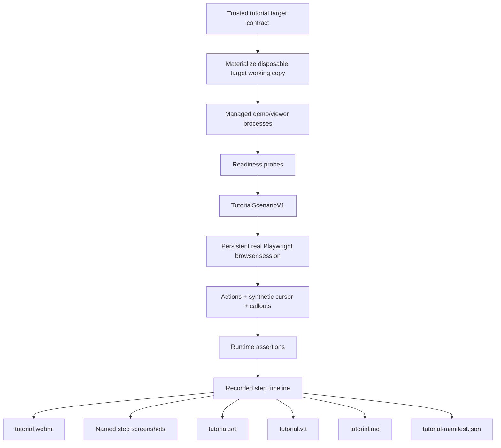

# Roadmap

This roadmap separates the implemented baseline from planned work. A version listed here is not released or implemented unless explicitly marked as current or completed.

The roadmap follows semantic version order. `v1.0.0` is the stable release after the complete `v0.x` development track; it is newer than every `v0.x` release.

## Version sequence


```mermaid
flowchart LR
  V020[v0.2.0] --> V021[v0.2.1] --> V022[v0.2.2]
  V022 --> V030[v0.3.0] --> V031[v0.3.1] --> V032[v0.3.2] --> V033[v0.3.3] --> V034[v0.3.4]
  V034 --> V040[v0.4.0] --> V041[v0.4.1] --> V042[v0.4.2] --> V043[v0.4.3] --> V044[v0.4.4]
  V044 --> V045[v0.4.5] --> V046[v0.4.6] --> V047[v0.4.7] --> V048[v0.4.8] --> V050[v0.5.0] --> V051[v0.5.1] --> V052[v0.5.2]
  V052 --> V060[v0.6.0] --> V061[v0.6.1] --> V062[v0.6.2] --> V063[v0.6.3]
  V063 --> V070[v0.7.0] --> V071[v0.7.1] --> V072[v0.7.2]
  V072 --> V080[v0.8.0] --> V081[v0.8.1] --> V082[v0.8.2]
  V082 --> V090[v0.9.0] --> V091[v0.9.1] --> V092[v0.9.2]
  V092 --> V0100[v0.10.0] --> V0101[v0.10.1] --> V0102[v0.10.2]
  V0102 --> V0110[v0.11.0] --> V0111[v0.11.1] --> V0112[v0.11.2]
  V0112 --> V0120[v0.12.0] --> V0121[v0.12.1] --> V0122[v0.12.2]
  V0122 --> V100[v1.0.0] --> V110[v1.1.0] --> V120[v1.2.0] --> V130[v1.3.0] --> V140[v1.4.0]
  V100 -. deferred .-> PT[Post-v1 / version TBD manual pentest]
```

## Product direction

my-dev-kit-lab is the experiment, evidence, reporting, security-validation, audit, and release-readiness companion for my-dev-kit.

my-dev-kit-lab should remain validation-first, evidence-first, and non-destructive by default. It should not become a project generator, app publisher, signing tool, Play Console uploader, or automatic fixer.

The strongest product thesis remains:

* my-dev-kit helps when a repository is larger than the task.
* my-dev-kit-lab should prove when my-dev-kit is useful, not claim that my-dev-kit always saves tokens.
* The most important usefulness cases are large repositories, localized tasks, warm index reuse, context-window limits, retrieval precision, stale-index risk detection, and better coding-agent edit quality.
* Security validation, audit reporting, code rot detection, code quality checks, mobile validation, and manual pentest support should strengthen release-readiness and implementation-readiness workflows around this evidence system.
* The pre-v1 software-review track should organize evidence across six dimensions: behavior, architecture, security, operations, quality, and evolution. These dimensions are a reporting and analysis model over shared evidence, not six parallel engines or command families.
* Security validation remains an independently authoritative subsystem. Project-wide review may consume its confirmed findings through the existing security audit adapter, but must not duplicate security policy, scanners, Android validation, attack-scenario logic, or security reports.
* Browser tutorial automation should turn one declarative scenario into assertion-backed runtime evidence and synchronized human-facing artifacts without becoming a general video editor or absorbing product-specific demo ownership.

## Release continuity and planned sequence

### v0.2.0 — completed

Status: **published**.

Purpose:

* Introduce the reusable experiment-plugin framework without breaking the raw-versus-guided baseline.

Completed scope:

* Generic experiment-plugin contracts, registry, runner, configuration, target model, and normalized results.
* `context-strategy-comparison` as the first experiment plugin.
* Existing raw-full-file versus my-dev-kit-guided behavior preserved through the plugin.
* Target-aware experiment execution.
* Plugin-aware JSON and HTML reports.
* Backward-compatible `experiment:list`, `experiment:describe`, `experiment:run`, and legacy controlled-experiment workflows.
* Reusable target-aware automated security validation carried forward from earlier security work.

Acceptance:

* Plugin and legacy workflows produce compatible artifacts, explicit local targets remain non-destructive, and existing security validation remains available.

### v0.2.1 — previous package baseline

Status: **the npm registry lists `0.2.1`**; no matching Git tag or GitHub Release was found during this recovery.

Purpose:

* Correct external-target security-test execution, including execution from an installed package, and synchronize documentation with the plugin architecture.

Completed scope:

* Correct target-project execution of `test:security` during external-target validation, including installed-package execution.
* Documentation synchronized with the implemented plugin and security-validation architecture.
* Fortification continues after this baseline without changing the backward-compatible `security:validate` command.
* The current package baseline is not the final security, audit, mobile, or pentest architecture.

Dependencies:

* Builds on the v0.2.0 plugin and target model.

Acceptance:

* External targets run their declared security test from the correct working directory in both source and installed-package execution.

### v0.2.2 — fortified automated security validation (published)

Status: **published**.

Purpose:

* Strengthen the existing automated security-validation framework so it moves closer to a reusable adversarial security framework, not just dependency scanning or package validation.
* Keep `security:validate` backward compatible.
* Do not merge this work into the audit framework yet.

Features:

* Add `security:validate` config-surface flags: `--checks`, `--profile`, `--format`, `--fail-on`, and `--out`, while preserving backward-compatible `--target` and no-flag behavior.
* Add automated attack-scenario model, reusable security profiles, payload corpus, and explicit exploit-evidence model.
* Add integrated attack runner and report support for attack scenarios.
* Add concrete target sandbox, package boundary, output boundary, path traversal, config injection, subprocess injection, secret leakage, report poisoning, and network/local-first assumption scenarios.
* Add profile-aware default check selection and scoped-run reporting.
* Add fail-on threshold behavior plus clearer separation between scanner findings, adversarial failures, optional skipped tools, release blockers, target-project blockers, and tool-framework blockers.
* Add metadata-driven `verdictImpact` categorization and remove the hand-maintained scenario-impact map.
* Add `reportSchemaGuard` baseline-diff structural-injection protection for JSON report poisoning/config injection.
* Add schema/report hardening, output-format/location consistency validation, text-report sanitization, and non-destructive target validation coverage.

Acceptance:

* The standalone command remains backward compatible and all accepted check IDs have implementation coverage.
* Attack scenarios produce structured, sanitized evidence and metadata.
* Target source remains unchanged by default, unavailable optional tools remain skipped, and experiment behavior remains compatible.

Explicit exclusions:

* This release did not merge security validation into the generic audit framework or add manual pentesting.

## Planned v0.x development track

### v0.3.0 — generic audit framework and code rot detector (published)

Status: **published**.

Purpose:

* Add a generic audit framework for project health, implementation-readiness, refactor-readiness, and release-readiness.
* Add code rot detection as the first audit detector family.
* Keep this separate from experiments and separate from direct security validation.

Features:

* Add reusable audit contracts, target resolution, registry, severity model, issue model, and report infrastructure.
* Add project inventory scanner.
* Add source-of-truth collector.
* Add normalized audit issue schema.
* Add code rot detector.
* Add stable text and JSON reports.
* Add configurable fail-on severity.
* Add false-positive and confidence labels.
* Add suggested fix strategy and validation commands per finding.
* Write reports under `reports/audits/code-rot/`.

Code rot detector scope:

* Stale command and workflow references.
* Documentation/code mismatch.
* Duplicate or parallel implementation candidates.
* Dead-code candidates from deterministic evidence.
* Test rot signals.
* Architecture drift signals.
* Package/release rot.
* Dependency/environment rot.
* Cross-platform rot.
* Security/validation assumption rot.

Acceptance:

* `npm run audit -- --target <path> --types code-rot` works.
* Reports include target metadata, tool metadata, timestamp, summary, issue counts, evidence, severity, confidence, recommended action, validation commands, release-blocking flag, implementation-blocking flag, and auto-fix eligibility.
* No target files are modified.
* Invalid targets fail cleanly.
* JSON schema is stable.
* Windows paths work.
* Existing experiment commands still work.
* Existing `security:validate` still works.

Explicit exclusions:

* Security, quality, project, and combined audit types were not part of this release's completed scope.

### v0.3.1 — language-aware TypeScript/JavaScript code-rot support

Status: **published**.

Purpose:

* Add a language-aware source-facts substrate and TypeScript/JavaScript support to the existing code-rot audit family without introducing a new audit type.

Completed scope:

* Added normalized source facts, analyzer registration, TypeScript/JavaScript parsing, source-facts-aware dead-code/duplicate/test-rot signals, and report summaries.
* Preserved the existing `npm run audit` surface, stable issue model, and non-destructive target boundary.

Dependencies:

* Builds on the `v0.3.0` generic audit framework and code-rot detector registry.

Acceptance:

* TypeScript/JavaScript evidence is deterministic and conservative; unsupported or ambiguous semantics are not overclaimed.
* Existing experiment and standalone security-validation behavior remains compatible.

Explicit exclusion:

* The `quality` audit type and deterministic code-quality detector family remain planned, unimplemented work; `v0.3.1` does not own them.

### v0.3.2 — security results in unified audit reports

Status: **published**. This release also added Python source-facts support.

Purpose:

* Integrate existing automated security-validation results into the audit framework as a report source.
* Preserve standalone `security:validate`.

Features:

* Add audit adapter for securityValidation.
* Convert security validation findings into the shared audit issue model.
* Preserve original security report output.
* Add security summary section to audit reports.
* Distinguish scanner findings, adversarial scenario failures, package/release findings, and optional skipped checks.
* Add audit report links to generated security validation reports.

Acceptance:

* `security:validate` remains backward compatible.
* `npm run audit -- --target <path> --types security` works.
* Audit reports include security findings in the shared issue model.
* Audit reports link or reference generated security reports.
* Optional skipped security tools are represented correctly.
* Existing security reports remain available.
* Existing experiment framework remains unchanged.

Explicit exclusions:

* This release did not implement the `quality`, `project`, or `all` audit types and did not add audit passthrough for standalone security check/profile selection.

### v0.3.3 — Java/Kotlin language-aware code-rot support

Status: **published**.

Purpose:

* Extend the language-aware code-rot substrate to Java and Kotlin while preserving conservative, dependency-free analysis.

Completed scope:

* Added Java/Kotlin analyzers, JVM project metadata, detector integration, and static Gradle/Maven documentation-claim checks.

Dependencies:

* Builds on the `v0.3.1` source-facts substrate and the `v0.3.2` additive report fields.

Acceptance:

* Java/Kotlin findings remain analyzer-scoped and do not claim compiler, classpath, runtime, Android, or dependency-freshness proof.
* Existing command and report schemas remain compatible.

Explicit exclusion:

* Project-wide combined audit defaults, audit profiles, cross-type deduplication, and the `quality`, `project`, and `all` audit types remain planned and unimplemented.

### v0.3.4 — cross-language code-rot fixture and stability pass

Status: **published**.

Purpose:

* Harden the shared TypeScript/JavaScript, Python, Java, and Kotlin source-facts substrate.
* Preserve deterministic path normalization, report schemas, cross-platform fixtures, and documentation/code consistency.

Acceptance:

* Mixed-language fixtures and reports remain deterministic across supported platforms.
* Existing experiment, audit, security-validation, report, plot, screenshot, and gallery behavior remains available.

### v0.4.0 — Android validation MVP

Status: **published**.

Purpose:

* Deliver the non-destructive Android validation MVP.

Implemented capabilities:

* Android project detection, module detection, and Compose/XML/mixed UI classification.
* Android manifest parsing and the original Android audit checks.
* Static Gradle metadata plus closed, explicitly opted-in Gradle operations.
* Android verdicts, text and JSON reports, target mutation evidence, and Play-readiness placeholders.
* Non-destructive defaults: no Gradle process, external tool, or network activity unless explicitly requested.

Acceptance:

* `security:validate --profile android` detects and validates Android targets.
* Default validation remains static, local, deterministic, report-first, and source-preserving.

### v0.4.1 — advanced Android security

Status: **published**.

Purpose:

* Extend the Android MVP with advanced shared substrate and deeper static security evidence.

Implemented capabilities:

* Network Security Config; backup and data-extraction; release/debug configuration.
* Redacted secret candidates and signing-configuration evidence.
* WebView, FileProvider, sensitive storage, sensitive logging, clipboard, and Firebase/Google services checks.
* Optional Semgrep, OSV, Android Lint, and Dependency-Check evidence.
* Nineteen active default checks, `CandidateEvidence`, CLI/report/verdict integration, and stable text/JSON output.
* Zero Gradle operations, zero external tools, and zero network requests by default.

Acceptance:

* Advanced checks feed the same Android validation result, verdict, and reports.
* Optional operations remain closed and auditable; standalone `security:validate` remains available.

### v0.4.2 — Android-aware general security audit adapter

Status: **published**.

Purpose:

* Extend the existing general security audit adapter directly with Android-aware validation without creating a parallel adapter.

Completed scope:

* Reuse the existing `SecurityFinding -> AuditIssue` mapping for general security findings.
* Invoke Android validation programmatically through the existing security audit adapter.
* Add Android status/completeness and `CandidateEvidence` summaries plus Android report references.
* Add an explicit public `audit` CLI opt-in and generic audit text/JSON integration.
* Preserve standalone `security:validate` and default static zero-process behavior.
* Do not map `CandidateEvidence` records to `AuditIssue`; only Android security findings become audit issues.
* Do not add a parallel adapter.

Acceptance:

* The opt-in audit path exposes Android summaries, report references, and mapped Android security findings.
* Generic audit output remains schema-stable and the standalone validator remains authoritative for complete Android validation evidence.
* Package metadata, the `v0.4.2` tag, and the GitHub Release were published for v0.4.2; that release superseded v0.4.1 at publication.

### v0.4.3 — stage-specific bounded-context and workflow-instruction evaluation

Status: **published**.

Purpose:

* Extend the existing experiment and report infrastructure so it can deterministically compare broad and bounded stage-context strategies against identical immutable targets, using explicit fixture expectations and structured packet evidence, without joining or replacing the production execution path of my-dev-kit or my-dev-kit-orchestrator.

Cross-repository dependency order (each repository remains independently releasable; my-dev-kit-lab has no runtime/package dependency on the other two):

1. `my-dev-kit` `1.10.1` — adds architecture/implementation/test-implementation context roles, structured `ContextRequest` input, changed-file/symbol intake, before/after index identities, evidence groups, bounded test-infrastructure discovery, deterministic responsibility mapping, and adequacy/truncation/freshness/provenance reporting on top of the existing context capsule (schema `1.0.0`) and retrieval-audit record (schema `1.0.0`).
2. `my-dev-kit-orchestrator` `1.2.1` — adds a structured workflow/command/rule/report-contract catalog with stable IDs, a deterministic reference resolver, `WorkflowInstructionPacket` assembly, and manual (non-automatic) implementation/test-implementation context-refresh integration into the existing ten-stage feature workflow.
3. `my-dev-kit-lab` `0.4.3` (this repository) — the scope described below.

Ownership boundaries approved for this patch:

* my-dev-kit-lab owns: controlled context-strategy experiments and strategy matrices, explicit fixture expectations, context-size measurement, required-evidence recall, irrelevant-file/irrelevant-instruction inclusion, test-responsibility-mapping completeness, provenance completeness, truncation/adequacy/freshness evaluation, full-file-fallback and unnecessary-read measurement (where source packet/audit data exposes it), repeated-run determinism, target immutability, machine- and human-readable reports, and optional plots/screenshots. It also continues to own the existing security-validation and code-rot-audit systems, unmodified by this patch.
* my-dev-kit owns: repository indexing, architecture/implementation/test-implementation role context, `ContextRequest`, context capsules, retrieval-audit records, changed-file/changed-symbol evidence, before/after index evidence, graph-diff evidence, and repository-evidence adequacy/provenance/test-responsibility-mapping-to-repository-evidence.
* my-dev-kit-orchestrator owns: workflow catalog content, stable workflow/stage/command/rule/report-contract IDs, exact workflow selection and dependency resolution, `WorkflowInstructionPacket`, stage prompt assembly, `TaskState`, stage order, artifact lifecycle, manual context-freshness rules, correction routing, judge interpretation, and publication authorization.
* Explicit non-owner boundaries: my-dev-kit-lab must not become the production repository indexer, the normal context-packet generator, or the workflow-instruction resolver; must not assemble production coding-agent prompts, control stage progression, mark orchestrator stages complete, execute normal production implementation workflows, automatically edit target repositories, become a required production dependency of either upstream project, or authorize publication. my-dev-kit must not own lab strategy verdicts, experiment scoring, or report comparisons. The orchestrator must not own lab metrics, lab report generation, or lab target-immutability evidence.

Problem this patch solves (resolved by the implementation described below):

* Prior evaluation (`src/evaluation/scoreCorrectness.ts` and the `context-strategy-comparison` plugin) was primarily agent-answer and broad-context-size oriented; it did not directly measure whether selected evidence contained required files, symbols, workflow-instruction IDs, contracts, validators, errors, tests, test infrastructure, responsibility mappings, or provenance. It did not measure whether full workflow-library or broad-repository-dump baselines waste context or include irrelevant material relative to a bounded alternative — that must be measured, not assumed. It did not compare architecture-only context against implementation-refreshed and test-refreshed context under identical target conditions to evaluate staleness, or evaluate explicit test-responsibility mappings for test-writing stages. Subjective LLM-based quality/relevance/usefulness judging remains explicitly out of this patch's scope.

In scope for `v0.4.3`:

* Extend the existing `src/experiments` plugin/registry/runner infrastructure (no second runner was created). Extend the existing `context-strategy-comparison` plugin (`src/experiments/plugins/contextStrategyComparison/`) rather than duplicating it; existing strategy IDs `raw-full-file` and `my-dev-kit-guided` are preserved.
* Six new strategy IDs are implemented: `architecture-context-only`, `architecture-plus-implementation-refresh`, `architecture-plus-implementation-and-test-refresh`, `full-workflow-library`, `bounded-workflow-instruction-packet`, and `combined-bounded-stage-context`. They are selected through programmatic strategy-input configuration; no new `experiment:run` CLI flags were added for these paths.
* Exact, non-normalizing readers for the my-dev-kit context capsule, the my-dev-kit retrieval-audit record, and the orchestrator `WorkflowInstructionPacket` are implemented in `src/evaluation/upstreamArtifacts`, each with schema-major validation and explicit failure (not silent reinterpretation) on malformed input or unsupported schema majors. The existing adapter `src/evaluation/runMyDevKitRetrieval.ts` is unchanged and continues to invoke only `index`, `search`, `lookup`, `slice`, and `source`.
* Selectors and consistency diagnostics over the exact reader output are implemented in `src/evaluation/stageContextSelectors`.
* An explicit fixture-expectation contract (`StageContextExpectationFixtureV1` in `src/evaluation/stageContextExpectations`: required/allowed/forbidden evidence, expected artifact states, stable case and expectation IDs) is implemented, extending rather than replacing the existing `BenchmarkTaskAnswerKey`/`ExpectedContextTarget` concepts in `src/evaluation/types.ts`.
* Deterministic, evidence-centered metrics are implemented in `src/evaluation/stageContextMetrics`: character count and estimated tokens (`ceil(characterCount / 4)` per source, explicitly labeled as an estimate), required-evidence recall, allowed-evidence coverage, forbidden-evidence inclusion, irrelevant-file inclusion, irrelevant-instruction inclusion, required-provenance recall, responsibility-mapping completeness, state comparisons, context-size measurement, and explicit `available`/`unavailable`/`not-applicable` metrics for considered-but-unselected reads, unnecessary reads, and target immutability (available only where the published upstream artifacts expose that evidence). Every recall/inclusion metric reports numerator, denominator, and rate explicitly; missing data is reported as unavailable, never coerced to zero.
* Target-immutability before/after snapshot evidence is implemented in `src/evaluation/targetImmutability`: explicit `targetRootPath` and bounded `relativeFilePaths`, configured-file SHA-256 hashes, and read-only Git state capture, with no symbolic-link following and no mutating Git commands. Repeated-run determinism (`repeatCount` 1 through 10, run 1 as baseline, recursive canonicalization, SHA-256 digests) is implemented in `src/evaluation/stageContextDeterminism`. Any target mutation caused by an experiment is reported as a mutation; the target is never auto-cleaned or reset.
* Machine-readable (JSON), human-readable HTML, and human-readable text reports are implemented through the existing `src/report`/`src/report/experiments` infrastructure (`report.json`, `report.html`, `report.txt`), with a bounded detail limit, source-order preservation, explicit missing/not-applicable/zero-occurrence distinctions, and a neutral interpretation with no composite score, grade, ranking, or winning strategy.
* Plot data, SVG plots, screenshots, and gallery integration for this stage-context evidence are not part of this implementation.
* Regression coverage for the existing audit framework (`src/audits`), security-validation framework (`src/securityValidation`), and benchmark/evaluation infrastructure (`src/evaluation`) was verified; none of it was weakened or replaced.

Explicitly out of scope / deferred for `v0.4.3`:

* Production repository indexing, production context generation, workflow-catalog ownership or selection, workflow-stage progression, production prompt assembly, coding-agent execution, or automatic target editing (all remain owned by my-dev-kit or the orchestrator).
* LLM-based strategy grading, assertion-quality scoring, relevance judgment, general prose-usefulness scoring, human-equivalent manual-troubleshooting scoring, and any broad semantic precision/recall platform — these remain deferred pending a future, separately approved decision, and are distinct from the deterministic, fixture-explicit oracle/failure-path evidence this patch does evaluate.
* A shared cross-repository schema package, a production dependency on my-dev-kit or the orchestrator, automatic publication, and any replacement of the existing security or code-rot systems.
* Broader `v0.8.0` retrieval-precision/recall platform work (see the `v0.8.0` entry below) — this patch must not absorb that scope, and that scope must not be used to shrink this patch's required evidence-centered metrics.

Acceptance criteria:

* Every strategy runs against an identical, immutable target and case-expectation set; strategy order, tool versions, and inputs are recorded and fixed.
* Every metric derives from explicit fixture expectations and/or parsed packet/audit data, never from subjective judgment; missing data is reported as unavailable rather than zero.
* Repeated canonical runs (normalizing only timestamps, temporary paths, and timing) produce identical selected evidence, metrics, warnings, adequacy, truncation, and report structure.
* Unsupported context-capsule/retrieval-audit/`WorkflowInstructionPacket` schema majors fail clearly rather than being silently reinterpreted.
* Existing audits, benchmarks, reports, security validation, and CLI behavior regress cleanly; no existing experiment plugin, strategy, report path, or command is removed or broken.
* my-dev-kit-lab remains outside the production execution path of my-dev-kit and the orchestrator, and never becomes a required runtime dependency of either.
* `v0.4.3` was published as the npm/tag/GitHub-Release baseline that superseded `v0.4.2`.

### v0.4.4 — producer-readiness bridge

Status: **published**.

Purpose:

* Extend `v0.4.3`'s `combined-bounded-stage-context` strategy so my-dev-kit-lab can read the frozen my-dev-kit-orchestrator supplemental implementation/test-context packet and retrieval-report documents plus an observed readiness result, and deterministically measure owner, allocation, truncation-cause, supplemental/raw agreement, readiness-agreement, and criticality-overlay evidence — without reimplementing upstream producer owner-selection, evidence-allocation, producer-parity, or orchestrator readiness policy.

Ownership boundaries approved for this patch (unchanged from `v0.4.3`): my-dev-kit-lab owns explicit fixture expectations, deterministic comparison, metric calculation, and neutral reporting; it never recomputes upstream behavior. Readiness remains observed consumer output — the frozen orchestrator commit exposes no on-disk readiness artifact, so it is accepted only as a bounded plain object, never invented as a file format.

In scope for `v0.4.4`:

* Exact readers for the frozen implementation/test-context packet and retrieval-report documents, and a bounded plain-object adapter for the orchestrator readiness result, in `src/evaluation/upstreamArtifacts`.
* Deterministic owner, allocation, truncation-cause, supplemental/raw agreement, readiness-agreement, and criticality-overlay metric calculators in `src/evaluation/stageContextMetrics`, reusing the existing `available`/`unavailable`/`not-applicable` metric model.
* An additive producer-readiness bridge evaluator (`evaluateProducerReadinessBridge`) composing those calculators exactly once per run over already-loaded evidence.
* Additive, optional producer-readiness expectations on `StageContextExpectationFixtureV1` (`src/evaluation/stageContextExpectations`).
* Additive, optional producer-readiness bridge inputs and payload fields on the existing `combined-bounded-stage-context` strategy input/execution types; every existing `v0.4.3` strategy and combined-strategy case without these inputs is unaffected.
* An additive, optional producer-readiness bridge section in the existing `report.json`/`report.html`/`report.txt` pipeline, with the same bounded-detail and neutral-interpretation conventions as `v0.4.3`.
* A deterministic historical producer-to-readiness fixture family (owner false negative/positive, avoidable/genuine-hard-limit/unresolved truncation, supplemental contradiction, readiness identity mismatch, invalid-ready, valid-blocked, valid-refresh-required, criticality mismatch, partial mapping, and a corrected case) reused across focused tests and one complete fixture-to-report integration test.

Explicitly out of scope / deferred for `v0.4.4`:

* Public CLI flags for any producer-readiness bridge input — all inputs remain programmatic.
* A new experiment runner or a parallel report framework.
* Reimplementing upstream owner selection, evidence allocation, producer parity, orchestrator readiness, or readiness issue prioritization.
* A composite score, grade, ranking, or lab-generated release verdict.
* Plots, screenshots, and gallery integration for producer-readiness bridge evidence.
* Package-version bump, release branch, tag, GitHub Release, or npm publication.

Acceptance:

* Every producer-readiness metric explicitly reports `available`, `unavailable`, or `not-applicable`; an available zero, an unavailable reason, and a not-applicable denominator remain distinct everywhere.
* Existing `v0.4.3` strategies, expectation fixtures, and reports remain valid and unchanged when no producer-readiness bridge inputs are supplied.
* No owner-selection, allocation, producer-parity, or readiness policy is duplicated from either frozen upstream repository.
* Repeated canonical runs of the corrected fixture case produce identical canonicalized digests, including the producer-readiness bridge result.
* `v0.4.4` is released after upstream verification, PR merge, main CI, tag, GitHub Release, and npm publish. All release documentation is in final post-publication state.

### v0.4.5 — context-integrity evaluation and frozen ecosystem regression

Status: **published** (2026-08-01).

Purpose:

* Extend the producer-readiness bridge to consume the exact current local my-dev-kit v1.10.4 condition-aware producer contract (role-condition coverage, allocation/spillover diagnostics, required-versus-optional omission) and the exact current local my-dev-kit-orchestrator v1.2.3 run-integrity contract (readiness, prompt authorization, judge integrity, correction routing, final-report eligibility, lifecycle), and calculate bounded agreement across both systems without reimplementing either upstream's policy.
* Preserve a permanent, byte-exact regression fixture for the real my-dev-kit v1.11.0 Batch 1 context-readiness false-negative failure, paired with a corrected-contract replay for the same request/target/index identity, so the failure class cannot silently regress.

Ownership boundaries approved for this patch (unchanged from `v0.4.3`/`v0.4.4`): my-dev-kit-lab parses exact upstream evidence, compares producer and orchestrator claims, and reports agreement/contradiction/unavailable; it never derives an expected judge verdict, selects a correction destination, authorizes a final report, marks a stage complete, or replaces either upstream verdict.

In scope for `v0.4.5`:

* Exact mirrors of the local my-dev-kit v1.10.4 additive producer fields (`roleConditionCoverage`, extended `groupTruncation` allocation/omission fields, `truncation.requiredEvidenceLost`) in `src/evaluation/upstreamArtifacts`, with schema-major-1 legacy compatibility preserved.
* Allocation, spillover, condition-coverage, witness, and last-witness-loss metrics, and producer-condition / requiredEvidenceLost / producer-readiness agreement calculators, in `src/evaluation/stageContextMetrics`.
* An exact, bounded lab-owned mirror of the local my-dev-kit-orchestrator v1.2.3 run-integrity contract (`RunIntegrityGateResult`, `JudgeIntegrityResult`, `FinalReportEligibilityResult`, and `artifact-state.json` lifecycle records) in `src/evaluation/upstreamArtifacts` and `src/evaluation/stageContextSelectors`, since the orchestrator itself exposes these as in-memory structured results plus one lifecycle JSON file rather than one combined on-disk artifact.
* Readiness/prompt, readiness/expected-judge, expected/actual-judge, judge/correction, judge/final-eligibility, eligibility/final-artifact, and lifecycle-integrity agreement calculators, plus one bounded end-to-end agreement summary, composed once through the existing `evaluateProducerReadinessBridge`.
* A permanent, byte-exact-where-applicable frozen fixture pair under `tests/fixtures/ecosystem/context-integrity/v0.4.5/`: the real preserved my-dev-kit v1.11.0 Batch 1 failed run, and a corrected-contract replay for the same request/target/index identity, both with SHA-256 provenance manifests, a 49-case negative matrix, deterministic repeated-evaluation verification, and fixture/target immutability verification.
* Additive `report.json`/`report.txt`/`report.html` sections presenting the above through the existing bounded-detail, availability, and neutral-interpretation conventions.

Explicitly out of scope / deferred for `v0.4.5`:

* Public CLI flags or a new command family for context-integrity evaluation — all inputs remain programmatic/fixture-driven.
* A live, full ten-stage AI-authored replay of the regressed feature; the corrected-replay fixture is a hand-distilled representation of the exact validated contracts for the same request/target/index identity, not a byte-exact generated run.
* A composite score, grade, ranking, winner, or lab-generated release verdict.
* Release-process mechanics; these were handled by the repository's standard readiness and release workflows rather than by the context-integrity feature itself.

Acceptance:

* Current and legacy (schema-major-1) producer artifacts both parse; unknown additive fields and missing legacy diagnostics remain distinct from fabricated zero/false/empty values.
* Required and optional evidence omission remain distinguishable everywhere they are reported, including through the false-negative regression fixture.
* The frozen failed-run fixture evaluates deterministically to `contradiction-present`; the corrected-replay fixture evaluates deterministically to `full-agreement`; both remain stable across repeated evaluation and fixture-immutability checks.
* No upstream producer, orchestrator, readiness, judge, correction, or lifecycle policy is reimplemented or overridden by a lab-owned verdict.

### v0.4.6 — installed-package CLI and runtime-boundary correction

Status: **published**.

Purpose:

* Correct the installed-package architecture so the published npm package exposes the existing user-facing lab capabilities through a coherent supported CLI instead of requiring a source checkout for documented security, audit, and related workflows.
* Separate the installed package location, writable lab workspace/output location, and inspected target-project location so the npm installation itself is not treated as the writable tool workspace.
* Preserve all existing experiment, audit, security-validation, Android, report, gallery, and v0.4.3-v0.4.5 evaluation behavior while fixing packaging and command-surface structure and providing the runtime-boundary foundation required by the planned v0.4.7 tutorial automation work before v0.5.0 warm-index work begins.

Implemented:

* One compiled installed CLI router (`dist/scripts/cli.js`, routed through `src/cli/runLabCli.ts`) whose subcommands delegate to existing implementation owners under `src/commands/` rather than duplicating product logic. Public routes: `--help`/`--version`, `security validate`, `audit`, `experiment list`/`describe`/`run`/`controlled`, `report render`, `plots generate`, `gallery build`, `demo final`, plus the historical direct final-demo invocation form.
* Repository `npm run` commands refactored into thin adapters over the same `src/commands/` owners the installed CLI calls — one implementation per capability. Developer-only commands (`security:deps`/`package`/`codeql`/`semgrep`, fuzz smoke, `test`, `docs:check`, benchmark verification, `report:context-integrity-smoke`, visualization demos) remain repository-only `npm run` commands; none were promoted into the public installed CLI.
* An explicit runtime path model (`src/runtime/`, `LabExecutionContext`): read-only `packageRoot` (discovered by walking up from the executing module's own location, never from `process.cwd()`), `invocationCwd` (explicit relative paths resolve here), writable `workspaceRoot` (default `<home>/.my-dev-kit-lab`, overridable via a global `--workspace <path>` that must precede the command), and `resourceRoot` for bundled runtime resources, resolved with path-semantics containment rather than string-prefix matching.
* Safe default output behavior for installed execution: `audit` and `security validate` root their implicit (no explicit `--out`) output under `workspaceRoot` when invoked through the installed CLI, never under the installed package directory or the inspected target; `experiment run`'s implicit output root moved under `workspaceRoot/lab-output/experiments/...` (same subdirectory shape as before). Explicit output paths keep unchanged resolution semantics.
* A reconciled npm package-content allowlist limited to the resources the installed CLI and its bundled runtime resources actually require, with a package-content regression test confirming removed developer-only content does not reappear.
* A permanent packed-tarball acceptance gate (`npm run verify:packed-package`): build, a real `npm pack`, install the exact tarball into a clean temporary consumer project, execute the installed binary, and verify default-workspace output, explicit-workspace output, target immutability, and installed-package immutability via recursive SHA-256 snapshot comparison.
* `engines.node` raised to `>=24`; GitHub Actions CI standardized on Node `24` and `latest` across Ubuntu/macOS/Windows; the pre-release readiness workflow tracks Node `latest`; both workflows run `npm run verify:packed-package`.
* A resolved transitive `nanoid` devDependency security advisory (lockfile-only correction); the published runtime dependency tree was unaffected.

Acceptance (met):

* A user can install or invoke the published package without cloning the repository and run the supported installed CLI command families listed above — proven by the packed-package acceptance gate against a real tarball in a clean consumer project.
* `npm run` contributor aliases and the installed CLI use the same underlying behavior owners; there is no second security, audit, experiment, or report implementation.
* The package installation directory and target projects are not used as the default writable location; the acceptance gate proves both remain byte-for-byte unchanged after installed audit/security execution.
* The exact npm artifact contains every required runtime module/resource; no installed command depends on source-only `scripts/*.ts`, `tsx`, TypeScript, Vitest, or Playwright.
* GitHub CI passed for Linux/macOS/Windows × Node 24/latest against the release PR and merged main.
* Existing v0.4.3, v0.4.4, and v0.4.5 fixtures, metrics, reports, audits, security validation, Android validation, and experiment behavior remain compatible — no security check, audit detector, Android behavior, experiment scoring, or report schema changed.

Explicit exclusions (deferred, not part of v0.4.6):

* No tutorial/browser automation implementation; that is planned for v0.4.7.
* No warm-index reuse experiment implementation; that remains v0.5.0.
* No new security checks, Android checks, audit detector families, experiment metrics, scoring rules, or upstream producer/orchestrator policy.
* No manual pentest work.
* No public visualization-demo CLI routing.

### v0.4.7 — declarative browser tutorial and video automation

Status: **published**.

Purpose:

* Add a generic, installed tutorial runtime that executes declarative, assertion-backed browser scenarios in persistent Playwright sessions and turns one scenario definition into synchronized runtime evidence and human-facing tutorial artifacts.
* Build directly on the v0.4.6 installed-CLI, workspace, package-resource, command-owner, command-resolution, and packed-package boundaries rather than creating a separate script-only automation stack.
* Keep product-specific demo websites and product-specific tutorial scenarios with the product repository that owns them. The first intended consumer is `my-frontend-observer`; my-dev-kit-lab owns the generic runtime, not the Observer demo or Observer-specific selectors.

Dependencies and ownership:

* v0.4.6 is the required architectural baseline: `LabExecutionContext`, the installed CLI router, shared `src/commands/` owners, `resolveCommand`, package-resource resolution, workspace isolation, and `verify:packed-package` remain authoritative.
* Existing one-shot report screenshot behavior remains owned by `src/screenshot`; shared Playwright loading/launch behavior is implemented in `src/browser/` and does not turn `captureReportScreenshot` into the persistent tutorial engine.
* Long-running demo/viewer processes use the dedicated managed-process owner that reuses existing command resolution and process-tree cleanup conventions while providing readiness probes, explicit stop, bounded logs, and cleanup on failure.
* `my-frontend-observer` owns the deterministic demo template, stable demo-target identifiers, visual variants, reference images, demo materialization/reset behavior, readiness/start contract, and Observer-specific tutorial scenario definitions. Normal my-dev-kit-lab tests must not require a sibling Observer checkout.
* my-dev-kit retrieval is not a tutorial runtime dependency. Static repository retrieval evidence, tutorial runtime assertions, screenshots, and video remain distinct evidence types.

Implemented tutorial contracts:

* Add a versioned, declarative JSON scenario contract (`TutorialScenarioV1`) with scenario identity, title/purpose, browser configuration, ordered steps, narration, optional highlight/callout behavior, timing, screenshot requests, and bounded assertions.
* Add a separate trusted target/demo contract (`TutorialTargetContractV1` or equivalent) describing materialization, process start, readiness, application URL, and working-copy boundaries. Process specifications must use executable-plus-argument structures rather than shell-interpolated strings.
* Keep scenario actions bounded and serializable. Initial actions: `goto`, `click`, `fill`, `press`, `hover`, `drag`, and `wait-for`.
* Keep locator forms bounded. Initial locator families should cover accessible role/name, visible text, CSS, and stable test/demo identifiers.
* Keep assertions bounded and declarative. Initial assertion families should cover element visibility, text equality/containment, URL/path state, DOM attribute/state, HTTP JSON fields, local JSON artifact fields, and file existence.
* Do not add arbitrary JavaScript callbacks, arbitrary page evaluation, or arbitrary shell commands as scenario actions or assertions.

Implemented runtime and artifact flow:


```mermaid
flowchart TD
  Contract[Trusted tutorial target contract] --> Materialize[Materialize disposable target working copy]
  Materialize --> Processes[Managed demo/viewer processes]
  Processes --> Ready[Readiness probes]
  Ready --> Scenario[TutorialScenarioV1]
  Scenario --> Browser[Persistent real Playwright browser session]
  Browser --> Actions[Actions + synthetic cursor + callouts]
  Actions --> Assertions[Runtime assertions]
  Assertions --> Timeline[Recorded step timeline]
  Timeline --> Video[tutorial.webm]
  Timeline --> Shots[Named step screenshots]
  Timeline --> SRT[tutorial.srt]
  Timeline --> VTT[tutorial.vtt]
  Timeline --> Markdown[tutorial.md]
  Timeline --> Manifest[tutorial-manifest.json]
```

* Introduce a generic shared browser-runtime owner for Playwright loading, Chromium launch, availability classification, and common cleanup. `src/screenshot` keeps one-shot report capture; `src/tutorial` owns persistent tutorial sessions.
* Add visible tutorial-only cursor and click feedback plus deterministic pointer-events-none callout/highlight overlays. These overlays must not become application state or product evidence.
* Record Playwright WebM as the first supported video format. The finalized `tutorial.webm` is a canonical tutorial artifact; FFmpeg/MP4 conversion is not required for this release.
* Record actual step timeline boundaries and generate `tutorial.srt` and `tutorial.vtt` from the same narration text used by the scenario. Do not maintain independent handwritten subtitle sources.
* Generate `tutorial.md` from the same scenario, including ordered explanation and configured step screenshots.
* Write a dedicated `tutorial-manifest.json` containing schema version, scenario/run identity, overall status, environment metadata, step/action/assertion results, artifact paths/status, warnings, and process/log references. Do not overload `GalleryManifest`.
* Keep generated artifacts under the configured lab workspace/output. A tutorial run must keep the immutable source template, disposable target working copy, generated artifacts, logs, and temporary browser/video files distinct.
* Successful finalization cleans temporary recording data. Failed runs may retain useful finalized partial video, screenshots, logs, and manifest evidence, but must not leave abandoned temporary browser/process directories indefinitely.

Implemented installed CLI:

* `my-dev-kit-lab tutorial validate --scenario <path>` performs schema/contract validation without requiring Chromium.
* `my-dev-kit-lab tutorial run --scenario <path> ...` runs through the existing installed CLI router and a thin `src/commands/` owner; `--target-contract` is the required trusted-target option.
* Tutorial recording is a primary command purpose, so missing required browser runtime produces an explicit unavailable/failure result and nonzero command outcome with setup guidance; it does not silently pass without video.
* Playwright is an exact runtime dependency required by the installed tutorial command. Chromium browser-binary availability remains a separate setup/runtime check and is not hidden by the package.

Cross-repository consumer work:

* `my-frontend-observer` should add a version-controlled deterministic demo template, stable demo targets, deterministic visual variants, reference images, a caller-selected materialization/reset path, a serve/readiness contract, and Observer-specific scenarios.
* Observer-specific scenarios should teach the Observer lifecycle distinctions and verify real Observer/browser/evidence state. They remain product documentation owned by Observer and are not copied into my-dev-kit-lab production code.
* The lab must carry its own generic deterministic tutorial fixture for unit/integration/packed-package testing. Observer-specific acceptance is an explicit consumer/cross-repository workflow, never a requirement for normal lab CI.

Acceptance (met):

* A valid generic tutorial scenario can be validated without launching a browser and can run through the installed CLI against a disposable local fixture when the browser runtime is available.
* One scenario is the single source of truth for ordered actions, narration, timing, screenshots, assertions, subtitles, and Markdown output.
* A successful generic fixture run produces a non-empty WebM, selected screenshots, SRT, VTT, Markdown, logs, and a structured tutorial manifest; required assertion failure prevents a successful tutorial verdict.
* Browser and managed-process resources are closed on both success and failure, and target/source/package immutability and workspace containment remain provable.
* The existing one-shot report screenshot contract remains compatible; tutorial screenshots use the persistent tutorial session rather than launching a fresh browser per step.
* The packed npm candidate can execute the supported tutorial workflow from a clean consumer project according to the chosen Playwright/browser setup contract.
* Normal lab CI and packed-package tests do not require `my-frontend-observer` or any other sibling repository.
* Linux, macOS, and Windows validation covers supported tutorial runtime paths without duplicating Windows command-shim/process-tree logic.

Explicit exclusions:

* FFmpeg integration and MP4 conversion.
* Generated speech, text-to-speech, audio narration, audio/video muxing, background music, intros/outros, chapter-card rendering, or a general-purpose video editor.
* Gallery integration beyond producing the canonical tutorial manifest; gallery consumption is planned as part of later report/gallery generalization.
* Observer-specific selectors, semantics, demo source, or product behavior inside my-dev-kit-lab production code.
* Arbitrary JavaScript/page-evaluation escape hatches or arbitrary shell commands in scenario steps.
* A runtime dependency on my-dev-kit or my-dev-kit-orchestrator.
* Warm-index reuse; that remains v0.5.0.

### v0.4.8 — locator-anchored pointer gestures for browser tutorials

Status: **published**.

Purpose:

* Close the generic tutorial-expression gap found by the first real downstream consumer, `my-frontend-observer`: v0.4.7 can drag one DOM element to another but cannot reproduce a real free-position pointer gesture inside one SVG/canvas-style interaction surface.
* Add the smallest bounded input vocabulary needed for drawing, selection rectangles, crop/range gestures, diagram editors, map/timeline selections, and other position-sensitive browser interactions without introducing arbitrary page coordinates, arbitrary JavaScript, or generic DOM event dispatch.
* Preserve every existing v0.4.7 action and artifact contract. This is an additive tutorial-runtime patch, not an Observer-specific workaround or a redesign of the tutorial target/process/video system.

Planner-owned action contract:

```ts
type TutorialFractionPointV1 = {
  x: number;
  y: number;
};

type TutorialPointerClickActionV1 = {
  type: "pointer-click";
  locator: TutorialLocatorV1;
  position: TutorialFractionPointV1;
  coordinateSpace: "fraction";
  timeoutMs?: number;
};

type TutorialPointerDragActionV1 = {
  type: "pointer-drag";
  locator: TutorialLocatorV1;
  from: TutorialFractionPointV1;
  to: TutorialFractionPointV1;
  coordinateSpace: "fraction";
  timeoutMs?: number;
};
```

Frozen semantics:

* `pointer-click` and `pointer-drag` are anchored to exactly one existing `TutorialLocatorV1`; there is no page-wide or screen-wide coordinate mode.
* Fraction coordinates are inclusive normalized offsets within the locator's current bounding box: `0 <= x <= 1`, `0 <= y <= 1`. Invalid coordinates fail validation and are never clamped.
* `pointer-drag` requires distinct `from` and `to` points. Zero-length pointer drags fail validation.
* `coordinateSpace` is required and the only accepted v0.4.8 value is `"fraction"`. Do not add element-pixel coordinates until a real generic use case requires them.
* `pointer-click` uses real Playwright mouse input at the resolved point. `pointer-drag` uses real Playwright mouse input in the exact host-side sequence `mouse.move(start)`, `mouse.down()`, `mouse.move(end, { steps: 8 })`, `mouse.up()`.
* Freeze `POINTER_DRAG_MOVE_STEPS = 8`. Do not expose move-step count, mouse button, pointer type, or arbitrary event properties in this patch.
* Existing `drag` remains element-to-element `source.dragTo(target)`; its schema and runtime behavior do not change.
* Synthetic cursor presentation follows the same locator-anchored start/end positions. `pointer-click` reuses existing click feedback. Visual failures remain warnings and never replace action/assertion evidence.
* Scenario JSON still cannot supply JavaScript, `page.evaluate`, callbacks, shell commands, arbitrary event payloads, or absolute page/screen coordinates.

Schema-version decision:

* Keep `TutorialScenarioV1.schemaVersion = "1.0.0"` for v0.4.8. The patch adds action discriminants while preserving every existing serialized v1.0.0 scenario unchanged; package version `0.4.8` is the capability boundary for scenarios that use the new actions.
* Keep `TutorialTargetContractV1`, `TutorialRunResultV1`, and `TutorialManifestV1` at schema version `1.0.0`. No target/process, output-layout, artifact-record, or manifest structural change is required.
* Do not introduce schema `2.0.0`. Revisit a scenario-schema version bump only when a serialized field changes incompatibly or a stronger cross-version compatibility requirement is demonstrated.

Implementation summary (completed):

1. **Pointer contract and runtime.** Extended `src/tutorial/types.ts` with `TutorialFractionPointV1`, `TutorialPointerClickActionV1`, and `TutorialPointerDragActionV1`. Added closed schema validation in `src/tutorial/scenarioValidation.ts` for fraction coordinate space, `[0, 1]` bounds, and distinct endpoint requirements. Added structural Playwright mouse types to `src/browser/types.ts`. Implemented real mouse execution in `src/tutorial/tutorialActions.ts` with fixed 8-step drag movement and `mouse.up()` error cleanup, shared geometry in `src/tutorial/tutorialPointerGeometry.ts`, and synthetic cursor presentation with click feedback in `src/tutorial/tutorialSession.ts`. Added planner-authored validation and action tests covering 0/1 bounds, negative/non-finite coordinates, unknown fields, zero-length drag rejection, mouse call ordering, deterministic 8-step drag movement, cursor start/end positioning, click feedback, and `mouse.up()` error cleanup.
2. **Generic browser/package acceptance.** Extended the generic `examples/tutorial-browser/` fixture with a real pointer-receiving SVG surface and intermediate pointermove tracking evidence. Added `pointer-click` and `pointer-drag` steps to the generic 9-step scenario, proven in `tests/integration/tutorialRealBrowser.spec.ts` through real Chromium. Extended exact packed-tarball acceptance in `scripts/verify-packed-package.mjs` to validate and execute both actions from a clean installed consumer without source mutation. Preserved downstream `my-frontend-observer` compatibility evidence across rectangle, line, arrow, point, and note gestures with zero Observer modifications and zero runtime dependencies.

Expected production owners:

* `src/tutorial/types.ts` — two new action discriminants and normalized point type.
* `src/tutorial/scenarioValidation.ts` — closed validation for fraction points and zero-length drag rejection.
* `src/browser/types.ts` — the minimal structural Playwright mouse surface required by tutorial execution.
* `src/tutorial/tutorialActions.ts` — real Playwright mouse execution and bounded coordinate conversion.
* `src/tutorial/tutorialSession.ts` / `tutorialCursor.ts` — synthetic cursor positioning and existing click feedback for the new actions.
* `src/tutorial/tutorialPointerGeometry.ts` — shared pointer geometry helper preventing duplicate coordinate math between action execution and presentation.

Acceptance:

* Existing v0.4.7 scenarios using `goto`, `click`, `fill`, `press`, `hover`, `drag`, and `wait-for` still validate and execute unchanged.
* A generic real-browser fixture proves a positional click and a non-zero pointer drag inside one located surface using actual Playwright mouse input.
* The action model never accepts unanchored page/screen coordinates and never gains arbitrary JavaScript or generic event dispatch.
* The exact packed npm candidate validates and runs the new pointer actions from a clean consumer while retaining the existing v0.4.7 tutorial artifacts and immutability checks.
* Windows, Linux, and macOS real-browser readiness proves coordinate behavior through the existing CI/pre-release workflow.
* When the unchanged Observer compatibility checkout is available, rectangle/line/arrow drawing and point/note placement are expressible through the generic lab actions without tutorial-only Observer controls.

Explicit exclusions:

* No invisible Observer drag handles, alternate Observer annotation APIs, hidden tutorial controls, or Observer-specific selectors/semantics in lab production code.
* No arbitrary page coordinates, element-pixel mode, configurable drag steps, touch/pen emulation, right/middle/custom buttons, arbitrary `dispatch-event`, JavaScript callbacks, or shell actions.
* No redesign of `TutorialTargetContractV1`, managed processes, loopback policy, source/target isolation, WebM/SRT/VTT/Markdown generation, tutorial manifests, or gallery behavior.
* No FFmpeg, MP4, generated audio, or gallery tutorial consumption.
* Warm-index reuse remains v0.5.0 and follows this bounded v0.4.8 patch.

### Post-v1 / version TBD — manual pentest

Status: **deferred**.

* Manual pentest is no longer assigned to v0.4.0 and is not assigned to v0.4.1 or v0.4.2.
* It remains a human-led post-v1 / version-TBD workflow.
* Automated security or Android validation must never be described as manual pentesting.

### v0.5.0 — warm-index reuse experiment support

Status: **planned; not implemented**.

Purpose:

* Add a plugin for testing the strongest my-dev-kit value case: indexing once and reusing the index across multiple tasks.

Features:

* Before registering the second plugin, remove the current `experiment run` command owner's context-strategy-specific assumption for future plugins. Keep all existing context-strategy flags backward compatible, but do not add one new experiment-ID branch per future plugin.
* Add one generic plugin-config path, `--config <path>`, owned by `runExperimentRunCommandFromArgs`. The file uses a versioned `ExperimentConfigFileV1` envelope: `{ "schemaVersion": "1.0.0", "experimentId": "<id>", "config": { ... } }`. The envelope's `experimentId` must exactly match `--experiment`; malformed JSON, unsupported schema major, unknown envelope fields, or mismatch fail before plugin execution. The config-file path resolves against invocation CWD, while relative paths **inside** `config` resolve against the config file's directory through generic config-source metadata supplied to the plugin.
* `--config` may be combined with the generic `--experiment`, `--target`, `--out`, and global `--workspace` surfaces. For `context-strategy-comparison`, it is mutually exclusive with the legacy plugin-specific convenience flags (`--cases`, `--project-profiles`, `--case`, `--benchmark-project`, `--agents`, `--strategies`, `--complexities`, timeout/run-count/continuation/real-agent/template flags, and `--no-screenshot`). Those legacy flags keep their current path/default behavior when `--config` is absent.
* Extend `ExperimentPlugin` additively with an optional plugin-owned `resolveInputs` hook. `runExperiment` calls it after target/config/output resolution only when the programmatic caller did not already supply `RunExperimentOptions.inputs`; explicit programmatic inputs take precedence and bypass automatic input resolution. The hook receives validated config, target/tool/output context, and config-source base metadata, and returns the `inputs` object used by `ExperimentExecutionContext`.
* Migrate the current context-strategy CLI input-loading branch into the context-strategy plugin's `resolveInputs`/plugin-owned helper while preserving its legacy artifacts and defaults. After v0.5.0, the generic command owner must not contain experiment-ID-specific input-loading branches.
* Extend experiment metadata with optional plugin-owned CLI examples. `experiment describe` renders those when present; otherwise it renders a generic `--config <path>` run example. It must not emit `--agents`/`--complexities` examples for plugins that do not declare them.
* Register the new `warm-index-reuse` plugin in the default registry so `experiment list`, `experiment describe --experiment warm-index-reuse`, and `experiment run --experiment warm-index-reuse` all expose it through both the installed CLI and source-checkout npm aliases in the same release.
* Add warm-index-reuse experiment plugin.
* Add setup step to index a project once.
* Run multiple benchmark tasks using the same index.
* Compare against raw-full-file context per task.
* Measure index build time, retrieval time per task, raw context size, retrieved context size, amortized index cost, correctness, duration, and token usage when available.
* Add report section explaining cold cost versus warm cost.
* Add plots for amortized index cost, raw versus retrieved context size, correctness, and cumulative token usage.

Acceptance:

* `my-dev-kit-lab experiment list` and `npm run experiment:list` both list `warm-index-reuse` from the same default registry.
* Installed/source `experiment describe` and `experiment run` reach the same command owners and plugin registry; explicit `--config` has identical semantics in both entry paths except the already-established implicit installed-workspace versus source-checkout output root.
* Existing `context-strategy-comparison` invocations and legacy flags remain backward compatible, and a config-file invocation of that plugin produces equivalent normalized config/input semantics for the same declared values.
* The generic experiment command owner contains no context-strategy or warm-index experiment-ID-specific input-loading branch after the migration; plugin-specific input resolution is owned by the plugin hook.
* Unit/integration tests prove `RunExperimentOptions.inputs` bypasses `resolveInputs`, while CLI runs without explicit programmatic inputs invoke the selected plugin's resolver exactly once.
* Warm-index experiment runs with fake-agent.
* Reports clearly separate one-time index cost from per-task retrieval cost.
* Results do not overclaim token savings when token totals are unavailable.

### v0.5.1 — expanded warm-index benchmark suite

Status: **planned; not implemented**.

Purpose:

* Add enough tasks to make warm-index reuse meaningful.

Features:

* Add multiple cases per benchmark project.
* Add localized tasks.
* Add cross-module tasks.
* Add broad-change tasks as negative controls.
* Add answer keys for all new tasks.
* Add expected relevant files and symbols for retrieval evaluation.
* Add benchmark metadata for task locality.

Acceptance:

* At least five tasks exist for the medium benchmark project.
* At least five tasks exist for the large/mixed benchmark project.
* Reports can compare warm-index behavior as task count increases.

### v0.5.2 — warm-index real-agent campaigns

Status: **planned; not implemented**.

Purpose:

* Run Codex and Claude on warm-index experiments with structured partial-outcome reporting.

Features:

* Add real-agent warm-index campaign presets.
* Add reduced-size campaign for Codex timeout isolation.
* Add Claude token-unavailable explanation.
* Add partial-result friendly report sections.
* Add screenshots and gallery output.

Acceptance:

* Campaigns can run with Codex and Claude.
* Partial outcomes are structured.
* Reports distinguish infrastructure success from agent/provider limitations.

### v0.6.0 — index freshness and changed-file detection

Status: **planned; not implemented**.

Purpose:

* Detect source changes that may invalidate indexed context.

Features:

* Record index manifest metadata.
* Track indexed files, file hashes, modified timestamps where useful, my-dev-kit version, command used, and generated artifacts.
* Add changed-file detection against the current working tree.
* Add reportable index freshness status:

  * fresh
  * stale
  * partially stale
  * unknown

Acceptance:

* Lab can detect changed files after an index was built.
* Freshness status appears in experiment artifacts and reports.

### v0.6.1 — affected-neighborhood experiments

Status: **planned; not implemented**.

Purpose:

* Measure graph-neighborhood targeting after localized changes.

Features:

* Use my-dev-kit graph outputs to map changed files and symbols to affected nodes.
* Determine whether a future task overlaps affected nodes.
* Add affected-neighborhood metrics:

  * changedFileCount
  * changedSymbolCount
  * affectedNodeCount
  * affectedEdgeCount
  * taskOverlapCount
  * taskOverlapPercent
  * reindexRecommendation

Acceptance:

* Experiment can classify next task as related or unrelated to a prior change.
* Report explains whether reindex was recommended.

### v0.6.2 — incremental-change and staleness plugin

Status: **planned; not implemented**.

Purpose:

* Compare stale, refreshed, and incrementally updated index behavior after controlled code changes.

Features:

* Add incremental-change-staleness plugin.
* Define change scenarios:

  * unrelated file change
  * local implementation change
  * exported symbol change
  * public API change
  * import graph change
  * test-only change
* Run next tasks with stale index, refreshed full index, and partial refresh where available.
* Score correctness and retrieval safety.
* Report stale-index risk.

Acceptance:

* Plugin demonstrates safe and unsafe stale-index scenarios.
* Reports do not recommend skipping reindex unless evidence supports it.

### v0.6.3 — partial-refresh planning

Status: **planned; not implemented**.

Purpose:

* Add evidence and planning support for bounded index refreshes.

Features:

* Add experiment treatments:

  * my-dev-kit-full-refresh
  * my-dev-kit-no-refresh
  * my-dev-kit-changed-files-refresh
  * my-dev-kit-affected-neighborhood-refresh
* If my-dev-kit does not yet support partial reindex, simulate or mark treatment unavailable.
* Document dependency on future my-dev-kit support.

Acceptance:

* Lab can model partial-refresh experiments even if my-dev-kit support is incomplete.
* Reports clearly distinguish implemented behavior from planned capability.

### v0.7.0 — context-window scaling plugin

Status: **planned; not implemented**.

Purpose:

* Measure raw and guided strategies under increasing repository and context sizes.

Features:

* Add context-window-scaling plugin.
* Define context budgets:

  * 8k
  * 16k
  * 32k
  * 64k
  * custom
* Measure raw context estimated tokens, retrieved context estimated tokens, whether raw context fits, whether retrieved context fits, correctness, omitted relevant files, and context budget utilization.
* Add report sections for context fit/fail.
* Add plots for raw versus retrieved context size, success rate by context budget, and correctness by context budget.

Acceptance:

* Experiment can mark raw strategy as context-too-large without treating it as a normal failure.
* my-dev-kit-guided treatment can be evaluated under the same budget.

### v0.7.1 — synthetic large-repository generator

Status: **planned; not implemented**.

Purpose:

* Generate reproducible repositories with controlled scale and topology.

Features:

* Add deterministic benchmark generator for synthetic TypeScript and Python repositories.
* Generate configurable file count, module depth, internal imports, symbol count, test count, task locality, and repeated patterns.
* Add answer keys for generated tasks.

Acceptance:

* Generated projects can be used in context-window experiments.
* Generated source is deterministic and maintainable.

### v0.7.2 — real-world and local-repository experiments

Status: **planned; not implemented**.

Purpose:

* Support repeatable campaigns against explicitly selected local repositories.

Features:

* Add support for external benchmark subject paths.
* Add safety checks for ignored files and large files.
* Add no-commit/no-modification policy for external source.
* Add report metadata for external repo name, commit, and size.
* Add privacy-safe artifact policies.

Acceptance:

* User can run lab experiments against a local repo path.
* Reports capture enough metadata to reproduce the experiment without copying private code.

### v0.8.0 — retrieval precision/recall plugin

Status: **planned; not implemented**.

Purpose:

* Measure whether retrieval includes required context and excludes irrelevant context without requiring real agents.

Features:

* Add retrieval-precision-recall plugin.
* Run my-dev-kit search, lookup, source, and slice commands.
* Compare retrieved files and symbols against answer keys.
* Measure file precision, file recall, symbol precision, symbol recall, fact coverage, irrelevant context ratio, retrieved token count, and missed required context.

Acceptance:

* Experiment does not require real agents.
* Retrieval metrics are deterministic.
* Reports identify missed files/symbols and irrelevant retrieved context.

### v0.8.1 — retrieval query strategy comparison

Status: **planned; not implemented**.

Purpose:

* Compare different ways of asking my-dev-kit for context.

Features:

* Compare keyword search, symbol lookup, graph neighborhood, source slice, data-model graph, model-view-lineage, and combined graph-guided workflows.
* Add strategy-specific metrics.
* Add report section showing which retrieval strategy worked best for each task type.

Acceptance:

* Lab can compare multiple my-dev-kit retrieval workflows without running coding agents.

### v0.8.2 — context-pack generation experiments

Status: **planned; not implemented**.

Purpose:

* Evaluate reproducible, auditable task-specific context packs.

Features:

* Add context-pack treatment.
* Generate context pack containing task summary, relevant files, relevant symbols, source slices, call relationships, tests, and evidence notes.
* Compare context pack size and coverage against raw full-file context.
* Add report preview of context pack.

Acceptance:

* Context pack artifacts are generated.
* Reports show context pack coverage and size.

### v0.9.0 — agent-success-rate plugin

Status: **planned; not implemented**.

Purpose:

* Compare task completion and correctness across context strategies.

Features:

* Add agent-success-rate plugin.
* Run agents on implementation tasks.
* Capture changed files.
* Run benchmark tests.
* Score tests passed, expected files modified, unexpected files modified, answer-key facts satisfied, regression failures, time, and tokens if available.
* Add safe sandbox/copy workflow for benchmark projects.
* Preserve diffs as artifacts.
* Add edit-quality and blast-radius metrics.
* Add multi-attempt repair mode as an optional experiment mode.

Acceptance:

* Fake-agent or deterministic fixture can simulate edits.
* Real-agent campaign can run with guarded local benchmark copies.
* Reports show diff summary, test result summary, blast radius, and repair-attempt labeling where applicable.

### v0.9.1 — normalized provider telemetry and campaign scheduler

Status: **planned; not implemented**.

Purpose:

* Normalize available provider/CLI telemetry and make real-agent campaigns safer to run incrementally.

Features:

* Improve agent output parsing.
* Add token usage reliability levels:

  * provider-reported
  * cli-reported
  * parsed-from-output
  * unavailable
  * estimated
* Add duration source metadata.
* Add status taxonomy:

  * completed
  * failed
  * timeout
  * invalid-output
  * agent-unavailable
  * agent-limit-reached
  * token-unavailable
* Add campaign queue.
* Add one-case-at-a-time mode.
* Add resume mode.
* Add skip completed runs.
* Add rate/limit pause handling.
* Add per-agent timeout presets.
* Add campaign progress summary.

Acceptance:

* Reports make clear which comparisons are strong, partial, or unavailable.
* Interrupted campaigns can resume.
* Partial results are preserved.

### v0.9.2 — hardened real-agent prompts and report/gallery generalization

Status: **planned; not implemented**.

Purpose:

* Harden real-agent prompt contracts and generalize reports/gallery for stable release readiness.

Features:

* Add stricter output schemas for Codex and Claude.
* Add short-form prompt mode.
* Add no-extra-explanation mode.
* Add bounded tool-use mode.
* Add max command count guidance.
* Add per-agent prompt templates.
* Make report renderer fully plugin-aware.
* Add report section registry.
* Add glossary links for every metric.
* Add report-level caveats generated from metric reliability.
* Improve static HTML report UX.
* Make gallery the entry point for many experiment outputs.
* Add additive consumption of canonical tutorial manifests so the gallery can surface tutorial title/status, WebM video, selected screenshots, and generated Markdown without changing the tutorial manifest into a gallery-specific schema.

Acceptance:

* Invalid-output rate improves in smoke campaigns.
* Reports compare prompt template versions.
* Existing context-strategy report renders through generic report framework.
* Warm-index, retrieval, context-window, audit, security, and mobile reports can share or link through consistent infrastructure where appropriate.
* Gallery can browse multiple experiment and validation outputs.
* Gallery can browse finalized tutorial artifacts through the canonical tutorial manifest without forcing tutorial execution to depend on gallery generation.


### v0.10.0 — architecture evidence substrate

Status: **planned; not implemented**.

Purpose:

* Add one reusable, versioned architecture-evidence substrate for future architecture, quality, behavior, operations, and evolution review without creating a parallel audit runner or detector-specific graph readers.
* Adapt deterministic repository graph evidence into my-dev-kit-lab while preserving target identity, evidence provenance, analyzer limitations, and partial/unavailable states.

Features:

* Add a bounded `ArchitectureEvidenceSnapshot`-style contract containing supported repository/file/symbol nodes, dependency/import edges, call edges, module/package grouping where deterministically available, graph identity, unresolved-edge counts, analyzer coverage, provenance, warnings, and explicit availability.
* Add an exact adapter for supported my-dev-kit graph artifacts with schema/version checks, target-root/repository-identity checks, bounded path handling, and no silent reinterpretation of unsupported graph evidence.
* Extend `AuditDetectorContext` additively so multiple detectors can reuse one precomputed architecture snapshot instead of reparsing graph artifacts independently.
* Preserve the existing project inventory, source-of-truth, and `SourceFactsSnapshot` collectors as complementary evidence rather than replacing them.
* Report graph evidence as `available`, `partial`, or `unavailable`; missing analyzers, unresolved edges, or unsupported language relationships must never be coerced to zero.
* Keep the existing `AuditDetector`, `AuditIssue`, audit runner, report model, CLI owner, and non-destructive target boundary.

Acceptance:

* Architecture evidence is collected at most once per audit run and can be consumed by multiple detectors.
* Unsupported or partial graph evidence is explicit and preserves provenance and analyzer coverage.
* Existing `code-rot` and `security` audit behavior is unchanged when architecture evidence is unused or unavailable.
* No new audit runner, report framework, or detector-specific command family is introduced.

Explicit exclusions:

* No semantic claim that two implementations share the same responsibility merely because names or topology are similar.
* No compiler-grade whole-program analysis, runtime reachability proof, semantic clone proof, VCS history analysis, or runtime profiling in this release.

### v0.10.1 — deterministic architecture topology analysis

Status: **planned; not implemented**.

Purpose:

* Use the shared architecture evidence to detect deterministic or explicitly policy-backed structural problems before introducing higher-risk semantic architecture judgments.
* Make architecture review publicly reachable through the existing audit command in the same release that the first architecture detectors become usable; do not leave the capability internal-only.

Features:

* Implement the planned `project` audit type through the existing `runAuditCommandFromArgs -> normalizeAuditConfig -> runAudit` path. In v0.10.1 the only implemented project dimension is `architecture`.
* Add `--dimensions <ids>` for `--types project`; v0.10.1 accepts only `architecture`. Omitting `--dimensions` runs every project dimension implemented by that installed version.
* Add `--my-dev-kit-index <path>` as an optional read-only evidence input. Relative paths resolve from the invocation directory; an explicit missing/malformed/unsupported/target-mismatched index is a fatal configuration/evidence error, while a valid but partial index produces partial/unavailable metrics rather than a fatal error. The audit command never builds an index implicitly.
* Add `--review-config <path>` as an optional versioned JSON contract for explicit layer rules, extension points, and architecture change scenarios. Relative paths resolve from the invocation directory; malformed files, unsupported schema versions, and unknown closed-contract fields fail clearly rather than being ignored.
* Introduce one shared audit CLI-option contract used by parsing and help rendering so every newly exposed audit flag has one source of truth.

* Add dependency-cycle and strongly-connected-component evidence with a frozen cycle-counting definition, plus cyclic-node count/percentage and evidence coverage.
* Add established coupling measures at supported module/package scopes: afferent coupling (Ca), efferent coupling (Ce), and Instability `I = Ce / (Ca + Ce)`.
* Add Chidamber-Kemerer object-oriented metrics (WMC, DIT, NOC, CBO, RFC, LCOM) only for languages/analyzers that can establish the required relationships and with versioned metric definitions.
* Add static affected-neighborhood and impact-set evidence using supported dependency/call edges.
* Add highly central module or dependency-hub candidates without equating centrality with a defect.
* Add dependency-direction violations only when the target provides explicit layer/module rules that make the expected direction observable.
* Add disconnected/orphan architecture candidates where graph coverage is sufficient.
* Add architecture-topology summaries to the existing audit report model using additive fields, metric provenance/source URLs, evidence coverage, and the existing confidence conventions.
* Do not introduce universal architecture-health thresholds in this release; report raw distributions and percentiles.

Acceptance:

* Both `my-dev-kit-lab audit --types project` and `npm run audit -- --types project` reach the same command owner, parser, normalized config, detector registry, report writer, and exit-code policy; only the already-established implicit output root may differ between installed-package workspace mode and source-checkout mode.
* `my-dev-kit-lab audit --help` and `npm run audit -- --help` expose the same audit option vocabulary because help is owned by the shared audit command contract, not a second installed-CLI definition.
* Deterministic fixtures prove cycle, fan-in/fan-out, and static-neighborhood calculations.
* Partial graph coverage produces partial/unavailable evidence rather than false clean results.
* Findings identify exact supporting nodes/edges and do not infer design intent that is absent from the configured evidence.
* Existing no-flag `code-rot` behavior, audit ordering, report determinism, CLI defaults, and non-destructive target handling remain compatible.

### v0.10.2 — extensibility and reuse analysis

Status: **planned; not implemented**.

Purpose:

* Detect evidence that a software family is expensive to extend because implementations bypass existing extension points, duplicate surrounding infrastructure, or lack a reusable abstraction where repeated structure provides a defensible candidate signal.

Features:

* Identify observable registries, shared contracts, registered implementations, and dispatch paths from supported source/graph evidence.
* Detect implementations that appear to bypass an established extension point when both expected registry/contract membership and the bypass path are observable.
* Detect parallel-pipeline candidates across variant families, including duplicated orchestration, report plumbing, CLI plumbing, configuration paths, and test infrastructure.
* Model extensibility through explicit bounded change scenarios informed by ALMA/EMSA-style modifiability analysis. In v0.10.2, where no real before/after change set exists, report only static scenario evidence such as resolved extension point, registry/contract touchpoints, static impact-set node/module counts, and candidate bypass/parallel paths. Do **not** report "files modified" or "contracts modified" as observed facts for a hypothetical scenario. Actual modification counts are available only later when an explicit change set/history/experiment provides before/after evidence.
* Add variant-specific-code-in-shared-core candidates where explicit family/ownership evidence supports the distinction.
* Add `extension-point bypass`, `missing abstraction`, `plugin opportunity`, and `adapter opportunity` only as lab-defined heuristic candidate findings with explicit confidence and false-positive risk.
* Reuse `AuditIssue` for findings and the shared architecture snapshot for evidence; do not create a separate architecture-review engine.

Acceptance:

* Existing well-formed registry/plugin fixtures are not mislabeled simply for having multiple implementations.
* Extension-point bypass fixtures identify the exact contract/registry and bypassing implementation path.
* Candidate-only findings clearly distinguish deterministic evidence from inferred architectural opportunity.
* Adding a new supported review rule does not require a new runner, CLI command, or report family.

### v0.11.0 — quality audit type and maintainability analysis

Status: **planned; not implemented**.

Purpose:

* Implement the already-planned `quality` audit type on top of the existing audit framework and shared source/architecture evidence.

Features:

* Add cyclomatic complexity with exact formula/version provenance and distribution summaries; optional cognitive complexity may be consumed only from a compatible, identified implementation.
* Add code-size and duplication measures such as non-comment lines of code, duplicated lines, and duplicated-lines density with explicit producing-engine provenance.
* Add supported structural-weakness count/density measures. Claim ISO/IEC 5055 alignment only when the implemented weakness mapping/calculation actually satisfies the selected standard contract; otherwise label the measure lab-defined.
* Add responsibility-concentration and god-module candidates using source-facts and architecture topology without treating high centrality alone as proof.
* Strengthen duplication analysis with supported structural evidence while keeping semantic clone claims out of scope unless a validated evidence source is added.
* Add dependency-discipline findings using explicit package/module/layer rules where available.
* Reuse existing dead-code, test-rot, documentation-consistency, and dependency/environment evidence rather than copying those detectors into a second framework.
* Extend the audit include-area vocabulary with `source` for production-source quality detectors. Preserve the existing no-flag code-rot default include set byte-for-byte; when `quality` is explicitly selected and `--include` is omitted, normalized quality scope adds `source` without changing legacy code-rot selection. Explicit `--include` remains authoritative.
* Extend audit metadata, selection, help text, reports, and tests so `quality` is a real implemented audit type while preserving `code-rot` as the default no-flag audit behavior.
* Report metric origin/source URL, availability, evidence coverage, and threshold source. No universal maintainability/quality score is introduced here.

Acceptance:

* `npm run audit -- --types quality` and the installed audit route execute the quality detector set through the existing runner.
* Existing `code-rot` behavior and issue IDs remain compatible unless an explicit migration is documented.
* Complexity and maintainability findings expose formulas/evidence and do not claim semantic correctness.
* JSON/text report parity, deterministic ordering, and schema compatibility are preserved.

### v0.11.1 — behavior and test evidence

Status: **planned; not implemented**.

Purpose:

* Add bounded evidence about how well important production behavior is protected by tests without claiming general semantic correctness of arbitrary target programs.

Features:

* Add production-symbol/module to test-file/test-symbol mapping where deterministic evidence is available, but label it mapping coverage rather than test coverage.
* Consume actual line/branch coverage artifacts from supported coverage tools, preserving producer identity and coverage semantics; where supported, preserve covered/missed cyclomatic complexity.
* Add changed-code-to-test mapping for explicit change sets when the changed files/symbols are known.
* Add public/exported behavior with weak or missing test-evidence candidates and weakly protected architectural seams using architecture neighborhoods plus test relationships.
* Add test-concentration, orphan-test, and repeated-test-infrastructure candidates where evidence is deterministic enough.
* Support optional mutation-testing evidence and mutation score, with equivalent-mutant limitations explicit; mutation testing is not a default audit requirement.
* Add `behavior` to the implemented `project` dimension vocabulary. `audit --types project --dimensions behavior` runs only behavior review; omitting `--dimensions` now runs architecture plus behavior.
* Add `--run-target-tests` as an explicit opt-in accepted only when the selected audit includes project behavior. It requires configured test commands in `--review-config`, executes them with structured argv and `shell:false` against a disposable workspace copy, and never executes arbitrary target tests by default.
* Preserve unavailable semantics when coverage, mutation, assertion quality, runtime behavior, or target-test execution evidence is absent.

Acceptance:

* Static behavior/test mappings are deterministic for supported fixtures and identify their evidence source.
* Optional test execution cannot mutate the original target and is not required for a normal audit.
* The report distinguishes test-presence evidence from coverage, assertion strength, and semantic correctness.
* Existing `test-rot` behavior remains compatible and is reused rather than duplicated.

### v0.11.2 — evolution and change-cost analysis

Status: **planned; not implemented**.

Purpose:

* Add read-only historical evidence for how expensive software is to change and whether supposedly separate modules repeatedly evolve together.

Features:

* Add bounded read-only Git history collection for changed-file/change-set metadata without uploading repository contents.
* Add code-churn measures and freeze an exact versioned relative-churn normalization before implementation; do not use one vague "relative churn" ID for multiple formulas.
* Add Co-Committal Frequency (CCF) and directional Co-Committal Strength (CCS) for file/module pairs, including the history-window and activity conditions needed to interpret them responsibly.
* Add architectural hotspot candidates combining change frequency/churn with supported structural evidence.
* Add historical change-set/module-impact summaries for bounded change sets.
* Add public-contract/interface instability evidence where supported symbols can be tracked safely across history.
* Reuse the v0.10.2 static change-scenario evidence for architecture context. When v0.11.2 has an actual bounded history/change set, add separately named **observed** measures such as existing files/modules/contracts touched; never merge static estimates and observed modifications under one metric ID.
* Add `evolution` to the implemented `project` dimension vocabulary. Omitting `--dimensions` now runs architecture, behavior, and evolution.
* Add `--history off|auto|required`, defaulting to `off`. `auto` consumes bounded read-only Git history when available and otherwise reports unavailable evidence; `required` treats missing/unusable history as a fatal requested-evidence error. Add `--history-max-commits <n>`, a positive integer accepted only when history is `auto` or `required`, defaulting to 500.
* Preserve privacy-safe, local-only history handling and explicit unavailable states when history is shallow, absent, or intentionally excluded.

Acceptance:

* History fixtures produce deterministic co-change and hotspot metrics.
* Missing/shallow history never appears as zero coupling.
* Findings separate historical correlation from causal architectural conclusions.
* No Git mutation, checkout, reset, or target rewrite is required.

### v0.12.0 — operational quality and resilience

Status: **planned; not implemented**.

Purpose:

* Review non-security operational qualities that affect reliability, diagnosability, portability, resource use, and safe long-running behavior while keeping security validation independently authoritative.

Features:

* Add source-level reliability and performance-efficiency weakness counts/densities where the implemented rules are traceably mapped; use ISO/IEC 5055/CISQ terminology only when the actual mapping supports it.
* Add resource-lifecycle candidates for managed processes, streams/files, timers, and cleanup paths where statically observable.
* Add timeout, cancellation, retry, fallback, and error-propagation evidence for supported patterns.
* Add observability candidates for major operations lacking structured failure/reporting paths where the expectation is explicit enough to avoid blanket logging rules.
* Extend bounded portability/cross-platform evidence rather than creating a second platform-analysis framework.
* Add conservative static performance candidates such as repeated expensive repository scans, repeated parsing, repeated subprocess startup, synchronous large-I/O paths, or redundant serialization only where the supporting evidence is explicit.
* Accept DORA delivery-performance metrics only as optional external CI/CD/deployment evidence; never infer deployment frequency, change lead time, failed deployment recovery time, change fail rate, or deployment rework rate from source code alone.
* Add `operations` to the implemented `project` dimension vocabulary. Omitting `--dimensions` now runs the complete project set: architecture, behavior, evolution, and operations.
* Keep runtime CPU/memory/latency profiling outside the baseline unless a separately validated optional evidence source is introduced.
* Do not duplicate dependency, package, path, subprocess-injection, secret, network, Android, fuzz, or attack-scenario security checks.

Acceptance:

* Operational findings distinguish static candidates from measured runtime performance.
* Existing security findings continue to come only from the security-validation owner and its audit adapter.
* Resource/reliability evidence includes exact code paths or relationships and explicit confidence.
* Existing cross-platform and target-safety behavior remains compatible.

### v0.12.1 — unified project software review

Status: **planned; not implemented**.

Purpose:

* Complete one coherent software-review view across behavior, architecture, security, operations, quality, and evolution without creating six command families or six report engines.
* Preserve the already-public `project` audit type introduced in v0.10.1 and add the explicit complete-review aggregation surface.

Features:

* Keep `project` as the cross-cutting architecture/behavior/evolution/operations audit type accumulated across v0.10.1-v0.12.0.
* Implement `all` as the explicit aggregate of `code-rot`, `quality`, `security`, and `project` while preserving the default no-flag `code-rot` behavior. Expansion controls selection/report metadata only: registered non-security detectors execute once in registry order and the existing security adapter executes once afterward.
* `all` is exclusive: `--types all,<other>` is invalid. `--dimensions` is valid only with exactly `--types project`; this prevents ambiguous partial execution of an `all` review.
* Extend audit `--format` with `html` while preserving the existing default `text,json`.
* Add review-dimension classification for `behavior`, `architecture`, `security`, `operations`, `quality`, and `evolution`; a finding may belong to more than one dimension when warranted.
* Add cross-type finding deduplication/relationship handling without discarding the original detector/security provenance.
* Add dimension summaries that present raw/derived measures, evidence coverage, and finding severity. Do not introduce a default 0-100 dimension score or overall arithmetic software-quality score.
* Add metric provenance fields so planned software-review metrics record origin, source URLs, definition version, availability, evidence coverage, threshold source, and calibration version where applicable.
* Consume confirmed security findings through the existing security audit adapter; standalone security reports and verdict logic remain authoritative for complete security evidence.
* Keep one severity/confidence/false-positive-risk vocabulary and one non-destructive target model across project review.

Acceptance:

* `my-dev-kit-lab audit` and `npm run audit --` expose the same implemented audit types, flags, validation rules, help vocabulary, report semantics, and exit policy through the same command owner.
* One `--types all` review can present all six dimensions without invoking parallel runners or duplicating security checks.
* Standalone `code-rot`, `quality`, `security`, and `project` selections remain independently runnable.
* Deduplication preserves original issue IDs, detector/source provenance, and report links.
* Missing evidence in one dimension does not imply that the dimension passed.
* Existing audit CLI syntax remains backward compatible.

### v0.12.2 — software-review benchmark and calibration suite

Status: **planned; not implemented**.

Purpose:

* Establish measured evidence for how well deterministic and heuristic review findings work before the stable release, instead of relying only on unit tests or qualitative claims.

Features:

* Add a `software-review-calibration` experiment plugin to the default experiment registry. It must appear through both installed/source `experiment list`, `experiment describe`, and `experiment run` in the same release and use the generic plugin `--config` path established in v0.5.0 rather than adding calibration-specific parser branches.
* The calibration plugin invokes the audit/review engine programmatically against immutable fixture targets and compares observed findings/metrics with labeled expectations. It must not shell out through the public audit CLI as its internal execution mechanism.
* Reuse the v0.7 synthetic-repository/fixture infrastructure for controlled good and intentionally problematic repository designs.
* Add labeled fixtures for dependency cycles, layer violations, high fan-in/fan-out, extension-point bypass, parallel architecture, responsibility concentration, weak test mapping, change coupling, and selected operational-quality cases.
* Measure finding precision, finding recall, F1 where defined, false-positive/false-negative counts, determinism, runtime cost, cross-language consistency, and partial-evidence behavior against explicit labeled fixtures.
* Derive reference bands or benchmark percentiles only from an identified benchmark population or project baseline; do not copy universal good/bad thresholds across unrelated project types.
* Add confidence calibration evidence for candidate findings.
* Treat heuristic findings such as missing abstraction/plugin opportunity as curated labeled cases with documented ambiguity rather than universal architectural truth.
* Add report sections describing benchmark scope and unsupported evidence instead of producing a single opaque software-quality score.
* Any future composite/dimension index must be separately justified, versioned, labeled experimental, and must never replace raw metrics, evidence coverage, or blocker/high finding visibility.

Acceptance:

* `software-review-calibration` is listed/described/run through the same default registry and shared experiment command owners in both installed-package and source-checkout modes.
* The generic experiment command owner contains no calibration-specific parsing/input-loading branch.
* Deterministic finding families have reproducible positive and negative fixtures.
* Heuristic families expose labeled-case agreement and limitations rather than an unsupported universal precision claim.
* Benchmark reports preserve language/analyzer/graph coverage and partial/unavailable evidence.
* Stable-release claims about review capability are traceable to this calibration suite.

## Stable and post-stable releases

### v1.0.0 — stable framework release

Status: **planned; not implemented**.

Purpose:

* Release my-dev-kit-lab as a stable experiment, software-review, audit, automated security-validation, Android validation, reporting, and evidence framework after all prerequisite `v0.x` work; manual pentest remains post-v1.

Required capabilities:

* Stable experiment plugin framework.
* Stable `context-strategy-comparison` plugin.
* Warm-index-reuse experiment support.
* Retrieval precision/recall experiment support.
* Context-window scaling experiment support.
* At least partial index freshness/staleness support.
* Agent-success-rate experiment support.
* Stable audit framework with code rot, quality, security-summary, project-wide review, and explicit aggregate selection support.
* Stable architecture-evidence substrate with deterministic graph/topology analysis and explicit partial/unavailable semantics.
* Stable extensibility/reuse analysis with extension-point bypass and candidate missing-abstraction/plugin/adapter evidence.
* Stable behavior/test evidence, evolution/change-cost evidence, and operational-quality/resilience analysis.
* Stable six-dimension combined software review covering behavior, architecture, security, operations, quality, and evolution through the `all` aggregate without duplicating the underlying audit/security owners.
* Stable software-review metric provenance with source URLs, explicit availability/evidence coverage, and calibrated reference bands where evidence supports them.
* Stable software-review benchmark/calibration suite with deterministic fixtures and explicit heuristic limitations.
* No unvalidated overall software-quality score; stable reports expose raw/derived measures, evidence coverage, and serious findings.
* Stable automated security validation.
* Android validation profile support.
* Stable declarative browser-tutorial runtime with supported installed validation/execution commands.
* Stable tutorial scenario, target-contract, and tutorial-manifest versioning.
* Stable artifact schema versioning.
* Stable report output.
* Stable gallery output.
* Strong documentation.
* Public examples.
* Deterministic fake demos.
* Structured real-agent partial outcomes.
* No known critical build/test failures.

Acceptance:

* Users can add a new experiment type without copying the whole pipeline.
* Users can audit a target project before implementation or release preparation.
* Users can review behavior, architecture, security, operations, quality, and evolution evidence through one project-level audit while retaining standalone specialized audit/security reports.
* Users can extend supported detector/analyzer/plugin families without copying the audit runner, report framework, or command surface.
* Users can validate a local Android project for release preparation without signing, publishing, or modifying target source files.
* Reports explain metrics, findings, confidence, and limitations clearly.
* All core tests pass.
* Verify passes.
* Cross-platform CI passes.

### v1.1.0 — incremental index and stale-context proof

Status: **planned; not implemented**.

Purpose:

* Productize evidence for incremental indexing and stale-context controls.

Features:

* Stronger changed-node and affected-neighborhood experiments.
* Partial-refresh treatment support if my-dev-kit supports it.
* Stale-index risk reporting.
* Reindex recommendation reports.
* Incremental workflow diagrams and tutorials.

### v1.2.0 — large-repository, external-repository, and mobile scaling

Status: **planned; not implemented**.

Purpose:

* Expand reproducible evidence across larger repositories, explicitly selected local repositories, and additional mobile project profiles.

Features:

* External repo subject support.
* Synthetic large-repo generator.
* Context-window scaling campaigns.
* Large-repo report templates.
* Privacy-safe artifact policies.
* Reproducibility metadata.
* Additional mobile validation profiles after Android is stable, such as Flutter, React Native, iOS SwiftUI, Kotlin Multiplatform, Expo, and Capacitor/Ionic.

### v1.3.0 — agent productivity and edit quality

Status: **planned; not implemented**.

Purpose:

* Consolidate agent-success, edit-quality, and repair evidence.

Features:

* Stronger agent-success experiments.
* Diff artifact capture.
* Test-pass scoring.
* Blast-radius scoring.
* Multi-attempt repair experiment mode.
* Real-agent campaign presets.
* Cross-project implementation-readiness evidence.

### v1.4.0 — publication and evidence portal

Status: **planned; not implemented**.

Purpose:

* Generalize reports, plots, screenshots, validation summaries, mobile reports, audit outputs, and gallery output into a publication-oriented evidence portal.

Features:

* Curated example reports.
* Public demo screenshots.
* Release-linked evidence bundles.
* Comparison summaries across experiment types.
* Audit and security evidence summaries.
* Android validation example reports.
* Curated tutorial/video evidence generated from canonical tutorial manifests.
* Documentation for interpreting evidence responsibly.
* Gallery as a navigable evidence portal.

## Command design principles

Future work should extend the existing experiment, audit, and security-validation command families through validated flags when practical. It should not create one command per detector, platform, review dimension, or report type. Candidate syntax remains planned until the owning version implements and validates it. [COMMANDS.md](COMMANDS.md) remains the implemented command reference.

### Planned software-review command surface

The software-review track extends the **existing** audit command. It does not add `review`, `architecture`, `quality`, or detector-specific top-level command families.

#### Command ownership and parity invariant

Both public invocation forms must call the same implementation owner:

```text
installed package:
my-dev-kit-lab [--workspace <path>] audit [options]
        |
        v
src/cli/runLabCli.ts
        |
        v
src/commands/runAuditCommand.ts :: runAuditCommandFromArgs

source checkout:
npm run audit -- [options]
        |
        v
scripts/audits/runAudit.ts        (thin adapter only)
        |
        v
src/commands/runAuditCommand.ts :: runAuditCommandFromArgs
```

The following are frozen requirements for every future audit option:

* Parsing, validation, normalized configuration, usage/help text, target resolution, report writing, and exit-code mapping have one command owner. The installed CLI router must not duplicate audit option parsing.
* A shared audit CLI-option contract must drive both the parser vocabulary and `AUDIT_USAGE`/help rendering when the first new review flags are implemented, eliminating independent flag lists that can drift.
* Every supported option must be available through both invocation forms in the same release. A flag is not considered implemented if only the npm script or only the installed CLI accepts it.
* Explicit paths and explicit `--out` values have identical semantics in both invocation forms. The only preserved environment-specific difference is the existing **implicit output root**: installed execution defaults under the selected lab workspace; source-checkout execution defaults under the package/repository root.
* Parity tests must run representative option matrices through both entry paths and compare normalized configuration, selected audit types/dimensions, report contents, and exit behavior.

#### Audit types and staged exposure

```text
v0.4.8 current:
  code-rot
  security
  quality/project/all recognized but rejected as planned

v0.10.1:
  project becomes implemented
  project dimensions: architecture

v0.11.0:
  quality becomes implemented

v0.11.1:
  project dimensions: architecture, behavior

v0.11.2:
  project dimensions: architecture, behavior, evolution

v0.12.0:
  project dimensions: architecture, behavior, evolution, operations

v0.12.1:
  all becomes implemented
  all = code-rot + quality + security + project
```

The end-state syntax is:

```text
my-dev-kit-lab audit --types code-rot
my-dev-kit-lab audit --types quality
my-dev-kit-lab audit --types security
my-dev-kit-lab audit --types project
my-dev-kit-lab audit --types all

npm run audit -- --types code-rot
npm run audit -- --types quality
npm run audit -- --types security
npm run audit -- --types project
npm run audit -- --types all
```

`--types` continues to accept unique comma-separated implemented types in canonical audit-type order for compatibility with the existing `code-rot,security` behavior. `all` is the one exception: it must be supplied alone. Normalized configuration records both `requestedTypes: ["all"]` and `expandedTypes: ["code-rot","quality","security","project"]`. Detector selection uses the expanded non-security types, while the security adapter is enabled exactly once from expanded membership and still executes after the detector loop. The array order is selection/report metadata, not a second execution loop and not a claim that security executes between quality and project detectors.

The no-flag default remains `code-rot` through v1.0.0.

#### Planned option contract

Existing options remain backward compatible:

```text
--target <path>
--types <ids>
--include <ids>
--format <ids>
--fail-on blocker|high|medium|low|none
--out <path>
--android
```

`--include` remains the registered-detector area filter. v0.11.0 adds `source` to the recognized area vocabulary for production-source quality detectors, but the legacy no-flag `code-rot` default remains exactly `docs,tests,package,architecture,cli`. Type-aware defaults may add `source` only when an explicitly selected implemented type requires it. Security-adapter execution remains independent of `--include`, matching current behavior.

Planned additions:

```text
--my-dev-kit-index <path>          introduced v0.10.1
--review-config <path>             introduced v0.10.1
--dimensions <ids>                 introduced v0.10.1
--run-target-tests                 introduced v0.11.1
--history off|auto|required        introduced v0.11.2
--history-max-commits <n>          introduced v0.11.2
--format ...,html                  introduced v0.12.1
```

Exact behavior:

* `--my-dev-kit-index <path>`: optional, read-only prebuilt index/evidence root. Relative paths resolve against invocation CWD. The lab never indexes implicitly. In v0.10.1-v0.10.2 it is valid only when `project` is selected. From v0.11.0 onward it is also valid when `quality` is selected because quality detectors may consume the same architecture evidence; `all` inherits validity through expansion. It remains invalid for code-rot-only or security-only runs unless a later release explicitly gives those types a graph consumer. Explicit missing paths, malformed/unsupported contracts, traversal failures, or target-identity mismatch are fatal command/configuration errors. Valid partial analyzer/graph coverage is non-fatal and reports `partial`/`unavailable`.
* `--review-config <path>`: optional versioned JSON policy/scenario file. Relative paths resolve against invocation CWD. In v0.10.1-v0.10.2 it is valid only when `project` is selected. From v0.11.0 onward it is also valid for `quality` and therefore `all`. It remains invalid for code-rot-only/security-only runs. Unsupported schema major, malformed JSON, missing explicit path, duplicate IDs, invalid contained paths/selectors, or unknown fields in the supported closed schema are fatal configuration errors. The initial contract owns explicit layer rules, extension-point declarations/change scenarios, and behavior test commands; future additions must version the contract rather than silently ignore fields.
* `--dimensions <ids>`: valid only when `--types project` is the **only** selected audit type. IDs are comma-separated and deduplicated in canonical order. Unknown or not-yet-implemented dimensions fail with usage/configuration exit code 2. If omitted, project runs every dimension implemented by that installed version. Users needing upgrade-stable scope should specify dimensions explicitly.
* `--run-target-tests`: valid only for a project run that includes the behavior dimension, or for `--types all`. It requires at least one structured test command in `--review-config`. Commands execute with argv arrays and `shell:false` against a disposable copy under the writable lab workspace. The original target is never the test working copy. Absence of required test configuration is a fatal configuration error, not a silently skipped test.
* `--history off|auto|required`: valid only when the selected audit includes project analysis. Default is `off`. `auto` reads bounded local Git history if usable and otherwise records unavailable history evidence. `required` makes missing/unusable history a fatal requested-evidence error.
* `--history-max-commits <n>`: positive integer, default 500, valid only with `--history auto|required`.
* `--format html`: added only when v0.12.1 audit HTML rendering is implemented. Existing `text,json` default remains unchanged.
* `--android`: current rule remains. It is valid when the resolved type selection includes `security`; therefore it also becomes valid with `--types all` once `all` exists. It remains invalid with project/quality/code-rot selections that do not include security.
* `--fail-on`: continues to evaluate `AuditIssue` severity only. Raw metric values do **not** directly change process exit status. A metric threshold affects `--fail-on` only when a specific implemented detector/configured policy converts that condition into a normal `AuditIssue` with explicit provenance.

#### Exit behavior

Preserve the existing audit policy:

```text
0  audit completed and fail-on threshold was not breached
1  audit completed and fail-on threshold was breached
2  fatal usage/configuration/target/runtime error that prevented the requested audit contract
```

A detector-level failure that the existing runner can isolate remains structured detector-error evidence and does not silently become a clean result.

#### Output contract

* Existing installed/source output-root behavior is preserved: omitted `--out` uses the installed workspace root for installed execution and the package/repository root for source-checkout execution; explicit `--out` behaves identically in both.
* Default output-directory selection for new selectors uses the **requested selector**, not the first expanded type. Therefore `--types project` defaults under `reports/audits/project/`, `--types quality` under `reports/audits/quality/`, and `--types all` under `reports/audits/all/`. Existing code-rot/security/legacy explicit multi-type directory behavior is preserved unless a separately versioned migration changes it.
* v0.10.1 introduces canonical generic audit report names `audit-report.txt` and `audit-report.json` for new `project` output and future audit types. Existing selections that already expose `code-rot-audit.txt/json` retain those legacy paths for backward compatibility.
* v0.12.1 adds `audit-report.html` where HTML is requested. Existing security reports under `reports/security/` remain separately authoritative and are linked/referenced rather than copied into the audit report.
* Report metadata records requested audit types, expanded audit types (for `all`), requested project dimensions, evidence-source availability, normalized config, and metric provenance.
* No future review option may redirect default writable output into the inspected target or installed package directory.

#### Planned review-config architecture

The initial versioned review configuration is declarative evidence/policy input, not executable code. At minimum it supports:

```json
{
  "schemaVersion": "1.0.0",
  "architecture": {
    "layers": [
      {
        "id": "ui",
        "pathPrefixes": ["src/ui/"],
        "mayDependOn": ["service"]
      }
    ],
    "extensionPoints": [
      {
        "id": "language-analyzer",
        "contract": {
          "relativePath": "src/audits/core/languageAnalyzerRegistry.ts",
          "symbolName": "LanguageAnalyzer",
          "symbolKind": "interface"
        },
        "registry": {
          "relativePath": "src/audits/core/languageAnalyzerRegistry.ts",
          "symbolName": "DEFAULT_LANGUAGE_ANALYZER_REGISTRY"
        }
      }
    ],
    "changeScenarios": [
      {
        "id": "add-language",
        "description": "Add one new supported language analyzer",
        "extensionPointId": "language-analyzer"
      }
    ]
  },
  "behavior": {
    "testCommands": [
      {
        "id": "unit",
        "argv": ["npm", "test"],
        "cwdRelative": ".",
        "timeoutMs": 120000
      }
    ]
  }
}
```

The schema is closed. IDs are unique within their collections. `pathPrefixes` are normalized repository-relative POSIX prefixes only: no absolute paths, `..`, glob syntax, or symlink traversal. v1 rejects overlapping layer prefixes that would assign a file to multiple layers instead of inventing hidden precedence. `mayDependOn` and `extensionPointId` references must resolve to declared IDs. Symbol selectors use repository-relative path + symbol name (+ optional kind) so name-only ambiguity cannot silently bind to the wrong symbol. Test commands cannot supply shell snippets, callbacks, arbitrary JavaScript, arbitrary environment mutation, or `shell:true`; `cwdRelative` must remain inside the disposable target copy and `timeoutMs` must be a positive bounded integer. Architecture rules/change scenarios are evidence declarations used by detectors and metrics; they do not authorize target modification.

Manual-pentest commands remain intentionally absent because that workflow is deferred to post-v1/version TBD.

### Planned software-review workflow

The intended complete review flow is:

1. Inspect the target read-only and optionally build/reuse a my-dev-kit index with call/dependency graph artifacts.
2. Supply an optional versioned review configuration when layer rules, extension points, change scenarios, or test commands must be explicit rather than inferred.
3. Run `audit --types all` (or a narrower type/dimension selection).
4. Collect shared inventory/source facts/architecture evidence once, then execute the existing detector registry and the existing security adapter.
5. For v0.11.2 evolution analysis, read bounded Git history without checkout/reset/mutation. For v0.11.1 target-test execution, require explicit opt-in and use a disposable/sandboxed copy rather than the original target.
6. Render text/JSON and, once implemented, HTML software-review output with raw/derived metrics, evidence coverage, findings, provenance, and unavailable/partial explanations.
7. Use the v0.12.2 calibration experiment to evaluate detector precision/recall and establish benchmark/project reference bands. Calibration remains an experiment responsibility; the audit engine performs review.

The metric glossary and metric-source URLs are maintained in [METRICS.md](METRICS.md).

## Mobile validation boundaries

my-dev-kit-lab mobile support means:

* Detect mobile project type.
* Validate Android project structure.
* Audit Android security risks.
* Run safe Gradle validation commands when requested.
* Inspect build, test, lint, and package metadata where available.
* Generate text and JSON reports.
* Produce a release-preparation verdict.
* Preserve non-destructive behavior.

my-dev-kit-lab mobile support does not mean:

* Creating Android apps.
* Bootstrapping mobile projects.
* Indexing Android code for retrieval.
* Publishing to Google Play.
* Uploading to Play Console.
* Signing releases.
* Managing signing secrets.
* Creating keystores.
* Editing target Gradle files.
* Updating target dependencies.
* Automatically fixing target code.
* Modifying target projects by default.

## Architecture direction

Future versions must extend the existing experiment, audit, security-validation, Android, report, gallery, installed-CLI, workspace, and process/runtime ownership boundaries rather than create parallel runners, adapters, command resolvers, or presentation systems. The planned tutorial runtime must keep persistent browser/session ownership separate from the existing one-shot report screenshot owner, and product-specific demo/scenario ownership outside the lab. Production indexing and workflow orchestration remain outside my-dev-kit-lab. See [ARCHITECTURE.md](ARCHITECTURE.md) for current ownership and each version section above for planned dependencies and exclusions.

## Validation expectations for every release

Every version's acceptance criteria must include relevant regression, compatibility, non-destructive-target, report-schema, documentation, and cross-platform checks. Exact commands and release gates belong in [WORKFLOWS.md](WORKFLOWS.md); current syntax belongs in [COMMANDS.md](COMMANDS.md).

## Key rule

Use one framework per responsibility:

* Experiments measure behavior across experiment variants.
* Security validation performs automated target security checks.
* Manual pentest support generates human-led testing plans, checklists, findings, and reports.
* Mobile validation inspects platform-specific project security, build, package, and release-readiness risks.
* Audits inspect project health across code rot, code quality, and security summaries.
* Reports render evidence and results.

Do not collapse everything into one vague system.

Do not add many commands when flags can express the difference.

Do not break existing experiment framework commands.

Do not make mobile validation destructive.

Do not let my-dev-kit-lab become an app generator, publisher, signer, or Play Store uploader.
