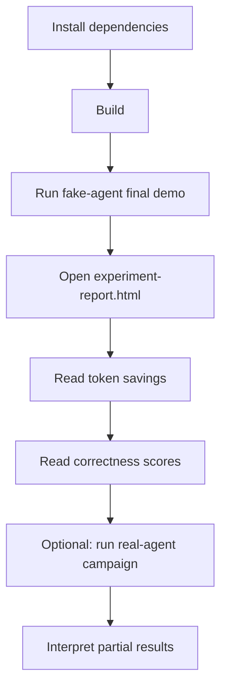

# Tutorial

This tutorial walks you through your first run of my-dev-kit-lab, from installation to reading the experiment report.



---

## Step 1: Install dependencies

```bash
npm install
```

This installs all Node.js dependencies. No external CLIs are required for the fake-agent demo.

---

## Step 2: Build

```bash
npm run build
```

This compiles TypeScript sources to `dist/`. Always run this before executing lab commands.

---

## Step 3: Verify the installation

```bash
npm run verify
```

This runs the full verification suite. All checks should pass before you run experiments.

---

## Step 4: Run the fake-agent final demo

```bash
npm run run-final-demo -- \
  --cases examples/token-savings-cases.json \
  --out lab-output/final-demo \
  --kit-command "node tests/fixtures/fake-my-dev-kit-cli.js" \
  --agents fake-agent \
  --complexities short \
  --no-screenshot
```

This runs the complete pipeline:
1. Controlled experiment with fake-agent (deterministic, no external CLIs)
2. Report rendering
3. Plot generation
4. Visualization demos
5. Gallery manifest and index

The fake-agent adapter returns deterministic outputs so results are reproducible on any machine.

---

## Step 5: Open the report

Open the generated HTML report in a browser:

```
lab-output/final-demo/experiment-report.html
```

The report is a self-contained HTML file. No server is required.

---

## Step 6: How to read token savings

The report shows a **token savings** value for each paired comparison between `raw-full-file` and `my-dev-kit-guided` runs.

| Value | Meaning |
|---|---|
| Positive | my-dev-kit used fewer tokens than raw-full-file |
| Negative | my-dev-kit used more tokens than raw-full-file |
| N/A | Token totals were not available for one or both runs |

**Important notes:**
- In fake-agent runs, token counts are estimated using `Math.ceil(characterCount / 4)`. These are context-size estimates, not provider billing totals.
- Claude does not expose token totals; token savings comparisons are unavailable for Claude runs.
- Codex may expose token totals but can produce timeouts or invalid-output runs.
- Small projects may show negative token savings because raw-full-file is cheaper when the entire project fits easily in context. Larger, more localized tasks are where my-dev-kit is expected to become more useful.

See [docs/METRICS.md](docs/METRICS.md) for full metric definitions.

---

## Step 7: How to read correctness scores

The report shows a **correctness score** for each run. Correctness is scored deterministically against the benchmark answer key — it is not semantic LLM judging.

Each answer key defines:
- **Expected files** — which source files the agent should reference
- **Expected symbols** — which functions or classes the agent should identify
- **Expected facts** — specific facts the agent's response should contain
- **Minimum correct facts** — the threshold for a passing score

A run passes if it meets or exceeds the minimum correct facts threshold.

---

## Step 8: Run a real-agent campaign (optional)

Real-agent campaigns require a local Codex or Claude CLI and available usage capacity.

**Check CLI availability:**
```bash
codex --version
claude --version
```

**Run a pilot campaign:**
```bash
npm run run-controlled-experiment -- \
  --cases examples/real-agent-campaign-cases.json \
  --agents codex,claude \
  --strategies raw-full-file,my-dev-kit-guided \
  --complexities short \
  --max-runs 4 \
  --out lab-output/real-agent-campaign-pilot \
  --include-real-agents \
  --continue-on-failure \
  --timeout-ms 180000
```

**Render the report:**
```bash
npm run render-experiment-report -- \
  --experiment lab-output/real-agent-campaign-pilot \
  --out lab-output/real-agent-report \
  --no-screenshot
```

---

## Step 9: Interpreting partial real-agent results

Real-agent runs can produce four outcome types:

| Outcome | Meaning |
|---|---|
| `completed` | The agent returned a valid response |
| `timeout` | The run exceeded the timeout limit |
| `invalid-output` | The agent returned output that could not be parsed |
| `limit-reached` | The agent hit a usage or session limit |

The report shows warnings for runs with missing token totals or non-completed outcomes. Partial results are still useful for understanding which runs completed and what correctness scores were achieved on completed runs.

**Do not interpret partial real-agent results as proof of token savings.** The current baseline establishes the experiment infrastructure. Stronger evidence requires future experiment types such as warm-index reuse, incremental-change, and context-window scaling. See [docs/ROADMAP.md](docs/ROADMAP.md).

---

## Benchmark projects used in this tutorial

| Project | Size | Languages |
|---|---|---|
| `todo-ts` | small | TypeScript |
| `todo-js` | small | JavaScript |
| `todo-python` | small | Python |
| `todo-mixed-ts-py` | small | TypeScript + Python |
| `task-workflow-medium-ts` | medium | TypeScript |
| `task-analytics-large-mixed` | large | TypeScript + Python |

The small Todo projects are used in the fake-agent demo. The medium and large projects are used in real-agent campaigns.

---

## Where outputs are written

| Artifact | Location |
|---|---|
| Experiment summary | `lab-output/<out>/experiment-summary.json` |
| All runs | `lab-output/<out>/experiment-runs.json` |
| Strategy comparisons | `lab-output/<out>/experiment-comparisons.json` |
| HTML report | `lab-output/<out>/experiment-report.html` |
| SVG charts | `lab-output/<out>/charts/*.svg` |
| Gallery manifest | `lab-output/<out>/gallery-manifest.json` |
| Gallery index | `lab-output/<out>/gallery-index.html` |

---

## Next steps

- Discover the current plugin with `npm run experiment:list`
- Inspect it with `npm run experiment:describe -- --experiment context-strategy-comparison`
- Run it against a local project with `npm run experiment:run -- --experiment context-strategy-comparison --target <path>`
- Run automated self-validation with `npm run security:validate`, or add `-- --target <path>` for another local project
- Read [docs/METRICS.md](docs/METRICS.md) for full metric definitions
- Read [docs/WORKFLOWS.md](docs/WORKFLOWS.md) for detailed workflow diagrams
- Read [docs/COMMANDS.md](docs/COMMANDS.md) for all command options
- Read [docs/ROADMAP.md](docs/ROADMAP.md) to understand where the project is heading
