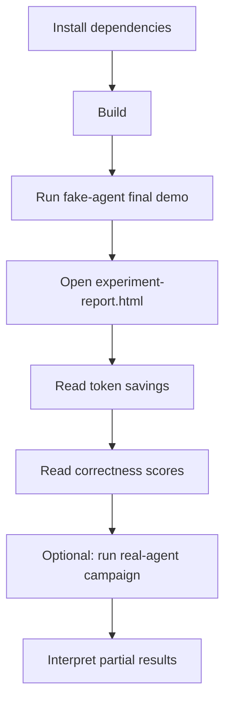

# Tutorial

This tutorial walks you through your first run of my-dev-kit-lab, from installation to reading the experiment report.

Prerequisites:

- Node.js and npm compatible with the package's `engines` requirement
- A local clone of this repository
- Permission to write beneath `lab-output/`

The deterministic fake-agent path does not require Codex, Claude, Graphviz, or network-backed security tools.


```mermaid
flowchart TD
  A[Install dependencies] --> B[Build]
  B --> C[Run fake-agent final demo]
  C --> D[Open experiment-report.html]
  D --> E[Read token savings]
  E --> F[Read correctness scores]
  F --> G[Optional: run real-agent campaign]
  G --> H[Interpret partial results]
```

---

## Step 1: Install dependencies

```bash
npm install
```

This installs all Node.js dependencies. No external CLIs are required for the fake-agent demo.

---

## Step 2: Build

```bash
npm run build
```

This compiles TypeScript sources to `dist/`. Always run this before executing lab commands.

---

## Declarative browser tutorial

The repository includes a generic deterministic tutorial example under `examples/tutorial-browser/`. It contains the scenario and reusable local application resources; the target contract is a separate trusted contract that supplies the disposable-target preparation command, loopback server process, readiness URL, and matching target ID.

Tutorial validation does not require a browser. Tutorial execution requires the exact package Playwright runtime (Playwright 1.60.0) and a compatible local Chromium binary. Install that binary separately when needed; package installation and `tutorial run` never download it automatically.

```bash
node dist/scripts/cli.js tutorial validate --scenario examples/tutorial-browser/scenario.json
node dist/scripts/cli.js tutorial validate --scenario <scenario> --target-contract <target-contract> --json
my-dev-kit-lab tutorial run --scenario <scenario> --target-contract <target-contract> --out lab-output/tutorial --json
```

Use a `TutorialTargetContractV1` with `schemaVersion: "1.0.0"`, the example's `lab-browser-fixture` ID, an executable-plus-args `prepare` command, a loopback HTTP-ready server process, and an application URL on that same loopback port. Both the checkout scripts and the installed CLI (`my-dev-kit-lab tutorial run`) fully support this workflow. The packed-package verifier (`npm run verify:packed-package`) exercises the exact packaged example from a clean installed tarball without modifying the installed source.

After a successful run, inspect the JSON result and the run root. The canonical outputs are `artifacts/tutorial.webm`, `screenshots/<screenshot-id>.png`, `artifacts/tutorial.srt`, `artifacts/tutorial.vtt`, `artifacts/tutorial.md`, and `artifacts/tutorial-manifest.json`; the manifest records step assertions, artifact statuses, warnings, and cleanup errors. Treat the video as a reviewable recording and the assertions/manifest as runtime evidence.

For default output, omit `--out` and the run is created under `<home>/.my-dev-kit-lab/tutorials/<scenario-id>/<run-id>/`; use global `--workspace <path>` before `tutorial run` to select another workspace. An explicit absolute `--out` is used exactly as supplied, while a relative one resolves from the invocation directory.

### Action vocabulary and pointer gestures

Declarative tutorials support an exact ten-action vocabulary under `TutorialScenarioV1`:

- `goto`: navigate to a relative application path.
- `click`: click an element directly through Playwright locator `click()`.
- `fill`: fill an input element with text.
- `press`: press a keyboard key on an element.
- `hover`: hover the pointer over an element.
- `drag`: drag-and-drop between two distinct DOM elements.
- `select-option`: select one native HTML `<select>` option by its HTML value.
- `wait-for`: wait for an element state or assertion.
- `pointer-click`: positional click at a normalized point inside one located interaction surface.
- `pointer-drag`: positional drag across two normalized points inside one located interaction surface.

#### Positional pointer actions: `pointer-click` and `pointer-drag`

While `click` targets an element through Playwright's locator center and `drag` moves one element to another, graphical editors (such as SVG drawing surfaces, HTML canvases, timeline range selectors, and map views) require deliberate coordinates inside a single interaction surface.

Both pointer actions are anchored to a single canonical `locator`. Coordinates use normalized fractions relative to that located element's bounding box:

- `coordinateSpace`: required, and must be `"fraction"`.
- Coordinates `x` and `y` are normalized fractions between `0` and `1` inclusive (`0 <= x <= 1`, `0 <= y <= 1`), representing top-left `(0, 0)` to bottom-right `(1, 1)`. Unanchored page coordinates, screen coordinates, and element-pixel mode do not exist.
- `pointer-drag` requires distinct endpoints: `from` and `to` cannot have identical coordinates; zero-length pointer drags are rejected during schema validation.

##### `pointer-click` example

```json
{
  "type": "pointer-click",
  "locator": { "kind": "test-id", "testId": "pointer-surface" },
  "position": { "x": 0.25, "y": 0.25 },
  "coordinateSpace": "fraction",
  "timeoutMs": 5000
}
```

Execution uses real Playwright mouse input: `mouse.move(resolvedX, resolvedY)`, `mouse.down()`, and `mouse.up()`. Synthetic cursor presentation shows visual click feedback at the resolved coordinates.

##### `pointer-drag` example

```json
{
  "type": "pointer-drag",
  "locator": { "kind": "test-id", "testId": "pointer-surface" },
  "from": { "x": 0.2, "y": 0.25 },
  "to": { "x": 0.8, "y": 0.75 },
  "coordinateSpace": "fraction",
  "timeoutMs": 5000
}
```

Execution uses real Playwright mouse input in a deterministic 4-call sequence:
1. `mouse.move(startX, startY)`
2. `mouse.down()`
3. `mouse.move(endX, endY, { steps: 8 })`
4. `mouse.up()`

The move step count is fixed to `8` (`POINTER_DRAG_MOVE_STEPS = 8`) to generate realistic intermediate `pointermove` events across the interaction surface. If an intermediate movement fails, `mouse.up()` cleanup is guaranteed before error propagation.

#### Distinguishing `drag` from `pointer-drag`

- **`drag` (element-to-element):** requires separate `source` and `target` locators. Used when dragging an item from a list to a dropzone or between two distinct DOM elements (`source.dragTo(target)`).
- **`pointer-drag` (within one surface):** requires a single `locator` interaction surface and normalized `from` and `to` fraction coordinates. Used for drawing shapes, selection boxes, or gestures inside one element.

#### Distinguishing `click` from `pointer-click`

- **`click`:** delegates directly to Playwright `locator.click()`.
- **`pointer-click`:** targets an exact normalized fraction offset within one located element using `page.mouse`.

#### Native select action: `select-option`

Use `select-option` when the intent is choosing one option in a native HTML `<select>`. Identify the option by its stable HTML value, and target the element with any existing `TutorialLocatorV1`. A `role=combobox` locator plus the control's accessible name is the recommended form, because it keeps the scenario tied to the accessible contract rather than to markup details:

```json
{
  "type": "select-option",
  "locator": {
    "kind": "role",
    "role": "combobox",
    "name": "Operation"
  },
  "value": "preserve"
}
```

Behavior and boundaries:

- The runtime resolves the locator through the canonical resolver and calls Playwright `Locator.selectOption({ value })` with the existing tutorial timeout.
- The action passes only when the browser reports exactly the requested single selected value.
- There is no `ArrowDown`/`Enter` emulation and no click or keyboard fallback. Expressing selection as a keystroke count is exactly the platform-sensitive pattern this action replaces.
- Value identity only: label selection, index selection, and multi-select arrays are not supported in v0.4.9.
- The synthetic cursor moves to the select element before execution. The native popup menu is drawn by the operating system, so traversal through option rows is deliberately not simulated and no click ripple is fabricated.

#### Distinguishing `press` from `select-option`

- **`press`:** keyboard intent. It sends a real keystroke to an element and remains unchanged.
- **`select-option`:** semantic select-value intent. It states which option value should end up selected, and lets Playwright choose how.

#### Security boundaries

Tutorial scenarios remain strictly declarative data contracts:
- No arbitrary JavaScript or `page.evaluate` callbacks.
- No generic DOM event dispatch (`dispatch-event`).
- No shell actions or subprocess executions in scenario steps.
- No unanchored page-wide or screen-wide coordinates.
- No touch/pen emulation or custom mouse buttons (left button only).

---

## Step 3: Verify the installation

```bash
npm test
npm run verify
```

`npm test` runs the canonical Vitest suite. `npm run verify` runs the non-test verification chain (build plus benchmark-fixture verification). Both should pass before you run experiments.

---

## Step 4: Run the fake-agent final demo

```bash
npm run run-final-demo -- \
  --cases examples/token-savings-cases.json \
  --out lab-output/final-demo \
  --kit-command "node tests/fixtures/fake-my-dev-kit-cli.js" \
  --agents fake-agent \
  --complexities short \
  --no-screenshot
```

This runs the complete pipeline:

1. Controlled experiment with fake-agent (deterministic, no external CLIs)
2. Report rendering
3. Plot generation
4. Visualization demos
5. Gallery manifest and index

The fake-agent adapter returns deterministic outputs so results are reproducible on any machine.

---

## Step 5: Open the report

Open the generated HTML report in a browser:

```
lab-output/final-demo/experiment-report.html
```

The report is a self-contained HTML file. No server is required.

The first run is complete when this file opens and shows the project profile, benchmark cases, paired strategy comparisons, correctness scores, and metric caveats.

---

## Step 6: How to read token savings

The report shows a **token savings** value for each paired comparison between `raw-full-file` and `my-dev-kit-guided` runs.

| Value | Meaning |
|---|---|
| Positive | my-dev-kit used fewer tokens than raw-full-file |
| Negative | my-dev-kit used more tokens than raw-full-file |
| N/A | Token totals were not available for one or both runs |

**Important notes:**
- In fake-agent runs, token counts are estimated using `Math.ceil(characterCount / 4)`. These are context-size estimates, not provider billing totals.
- Claude does not expose token totals; token savings comparisons are unavailable for Claude runs.
- Codex may expose token totals but can produce timeouts or invalid-output runs.
- Small projects may show negative token savings because raw-full-file is cheaper when the entire project fits easily in context. Larger, more localized tasks are where my-dev-kit is expected to become more useful.

See [METRICS.md](METRICS.md) for full metric definitions.

---

## Step 7: How to read correctness scores

The report shows a **correctness score** for each run. Correctness is scored deterministically against the benchmark answer key — it is not semantic LLM judging.

Each answer key defines:
- **Expected files** — which source files the agent should reference
- **Expected symbols** — which functions or classes the agent should identify
- **Expected facts** — specific facts the agent's response should contain
- **Minimum correct facts** — the threshold for a passing score

A run passes if it meets or exceeds the minimum correct facts threshold.

---

## Step 8: Run a real-agent campaign (optional)

Real-agent campaigns require a local Codex or Claude CLI and available usage capacity.

**Check CLI availability:**
```bash
codex --version
claude --version
```

**Run a pilot campaign:**
```bash
npm run run-controlled-experiment -- \
  --cases examples/real-agent-campaign-cases.json \
  --agents codex,claude \
  --strategies raw-full-file,my-dev-kit-guided \
  --complexities short \
  --max-runs 4 \
  --out lab-output/real-agent-campaign-pilot \
  --include-real-agents \
  --continue-on-failure \
  --timeout-ms 180000
```

**Render the report:**
```bash
npm run render-experiment-report -- \
  --experiment lab-output/real-agent-campaign-pilot \
  --out lab-output/real-agent-report \
  --no-screenshot
```

---

## Step 9: Interpreting partial real-agent results

Real-agent runs can produce four outcome types:

| Outcome | Meaning |
|---|---|
| `completed` | The agent returned a valid response |
| `timeout` | The run exceeded the timeout limit |
| `invalid-output` | The agent returned output that could not be parsed |
| `limit-reached` | The agent hit a usage or session limit |

The report shows warnings for runs with missing token totals or non-completed outcomes. Partial results are still useful for understanding which runs completed and what correctness scores were achieved on completed runs.

**Do not interpret partial real-agent results as proof of token savings.** The current implementation establishes the experiment infrastructure. The released v0.5.0 `warm-index-reuse` plugin adds fake-agent evidence about amortizing one index across repeated tasks, and the released v0.5.1 expanded benchmark corpus (`benchmarks/contracts/warm-index-benchmark-cases.json`, six tasks per benchmark project) provides deterministic evidence as task count grows. Stronger evidence still requires the planned real-agent warm-index campaigns (v0.5.2), attention to provider limitations, and future experiment types such as index freshness, incremental-change, and context-window scaling. See [ROADMAP.md](ROADMAP.md).

---

## Benchmark projects used in this tutorial

| Project | Size | Languages |
|---|---|---|
| `todo-ts` | small | TypeScript |
| `todo-js` | small | JavaScript |
| `todo-python` | small | Python |
| `todo-mixed-ts-py` | small | TypeScript + Python |
| `task-workflow-medium-ts` | medium | TypeScript |
| `task-analytics-large-mixed` | large | TypeScript + Python |

The small Todo projects are used in the fake-agent demo. The medium and large projects are used in real-agent campaigns.

---

## Where outputs are written

| Artifact | Location |
|---|---|
| Experiment summary | `lab-output/<out>/experiment-summary.json` |
| All runs | `lab-output/<out>/experiment-runs.json` |
| Strategy comparisons | `lab-output/<out>/experiment-comparisons.json` |
| HTML report | `lab-output/<out>/experiment-report.html` |
| SVG charts | `lab-output/<out>/charts/*.svg` |
| Gallery manifest | `lab-output/<out>/gallery-manifest.json` |
| Gallery index | `lab-output/<out>/gallery-index.html` |

---

## Troubleshooting

- **Build artifacts are missing:** run `npm run build` again and resolve the first TypeScript error.
- **The fake my-dev-kit command cannot be found:** run the command from the repository root and confirm `tests/fixtures/fake-my-dev-kit-cli.js` exists.
- **An output directory contains partial artifacts:** inspect the first failing stage, keep the partial files for diagnosis, then rerun with a new `--out` path if you need a clean comparison.
- **A real agent is unavailable or reaches a limit:** verify the local CLI independently. Keep the resulting structured partial outcome; do not interpret it as a completed comparison.
- **Token savings show `N/A`:** one or both paired runs did not expose total tokens. This is unavailable data, not zero savings.

---

## Next steps

- Discover the registered plugins with `npm run experiment:list`
- Inspect one with `npm run experiment:describe -- --experiment context-strategy-comparison`
- Run it against a local project with `npm run experiment:run -- --experiment context-strategy-comparison --target <path>`
- Try the warm-index reuse plugin (v0.5.0), which reuses one my-dev-kit index across several tasks per benchmark project; see [WORKFLOWS.md](WORKFLOWS.md#warm-index-reuse-experiment) for the procedure
- Run automated self-validation with `npm run security:validate`, or add `-- --target <path>` for another local project
- Read [METRICS.md](METRICS.md) for full metric definitions
- Read [WORKFLOWS.md](WORKFLOWS.md) for detailed workflow diagrams
- Read [COMMANDS.md](COMMANDS.md) for all command options
- Read [ROADMAP.md](ROADMAP.md) to understand where the project is heading
