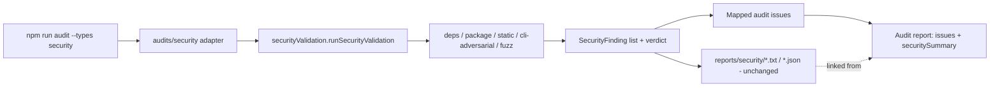
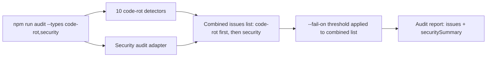

# Workflows

## Current workflow families

The repository supports experiment campaigns, generic audits, automated security validation, Android validation, opt-in closed Gradle operations, opt-in external tools/network evidence, implementation verification, documentation reconciliation, pre-release readiness, and release publication. Android defaults remain static and zero-process. Documentation reconciliation follows `DOCUMENTATION_PRESERVATION_POLICY.md` and must preserve future plans and release history.

This document separates implementation workflows, documentation reconciliation, pre-release readiness, release preparation, and future planned workflows. The current published baseline is `v0.4.1` (package metadata `0.4.1`); the v0.3.x audit history remains published and the v0.4.x releases use the existing command families.

## Workflow 1: Fake-agent final demo

Use this workflow to validate the full experiment pipeline locally without external agent CLIs.

```bash
npm run build
npm run run-final-demo -- --cases examples/token-savings-cases.json --out lab-output/final-demo --kit-command "node tests/fixtures/fake-my-dev-kit-cli.js" --agents fake-agent --complexities short --no-screenshot
```

Outputs:

- experiment summary artifacts
- HTML/JSON report
- plots
- visualization demo artifacts
- gallery artifacts

## Workflow 2: Context-strategy experiment run

Use the implemented `context-strategy-comparison` plugin to compare `raw-full-file` and `my-dev-kit-guided`.

```bash
npm run experiment:run -- --experiment context-strategy-comparison --target /path/to/local/project --agents fake-agent --complexities short --no-screenshot
```

Current behavior:

- omitting `--target` uses self mode
- explicit targets are inspected without modifying target files

## Workflow 3: Real-agent campaign

Use this workflow for Codex or Claude runs when local CLIs are configured.

```bash
npm run run-controlled-experiment -- --cases examples/real-agent-campaign-cases.json --agents codex,claude --strategies raw-full-file,my-dev-kit-guided --complexities medium,multi-step --out lab-output/real-agent-campaign --include-real-agents --continue-on-failure --timeout-ms 240000
```

Current behavior:

- partial outcomes are preserved
- missing token totals and timeouts are reported explicitly

## Workflow 4: Report, plots, and gallery

Use this workflow to render outputs from existing experiment artifacts.

```bash
npm run render-experiment-report -- --experiment lab-output/controlled-experiment-fake --out lab-output/experiment-report-fake --no-screenshot
npm run generate-experiment-plots -- --experiment lab-output/controlled-experiment-fake --out lab-output/experiment-plots
npm run build-gallery -- --report lab-output/experiment-report-fake --plots lab-output/experiment-plots --visualizations lab-output/visualization-demos --out lab-output/gallery
```

## Workflow 5: Automated security validation

Use this workflow for the current implemented `security:validate` path.

```bash
npm run security:validate
```

Targeted example:

```powershell
npm run security:validate -- --target "Z:\Users\newuser\Projects\my-dev-kit-v1"
```

Current behavior:

- optional tools are skipped, not treated as passed
- target files are not modified by default
- this is automated validation, not manual pentest

## Workflow 6: Code-rot audit

Use this workflow for the current implemented code-rot audit path. The `v0.3.0` baseline added the generic audit framework and code-rot detectors; `v0.3.1` added language-aware TypeScript/JavaScript source facts and source-facts-aware candidate evidence; the `v0.3.2` baseline added a Python analyzer and Python-aware candidate evidence to the same detectors, without adding command flags. The `v0.3.3` implementation extended the same workflow to Java/Kotlin using static source-facts analyzers and JVM metadata, still without adding command flags. The published `v0.3.4` historical work hardens the same workflow with mixed-language, report-determinism, cross-platform/path, and CRLF/LF stability coverage only.

```bash
npm run audit
```

Targeted example:

```powershell
npm run audit -- --target "Z:\Users\newuser\Projects\my-dev-kit-v1" --types code-rot --fail-on none
```

Current behavior:

- `code-rot` runs today (this workflow); `security` runs via Workflow 6a below
- audit is independent from `security:validate`
- audit findings are heuristic candidates and do not auto-fix anything
- source-facts evidence (TypeScript/JavaScript, Python, Java, and Kotlin) is conservative static-analysis evidence, not proof of dead code, semantic duplicate implementation, complete test coverage, full module resolution, runtime reachability, or language-specific semantic correctness
- for Java/Kotlin targets, the workflow reads files and static Gradle/Maven/source-set metadata only; it does not execute Gradle, Maven, compilers, Android tooling, or target tests

Generated report location: `reports/audits/code-rot/code-rot-audit.txt` / `.json` (or `--out <path>` when supplied).

## Workflow 6a: Security-validation audit adapter

Use this workflow for the `v0.3.2` security audit type. This adapts `security:validate`'s own internals into the shared audit/report surface — it does not replace `security:validate` (Workflow 5), which remains the standalone, focused security command.

```bash
npm run audit -- --types security --fail-on none
```

Targeted example:

```powershell
npm run audit -- --target "Z:\Users\newuser\Projects\my-dev-kit-v1" --types security --fail-on none
```



Current behavior:

- reuses the same default check groups `security:validate` runs with no flags; there is no `--checks`/`--profile` passthrough on `npm run audit` yet
- adds a `securitySummary` field to the audit JSON/text report (verdict, check counts, finding counts, and links to the original security report)
- skipped optional security checks are represented only in `securitySummary`'s counts — never as a passed check, never as an audit issue
- the original `reports/security/` report family is generated exactly as `security:validate` would generate it
- generated report location: audit report under `reports/audits/security/code-rot-audit.txt` / `.json`; original security report under `reports/security/<prefix>-security-validation.txt` / `.json`

## Workflow 6b: Combined code-rot and security audit

Use this workflow to run both implemented audit types together.

```bash
npm run audit -- --types code-rot,security --fail-on none
```



Current behavior:

- code-rot issues are ordered first (detector registry order), followed by mapped security issues, deterministically
- `--fail-on` applies to the combined issue list

## Workflow 7: Implementation completion

Every implementation version ends with these stages before pre-release readiness:

1. implementation-completeness review
2. documentation source-of-truth reconciliation
3. validation commands
4. pre-release readiness review

Documentation reconciliation is a required workflow stage. It is not its own semantic version.

## Workflow 8: Documentation reconciliation

Use this workflow after implementation work and before pre-release readiness.

Required actions:

1. reconcile README, roadmap, architecture, workflows, commands, and current-state docs with the checked-in implementation
2. confirm current versus planned behavior is clearly separated
3. remove stale roadmap assignments or relabel them as future/historical as appropriate
4. run the required validation commands for the repository

For the `v0.3.4` release, this specifically included documenting `v0.3.3` as the previous published baseline, `v0.3.4` as the current published baseline with package metadata `0.3.4`, and keeping Android, quality/project/all, and JVM package/environment rot deferred.

This workflow does not create a separate product version.

## Workflow 9: Pre-release readiness

Use this workflow after implementation completion and documentation reconciliation.

Typical commands:

```bash
npm run typecheck
npm run build
npm run test
npm run verify
```

If a release-specific validation workflow exists for the implemented feature set, run it here as well.

## Workflow 10: Release preparation and publication

These are separate from implementation and documentation reconciliation.

Release preparation includes:

- changelog verification
- package/release hygiene checks
- final readiness review
- version bump from the previous published baseline to the release-prepared package state

Publication includes:

- publish/tag/release steps when explicitly authorized

Do not collapse these stages into implementation work.

### Publication-order invariant

`npm publish --access public` must be the final state-changing command of the full release workflow. All GitHub repository work must finish before npm publication. Specifically, the following must all complete before `npm publish` runs:

- release docs (CHANGELOG, README, docs) committed
- release-prep and merge commits made
- the default/publication branch pushed
- required GitHub Actions passed
- the git tag in place, local and remote
- a GitHub Release in place and verified against that tag/commit
- `npm pack --dry-run` inspected
- the release-channel parity gate below verified

After `npm publish` succeeds, only read-only verification commands are allowed:

- `npm view <package>@<version> version`
- `npm view <package> versions --json`
- `gh release view <tag>`
- `git status --short`

No commits, tags, pushes, or GitHub Release creation may happen after `npm publish`. If docs need to be updated to reflect the now-published state, that update is a separate, explicit follow-up commit — it does not change the invariant that no further GitHub-side release work happens before `npm publish` in the same release.

### Release-channel parity gate

Before any future `npm publish`, verify:

- package.json target version
- package-lock.json target version (and `packages[""].version`, if applicable)
- the npm target version does not already exist on the registry
- the default/publication branch is pushed
- required GitHub Actions passed
- the local and remote git tag exist (or are created before `npm publish`, per repo policy)
- a GitHub Release is in place and points to the correct tag/commit before `npm publish`
- `npm pack --dry-run` passes with expected contents
- `git status --short` is clean

Do not treat a GitHub Release as optional when the GitHub CLI is authenticated and available — create it and verify it before publishing.

## Future workflow: Android validation

This workflow is planned for `v0.4.x`. It is not implemented today.

Planned direction:

```bash
npm run security:validate -- --target /path/to/android/project --profile android
npm run security:validate -- --target /path/to/android/project --profile android-compose
```

Planned behavior:

- validate existing Android projects
- preserve non-destructive target handling
- include report/schema stability inside each Android implementation version

## Future workflow: Android extension of the security audit adapter

The general (non-Android) security audit adapter is implemented in the published `v0.3.2` baseline (Workflow 6a). The Android-aware extension of that same adapter is implemented on the v0.4.2 feature branch and remains unreleased.

Planned direction:

```bash
npm run audit -- --target /path/to/android/project --types security --profile android
```

This extension will summarize Android validation findings through the same adapter/mapping path, without replacing `security:validate` or the general `v0.3.2` adapter.

## Future workflow: Manual pentest

Manual pentest is deferred until after `v1.0.0`.

It is a human-led workflow and is not required for automated Android security validation.
