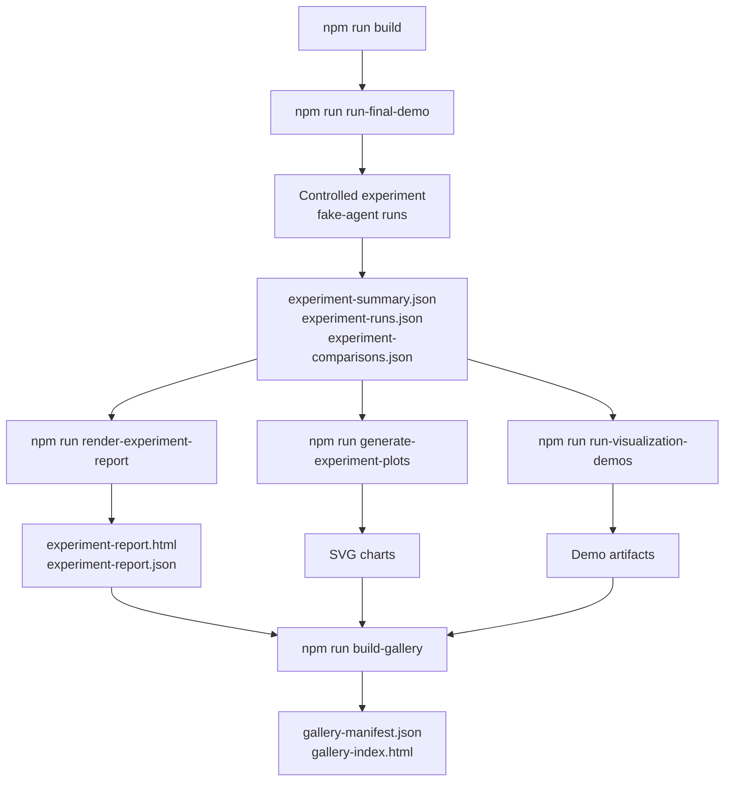
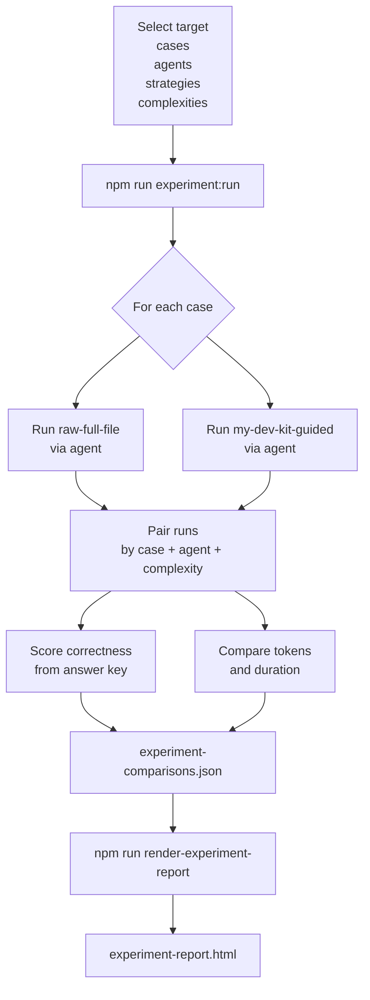
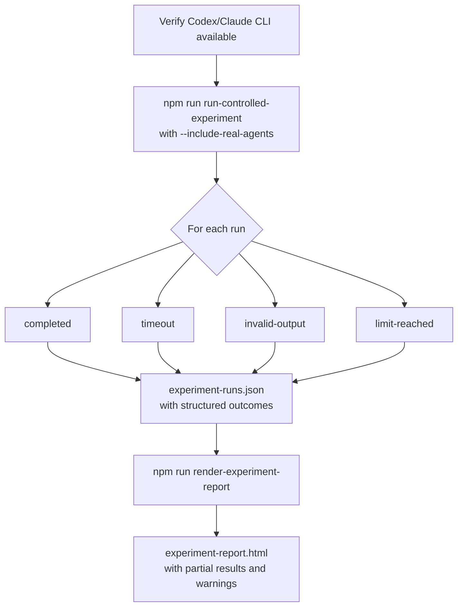
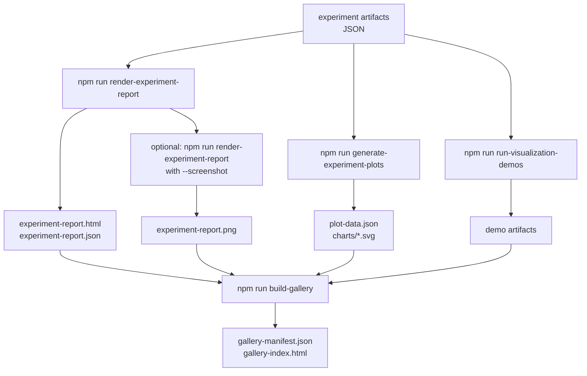
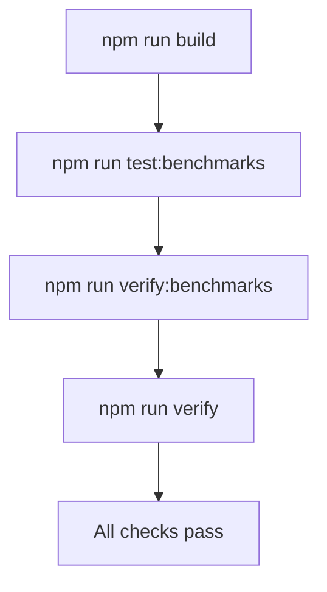
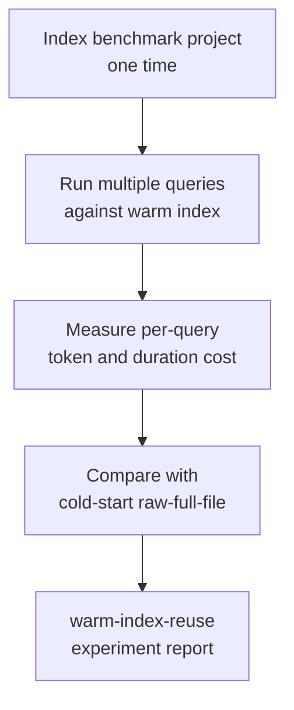
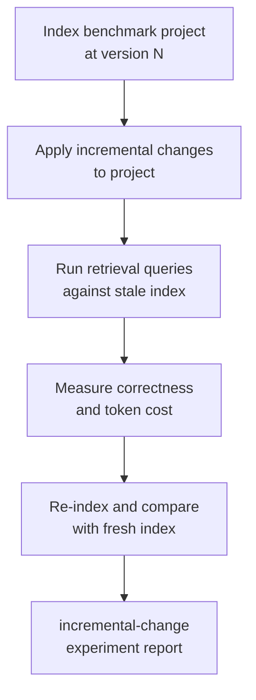

# Workflows

This document describes the main workflows available in my-dev-kit-lab. Each workflow is a sequence of commands that produces a set of artifacts. See [docs/COMMANDS.md](docs/COMMANDS.md) for full command options.

---

## Workflow 1: Fake-agent demo (deterministic, no external CLIs required)

Use this workflow to validate the full pipeline locally without Codex or Claude. The fake-agent adapter returns deterministic outputs so results are reproducible on any machine.



**Command:**
```bash
npm run run-final-demo -- \
  --cases examples/token-savings-cases.json \
  --out lab-output/final-demo \
  --kit-command "node tests/fixtures/fake-my-dev-kit-cli.js" \
  --agents fake-agent \
  --complexities short \
  --no-screenshot
```

```powershell
npm run run-final-demo -- `
  --cases examples/token-savings-cases.json `
  --out lab-output/final-demo `
  --kit-command "node tests/fixtures/fake-my-dev-kit-cli.js" `
  --agents fake-agent `
  --complexities short `
  --no-screenshot
```

- Bash and zsh examples use `\` line continuations.
- PowerShell examples use the backtick continuation shown above.
- `cmd.exe` users should run the same arguments on one line.

**Outputs:**
- `lab-output/final-demo/experiment-summary.json`
- `lab-output/final-demo/experiment-runs.json`
- `lab-output/final-demo/experiment-comparisons.json`
- `lab-output/final-demo/experiment-report.html`
- `lab-output/final-demo/charts/*.svg`
- `lab-output/final-demo/gallery-manifest.json`
- `lab-output/final-demo/gallery-index.html`

---

## Workflow 2: Context-strategy-comparison plugin

Use the implemented `context-strategy-comparison` plugin to compare `raw-full-file` and `my-dev-kit-guided`. Each case is run under both strategies with the same agent and complexity level so results are directly comparable.



**Command (fake-agent):**
```bash
npm run experiment:run -- \
  --experiment context-strategy-comparison \
  --agents fake-agent \
  --strategies raw-full-file,my-dev-kit-guided \
  --complexities short \
  --out lab-output/controlled-experiment-fake
```

Add `--target /path/to/local/project` to select an explicit local target. Omitting it uses self mode. The legacy `npm run run-controlled-experiment` command remains supported for backward compatibility.

**Then render the report:**
```bash
npm run render-experiment-report -- \
  --experiment lab-output/controlled-experiment-fake \
  --out lab-output/experiment-report-fake \
  --no-screenshot
```

**Outputs:**
- `lab-output/controlled-experiment-fake/experiment-summary.json`
- `lab-output/controlled-experiment-fake/experiment-runs.json`
- `lab-output/controlled-experiment-fake/experiment-comparisons.json`
- `lab-output/experiment-report-fake/experiment-report.html`
- `lab-output/experiment-report-fake/experiment-report.json`

---

## Workflow 3: Real-agent campaign (Codex or Claude)

Use this workflow to run a campaign with real Codex or Claude agents. This requires local CLI setup and available usage capacity. Runs that time out, produce invalid output, or hit session limits are recorded as structured outcomes.



**Command:**
```bash
npm run run-controlled-experiment -- \
  --cases examples/real-agent-campaign-cases.json \
  --agents codex,claude \
  --strategies raw-full-file,my-dev-kit-guided \
  --complexities medium,multi-step \
  --out lab-output/real-agent-campaign \
  --include-real-agents \
  --continue-on-failure \
  --timeout-ms 240000
```

**Important limitations:**
- Claude does not expose token totals; token savings comparisons are unavailable for Claude runs
- Codex may expose token totals but can produce timeouts or invalid-output runs
- Results may be partial; the report shows warnings for missing token totals or incomplete runs

---

## Workflow 4: Report, plots, and gallery

Use this workflow to render a report, generate plots, and build a gallery from existing experiment artifacts.



**Commands:**
```bash
npm run render-experiment-report -- \
  --experiment lab-output/controlled-experiment-fake \
  --out lab-output/experiment-report-fake \
  --no-screenshot

npm run generate-experiment-plots -- \
  --experiment lab-output/controlled-experiment-fake \
  --out lab-output/experiment-plots

npm run run-visualization-demos -- \
  --project benchmarks/projects/todo-ts \
  --kit-command "node tests/fixtures/fake-my-dev-kit-cli.js" \
  --out lab-output/visualization-demos

npm run build-gallery -- \
  --report lab-output/experiment-report-fake \
  --plots lab-output/experiment-plots \
  --visualizations lab-output/visualization-demos \
  --out lab-output/gallery
```

---

## Workflow 5: Benchmark validation

Use this workflow to verify that benchmark projects, contracts, profiles, and answer keys are all consistent.



**Commands:**
```bash
npm run build
npm run test:benchmarks
npm run verify:benchmarks
npm run verify
```

---

## Workflow 6: Default security validation

Use this workflow when you want the backward-compatible default validation run. With no `--profile` and no `--checks`, the command runs the classic implemented check groups: `deps`, `package`, `static`, `cli-adversarial`, and `fuzz`.

```bash
npm run security:validate
```

Read the result as follows:
- Optional tools such as CodeQL, Semgrep, or OSV-Scanner can be `skipped`; a skip is not a pass
- The default `--fail-on` threshold is `blocker`
- `not ready: security blocker remains` still exits nonzero even without a custom `--fail-on`
- The text report and JSON report are both written by default

---

## Workflow 7: Targeted project validation

Use this workflow to validate another local project without modifying that target by default.

```powershell
npm run security:validate -- --target "Z:\Users\newuser\Projects\my-dev-kit-v1"
```

Read the result as follows:
- The lab remains the tool root and the selected project becomes the target root
- Reports record target package/git metadata when available
- If the target defines `scripts.test:security`, the CLI adversarial suite runs `npm run test:security` in the target root
- Generated reports stay under `reports/security/` unless `--out` is supplied

---

## Workflow 8: Focused scoped checks

Use this workflow when you want a narrow validation pass instead of the full classic gate.

```bash
npm run security:validate -- --checks boundary,subprocess,secrets,network --format text,json
```

Read the result as follows:
- Explicit `--checks` narrows the run to the requested check groups
- The report marks this as a narrowed/scoped run
- A scoped run is useful for focused evidence gathering, but it is not the same as a full release gate

---

## Workflow 9: Profile-based validation

Use this workflow when you want profile-aware default check selection.

```bash
npm run security:validate -- --profile local-tool --format json
```

Read the result as follows:
- `node-cli-package` defaults to `deps,package,static,cli-adversarial,fuzz`
- `local-tool` defaults to `deps,static,cli-adversarial,fuzz`
- `npm-package` defaults to `deps,package,static`
- Explicit `--checks` overrides any profile default
- Profile behavior is currently limited to default-check selection and scenario applicability filtering

---

## Workflow 10: Thresholded validation

Use this workflow when you want stricter exit behavior than the default blocker-only threshold.

```bash
npm run security:validate -- --checks boundary,subprocess,secrets,network --fail-on high --format json
```

Read the result as follows:
- Default `--fail-on` is `blocker`
- `--fail-on high` exits `1` for blocker or major findings
- `--fail-on medium` also exits `1` for minor findings
- `--fail-on low` also exits `1` for informational findings
- Inconclusive runs still exit `2`

---

## Workflow 11: Reading security reports

Use this workflow after a security-validation run to interpret the generated artifacts.

Read the text report for:
- Selected profile and checks
- Whether the run was a full classic gate or narrowed scope
- Verdict reasoning summary, including release blockers, target-project blockers, and tool-framework blockers
- Attack-scenario evidence previews with redacted/sanitized content

Read the JSON report for:
- `metadata.selectedChecks`, `metadata.profile`, `metadata.failOnThreshold`, and `metadata.isFullReleaseGate`
- `attackScenarios.count` and `attackScenarios.results`
- `verdictReasonSummary`

Remember:
- Text reports are sanitized against ANSI/control-byte and report-poisoning payloads
- JSON schema guards protect the current report structure against payload-created structural injection
- These guards strengthen the automated reports; they are not a complete pentest or universal renderer-safety proof

---

## Workflow 12: Default code-rot audit

Use this workflow to run the implemented audit framework (`v0.3.0`, implemented in the current development branch; not yet released or published) against my-dev-kit-lab itself. This is not the same as `security:validate`, it is not a pre-release readiness check, and it does not auto-fix anything — it surfaces heuristic, conservative candidate findings for review.

```bash
npm run audit
```

Read the result as follows:
- Default `--types` is `code-rot` (the only implemented audit type)
- Default `--fail-on` is `blocker`
- Default `--format` is `text,json`
- Reports are written under `reports/audits/code-rot/` by default

---

## Workflow 13: External-target audit

Use this workflow to audit another local project without modifying it.

```powershell
npm run audit -- --target "Z:\Users\newuser\Projects\my-dev-kit-v1" --types code-rot --fail-on none
```

Read the result as follows:
- The lab remains the tool root; the selected project becomes the audit target
- Target resolution and the detector runner do not write or delete files inside the target root
- Generated reports stay under the tool root's `reports/audits/` unless `--out` is supplied

---

## Workflow 14: Scoped and format-focused audit runs

Use these variants for narrower or format-specific audit passes.

```bash
# Scoped include areas
npm run audit -- --types code-rot --include docs,tests,package,architecture,cli --format text,json --fail-on none

# Non-blocking investigation (never exits nonzero on findings)
npm run audit -- --fail-on none

# Text-only report
npm run audit -- --format text --fail-on none

# JSON-only report
npm run audit -- --format json --fail-on none

# Stricter gating: exit 1 if any high-or-worse issue is found
npm run audit -- --fail-on high
```

Read the result as follows:
- `--include` narrows which project areas detectors consider; it does not change which detectors are registered
- `--fail-on none` is useful for investigation without blocking automation
- `--fail-on blocker|high|medium|low` progressively tightens the exit-1 threshold

---

## Workflow 15: Reading audit reports

Use this workflow after an audit run to interpret the generated artifacts.

Read the text report and console summary for:
- Issue counts by severity (`blocker`, `high`, `medium`, `low`, `info`)
- Skipped detectors and detector errors, if any
- The final verdict label and exit reason

Read the JSON report (`reports/audits/code-rot/code-rot-audit.json`) for the full 13-field schema: `schemaVersion` (currently `"1.0"`), `metadata` (including `auditType` and `auditTypes`), `target`, `config`, `summary`, `inventory`, `sourceOfTruth`, `detectors`, `issues`, `skippedDetectors`, `detectorErrors`, `recommendations`, and `exit`.

Interpreting findings:
- Findings are heuristic candidates, not proof of a defect — each issue carries a `confidence` and `falsePositiveRisk` label
- A skipped detector is not a pass; check `skippedDetectors` for the reason
- A detector error does not stop the whole run; other detectors still execute, and the error is reported in `detectorErrors`

Boundaries — the audit workflow is **not**:
- a pre-release readiness check
- the same as `npm run security:validate` (they are independent tools; audit never invokes security:validate)
- a manual pentest
- an auto-fix tool

---

## Future workflow: Warm-index reuse experiment

This workflow is not yet implemented. It will measure the amortized cost of my-dev-kit indexing when the index is reused across multiple queries.



---

## Future workflow: Incremental-change experiment

This workflow is not yet implemented. It will measure how well a partially stale index still guides retrieval after incremental code changes.


