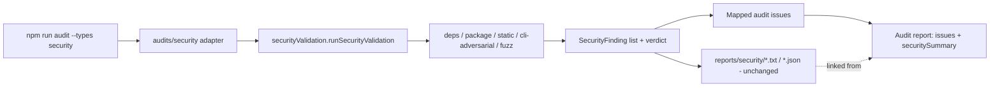
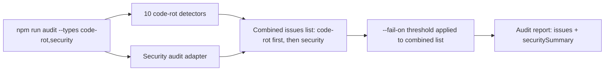

# Workflows

## Current workflow families

The repository supports experiment campaigns, evidence rendering, generic audits, automated security validation, Android validation, implementation verification, documentation reconciliation, and release operations. Each workflow below states its goal, prerequisites, steps, outputs, failure handling, and completion condition. Exact options belong in [COMMANDS.md](COMMANDS.md).

Android defaults remain static and start zero Gradle, external tool, and network processes. Release chronology belongs in [CHANGELOG.md](../CHANGELOG.md); future scope belongs in [ROADMAP.md](ROADMAP.md).

## Fake-agent final demo

**Goal:** validate the complete experiment-to-gallery pipeline without external agent CLIs.

**Prerequisites and starting state:** install dependencies and run `npm run build`. The fixture command and example cases must be present in the checkout.

**Steps:**

```bash
npm run build
npm run run-final-demo -- --cases examples/token-savings-cases.json --out lab-output/final-demo --kit-command "node tests/fixtures/fake-my-dev-kit-cli.js" --agents fake-agent --complexities short --no-screenshot
```

**Expected outputs:**

- experiment summary artifacts
- HTML/JSON report
- plots
- visualization demo artifacts
- gallery artifacts

**Failure handling:** inspect the first failing stage and its stderr; keep partial artifacts for diagnosis. Rebuild after source changes.

**Completion:** the command exits successfully and the report, plots, visualization artifacts, and gallery are present beneath `lab-output/final-demo`.

## Context-strategy experiment run

**Goal:** compare `raw-full-file` and `my-dev-kit-guided` through the implemented `context-strategy-comparison` plugin.

**Prerequisites and starting state:** build the repository and choose either self mode or an existing local target. The target must remain unchanged during the run.

**Steps:**

```bash
npm run experiment:run -- --experiment context-strategy-comparison --target /path/to/local/project --agents fake-agent --complexities short --no-screenshot
```

**Expected behavior and outputs:**

- omitting `--target` uses self mode
- explicit targets are inspected without modifying target files
- normalized plugin and legacy experiment artifacts are written beneath the selected output root

**Failure handling:** invalid plugin IDs or options fail before the run. Agent-related partial outcomes remain structured results rather than being rewritten as successful comparisons.

**Completion:** both strategies have recorded outcomes and the target remains unchanged.

## Stage-context strategy evaluation (v0.4.3, implemented on `feature/v0.4.3-stage-context-readers`; not published)

**Goal:** deterministically evaluate one of the six new stage-context strategies against explicit artifact inputs and an explicit expectation fixture, through the same `context-strategy-comparison` plugin.

**Prerequisites and starting state:** build the repository; supply explicit `v043StrategyInputs` programmatic configuration (expectations fixture path plus the artifact paths the selected strategy requires) — there is no CLI flag for these paths.

**Steps (implemented sequence):**

1. Read explicit artifact inputs (context capsule, retrieval-audit record, and/or `WorkflowInstructionPacket`) through the exact readers in `src/evaluation/upstreamArtifacts`.
2. Validate exact artifact schemas; unsupported schema majors or malformed input fail explicitly rather than being silently reinterpreted.
3. Validate the `StageContextExpectationFixtureV1` expectation fixture.
4. Execute the selected strategy and assemble its payload.
5. Collect observed evidence from the payload.
6. Match observed evidence against the expectation fixture's required/allowed/forbidden evidence.
7. Calculate evidence-centered metrics (recall, coverage, inclusion, responsibility mapping, state comparisons, context size).
8. Capture target-immutability before/after snapshots when target-immutability configuration is supplied.
9. Repeat runs (1 through 10) when a `repeatCount` greater than 1 is configured.
10. Calculate repeated-run determinism from the repeated runs.
11. Build the bounded `report.json`, `report.html`, and `report.txt` reports through the existing plugin report system.

**Expected behavior and outputs:** the target is never modified; missing upstream evidence is reported as `unavailable`, never coerced to zero; the report contains no composite score, grade, ranking, or winning strategy.

**Failure handling:** malformed artifacts or unsupported schema majors fail clearly. A detected target mutation is reported as a mutation, not auto-repaired or reset.

**Completion:** the bounded report reflects the selected strategy's execution, evaluation, and (when configured) run-assurance results. This workflow does not yet have a CLI entrypoint and has not entered the pre-release readiness, cross-platform, security, or code-rot workflow; see [ROADMAP.md](ROADMAP.md).

## Real-agent campaign

**Goal:** run matched Codex or Claude trials while preserving partial outcomes.

**Prerequisites and starting state:** configure the selected local CLIs, confirm usage capacity, build the repository, and choose a bounded case set.

**Steps:**

```bash
npm run run-controlled-experiment -- --cases examples/real-agent-campaign-cases.json --agents codex,claude --strategies raw-full-file,my-dev-kit-guided --complexities medium,multi-step --out lab-output/real-agent-campaign --include-real-agents --continue-on-failure --timeout-ms 240000
```

**Expected outputs:**

- partial outcomes are preserved
- missing token totals and timeouts are reported explicitly

**Failure handling:** use `--continue-on-failure` for campaigns where one provider failure should not discard other runs. Treat provider limits and unavailable token totals as evidence limitations, not product regressions.

**Completion:** every scheduled run has a completed or explicit partial outcome and the campaign artifacts are available for rendering.

## Report, plots, and gallery

**Goal:** render existing experiment artifacts into reports, plots, and a browsable gallery.

**Prerequisites and starting state:** complete an experiment and verify the input artifact directories shown below exist.

**Steps:**

```bash
npm run render-experiment-report -- --experiment lab-output/controlled-experiment-fake --out lab-output/experiment-report-fake --no-screenshot
npm run generate-experiment-plots -- --experiment lab-output/controlled-experiment-fake --out lab-output/experiment-plots
npm run build-gallery -- --report lab-output/experiment-report-fake --plots lab-output/experiment-plots --visualizations lab-output/visualization-demos --out lab-output/gallery
```

**Expected outputs:** JSON/HTML reports, plot data and SVG charts, a gallery manifest, and `gallery-index.html`.

**Failure handling:** correct the missing or mismatched input directory reported by the failing renderer. Do not fabricate absent artifacts.

**Completion:** open `lab-output/gallery/gallery-index.html` and confirm its relative links resolve.

## Automated security validation

**Goal:** collect standalone automated CLI/package security evidence and a structured verdict.

**Prerequisites and starting state:** build the repository; choose self mode or an existing local target. Optional scanners may be unavailable.

**Steps:**

```bash
npm run security:validate
```

Targeted example:

```powershell
npm run security:validate -- --target "Z:\Users\newuser\Projects\my-dev-kit-v1"
```

**Expected behavior and outputs:**

- optional tools are skipped, not treated as passed
- target files are not modified by default
- this is automated validation, not manual pentest

Reports are written beneath `reports/security/` unless `--out` is supplied.

**Failure handling:** treat unavailable optional tools as `skipped`, not passed. Investigate failed checks and inconclusive environments from the generated report; do not weaken thresholds to hide findings.

**Completion:** the selected checks finish, the report records every pass/failure/skip, and the target mutation evidence shows no unintended change.

## Code-rot audit

**Goal:** inspect repository-health signals with the implemented code-rot detector family.

**Prerequisites and starting state:** build the repository and choose a local target. TypeScript/JavaScript, Python, Java, and Kotlin evidence is static and conservative.

**Steps:**

```bash
npm run audit
```

Targeted example:

```powershell
npm run audit -- --target "Z:\Users\newuser\Projects\my-dev-kit-v1" --types code-rot --fail-on none
```

**Expected behavior and outputs:**

- `code-rot` runs in this workflow; `security` runs through the security-validation audit adapter below
- audit is independent from `security:validate`
- audit findings are heuristic candidates and do not auto-fix anything
- source-facts evidence (TypeScript/JavaScript, Python, Java, and Kotlin) is conservative static-analysis evidence, not proof of dead code, semantic duplicate implementation, complete test coverage, full module resolution, runtime reachability, or language-specific semantic correctness
- for Java/Kotlin targets, the workflow reads files and static Gradle/Maven/source-set metadata only; it does not execute Gradle, Maven, compilers, Android tooling, or target tests

Generated report location: `reports/audits/code-rot/code-rot-audit.txt` / `.json` (or `--out <path>` when supplied).

**Failure handling:** exit code `1` means an issue met the selected threshold; exit code `2` means invalid configuration, target resolution failure, or runtime failure. Review candidates before treating them as defects.

**Completion:** reports are written, target files remain unchanged, and every issue is interpreted as evidence rather than proof.

## Security-validation audit adapter

**Goal:** include standalone security-validation results in the shared audit report.

**Prerequisites and starting state:** use the same target requirements as standalone security validation. This adapter does not replace `security:validate`.

**Steps:**

```bash
npm run audit -- --types security --fail-on none
```

Targeted example:

```powershell
npm run audit -- --target "Z:\Users\newuser\Projects\my-dev-kit-v1" --types security --fail-on none
```



**Expected behavior and outputs:**

- reuses the same default check groups `security:validate` runs with no flags; there is no `--checks`/`--profile` passthrough on `npm run audit` yet
- adds a `securitySummary` field to the audit JSON/text report (verdict, check counts, finding counts, and links to the original security report)
- skipped optional security checks are represented only in `securitySummary`'s counts — never as a passed check, never as an audit issue
- the original `reports/security/` report family is generated exactly as `security:validate` would generate it
- generated report location: audit report under `reports/audits/security/code-rot-audit.txt` / `.json`; original security report under `reports/security/<prefix>-security-validation.txt` / `.json`

**Failure handling:** optional-tool skips remain summary data; they never become audit issues or passes. Use the original security report for complete evidence.

**Completion:** both report families exist, the audit report links to the security report, and mapped issues correspond only to confirmed findings.

## Combined code-rot and security audit

**Goal:** run both implemented audit types and apply one fail-on threshold to their combined issue list.

**Prerequisites and starting state:** satisfy the code-rot and security-audit prerequisites above.

**Steps:**

```bash
npm run audit -- --types code-rot,security --fail-on none
```



**Expected behavior and outputs:**

- code-rot issues are ordered first (detector registry order), followed by mapped security issues, deterministically
- `--fail-on` applies to the combined issue list

**Failure handling:** distinguish detector errors from threshold-triggering findings in the report. Preserve the standalone security report for diagnosis.

**Completion:** deterministic combined issues and the security summary are written without modifying the target.

## Implementation completion

Every implementation version ends with these stages before pre-release readiness:

1. implementation-completeness review
2. documentation source-of-truth reconciliation
3. validation commands
4. pre-release readiness review

Documentation reconciliation is a required workflow stage. It is not its own semantic version.

## Documentation reconciliation

Use this workflow after implementation work and before pre-release readiness.

Required actions:

1. reconcile README, roadmap, architecture, workflows, commands, and current-state docs with the checked-in implementation
2. confirm current versus planned behavior is clearly separated
3. remove stale roadmap assignments or relabel them as future/historical as appropriate
4. run the required validation commands for the repository

This workflow does not create a separate product version.

## Pre-release readiness

Use this workflow after implementation completion and documentation reconciliation.

Typical commands:

```bash
npm run typecheck
npm run build
npm run test
npm run verify
npm run docs:check
```

Run safe command discovery/help smokes for changed command families and any release-specific fixture checks. Android releases must preserve project detection, manifest and advanced-security checks, report-schema stability, non-destructive target evidence, and optional-tool skip handling. Required CI must pass on the repository's configured operating-system matrix before publication work begins.

**Completion:** the worktree is clean, package/release metadata is internally consistent, required checks pass, and no generated report or local artifact is staged.

## Release preparation and publication

These are separate from implementation and documentation reconciliation.

Release preparation includes:

- changelog verification
- package/release hygiene checks
- final readiness review
- version change from the previous release to the target release version

Publication includes:

- publish/tag/release steps when explicitly authorized

Do not collapse these stages into implementation work.

### Publication-order invariant

`npm publish --access public` must be the final state-changing command of the full release workflow. All GitHub repository work must finish before npm publication. Specifically, the following must all complete before `npm publish` runs:

- release docs (CHANGELOG, README, docs) committed
- release-prep and merge commits made
- the default/publication branch pushed
- required GitHub Actions passed
- the git tag in place, local and remote
- a GitHub Release in place and verified against that tag/commit
- `npm pack --dry-run` inspected
- the release-channel parity gate below verified

After `npm publish` succeeds, only read-only verification commands are allowed:

- `npm view <package>@<version> version`
- `npm view <package> versions --json`
- `gh release view <tag>`
- `git status --short`

No commits, tags, pushes, or GitHub Release creation may happen after `npm publish`. If docs need to be updated to reflect the now-published state, that update is a separate, explicit follow-up commit — it does not change the invariant that no further GitHub-side release work happens before `npm publish` in the same release.

### Release-channel parity gate

Before any future `npm publish`, verify:

- package.json target version
- package-lock.json target version (and `packages[""].version`, if applicable)
- the npm target version does not already exist on the registry
- the default/publication branch is pushed
- required GitHub Actions passed
- the local and remote git tag exist (or are created before `npm publish`, per repo policy)
- a GitHub Release is in place and points to the correct tag/commit before `npm publish`
- `npm pack --dry-run` passes with expected contents
- `git status --short` is clean

Do not treat a GitHub Release as optional when the GitHub CLI is authenticated and available — create it and verify it before publishing.

## Android validation

**Goal:** statically validate an existing Android project and produce security evidence.

**Prerequisites and starting state:** choose an Android project and keep all Gradle, external-tool, and network opt-ins disabled unless the review explicitly requires them.

**Steps:**

Current command:

```bash
npm run security:validate -- --target /path/to/android/project --profile android
```

**Expected behavior and outputs:**

- validate existing Android projects
- preserve non-destructive target handling
- include report/schema stability inside each Android implementation version

The default run executes nineteen checks and starts zero Gradle, external-tool, and network processes. Reports remain under the security report root.

**Failure handling:** unavailable optional tools are skipped. Report target mutations; never clean or reset the target to hide them.

**Completion:** the report records Android applicability, findings, CandidateEvidence, skips, verdict, and unchanged-target evidence.

## Android extension of the security audit adapter

**Goal:** add confirmed Android findings and bounded Android summaries to the existing security audit adapter.

**Prerequisites and starting state:** choose an Android project and include `security` in `--types`. The audit command exposes no Gradle, external-tool, or network opt-ins.

**Steps:**

Current command (published):

```bash
npm run audit -- --target /path/to/android/project --types security --android --format text,json --fail-on none
```

**Expected behavior and outputs:** confirmed Android findings use the existing mapping path; `CandidateEvidence` remains separate; the report links to the full standalone Android evidence. Omitting `--android` preserves the non-Android audit path.

**Failure handling:** Android validator failures are contained and reported without discarding already collected non-Android issues.

**Completion:** Android status, completeness, verdict, report references, mapped counts, and review-only evidence summaries appear in the audit output.

## Manual pentest

Manual pentest is deferred until after `v1.0.0`.

It is a human-led workflow and is not required for automated Android security validation.
