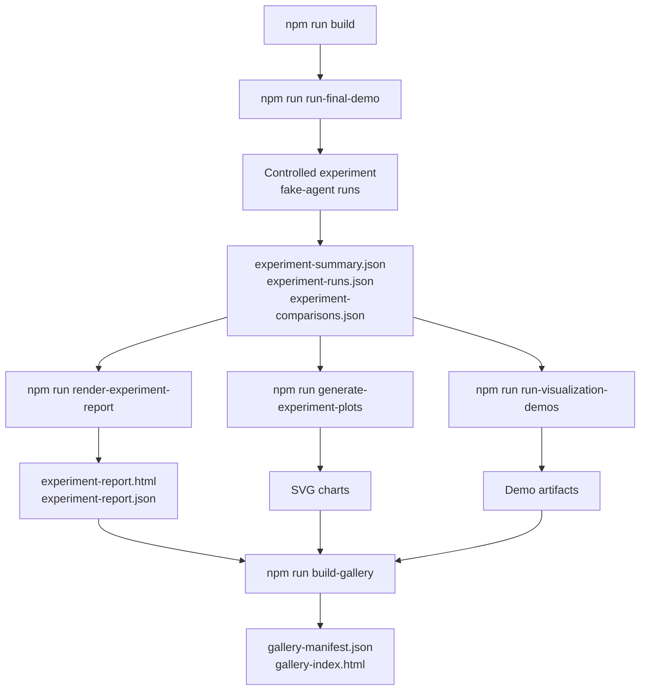
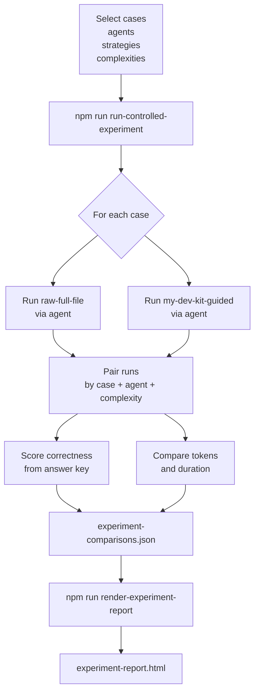
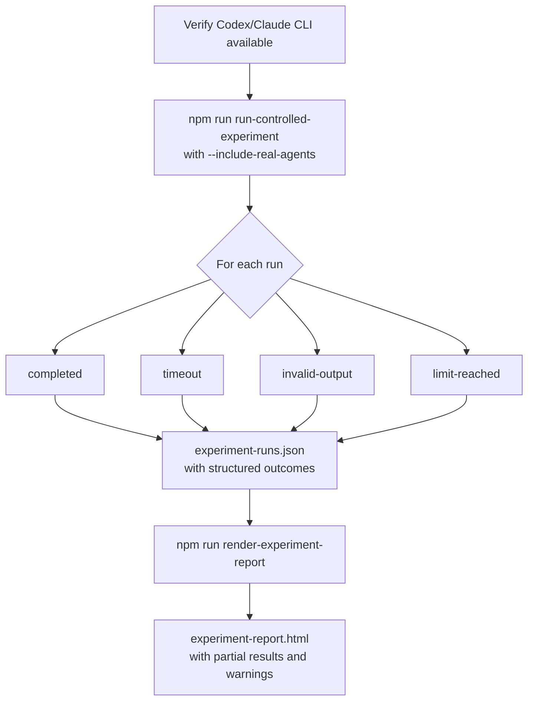
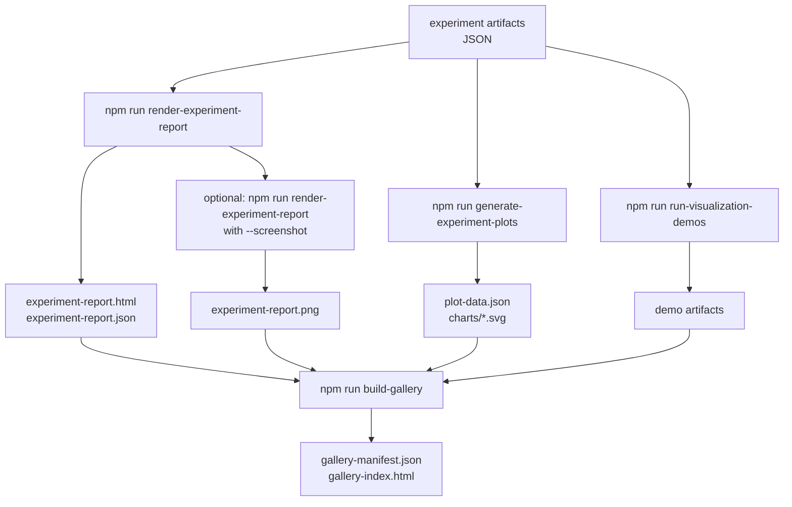
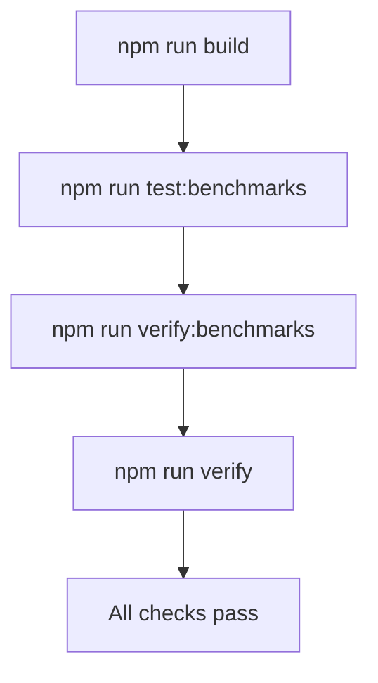
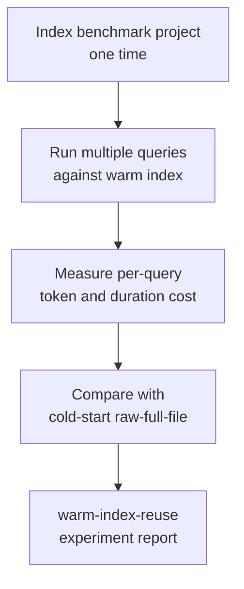
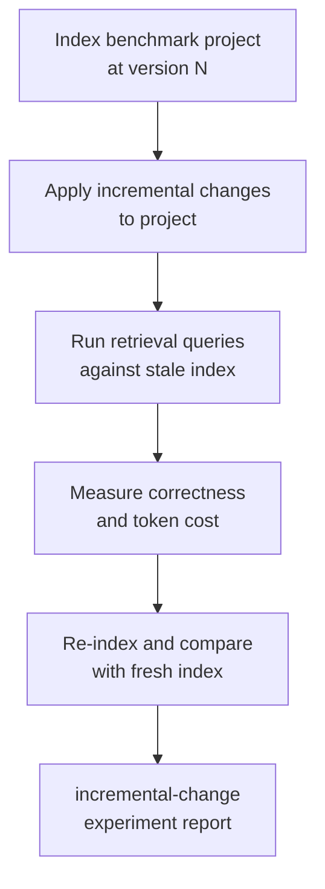

# Workflows

This document describes the main workflows available in my-dev-kit-lab. Each workflow is a sequence of commands that produces a set of artifacts. See [docs/COMMANDS.md](docs/COMMANDS.md) for full command options.

---

## Workflow 1: Fake-agent demo (deterministic, no external CLIs required)

Use this workflow to validate the full pipeline locally without Codex or Claude. The fake-agent adapter returns deterministic outputs so results are reproducible on any machine.



**Command:**
PowerShell:

```powershell
npm run run-final-demo -- `
  --cases examples/token-savings-cases.json `
  --out lab-output/final-demo `
  --kit-command "node tests/fixtures/fake-my-dev-kit-cli.js" `
  --agents fake-agent `
  --complexities short `
  --no-screenshot
```

macOS/Linux shell:

```bash
npm run run-final-demo -- \
  --cases examples/token-savings-cases.json \
  --out lab-output/final-demo \
  --kit-command "node tests/fixtures/fake-my-dev-kit-cli.js" \
  --agents fake-agent \
  --complexities short \
  --no-screenshot
```

For shell continuations, use `\` in Bash-like shells, PowerShell backticks in PowerShell, and a single line in `cmd.exe`.

**Outputs:**
- `lab-output/final-demo/experiment-summary.json`
- `lab-output/final-demo/experiment-runs.json`
- `lab-output/final-demo/experiment-comparisons.json`
- `lab-output/final-demo/experiment-report.html`
- `lab-output/final-demo/charts/*.svg`
- `lab-output/final-demo/gallery-manifest.json`
- `lab-output/final-demo/gallery-index.html`

---

## Workflow 2: Raw-vs-indexed controlled experiment

Use this workflow to run a controlled comparison between `raw-full-file` and `my-dev-kit-guided` strategies. Each case is run under both strategies with the same agent and complexity level so results are directly comparable.



**Command (fake-agent):**
```bash
npm run run-controlled-experiment -- \
  --cases examples/token-savings-cases.json \
  --agents fake-agent \
  --strategies raw-full-file,my-dev-kit-guided \
  --complexities short \
  --out lab-output/controlled-experiment-fake
```

**Then render the report:**
```bash
npm run render-experiment-report -- \
  --experiment lab-output/controlled-experiment-fake \
  --out lab-output/experiment-report-fake \
  --no-screenshot
```

**Outputs:**
- `lab-output/controlled-experiment-fake/experiment-summary.json`
- `lab-output/controlled-experiment-fake/experiment-runs.json`
- `lab-output/controlled-experiment-fake/experiment-comparisons.json`
- `lab-output/experiment-report-fake/experiment-report.html`
- `lab-output/experiment-report-fake/experiment-report.json`

---

## Workflow 3: Real-agent campaign (Codex or Claude)

Use this workflow to run a campaign with real Codex or Claude agents. This requires local CLI setup and available usage capacity. Runs that time out, produce invalid output, or hit session limits are recorded as structured outcomes.



**Command:**
```bash
npm run run-controlled-experiment -- \
  --cases examples/real-agent-campaign-cases.json \
  --agents codex,claude \
  --strategies raw-full-file,my-dev-kit-guided \
  --complexities medium,multi-step \
  --out lab-output/real-agent-campaign \
  --include-real-agents \
  --continue-on-failure \
  --timeout-ms 240000
```

**Important limitations:**
- Claude does not expose token totals; token savings comparisons are unavailable for Claude runs
- Codex may expose token totals but can produce timeouts or invalid-output runs
- Results may be partial; the report shows warnings for missing token totals or incomplete runs

---

## Workflow 4: Report, plots, and gallery

Use this workflow to render a report, generate plots, and build a gallery from existing experiment artifacts.



**Commands:**
```bash
npm run render-experiment-report -- \
  --experiment lab-output/controlled-experiment-fake \
  --out lab-output/experiment-report-fake \
  --no-screenshot

npm run generate-experiment-plots -- \
  --experiment lab-output/controlled-experiment-fake \
  --out lab-output/experiment-plots

npm run run-visualization-demos -- \
  --project benchmarks/projects/todo-ts \
  --kit-command "node tests/fixtures/fake-my-dev-kit-cli.js" \
  --out lab-output/visualization-demos

npm run build-gallery -- \
  --report lab-output/experiment-report-fake \
  --plots lab-output/experiment-plots \
  --visualizations lab-output/visualization-demos \
  --out lab-output/gallery
```

---

## Workflow 5: Benchmark validation

Use this workflow to verify that benchmark projects, contracts, profiles, and answer keys are all consistent.



**Commands:**
```bash
npm run build
npm run test:benchmarks
npm run verify:benchmarks
npm run verify
```

---

## Future workflow: Warm-index reuse experiment

This workflow is not yet implemented. It will measure the amortized cost of my-dev-kit indexing when the index is reused across multiple queries.



---

## Future workflow: Incremental-change experiment

This workflow is not yet implemented. It will measure how well a partially stale index still guides retrieval after incremental code changes.


