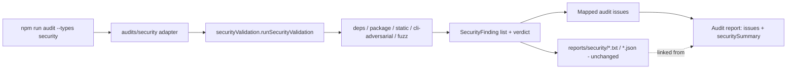
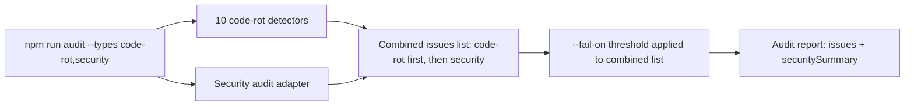

# Workflows

## Current workflow families

The repository supports experiment campaigns, evidence rendering, generic audits, automated security validation, Android validation, implementation verification, documentation reconciliation, and release operations. Cross-repository composition, including command-surface-derived handoffs not named below, is centralized in [my-dev-kit's command-surface compatibility map](https://github.com/dailephd/my-dev-kit/blob/main/docs/ECOSYSTEM_DEVELOPMENT_WORKFLOWS.md#915-command-surface-compatibility-map). Each workflow below states its goal, prerequisites, steps, outputs, failure handling, and completion condition. Exact options belong in [COMMANDS.md](COMMANDS.md).

Android defaults remain static and start zero Gradle, external tool, and network processes. Release chronology belongs in [CHANGELOG.md](../CHANGELOG.md); future scope belongs in [ROADMAP.md](ROADMAP.md).

## Installed-package workflow (v0.4.6)

This is the workflow for a user of the published package. It is separate from the contributor workflow below, which every other section in this document uses.

**Goal:** run supported my-dev-kit-lab commands against a project without cloning this repository.

**Steps:**

```
install or npx the package        (e.g. npm install -g @dailephd/my-dev-kit-lab, or npx @dailephd/my-dev-kit-lab@<version>)
  -> invoke the installed my-dev-kit-lab binary
  -> optionally pass --workspace <path> before the command to select a writable workspace (default: <home>/.my-dev-kit-lab)
  -> inspect an external target with --target <path> where the command supports it
  -> generated reports/experiment output are written under the workspace by default, never under the installed package or the target
```

See [COMMANDS.md](COMMANDS.md) for the full installed command tree and [ARCHITECTURE.md](ARCHITECTURE.md) for the `packageRoot`/`invocationCwd`/`workspaceRoot`/`resourceRoot`/`targetRoot` path model behind it.

**Failure handling:** an unrecognized top-level command or an unimplemented route (for example the low-level `security` helper commands, or `experiment list`/`describe`/`run` typos) returns a usage exit code rather than silently doing something else.

**Completion:** the invoked command exits, and (for commands with a writable output) the expected report/artifact files exist under the resolved output location (the workspace by default, or the explicit path supplied).

## Declarative tutorial generation

**Goal:** turn one validated local browser scenario into assertion-backed runtime evidence and synchronized human-facing artifacts without requiring a product-specific repository.

**Prerequisites:** install dependencies and build the checkout; use the packaged or checkout-owned generic example at `examples/tutorial-browser/`. Install the compatible Chromium browser separately when execution is desired:

```bash
npm install
npm run build
npx playwright install chromium
```

**Steps:**

1. Select or create a `TutorialScenarioV1` scenario (supporting actions such as `goto`, `click`, `fill`, `press`, `hover`, `drag`, `select-option`, `wait-for`, and locator-anchored `pointer-click`/`pointer-drag`) and a matching `TutorialTargetContractV1` target contract.
2. Validate the scenario:

   ```bash
   node dist/scripts/cli.js tutorial validate --scenario examples/tutorial-browser/scenario.json
   ```

3. Validate the scenario and target contract together:

   ```bash
   node dist/scripts/cli.js tutorial validate --scenario <scenario> --target-contract <target-contract> --json
   ```

4. Install Chromium when the local browser runtime is unavailable.
5. Run the tutorial with the installed CLI or built checkout CLI:

   ```bash
   my-dev-kit-lab tutorial run --scenario <scenario> --target-contract <target-contract> --out <run-root> --json
   ```

6. Inspect the JSON result for `status`, scenario/target identity, step results, warnings, and `cleanupErrors`.
7. Inspect `artifacts/tutorial.webm`, requested `screenshots/`, `artifacts/tutorial.srt`, `artifacts/tutorial.vtt`, `artifacts/tutorial.md`, and `artifacts/tutorial-manifest.json` beneath the run root.
8. Interpret assertions and cleanup as runtime evidence. Treat the WebM as a reviewable recording, not as proof of correctness by itself.

**Failure handling:** validation failures return usage/content errors without launching a browser. A missing Chromium runtime returns a nonzero `browser-unavailable` run with setup guidance; it does not trigger an automatic browser download. Assertion, process, target, artifact, and cleanup failures remain distinct in the result and manifest.

**Completion:** the run passes only when every executed step and required artifact succeeds, cleanup errors are empty, and the manifest records the expected scenario and target identity. Product-specific demo sites and scenarios remain owned by their product repositories; gallery consumption of tutorial manifests remains future scope.

## Contributor / source-checkout workflow

The remaining workflow sections in this document run from a cloned repository checkout with dependencies installed (`npm ci` or `npm install`). They remain the contributor/development path. The published installed CLI reaches the supported public command owners without a repository clone, while the `npm run` commands below use those same underlying command owners for contributor workflows.

## Fake-agent final demo

**Goal:** validate the complete experiment-to-gallery pipeline without external agent CLIs.

**Prerequisites and starting state:** install dependencies and run `npm run build`. The fixture command and example cases must be present in the checkout.

**Steps:**

```bash
npm run build
npm run run-final-demo -- --cases examples/token-savings-cases.json --out lab-output/final-demo --kit-command "node tests/fixtures/fake-my-dev-kit-cli.js" --agents fake-agent --complexities short --no-screenshot
```

**Expected outputs:**

- experiment summary artifacts
- HTML/JSON report
- plots
- visualization demo artifacts
- gallery artifacts

**Failure handling:** inspect the first failing stage and its stderr; keep partial artifacts for diagnosis. Rebuild after source changes.

**Completion:** the command exits successfully and the report, plots, visualization artifacts, and gallery are present beneath `lab-output/final-demo`.

## Context-strategy experiment run

**Goal:** compare `raw-full-file` and `my-dev-kit-guided` through the implemented `context-strategy-comparison` plugin.

**Prerequisites and starting state:** build the repository and choose either self mode or an existing local target. The target must remain unchanged during the run.

**Steps:**

```bash
npm run experiment:run -- --experiment context-strategy-comparison --target /path/to/local/project --agents fake-agent --complexities short --no-screenshot
```

**Expected behavior and outputs:**

- omitting `--target` uses self mode
- explicit targets are inspected without modifying target files
- normalized plugin and legacy experiment artifacts are written beneath the selected output root

**Failure handling:** invalid plugin IDs or options fail before the run. Agent-related partial outcomes remain structured results rather than being rewritten as successful comparisons.

**Completion:** both strategies have recorded outcomes and the target remains unchanged.

## Warm-index reuse experiment

Introduced in v0.5.0 and expanded in v0.5.1; see [CURRENT_STATE.md](CURRENT_STATE.md) for its lifecycle state.

The expanded benchmark corpus used below was released in v0.5.1; it reuses the v0.5.0 runtime unchanged. Selectable real-agent warm-index campaigns are available in the installed v0.5.2 CLI (see "Real-agent warm-index campaign" below).

**Goal:** measure how a one-time my-dev-kit index cost is amortized when the same prepared index is reused across several tasks, with a matched `raw-full-file` baseline for every task and deterministic fake-agent correctness and token evidence.

**Prerequisites:** install dependencies and run `npm run build`. Choose a my-dev-kit command: the default `npx @dailephd/my-dev-kit@latest`, a locally installed my-dev-kit, or the deterministic fixture `node tests/fixtures/fake-my-dev-kit-cli.js` in a source checkout. Choose a cases file with several tasks per benchmark project. The canonical multi-task corpus is the dedicated expanded benchmark suite `benchmarks/contracts/warm-index-benchmark-cases.json` released in v0.5.1: two benchmark projects, `task-workflow-medium-ts` and `task-analytics-large-mixed`, with six ordered tasks each, every task carrying an answer key, expected files and symbols, and task-locality metadata. It must be selected explicitly with `--cases`. The default `examples/token-savings-cases.json` remains a small compatibility corpus with one task per project, so it exercises index setup and one task per project rather than multi-task reuse. (`tests/fixtures/warm-index-reuse/multi-task-cases.json` is a compact developer test fixture, not the product corpus.)

**Task locality:** each corpus task is tagged `localized` (a narrow task surface in one owner), `cross-module` (the answer needs several owners or modules), or `broad-change` (a deliberately wide negative control that is not expected to fit a small localized context). Locality is benchmark metadata only; it does not change grouping, indexing, retrieval, metrics, reports, or plots, and there is no locality CLI filter.

**Starting state:** the output directory is new or empty, and any `--target` project is an existing local directory that must stay unchanged.

**Lifecycle:**

```
select cases (source order, optional --case / --benchmark-project filters)
  -> group by benchmark project (first-seen order)
  -> per project: build exactly one index (no per-task re-indexing, no retry)
  -> per task: one raw-full-file baseline + one warm retrieval against that project's index
  -> per task side with context evidence: one deterministic fake-agent evaluation
  -> metrics calculated once (amortized, cumulative, fake-agent correctness/tokens)
  -> bounded warm-index-execution.json + plugin report.json / report.txt / report.html
  -> optional: plots generate -> four warm-index SVG charts
```

**Steps:**

1. Run the experiment over the dedicated corpus. PowerShell (source checkout, deterministic fixture):

   ```powershell
   npm run experiment:run -- `
     --experiment warm-index-reuse `
     --cases benchmarks/contracts/warm-index-benchmark-cases.json `
     --kit-command "node tests/fixtures/fake-my-dev-kit-cli.js" `
     --out lab-output/warm-index-reuse
   ```

   This runs 12 tasks as two project groups: one index per project, task ordinals 1–6 in each project, one `raw-full-file` baseline and one warm retrieval per task, and deterministic fake-agent evidence for each side. Add `--benchmark-project task-workflow-medium-ts` (or `task-analytics-large-mixed`) to run one six-task project, or `--case <id>` for single tasks. The installed equivalent is `my-dev-kit-lab experiment run --experiment warm-index-reuse --cases benchmarks/contracts/warm-index-benchmark-cases.json [--benchmark-project <id>] --kit-command "<command>" --out <dir>`; the relative corpus path resolves against the installed package.

2. Generate the plots:

   ```bash
   npm run generate-experiment-plots -- --experiment lab-output/warm-index-reuse --out lab-output/warm-index-plots
   ```

   The installed equivalent is `my-dev-kit-lab plots generate --experiment <run dir> --out <plots dir>`.

3. Read the "Warm Index Reuse Evidence" section of `report.html` or `report.txt`, and use `report.json` (`report.warmIndexReuse`) for machine-readable review.

**Expected outputs:** `warm-index-execution.json`, `indexes/<project>/`, `commands/<project>/`, `agents/<project>/<case>/<variant>/`, `report.json`, `report.txt`, and `report.html` beneath the run output; `plot-data.json`, `plots-summary.json`, and `charts/warm-index-amortized-index-cost.svg`, `warm-index-context-size.svg`, `warm-index-correctness.svg`, and `warm-index-cumulative-token-usage.svg` beneath the plots output. Reports and plot data contain bounded measurements only, never context text, source contents, prompts, answers, or command output bodies.

**Failure handling:** unknown case or benchmark-project IDs, or a filter that matches nothing, fail the run with the reason in the report's failures. A project whose cases disagree on target or source roots is not indexed; its warm outcomes fail while raw baselines still run. A failed index keeps its measured command evidence and raw baselines, fails that project's warm outcomes, and does not stop other projects. A fake-agent failure leaves context and duration evidence unchanged and makes that side's correctness unavailable. Unavailable measurements stay unavailable in cumulative metrics and plots; they are never counted as zero.

**Completion:** the run reports `completed` (or an explicit `partial` state that has been reviewed), each benchmark project shows exactly one index setup, the report's warm-index section and limitations are present, the optional plots output contains four charts, and any `--target` project is unchanged. Interpret the results as scoped fake-agent evidence: the report calculates no token-savings percentage, break-even task, winner, or ranking.

### Index freshness extension (v0.6.0)

Released in v0.6.0 and available in the installed CLI. It extends the warm-index workflow above and the real-agent campaign below without any new command or flag: a normal warm-index run records the evidence automatically.

**Lifecycle (per benchmark project):**

1. Build exactly one my-dev-kit index.
2. Capture the index snapshot: the exact files the my-dev-kit index lists, each with SHA-256 identity, size, and modified-time metadata, plus the index-command and generated-artifact evidence.
3. Record the my-dev-kit tool version from one `--version` probe of the configured kit command (unsupported versions are recorded as unavailable, never fatal).
4. For each selected task:
   1. construct the matched raw baseline;
   2. validate session and target identity;
   3. assess index freshness immediately before warm retrieval;
   4. run the existing warm retrieval regardless of the freshness result;
   5. preserve the freshness assessment in that task's execution evidence.
5. Calculate the existing metrics unchanged.
6. Run the existing fake-agent or campaign provider path unchanged.
7. Build the existing reports.
8. Render the persisted freshness evidence in `report.json`, `report.txt`, and `report.html`.

**Statuses** (same meanings as [METRICS.md](METRICS.md#index-freshness-evidence-v060)): `fresh` — the snapshot was complete, every represented file was compared, and every content identity still matches; `stale` — a complete comparison confirmed at least one represented file is modified or missing; `partially-stale` — at least one represented file is confirmed changed, but comparison evidence is incomplete; `unknown` — no confirmed change established staleness, but evidence is insufficient to prove freshness. A task with no assessment is shown as not assessed, which is different from `unknown`.

**Boundaries:** freshness is observational. There is no automatic reindex, no reindex recommendation in v0.6.0 (the v0.6.1 extension below adds categorical evidence only), no retrieval suppression, and no status conversion (execution, provider, correctness, and token-evidence status are unchanged). It compares only files the snapshot lists, so it does not establish whole-repository freshness, and a new file is not by itself evidence of staleness. It adds no metric, plot, or gallery item.

**Where to read it:** `warm-index-execution.json` holds project `indexSnapshot` and task `indexFreshness` (with hashes); the report's "Index Freshness" summary and per-task entries show counts and at most 20 changed files and 10 unresolved entries per task, without hashes.

**Completion (additional):** when freshness evidence is present, the report contains the index freshness summary and per-task freshness entries, each benchmark project still shows exactly one index setup, and freshness has not changed any run, task, or provider status.

### Affected-neighborhood extension (v0.6.1)

Released in v0.6.1. It extends the warm-index workflow above without any new command or flag: a normal warm-index run records the evidence automatically.

**Lifecycle (per benchmark project):**

1. Build exactly one my-dev-kit index and capture the index snapshot (unchanged).
2. Load the baseline graph evidence once from the manifest-referenced symbol index and code graph of that same index, and retain it on the session. A missing or unusable graph degrades the evidence and never fails the session.
3. For each selected task:
   1. construct the matched raw baseline;
   2. validate session and target identity;
   3. assess index freshness for this task;
   4. map the confirmed changed indexed files, and the baseline symbols they contain, to graph nodes;
   5. assess the one-hop affected neighborhood and the task's overlap with it;
   6. run the existing warm retrieval regardless of the evidence quality;
   7. preserve the freshness and affected-neighborhood assessments in that task's execution evidence.
4. Calculate the existing metrics plus the six warm-side affected-neighborhood metrics.
5. Run the existing fake-agent or campaign provider path unchanged.
6. Build the existing reports and render the persisted affected-neighborhood evidence in `report.json`, `report.txt`, and `report.html`.

**Degraded behavior:** positive overlap can classify a task as `related` (and `recommended`) even when the assessment is partial; zero overlap under incomplete or unavailable evidence is `unknown` (recommendation `unknown`), never unrelated, including a fresh index with unresolved or ambiguous expected symbols. Only complete evidence with zero overlap is `unrelated` (`not-indicated`). A task with no valid session gets no assessment (`null`); an assessment can also be performed and be `unavailable`.

**Boundaries:** the analysis is observational. There is no automatic reindex, no retrieval suppression, no status conversion, no graph-diff or refreshed-index comparison, and no new plugin, plot, gallery item, or CLI surface. It uses only the baseline graph and the snapshot-represented files, so it does not establish whole-repository freshness, and `not-indicated` never means that skipping a reindex is safe.

**Where to read it:** `warm-index-execution.json` holds the per-task `affectedNeighborhood` assessment (full identity arrays, no graph); the report's affected-neighborhood summary and per-task entries show statuses, the six metrics, the relationship, the recommendation with its explanation, and bounded lists. See [METRICS.md](METRICS.md#affected-neighborhood-metrics-v061).

**Installed-package validation:** the exact-tarball packed-package gate (`npm run verify:packed-package`) additionally proves the installed CLI against the real registry package `@dailephd/my-dev-kit@1.12.5` (the pin of the current verifier) for a fresh case and a controlled changed-file case, keeping the canonical and installed benchmarks immutable.

**Completion (additional):** when the evidence is present, the report contains the affected-neighborhood summary and per-task entries, each benchmark project still shows exactly one index setup and one graph load, and the assessment has not changed any run, task, or provider status.

## Incremental-change and staleness experiment (introduced in v0.6.2; four-treatment workflow in v0.6.3)

This is the current source workflow. The v0.6.2 release ran two treatments (`stale-index`, `full-refresh`); the v0.6.3 release added two treatments, and the current package continues to run all four. See [ROADMAP.md](ROADMAP.md) for the preserved scope.

**Goal:** compare matched `stale-index`, `changed-files-refresh`, `affected-neighborhood-refresh`, and `full-refresh` treatment evidence after the same deterministic controlled source change, using the six frozen scenario families, without changing the released `warm-index-reuse` experiment. `full-refresh` is a comparison reference, not a preferred treatment.

**Prerequisites:** install dependencies and run `npm run build`. Choose a my-dev-kit command: the default `npx @dailephd/my-dev-kit@1.12.5` (network access required) or a locally installed my-dev-kit of version 1.12.5 or later, because the partial treatments need upstream `index --incremental --refresh-scope`. The `tests/fixtures/fake-my-dev-kit-cli.js` fixture does not emulate that evidence and cannot drive the four-treatment run. This plugin always runs against the lab's own bundled benchmark projects; it does not accept `--target`, and there is no Lab `--refresh-scope` option.

**Starting state:** the output directory is new or empty; the packaged scenario catalog and benchmark projects are unchanged.

**Lifecycle (per selected scenario):**

1. Choose the packaged six canonical scenarios, or a valid `--case` subset of `U1`, `L2`, `E1`, `P1`, `I1`, `T1`.
2. Create four independent disposable target copies (one per treatment) from the same immutable benchmark baseline, and prove they start from equivalent controlled source state.
3. Bootstrap a trusted baseline index/snapshot/graph for each treatment before any mutation, and clone each partial treatment's baseline index directory into its own refreshed index directory.
4. Mutation barrier: apply the scenario's frozen declarative bounded mutation to all four copies only after every baseline is ready, and prove post-mutation controlled-source equivalence.
5. `stale-index`: no refresh; no post-mutation index invocation. Retrieval uses the pre-mutation baseline.
6. `changed-files-refresh`: upstream refresh with `--refresh-scope changed-files` on the cloned baseline.
7. `affected-neighborhood-refresh`: upstream refresh with `--refresh-scope affected-neighborhood` (trusted prior index, one graph hop in both directions) on the cloned baseline.
8. `full-refresh`: build a new complete post-mutation index.
9. Fallback behavior: if upstream applies a full rebuild instead of a requested partial scope, the treatment is recorded as `FALLBACK_FULL` with the upstream reason and its comparison is `not-comparable-as-partial-refresh`; it is never counted as partial-refresh evidence.
10. Assess affected-neighborhood evidence (Lab task relationship) and confirm it is symmetric across treatments, then run retrieval and deterministic fake-agent correctness for each treatment.
11. Produce exactly three comparisons against `full-refresh`: `stale-index`, `changed-files-refresh`, and `affected-neighborhood-refresh`. Other treatment pairs are not compared.
12. Persist scenario/treatment/comparison evidence in `incremental-change-staleness-execution.json` (schema `my-dev-kit-lab-incremental-change-staleness-execution-v2`) and build `report.json`, `report.txt`, and `report.html` from that persisted evidence only.
13. Cleanup: the disposable targets and indexes live in the plugin's own gitignored runtime root and are removed by the generic runner after the run.

**Steps:**

1. Run the experiment over all six canonical scenarios. PowerShell (source checkout):

   ```powershell
   npm run experiment:run -- `
     --experiment incremental-change-staleness `
     --out lab-output/incremental-change-staleness
   ```

   This runs all six scenarios in their canonical order, each with the four treatments in fixed order. Add `--case U1,L2` to narrow the selection to a subset of the six frozen scenario IDs, and `--kit-command "<command>"` to use a different my-dev-kit 1.12.5-or-later command. The installed equivalent is `my-dev-kit-lab experiment run --experiment incremental-change-staleness --out <dir>`.

2. Read the incremental-change-staleness section of `report.html` or `report.txt`, and use `report.json` (`report.incrementalChangeStaleness`) for machine-readable review.

**Expected outputs:** `incremental-change-staleness-execution.json`, `report.json`, `report.txt`, and `report.html` beneath the run output. Reports and the execution artifact contain bounded measurements only, never full source contents, complete graph objects, or full retrieved-context bodies.

**Failure handling:** a scenario whose lifecycle cannot reach a ready state (for example a controlled-mutation, baseline-bootstrap, or baseline-symmetry failure) is recorded as that scenario's own failed status with an explicit failure reason; it does not fabricate treatment evidence and does not stop other scenarios. Missing or partial correctness/required-file evidence is classified `inconclusive`, never silently treated as no regression.

**Completion:** the run reports `completed` (or a reviewed `partial` state), each ready scenario shows four treatments in the persisted order and three reference comparisons, the report's incremental-change-staleness section and limitations are present, and the packaged benchmark projects and scenario catalog remain unchanged. Interpret the results as scenario-scoped evidence: an applied partial refresh in one run does not guarantee the next run cannot fall back, and there is no `graph-diff` dependency, no numeric stale-risk score, no treatment winner, and no global safety verdict. Historical V1 artifacts from the two-treatment release remain readable.

**Installed-package validation:** the exact-tarball packed-package gate (`npm run verify:packed-package`) proves the installed CLI against the real registry package `@dailephd/my-dev-kit@1.12.5` for all six scenarios with all four treatments, requires both partial treatments to be applied without fallback, checks operational discrimination between changed-files and affected-neighborhood refresh, and keeps the canonical benchmarks and both installed packages immutable. It introduces no new plot, screenshot, or gallery item.

## Context-window scaling experiment (v0.7.0)

**Status:** released in v0.7.0; the synthetic-repository input (`--synthetic-config`) was added in v0.7.1, and the local-repository mode was added in v0.7.2 and remains available in the current release. By default this plugin uses a bundled four-case catalog and fixed self target and does not accept real-agent campaign options; an external `--target` is accepted only together with `--local-subject-config`.

**Goal:** compare the measured raw-full-file and my-dev-kit-guided contexts at the same selected estimated-token budgets, and preserve fit, deterministic correctness/success, and omitted expected relevant-file evidence.

**Steps (source checkout):**

```powershell
npm run experiment:run -- `
  --experiment context-window-scaling `
  --context-budgets 8k,16k,32k,64k `
  --kit-command "npx @dailephd/my-dev-kit@latest" `
  --out lab-output/context-window-scaling

npm run generate-experiment-plots -- `
  --experiment lab-output/context-window-scaling `
  --out lab-output/context-window-scaling-plots
```

To run the same experiment over caller-supplied deterministic synthetic repositories instead of the bundled corpus, add `--synthetic-config <path>` (a `SyntheticRepositoryConfigV1` JSON file; relative paths resolve against the invocation directory; mutually exclusive with `--case`). The synthetic workflow is: config -> deterministic planning -> deterministic materialization -> per-case manifest verification -> `EvaluationCase` construction -> the existing raw-full-file and my-dev-kit-guided context construction -> existing budget evaluation -> the existing artifact, reports, and plots. An invalid or infeasible config or a materialization collision exits 1 before any artifact or report is written. Repositories are generated beneath `<run output>/synthetic-repositories/<case-id>/` (`repository/` plus `synthetic-repository-manifest.json`) and are disposable runtime output (re-running with the same config and output directory reuses an identical materialization and fails on a conflicting one); the bundled fixed corpus is untouched and the scientific semantics below are unchanged. The installed equivalents are `my-dev-kit-lab experiment run --experiment context-window-scaling [--case <ids> | --synthetic-config <path>] [--context-budgets <values>] [--kit-command <command>] [--out <dir>]` and `my-dev-kit-lab plots generate --experiment <run dir> --out <plots dir>`. The default budget set is 8k/16k/32k/64k; positive integer custom values are accepted. Duplicates after normalization are rejected.

**Local-repository workflow (v0.7.2):** to run the same experiment over your own local Git repository:

1. Choose a local Git worktree root with at least one commit. The Lab will not modify it.
2. Write a `LocalRepositorySubjectConfigV1` JSON file with a `subjectId` and one or more cases (see [COMMANDS.md](COMMANDS.md#context-window-scaling-released-in-v070---synthetic-config-added-in-v071-local-repository-mode-added-in-v072)). Keep it outside the repository.
3. Choose an output directory outside the repository.
4. Run the experiment:

```powershell
my-dev-kit-lab experiment run `
  --experiment context-window-scaling `
  --target <local-git-repository> `
  --local-subject-config <path-to-local-subject-config.json> `
  --out <run-directory-outside-the-repository>
```

5. Inspect `local-repository-subject-manifest.json`, `report.json`, `report.txt`, `report.html`, and `context-window-scaling-execution.json`.
6. Read file identities correctly: `<redacted file N>` means a file identity existed and was intentionally withheld from durable output. It does not mean zero files; counts are exact, an empty list still means no files, and `null` still means unavailable.

**Local-repository failure semantics:** a failed run exits nonzero and prints a bounded error with no repository path or file names. It writes no report, execution artifact, or manifest, and the private scratch state is removed. If the run detects that the repository changed, it fails and does not revert the change, so you can inspect it.

**Expected outputs:** `context-window-scaling-execution.json` and the plugin `report.json`, `report.txt`, and `report.html` beneath the run output. Plot output contains `plot-data.json`, `plots-summary.json`, and exactly `context-window-scaling-context-size.svg`, `context-window-scaling-success-rate-by-budget.svg`, and `context-window-scaling-correctness-by-budget.svg` under `charts/`.

**Interpretation and limits:** each treatment context is constructed once. Budgets classify that measured context; they do not truncate or rebuild it, change retrieval, or configure a model. Estimated tokens use `ceil(characters / 4)`. `context-too-large` is an expected unsuccessful budget cell, not an operational run failure; correctness is unavailable for that cell and the cell remains in the success-rate denominator. Deterministic fake-agent correctness is context-independent, so the run does not demonstrate semantic sensitivity to context differences or real-provider behavior. Omitted relevant files are benchmark expected files not observed in a treatment's context; this is not precision/recall. The plugin adds no dedicated gallery or screenshot integration.

**Plot input selection:** `plots generate` detects `context-window-scaling-execution.json`. If both that artifact and warm-index evidence appear in one directory, generation fails as ambiguous; it does not choose a plugin by precedence.

**Completion:** review fit and unavailable counts, per-budget success/correctness/utilization, omitted-file evidence and fixed limitations in the report. Confirm all three plots exist and treat their values as scoped deterministic benchmark evidence.

## Retrieval precision/recall experiment (v0.8.0)

**Status:** released in v0.8.0. This workflow is available from the source checkout and the installed package.

**Goal:** measure, without any agent, whether my-dev-kit retrieval returns the files, symbols, and facts a case requires and how much irrelevant context it returns with them.

**Bundled workflow (source checkout):**

1. Optionally choose case or benchmark-project filters (`--case`, `--benchmark-project`); the default is the bundled 12-case corpus over two benchmark projects.
2. The run builds one my-dev-kit index per benchmark project.
3. For each case it executes the existing search, lookup, slice, and source lifecycle for the top search candidate.
4. It compares the retrieved files and symbols with the case answer key.
5. It calculates the deterministic metrics (file and symbol precision and recall, fact coverage, irrelevant context ratio, retrieved token count, and the missed files, symbols, and facts).
6. It aggregates the available per-case evidence.
7. It writes `retrieval-precision-recall-execution.json`.
8. It renders `report.json`, `report.html`, and `report.txt` from that persisted evidence.

```powershell
npm run experiment:run -- `
  --experiment retrieval-precision-recall `
  --kit-command "npx @dailephd/my-dev-kit@latest" `
  --out lab-output/retrieval-precision-recall
```

No agent is invoked, so the result does not depend on a provider. For a deterministic offline check, pass `--kit-command "node tests/fixtures/fake-my-dev-kit-cli.js"` and one `--case`; that confirms the command and output shape, not retrieval quality.

**External-local workflow:** to run the same measurement over your own local Git repository, write a `LocalRepositorySubjectConfigV1` file whose cases carry a complete answer key (see [COMMANDS.md](COMMANDS.md#retrieval-precision-recall-v080)) and run:

```powershell
npm run experiment:run -- `
  --experiment retrieval-precision-recall `
  --target <local-git-repository> `
  --local-subject-config <path-to-local-subject-config.json> `
  --out <run-directory-outside-the-repository>
```

The run proceeds in this order:

1. Load the subject and validate each case's ground truth.
2. Check that the output root is outside the repository.
3. Capture a before snapshot of the eligible files.
4. Create private scratch outside the repository and derive safe index exclusions (Git-ignored and oversized files).
5. Build one index per case from its exact `sourceRoots`.
6. Run the retrieval lifecycle.
7. Check that retrieval stayed inside the eligible file universe.
8. Calculate the metrics.
9. Capture an after snapshot and compare it with the first.
10. Remove the private scratch.
11. Project durable output to redacted identities.
12. Persist the execution artifact, `local-repository-subject-manifest.json`, and the reports.

**Failure semantics:** if any case fails a safety or execution check, the entire run fails and exits nonzero; no normal artifact, report, or manifest family is written, and the scratch is removed. The repository is never modified, and a detected change fails the run and is not reverted.

**Interpretation and limits:** the measures are set-based, not ranked. They are evidence about the executed cases only. The lifecycle expands only the top search candidate. No retrieval-strategy comparison, ranking, winner, or composite score exists in v0.8.0. In external-local output, `<redacted file N>`, `<redacted symbol N>`, and `<redacted fact N>` mean an identity existed and was withheld, not that the list is empty. The console summary of a successful run can still show the physical output directory even though durable files redact it. Very long platform paths can fail cleanly instead of running.

**Completion:** review the available, unavailable, and not-applicable counts, the per-case missed files, symbols, and facts, and the irrelevant context ratio in the report. See [METRICS.md](METRICS.md#retrieval-precision-recall-evidence-v080) for exact definitions.

## Retrieval query strategy comparison experiment (v0.8.1)

**Status:** released in v0.8.1. This workflow is available from the source checkout and remains available in the current installed package.

**Goal:** compare deterministic ways of asking my-dev-kit for relevant repository context without invoking coding agents, using the `retrieval-query-strategy-comparison` plugin.

**Bundled workflow (source checkout):**

1. Optionally choose case or benchmark-project filters (`--case`, `--benchmark-project`); the default is the bundled 12-case corpus. Filters narrow cases or projects and preserve corpus order; they never narrow strategies, and there is no `--strategies` option.
2. The run selects the bundled cases and groups them by benchmark project.
3. It builds one base index per benchmark project.
4. For each case it executes all seven strategies in canonical order: `keyword-search`, `symbol-lookup`, `graph-neighborhood`, `source-slice`, `data-model-graph`, `model-view-lineage`, and `combined-graph-guided`.
5. The two semantic treatments (`data-model-graph`, `model-view-lineage`) each use a private copy of the project's base index, so one treatment cannot change another's index.
6. It collects strategy-neutral identity evidence for every treatment.
7. It calculates retrieval quality and balanced F1 for each treatment.
8. It requires matched complete cases for any aggregate comparison: a case contributes only if all seven strategies have file F1, symbol F1, fact coverage, and a token count.
9. It aggregates by the `overall`, `localized`, `cross-module`, and `broad-change` scopes.
10. It calculates the Pareto front for each scope.
11. It writes `retrieval-query-strategy-comparison-execution.json`.
12. It writes `retrieval-query-strategy-comparison-analysis.json`.
13. It writes `report.json`, `report.txt`, and `report.html` from the already-calculated analysis.

```powershell
npm run experiment:run -- `
  --experiment retrieval-query-strategy-comparison `
  --case warm-medium-complete-idempotent `
  --kit-command "npx @dailephd/my-dev-kit@latest" `
  --out lab-output/retrieval-query-strategy-comparison
```

No agent is invoked, so the result does not depend on a provider.

**External-local workflow:** to run the same comparison over your own local Git repository, write a `LocalRepositorySubjectConfigV1` file whose cases carry a complete answer key (see [COMMANDS.md](COMMANDS.md#retrieval-query-strategy-comparison-v081)) and run:

```powershell
npm run experiment:run -- `
  --experiment retrieval-query-strategy-comparison `
  --target <local-git-repository> `
  --local-subject-config <path-to-local-subject-config.json> `
  --out <run-directory-outside-the-repository>
```

The run proceeds in this order:

1. Validate the subject and the output root, which must be outside the repository.
2. Derive the exact exclusions (Git-ignored and oversized files).
3. Validate each case's ground truth.
4. Capture a before snapshot of the eligible files.
5. Create private scratch outside the repository.
6. Build one private base index per configured case from that case's exact `sourceRoots`.
7. Execute the seven treatments for that case from its base index; the semantic treatments use isolated copies.
8. Check that every exposed file identity is inside the eligible file universe.
9. Capture an after snapshot and compare it with the first.
10. Remove the private scratch.
11. Calculate the scientific analysis using the real identities.
12. Project the durable evidence to redacted identities and assert that no private value survived.
13. Persist the execution artifact, the analysis artifact, and `local-repository-subject-manifest.json`, then render the reports.

External mode differs from bundled mode in one important way: it builds one base index per configured case, not one per project, because each case owns its exact `sourceRoots`. Cases are never grouped by subject or project name.

**Failure semantics:** if any safety, immutability, or privacy gate fails, the run exits nonzero with a bounded safe description and writes no normal artifact, report, or manifest family; the scratch is removed, the repository is never modified, and a detected change is not reverted. A single treatment that fails or returns partial evidence is recorded as measurement evidence and does not fail the run.

**Interpreting results:** each scope receives one interpretation.

- `unique-best`: exactly one strategy is the only nondominated strategy on the four primary objectives (mean file F1, mean symbol F1, mean fact coverage, and mean retrieved tokens).
- `tradeoff`: several strategies remain nondominated, so there is no single best strategy. Compare them on the four objectives instead.
- `unavailable`: the scope has no matched complete cases.

The Pareto-front list is in canonical strategy order. Do not treat the first entry as the best strategy. The measures are evidence about the executed cases only; the retrieved token count is a context-size estimate.

**Validation boundary:** the v0.8.1 implementation, its release-transition proof, pre-release readiness, and release preparation are complete. This experiment workflow is a measurement procedure, not a release gate.

**Completion:** review the per-scope interpretation, the Pareto fronts, the matched and excluded case counts, and the per-case treatment metrics in the report. See [METRICS.md](METRICS.md#retrieval-query-strategy-comparison-metrics-v081) for exact definitions.

## Context-pack generation experiment

**Status:** released in v0.8.2 and available in the current package.

**Goal:** measure reproducible, auditable task-specific context packs against raw full-file context using the registered `context-pack-generation` experiment plugin. Both treatments (`raw-full-file`, `context-pack`) always run in that order for every selected case.

**Bundled workflow:**

1. Load the frozen 12-case corpus and selected benchmark project profiles; `--case` and `--benchmark-project` only narrow the cases.
2. Build a call-graph-enabled my-dev-kit index per benchmark project.
3. Run the raw-full-file baseline for each selected case.
4. Retrieve bounded evidence and compose the context pack from task summary, relevant files and symbols, bounded source slices, call relationships, tests, and evidence notes.
5. Calculate existing retrieval coverage metrics, estimated context size, and paired raw-versus-pack tokens saved, percent saved, and objective deltas.
6. Persist execution and analysis artifacts, per-case context-pack artifacts, and JSON/text/HTML reports with a bounded pack preview.

Example:

```powershell
npm run experiment:run -- `
  --experiment context-pack-generation `
  --case warm-medium-complete-idempotent `
  --kit-command "npx @dailephd/my-dev-kit@latest" `
  --out lab-output/context-pack-generation
```

**External-local workflow:** supply `--target <local-git-repository>` and `--local-subject-config <path>` together; output must be outside the target repository. The configured cases provide their ground truth. Execution follows this order:

```text
validate safe seam
  -> target snapshot
  -> private scratch
  -> real-identity science
  -> eligible-universe check
  -> target immutability check
  -> privacy projection
  -> privacy assertion
  -> projected persistence
  -> redacted report preview
```

The repository remains read-only. Privacy projection happens after metrics are calculated on real identities. External-local runs persist no pack body; durable output and report previews redact private identities. A safety, execution, immutability, or privacy failure fails the run without writing the normal durable artifact/report family.

**Interpretation:** coverage uses the existing fact, file, and symbol measures; estimated tokens are a context-size estimate. The report compares paired raw and pack size and objectives without a composite winner or ranking. Tests and call relationships are descriptive because the frozen answer key does not provide expected test or call-edge identities. See [COMMANDS.md](COMMANDS.md#context-pack-generation-v082) and [METRICS.md](METRICS.md#context-pack-generation-metrics-v082).

## Real-agent warm-index campaign (v0.5.2)

Available in the installed v0.5.2 CLI. This is a distinct campaign path through the `warm-index-reuse` plugin, separate from the generic `context-strategy-comparison` campaign described in "Real-agent campaign" above; it reuses the warm-index runtime described in "Warm-index reuse experiment" above rather than the agent-matrix path.

**Goal:** run the bundled production warm-index corpus against a single real Codex or Claude provider, reusing one prepared index per benchmark project, and produce the resulting report, plots, screenshot, and gallery presentation from a single command.

**Prerequisites:** install dependencies, run `npm run build`, and configure the local Codex or Claude CLI required by the selected preset. Confirm provider usage capacity before running a full campaign.

**Starting state:** the output directory is new or empty; no `--target` is supplied (campaigns run only against the bundled synthetic benchmark projects, not an explicit local project).

**Lifecycle:**

```
select preset (codex-full | claude-full | codex-timeout-isolation)
  -> preset resolves corpus, single agent, and timeout policy
  -> per project: build exactly one index (unchanged v0.5.0 execution layer)
  -> per task side with context evidence: one real-agent evaluation (Codex JSONL / Claude JSON stdin transport)
  -> outcome classification (completed / failed / invalid-output / agent-unavailable / agent-limit-reached / timeout)
  -> metrics calculated once (unchanged metrics owner)
  -> on a completed run: report -> plots -> screenshot -> gallery presentation
```

**Steps:**

```text
my-dev-kit-lab experiment run --experiment warm-index-reuse --campaign codex-full --include-real-agents --out lab-output/warm-index-campaign
```

Use `--campaign claude-full` for the Claude preset, or `--campaign codex-timeout-isolation` to exercise bounded-timeout behavior. `--case <ids>` narrows the run to specific tasks within the preset's corpus; `--target`, `--cases`, and `--project-profiles` are rejected because the preset owns the corpus and project profiles.

**Expected outputs:** the same `warm-index-execution.json`, `indexes/<project>/`, `commands/<project>/`, and plugin reports as an ordinary warm-index run, plus — only when the run status is `completed` — the standard report/plots/screenshot pipeline and a bounded 3-item campaign gallery (report, plots, bounded `warm-index-execution.json` evidence) with relative paths and no raw agent stdout/stderr/telemetry. The report screenshot is best-effort presentation evidence: when captured, it is attached to the report gallery item; when skipped or failed, no screenshot path is claimed and the warning/error is retained.

**Failure handling:** each task side's agent outcome is classified explicitly; `failed`, `invalid-output`, `agent-unavailable`, `agent-limit-reached`, and `timeout` are all reported rather than defaulted to success or silently dropped, and unavailable or partial token evidence is reported separately from the outcome status. A `partial` or `failed` run status does not trigger presentation (report/plots/screenshot/gallery); presentation runs only for a `completed` run. Screenshot status remains `captured`, `skipped`, or `failed`; skipped or failed screenshot capture is nonfatal by itself and does not change an otherwise successful campaign's exit code. A failed capture remains visibly failed with its error preserved and no fabricated PNG. Report, plot, gallery, execution, or campaign failures remain fatal.

**Completion:** the run reports `completed`, the warm-index section and campaign agent evidence are present in the report, and — for a completed run — the campaign gallery exists with its three expected items.

## Stage-context strategy evaluation (v0.4.3)

**Goal:** deterministically evaluate one of the six new stage-context strategies against explicit artifact inputs and an explicit expectation fixture, through the same `context-strategy-comparison` plugin.

**Prerequisites and starting state:** build the repository; supply explicit `v043StrategyInputs` programmatic configuration (expectations fixture path plus the artifact paths the selected strategy requires) — there is no CLI flag for these paths.

**Steps (implemented sequence):**

1. Read explicit artifact inputs (context capsule, retrieval-audit record, and/or `WorkflowInstructionPacket`) through the exact readers in `src/evaluation/upstreamArtifacts`.
2. Validate exact artifact schemas; unsupported schema majors or malformed input fail explicitly rather than being silently reinterpreted.
3. Validate the `StageContextExpectationFixtureV1` expectation fixture.
4. Execute the selected strategy and assemble its payload.
5. Collect observed evidence from the payload.
6. Match observed evidence against the expectation fixture's required/allowed/forbidden evidence.
7. Calculate evidence-centered metrics (recall, coverage, inclusion, responsibility mapping, state comparisons, context size).
8. Capture target-immutability before/after snapshots when target-immutability configuration is supplied.
9. Repeat runs (1 through 10) when a `repeatCount` greater than 1 is configured.
10. Calculate repeated-run determinism from the repeated runs.
11. Build the bounded `report.json`, `report.html`, and `report.txt` reports through the existing plugin report system.

**Expected behavior and outputs:** the target is never modified; missing upstream evidence is reported as `unavailable`, never coerced to zero; the report contains no composite score, grade, ranking, or winning strategy.

**Failure handling:** malformed artifacts or unsupported schema majors fail clearly. A detected target mutation is reported as a mutation, not auto-repaired or reset.

**Completion:** the bounded report reflects the selected strategy's execution, evaluation, and (when configured) run-assurance results. This workflow does not have a CLI entrypoint; all inputs are supplied programmatically. `v0.4.3` published this workflow and completed the pre-release readiness, cross-platform, security, and code-rot workflow before publication; see [ROADMAP.md](ROADMAP.md).

## Producer-readiness bridge evaluation (v0.4.4)

**Goal:** deterministically evaluate owner, allocation, truncation-cause, supplemental/raw agreement, readiness-agreement, and criticality-overlay evidence for the `combined-bounded-stage-context` strategy, without reproducing upstream producer or orchestrator-readiness policy.

**Prerequisites and starting state:** build the repository; supply the same `combined-bounded-stage-context` strategy input as `v0.4.3`, optionally extended with the implementation/test-context packet and retrieval-report file paths and a readiness plain object — there is no CLI flag for any of these inputs.

**Steps (implemented sequence):**

1. Load the same raw `ContextCapsule`/`RetrievalAuditRecord`/`WorkflowInstructionPacket` artifacts as `v0.4.3`.
2. When supplied, read the implementation/test-context packet and retrieval-report files through the `v0.4.4` supplemental readers (`src/evaluation/upstreamArtifacts`); when supplied, validate the readiness plain object through `validateOrchestratorContextReadinessResultV1` — never from a file, since the frozen orchestrator commit exposes no on-disk readiness artifact.
3. Run the existing `v0.4.3` stage-context evaluation unchanged.
4. Run the additive producer-readiness bridge evaluator (`evaluateProducerReadinessBridge`) once per run, composing the `v0.4.4` metric calculators over already-loaded evidence.
5. Capture target-immutability and repeated-run determinism exactly as `v0.4.3` does, now also covering the bridge result.
6. Build the same bounded `report.json`, `report.html`, and `report.txt` reports, with an additive, optional producer-readiness bridge section.

**Expected behavior and outputs:** absent supplemental/readiness inputs leave the bridge section reporting `not-applicable`/`unavailable` per metric rather than inventing evidence; existing `v0.4.3` strategies and reports are unaffected when no bridge inputs are supplied; the report contains no composite score, grade, ranking, or winning strategy; readiness, producer parity, owner selection, and allocation are never recomputed.

**Failure handling:** a supplied-but-unreadable supplemental path or an invalid readiness object fails the strategy execution clearly, the same way a malformed raw artifact does.

**Completion:** the bounded report reflects the selected strategy's execution, evaluation, and producer-readiness bridge evaluation. This workflow is released in v0.4.4 after upstream verification, PR, CI, merge, tag, GitHub Release, and npm publish. All release documentation is in final post-publication state. See [CURRENT_STATE.md](CURRENT_STATE.md) and [ROADMAP.md](ROADMAP.md).

## Context-integrity evaluation (v0.4.5)

**Goal:** deterministically evaluate agreement between condition-aware producer evidence (mirrored from the published `my-dev-kit` `v1.10.4` contract) and orchestrator run-integrity evidence (mirrored from the published `my-dev-kit-orchestrator` `v1.2.3` contract) for a fixed request/target/index identity, using a frozen regression fixture pair, without reimplementing either upstream project's policy.

**Prerequisites and starting state:** build the repository. This workflow has no configurable CLI entrypoint; it runs through tests and through `npm run report:context-integrity-smoke` (a fixed, argument-less script that calls the underlying evaluation functions directly with the frozen fixture paths for manual report inspection).

**Steps (implemented sequence):**

1. Load the fixture manifest (`failed-run` or `corrected-replay`) and verify tracked fixture file SHA-256 hashes against the manifest through `src/evaluation/ecosystemFixtures`.
2. Parse the condition-aware `ContextCapsule`/`RetrievalAuditRecord` producer evidence through the exact `v0.4.5` readers in `src/evaluation/upstreamArtifacts`.
3. Validate the loaded capsule/audit evidence against the same consistency selectors `v0.4.3`/`v0.4.4` use.
4. Calculate allocation, spillover, and condition-coverage metrics from the parsed producer evidence.
5. Parse the mirrored orchestrator run-integrity evidence (`RunIntegrityGateResult`, `JudgeIntegrityResult`, `FinalReportEligibilityResult`, and the `artifact-state.json` lifecycle record) through the `v0.4.5` orchestrator readers and selectors.
6. Calculate agreement between the producer evidence and the run-integrity evidence for each defined comparison pair, using the shared `AgreementOutcomeV1` vocabulary (`agreement` / `contradiction` / `insufficient-evidence` / `unsupported-legacy-evidence` / `not-applicable`).
7. Calculate the end-to-end agreement category from the individual agreement results.
8. Verify determinism by repeating the evaluation (reusing `calculateStageContextDeterminism`) and comparing canonicalized results.
9. Verify fixture self-immutability by re-running hash verification against the frozen fixture bytes.
10. Build the bounded `ContextIntegrityReportV1` JSON, text, and HTML reports through `buildContextIntegrityReport` and the corresponding renderers in `src/report/experiments`.

**Expected behavior and outputs:** the `failed-run` fixture evaluates to `contradiction-present` end-to-end and preserves real evidence of judge/lifecycle contradictions; the `corrected-replay` fixture evaluates to `full-agreement`; missing or legacy-incompatible evidence (e.g. no `roleConditionCoverage` on the failed-run producer) is reported as `unsupported-legacy-evidence`/`unavailable`, never coerced into agreement or zero; no composite score, grade, ranking, or winner is produced. The corrected-replay fixture and any report or document describing it must state that it is a hand-distilled representation of the validated `v1.10.4`/`v1.2.3` contracts, not a live capture of a complete ten-stage workflow and not proof that every future run will behave identically.

**Failure handling:** a hash-verification failure or malformed fixture manifest fails the load step clearly rather than falling back to unverified bytes. A missing or malformed piece of evidence produces an `unavailable`/`insufficient-evidence` agreement result rather than a fabricated agreement or contradiction.

**Completion:** the bounded report reflects hash-verified, deterministic evaluation of the selected fixture, and the underlying fixture bytes and recorded hashes are unchanged by evaluation. This workflow was released in v0.4.5 after individual readiness, coordinated cross-repository validation, published-upstream revalidation, release validation, tagging, GitHub Release creation, and npm publication. See [CURRENT_STATE.md](CURRENT_STATE.md) and [ROADMAP.md](ROADMAP.md).

## Real-agent campaign

**Goal:** run matched Codex or Claude trials while preserving partial outcomes.

**Prerequisites and starting state:** configure the selected local CLIs, confirm usage capacity, build the repository, and choose a bounded case set.

**Steps:**

```bash
npm run run-controlled-experiment -- --cases examples/real-agent-campaign-cases.json --agents codex,claude --strategies raw-full-file,my-dev-kit-guided --complexities medium,multi-step --out lab-output/real-agent-campaign --include-real-agents --continue-on-failure --timeout-ms 240000
```

**Expected outputs:**

- partial outcomes are preserved
- missing token totals and timeouts are reported explicitly

**Failure handling:** use `--continue-on-failure` for campaigns where one provider failure should not discard other runs. Treat provider limits and unavailable token totals as evidence limitations, not product regressions.

**Completion:** every scheduled run has a completed or explicit partial outcome and the campaign artifacts are available for rendering.

## Report, plots, and gallery

**Goal:** render existing experiment artifacts into reports, plots, and a browsable gallery.

**Prerequisites and starting state:** complete an experiment and verify the input artifact directories shown below exist.

**Steps:**

```bash
npm run render-experiment-report -- --experiment lab-output/controlled-experiment-fake --out lab-output/experiment-report-fake --no-screenshot
npm run generate-experiment-plots -- --experiment lab-output/controlled-experiment-fake --out lab-output/experiment-plots
npm run build-gallery -- --report lab-output/experiment-report-fake --plots lab-output/experiment-plots --visualizations lab-output/visualization-demos --out lab-output/gallery
```

**Expected outputs:** JSON/HTML reports, plot data and SVG charts, a gallery manifest, and `gallery-index.html`.

`generate-experiment-plots` (installed: `plots generate`) accepts warm-index output directories and writes their four charts, or context-window-scaling run directories and writes their three charts; legacy controlled-experiment directories keep the existing plot path. The generic `gallery build --plots` workflow can include a plots directory, but context-window-scaling has no dedicated gallery integration. Ordinary non-campaign warm-index outputs also have no dedicated gallery integration. A completed real-agent warm-index `--campaign` run is the exception: it automatically writes the bounded v0.5.2 campaign gallery described above.

**Failure handling:** correct the missing or mismatched input directory reported by the failing renderer. Do not fabricate absent artifacts.

**Completion:** open `lab-output/gallery/gallery-index.html` and confirm its relative links resolve.

## Automated security validation

**Goal:** collect standalone automated CLI/package security evidence and a structured verdict.

**Prerequisites and starting state:** build the repository; choose self mode or an existing local target. Optional scanners may be unavailable.

**Steps:**

```bash
npm run security:validate
```

Targeted example:

```powershell
npm run security:validate -- --target "Z:\Users\newuser\Projects\my-dev-kit-v1"
```

**Expected behavior and outputs:**

- optional tools are skipped, not treated as passed
- target files are not modified by default
- this is automated validation, not manual pentest

Reports are written beneath `reports/security/` unless `--out` is supplied.

**Failure handling:** treat unavailable optional tools as `skipped`, not passed. Investigate failed checks and inconclusive environments from the generated report; do not weaken thresholds to hide findings.

**Completion:** the selected checks finish, the report records every pass/failure/skip, and the target mutation evidence shows no unintended change.

## Code-rot audit

**Goal:** inspect repository-health signals with the implemented code-rot detector family.

**Prerequisites and starting state:** build the repository and choose a local target. TypeScript/JavaScript, Python, Java, and Kotlin evidence is static and conservative.

**Steps:**

```bash
npm run audit
```

Targeted example:

```powershell
npm run audit -- --target "Z:\Users\newuser\Projects\my-dev-kit-v1" --types code-rot --fail-on none
```

**Expected behavior and outputs:**

- `code-rot` runs in this workflow; `security` runs through the security-validation audit adapter below
- audit is independent from `security:validate`
- audit findings are heuristic candidates and do not auto-fix anything
- source-facts evidence (TypeScript/JavaScript, Python, Java, and Kotlin) is conservative static-analysis evidence, not proof of dead code, semantic duplicate implementation, complete test coverage, full module resolution, runtime reachability, or language-specific semantic correctness
- for Java/Kotlin targets, the workflow reads files and static Gradle/Maven/source-set metadata only; it does not execute Gradle, Maven, compilers, Android tooling, or target tests

Generated report location: `reports/audits/code-rot/code-rot-audit.txt` / `.json` (or `--out <path>` when supplied).

**Failure handling:** exit code `1` means an issue met the selected threshold; exit code `2` means invalid configuration, target resolution failure, or runtime failure. Review candidates before treating them as defects.

**Completion:** reports are written, target files remain unchanged, and every issue is interpreted as evidence rather than proof.

## Security-validation audit adapter

**Goal:** include standalone security-validation results in the shared audit report.

**Prerequisites and starting state:** use the same target requirements as standalone security validation. This adapter does not replace `security:validate`.

**Steps:**

```bash
npm run audit -- --types security --fail-on none
```

Targeted example:

```powershell
npm run audit -- --target "Z:\Users\newuser\Projects\my-dev-kit-v1" --types security --fail-on none
```


```mermaid
flowchart LR
  Command[npm run audit --types security] --> Adapter[audits/security adapter]
  Adapter --> Validation[securityValidation.runSecurityValidation]
  Validation --> Checks[deps / package / static / cli-adversarial / fuzz]
  Checks --> Findings[SecurityFinding list + verdict]
  Findings --> Mapped[Mapped audit issues]
  Findings --> OriginalReports[reports/security/*.txt / *.json - unchanged]
  Mapped --> AuditReport[Audit report: issues + securitySummary]
  OriginalReports -. linked from .-> AuditReport
```

**Expected behavior and outputs:**

- reuses the same default check groups `security:validate` runs with no flags; there is no `--checks`/`--profile` passthrough on `npm run audit` yet
- adds a `securitySummary` field to the audit JSON/text report (verdict, check counts, finding counts, and links to the original security report)
- skipped optional security checks are represented only in `securitySummary`'s counts — never as a passed check, never as an audit issue
- the original `reports/security/` report family is generated exactly as `security:validate` would generate it
- generated report location: audit report under `reports/audits/security/code-rot-audit.txt` / `.json`; original security report under `reports/security/<prefix>-security-validation.txt` / `.json`

**Failure handling:** optional-tool skips remain summary data; they never become audit issues or passes. Use the original security report for complete evidence.

**Completion:** both report families exist, the audit report links to the security report, and mapped issues correspond only to confirmed findings.

## Combined code-rot and security audit

**Goal:** run both implemented audit types and apply one fail-on threshold to their combined issue list.

**Prerequisites and starting state:** satisfy the code-rot and security-audit prerequisites above.

**Steps:**

```bash
npm run audit -- --types code-rot,security --fail-on none
```


```mermaid
flowchart LR
  Command[npm run audit --types code-rot,security] --> CodeRot[10 code-rot detectors]
  Command --> SecAdapter[Security audit adapter]
  CodeRot --> Issues[Combined issues list: code-rot first, then security]
  SecAdapter --> Issues
  Issues --> FailOn[--fail-on threshold applied to combined list]
  FailOn --> Report[Audit report: issues + securitySummary]
```

**Expected behavior and outputs:**

- code-rot issues are ordered first (detector registry order), followed by mapped security issues, deterministically
- `--fail-on` applies to the combined issue list

**Failure handling:** distinguish detector errors from threshold-triggering findings in the report. Preserve the standalone security report for diagnosis.

**Completion:** deterministic combined issues and the security summary are written without modifying the target.

## Implementation completion

Every implementation version ends with these stages before pre-release readiness:

1. implementation-completeness review
2. documentation source-of-truth reconciliation
3. validation commands
4. pre-release readiness review

Documentation reconciliation is a required workflow stage. It is not its own semantic version.

## Documentation reconciliation

Use this workflow after implementation work and before pre-release readiness.

Required actions:

1. reconcile README, roadmap, architecture, workflows, commands, and current-state docs with the checked-in implementation
2. confirm current versus planned behavior is clearly separated
3. remove stale roadmap assignments or relabel them as future/historical as appropriate
4. run the required validation commands for the repository

This workflow does not create a separate product version.

## Pre-release readiness

Use this workflow after implementation completion and documentation reconciliation.

Typical commands:

```bash
npm run typecheck
npm run build
npm run test
npm run verify
npm run docs:check
```

Run safe command discovery/help smokes for changed command families and any release-specific fixture checks. Android releases must preserve project detection, manifest and advanced-security checks, report-schema stability, non-destructive target evidence, and optional-tool skip handling. Required CI must pass on the repository's configured operating-system matrix before publication work begins.

**Completion:** the worktree is clean, package/release metadata is internally consistent, required checks pass, and no generated report or local artifact is staged.

When the local CodeQL CLI preflight is skipped, pre-release readiness still requires a successful GitHub CodeQL advanced-setup analysis for the exact candidate SHA, recorded Code Scanning analyses for both configured languages (`javascript-typescript` and `actions`), and review of open applicable CodeQL alerts. Verify the analyses through GitHub's code-scanning analysis API or an equivalent `gh` query, including the candidate SHA/ref and analysis categories; workflow success alone is insufficient. An unresolved alert must be surfaced for explicit classification or correction; do not auto-dismiss it. A complete readiness run requires all three workflow families: [`ci.yml`](../.github/workflows/ci.yml), [`pre-release-latest-node-readiness.yml`](../.github/workflows/pre-release-latest-node-readiness.yml), and [`.github/workflows/codeql.yml`](../.github/workflows/codeql.yml). GitHub default setup does not need to be enabled when this advanced-setup workflow is used.

## Release preparation and publication

These are separate from implementation and documentation reconciliation.

Release preparation includes:

- changelog verification
- package/release hygiene checks
- final readiness review
- version change from the previous release to the target release version

Publication includes:

- publish/tag/release steps when explicitly authorized

Do not collapse these stages into implementation work.

### Current workflow applicability and validation identity

The planner determines applicable workflows from the checked-in triggers before issuing an execution prompt. The current workflow files define:

| Workflow | Automatic branch pushes | Pull requests | Manual dispatch | Tag pushes |
|---|---|---|---|---|
| `ci.yml` | `main`, `feature/**`, `fix/**` | `main` | Yes | None |
| `pre-release-latest-node-readiness.yml` | `release/**` | None | Yes | None |
| `codeql.yml` | `main`, `feature/**`, `fix/**`, `release/**`, `validation/**` | `main` | Yes | None |

Readiness requires all three workflow families on the exact candidate; dispatch workflows when the candidate branch has no applicable automatic trigger. Standard CI covers Ubuntu/macOS/Windows on Node 24 and latest; dedicated readiness covers the three operating systems on Node latest; CodeQL covers JavaScript/TypeScript and Actions plus the alert review described above. For release-branch validation, ordinary CI needs dispatch or an applicable PR event rather than a release-branch push. The dedicated readiness workflow has no automatic main trigger. The established release policy records tag CI and a separate main dedicated latest-Node gate as `NOT_APPLICABLE_BY_REPOSITORY_POLICY`; main still requires its ordinary CI matrix and applicable CodeQL checks. If workflow triggers or approved policy change, the planner must reconcile applicability before execution.

When release preparation writes its historical report in a report-only child commit, retain separate identities: `RELEASE_PREPARED_PRODUCT_SHA` owns product validation, while `RELEASE_BRANCH_TIP` identifies the child containing the report. Verify that the child changes only the release-preparation report, merge the child tip so the report reaches main, and never attribute product validation to that child. Exact-main validation belongs to the resulting merged main commit.

For a suspected transient local full-suite timeout, inspect the failed test/job and run the affected file alone before deciding on a retry. Allow exactly one full-suite rerun when that evidence supports a transient load issue. A repeated failure is a blocker; do not rerun until green, increase global timeouts, or add sleeps/retries to hide unfinished asynchronous work.

The publication sequence remains: release preparation -> release PR -> required PR checks -> merge main -> exact-main local and hosted validation -> annotated tag -> tag-specific validation only when defined by repository policy -> GitHub Release -> final release-channel/package parity -> npm publication last. Execution-permission denial is distinct from release authorization and does not change this order.

### Historical v0.4.4 release preparation and publication procedure

This subsection is preserved as historical release-procedure evidence for v0.4.4. It is not the current release procedure and must not be copied forward as a version-specific template. Current and future releases use the generic release-preparation/publication invariants in this document plus the repository's current release workflow. Completing implementation, correction, or readiness work never authorizes publication.

1. Require published `my-dev-kit@1.10.3`.
2. Require published `my-dev-kit-orchestrator@1.2.2`.
3. Revalidate lab compatibility against both published upstream packages.
4. Verify the corrected `v0.4.4` candidate commit and clean candidate branch.
5. Confirm that `@dailephd/my-dev-kit-lab@0.4.4` is available on npm.
6. Create `release/v0.4.4` from the verified candidate.
7. Update `package.json` and both package-lock root version fields to `0.4.4`.
8. Update the changelog and release-state documentation for the release.
9. Run the complete configured repository validation suite.
10. Run self-security and target-aware security validation.
11. Run the code-rot audit and package-content security checks.
12. Run the corrected full-bridge JSON, text, and HTML report smoke.
13. Inspect the complete `npm pack --dry-run` inventory.
14. Commit the exact release files and push `release/v0.4.4`.
15. Create a pull request targeting `main`.
16. Require passing CI, review, and the repository's approved pull-request gate.
17. Merge only through that approved pull-request gate.
18. Verify the merged release commit on `main`.
19. Create and push tag `v0.4.4` at the verified merged commit.
20. Create the GitHub Release for `v0.4.4` and verify its tag and commit.
21. Verify npm authentication, registry state, and version availability again.
22. Run `npm publish --access public` as the final publication command because
    it requires the user's passkey.
23. Verify the published package and that npm `latest` resolves to `0.4.4`.
24. Run read-only post-publication CLI, report, and compatibility smoke tests.

### Publication-order invariant

`npm publish --access public` must be the final state-changing command of the full release workflow. Release documentation must already describe the target version in its final post-publication state before the release commit is merged, tagged, turned into a GitHub Release, or packed for npm, so publication does not knowingly create documentation drift. All GitHub repository work must finish before npm publication. Specifically, the following must all complete before `npm publish` runs:

- release docs (CHANGELOG, README, docs) committed
- release-prep and merge commits made
- the default/publication branch pushed
- required GitHub Actions passed
- the git tag in place, local and remote
- a GitHub Release in place and verified against that tag/commit
- `npm pack --dry-run` inspected
- the release-channel parity gate below verified

After `npm publish` succeeds, only read-only verification commands are allowed:

- `npm view <package>@<version> version`
- `npm view <package> versions --json`
- `gh release view <tag>`
- `git status --short`

No commits, tags, pushes, GitHub Release creation or edits, release-documentation edits, cleanup, tests, package packing, installs, or other state-changing commands may happen after `npm publish` within that release workflow. A release workflow must not intentionally publish stale documentation and plan to repair it afterward. If a documentation defect is discovered only after publication, handle it as a new, explicit correction workflow rather than as a planned continuation of the release.

### Release-channel parity gate

Before any future `npm publish`, verify:

- package.json target version
- package-lock.json target version (and `packages[""].version`, if applicable)
- the npm target version does not already exist on the registry
- the default/publication branch is pushed
- required GitHub Actions passed
- the local and remote git tag exist (or are created before `npm publish`, per repo policy)
- a GitHub Release is in place and points to the correct tag/commit before `npm publish`
- `npm pack --dry-run` passes with expected contents
- `git status --short` is clean

Do not treat a GitHub Release as optional when the GitHub CLI is authenticated and available — create it and verify it before publishing.

## Android validation

**Goal:** statically validate an existing Android project and produce security evidence.

**Prerequisites and starting state:** choose an Android project and keep all Gradle, external-tool, and network opt-ins disabled unless the review explicitly requires them.

**Steps:**

Current command:

```bash
npm run security:validate -- --target /path/to/android/project --profile android
```

**Expected behavior and outputs:**

- validate existing Android projects
- preserve non-destructive target handling
- include report/schema stability inside each Android implementation version

The default run executes nineteen checks and starts zero Gradle, external-tool, and network processes. Reports remain under the security report root.

**Failure handling:** unavailable optional tools are skipped. Report target mutations; never clean or reset the target to hide them.

**Completion:** the report records Android applicability, findings, CandidateEvidence, skips, verdict, and unchanged-target evidence.

## Android extension of the security audit adapter

**Goal:** add confirmed Android findings and bounded Android summaries to the existing security audit adapter.

**Prerequisites and starting state:** choose an Android project and include `security` in `--types`. The audit command exposes no Gradle, external-tool, or network opt-ins.

**Steps:**

Current command (published):

```bash
npm run audit -- --target /path/to/android/project --types security --android --format text,json --fail-on none
```

**Expected behavior and outputs:** confirmed Android findings use the existing mapping path; `CandidateEvidence` remains separate; the report links to the full standalone Android evidence. Omitting `--android` preserves the non-Android audit path.

**Failure handling:** Android validator failures are contained and reported without discarding already collected non-Android issues.

**Completion:** Android status, completeness, verdict, report references, mapped counts, and review-only evidence summaries appear in the audit output.

## Manual pentest

Manual pentest is deferred until after `v1.0.0`.

It is a human-led workflow and is not required for automated Android security validation.
