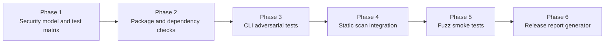

# Security Validation Framework

This document defines the planned security-validation framework that my-dev-kit-lab will own for **my-dev-kit** release preparation.

The framework is a lab-owned validation and evidence layer. It is not a normal end-user feature of my-dev-kit-lab, and it does not change the current experiment baseline or the planned generic experiment-plugin architecture. Its purpose is to help determine whether **my-dev-kit**, as a local CLI/package, remains safe to run on local repositories before release candidates are promoted.

---

## Security model

The planned framework validates whether my-dev-kit remains:

- local-first
- deterministic
- read-only with respect to user source files
- network-free during normal CLI operation
- LLM-free
- database-free
- safe to run on local repositories

Because my-dev-kit is a local CLI/package rather than a hosted web app, the correct testing model is CLI/package adversarial testing. This framework is not intended to be an OWASP ZAP or Burp-style web application pentest stack.

---

## Scope boundary

### In scope

- Local CLI arguments and command execution paths
- Repository indexing and retrieval behavior
- Artifact readers and generated artifact handling
- Package contents and publication safety
- Dependency and supply-chain review
- Static security scan coverage
- Release evidence and security verdict reporting

### Out of scope

- Hosted service penetration testing
- Browser-session security testing
- Authentication/session management testing for a web app
- Long-running fuzz infrastructure as a release prerequisite in the initial phase

---

## Threat model

The main adversarial assumptions are practical rather than hypothetical:

- A careless user passes malformed, hostile, or unexpected CLI arguments.
- A repository contains unusual paths, giant files, malformed generated artifacts, secrets, or symlink/junction edge cases.
- A release accidentally ships unsafe package contents, generated lab artifacts, or machine-specific files.
- A code path introduces unsafe subprocess execution, unsafe Graphviz invocation, path traversal, or destructive file cleanup behavior.
- Warnings, progress logs, or malformed error handling corrupt machine-readable JSON output.

The framework should provide evidence that my-dev-kit stays within its intended trust boundaries even when inputs are hostile or malformed.

---

## Validation layers

### 1. Static application security testing

Planned tools:

- CodeQL
- Semgrep

Primary focus areas:

- `child_process` usage
- unsafe shell execution
- unsafe Graphviz invocation
- path traversal
- unsafe `fs.rm` or recursive deletion
- unsafe `path.resolve` / `path.join` usage
- unbounded file reads
- unbounded JSON artifact generation
- accidental secret indexing
- tainted CLI arguments flowing into filesystem writes or subprocess calls

Purpose:
Find code-level vulnerability patterns before release candidates move forward.

### 2. Dependency and supply-chain audit

Planned tools:

- `npm audit`
- `npm audit --omit=dev`
- OSV-Scanner
- `npm outdated`
- `npm ls --all`
- `npm pack --dry-run`

Primary focus areas:

- runtime dependency vulnerabilities
- dev dependency vulnerabilities that affect build or release
- suspicious lifecycle scripts
- accidental package tarball inclusion of generated or private artifacts
- generated `.my-dev-kit` artifacts
- local tarballs
- smoke folders
- private planning notes
- reports not intended for users
- `.env` files, secrets, tokens, or credentials
- machine-specific files

Purpose:
Detect vulnerable dependencies and prevent unsafe package publication.

### 3. CLI adversarial test harness

Planned tools:

- Vitest or the Node test runner
- temporary test directories
- local built CLI such as `node dist/cli.js`
- no network access
- no destructive activity outside temporary directories

Primary attack surface:

- `--root`
- `--src`
- `--out`
- `--index`
- `--file`
- `--node`
- `--symbol`
- `--contains`
- `--query`
- `--graph`
- `--format`
- `--path`
- `--react-region`
- `--include-local-component-tree`
- `--include-prop-flow`
- `--include-event-handlers`

Representative test categories:

- path traversal
- arbitrary file read attempts
- arbitrary file write attempts
- unsafe output paths
- unsafe index paths
- symlink/junction escape
- generated artifact cleanup deleting user files
- malformed JSON artifacts
- unsupported schema versions
- huge source files or literals
- deeply nested TSX
- Graphviz label escaping
- shell metacharacters in labels and paths
- JSON stdout/stderr corruption
- warnings or progress contaminating JSON stdout
- read-only boundary violations
- generated artifacts containing secrets
- indexing ignored or generated directories

Purpose:
Act like an attacker or careless user and verify that the CLI fails safely.

### 4. Fuzzing

Planned tools:

- Jazzer.js or a lightweight custom fuzz harness first
- optional larger fuzz infrastructure later

Initial fuzz targets:

- manifest reader
- symbol-index reader
- code-graph reader
- data-model reader
- frontend-semantic reader
- CLI argument parser
- source `--contains` matcher
- path normalization helpers
- DOT label escaping
- TS/TSX frontend analyzer
- data-model analyzer
- graph view renderer
- source retrieval windowing logic

Purpose:
Stress parsers and artifact readers with malformed or randomized input.

Initial fuzzing is intended to stay bounded and smoke-level. Early releases should not depend on long-running fuzz jobs.

### 5. Release security report

Each release candidate should eventually generate a report such as:

- `reports/v<version>-security-validation.txt`

Planned report sections:

1. Executive summary
2. Branch and commit audited
3. Package name and version
4. Security model
5. CodeQL result
6. Semgrep result
7. npm audit result
8. OSV-Scanner result
9. Package tarball inspection
10. File-system/path traversal tests
11. Source read-only boundary tests
12. Graphviz/subprocess safety tests
13. JSON stdout/stderr safety tests
14. Network boundary check
15. Secret leakage check
16. Artifact content safety check
17. Symlink/ignored-folder behavior
18. Invalid input/error-message behavior
19. Fuzz smoke result
20. Findings by severity
21. Release verdict
22. Recommended next step

Purpose:
Produce a stable release-gate artifact that can be reviewed alongside normal release validation.

---

## Expected safe behavior

The planned framework should verify that:

- the CLI fails safely with clear error messages
- JSON mode returns valid JSON errors where supported
- source files are not modified
- writes are limited to explicit artifact or output paths
- generated artifact refresh does not delete non-generated user files
- DOT output does not require Graphviz
- SVG/PNG behavior is safe when Graphviz is missing
- subprocess execution avoids shell-string interpolation
- output paths and labels do not allow command injection
- warnings and progress stay on stderr rather than corrupting JSON stdout

---

## Severity categories

- `Blocker` - must fix before release
- `Major` - should fix before release
- `Minor` - can fix in a patch release or documentation follow-up
- `Informational` - no direct release impact
- `Skipped` - environment did not allow the check

---

## Release verdicts

- `ready for release preparation`
- `not ready: security blocker remains`
- `ready except optional manual checks`
- `inconclusive: audit environment incomplete`

---

## Planned command concepts

The following command names are planned roadmap items, not current repository capabilities unless they are implemented in a future phase:

- `security:codeql`
- `security:semgrep`
- `security:deps`
- `security:package`
- `test:security`
- `test:fuzz:smoke`
- `security:validate`

Intended behavior:

- `security:deps` runs dependency audit checks and uses OSV-Scanner when available.
- `security:package` inspects package contents via `npm pack --dry-run` and related tarball checks.
- `test:security` runs adversarial CLI tests in temporary directories.
- `test:fuzz:smoke` runs bounded fuzz targets with short timeouts.
- `security:validate` assembles the release-security gate and report.

---

## Npm published baseline

my-dev-kit-lab v0.1.0 is published on npm as `my-dev-kit-lab`. The published package exposes a CLI bin `my-dev-kit-lab` that runs the final demo workflow.

The security-validation framework is post-v0.1.0 work. It is being developed in staged branches after the v0.1.0 baseline release.

Baseline verification commands:

```bash
npm view my-dev-kit-lab@0.1.0 version
npm view my-dev-kit-lab@0.1.0 bin
```

Security scripts such as `security:deps` and `security:package` are new additions that do not exist in v0.1.0. They should not be referenced in user-facing v0.1.0 documentation as current capabilities.

---

## Planned module map

The following paths show where each security-validation module will live once implemented. None of these modules exist yet unless a prompt has created them.

```
src/securityValidation/
  types.ts                     Security model types: severity, verdict, check result, finding, summary
  config.ts                    Report paths, timeouts, forbidden patterns, optional tool toggles
  commandRunner.ts             Structured subprocess executor for security check commands
  artifacts.ts                 Artifact writer for structured JSON check results
  index.ts                     Public API surface for the securityValidation module
  dependencies/
    runDependencyChecks.ts     Orchestrate npm audit, npm outdated, npm ls, OSV-Scanner
    parseNpmAudit.ts           Parse npm audit JSON output into SecurityCheckResult
    parseNpmLs.ts              Parse npm ls --all output into SecurityCheckResult
    parseNpmOutdated.ts        Parse npm outdated output into SecurityCheckResult
    runOsvScanner.ts           Run OSV-Scanner if available; skip with reason if not
  packageChecks/
    runPackageChecks.ts        Orchestrate npm pack --dry-run and forbidden-content scan
    parseNpmPackDryRun.ts      Parse npm pack --dry-run output into file list
    forbiddenPackageContents.ts Detect lab-output, .my-dev-kit, .env, and other unsafe inclusions
  staticScans/                 (planned: Phase 4 — CodeQL and Semgrep wrappers)
  adversarialCli/              (planned: Phase 3 — hostile CLI argument tests)
  fuzz/                        (planned: Phase 5 — bounded parser fuzz targets)
  report/                      (planned: Phase 6 — release security report generator)

scripts/security/
  runDependencyChecks.ts       npm script entrypoint for security:deps
  runPackageChecks.ts          npm script entrypoint for security:package

tests/security/
  securityValidationTypes.test.ts    Type and enumeration completeness checks
  securityValidationTestMatrix.test.ts  Test matrix structure and uniqueness checks
  dependencyChecks.test.ts     Parse and runner unit tests for dependency checks
  packageContentChecks.test.ts Forbidden-content detection unit tests

tests/fuzz/                    (planned: Phase 5 — bounded fuzz harnesses)

reports/security/              Generated security check artifacts (not committed)
  dependency-checks.json
  package-checks.json
  raw/                         Raw command stdout/stderr captured during checks
```

---

## Branch and version sequence

| Branch | Purpose |
|---|---|
| `feature/security-validation-planning` | Prompt 1: implementation plan and framework doc |
| `feature/security-validation-foundation` | Prompt 2: types, config, and test matrix |
| `feature/security-package-validation` | Prompt 3: dependency and package-content checks |
| `feature/security-cli-adversarial-tests` | Prompt 4 (future): CLI adversarial harness, part 1 |
| `feature/security-malformed-artifacts` | Prompt 5 (future): malformed artifacts, JSON, Graphviz |
| `feature/security-static-scan-integration` | Prompt 6 (future): CodeQL and Semgrep integration |
| `feature/security-fuzz-smoke` | Prompt 7 (future): bounded fuzz smoke tests |
| `feature/security-release-report` | Prompt 8 (future): security:validate and release report |

No npm version bump is needed for Prompts 1–3. These are development branches targeting a future v0.1.1 or later release.

---

## Relationship to the existing experiment and evidence pipeline

The security-validation framework is additive. It does not replace or modify:

- the raw-vs-indexed controlled experiment pipeline
- fake-agent deterministic demo behavior
- Codex and Claude adapter support
- report, plot, screenshot, visualization demo, and gallery workflows
- benchmark metadata and correctness scoring

It also does not depend on the future generic experiment-plugin framework. The two tracks are parallel and independent.

Security artifacts are written to `reports/security/` and kept separate from experiment artifacts in `lab-output/`.

---

## Acceptance criteria by phase

### Phase 1: Security model and test matrix (Prompt 1–2)

- Security model documents local-first, deterministic, read-only, network-free, LLM-free, and database-free boundaries
- Threat model explicitly distinguishes CLI/package adversarial testing from web-application pentesting
- TypeScript types exist for severity, verdict, check result, finding, and validation summary
- Test matrix covers path traversal, read-only boundaries, malformed artifacts, JSON stdout/stderr, Graphviz safety, secret leakage, scale, and CLI arguments
- Each test matrix entry has a unique id, category, attack surface, expected behavior, severity, and implementation status

### Phase 2: Package and dependency checks (Prompt 3)

- `npm run security:deps` runs npm audit, npm audit --omit=dev, npm outdated, npm ls --all, and OSV-Scanner (if available)
- `npm run security:package` runs npm pack --dry-run and detects forbidden package contents
- Structured JSON results are written to `reports/security/dependency-checks.json` and `reports/security/package-checks.json`
- Unavailable optional tools (OSV-Scanner) are marked skipped, not failed
- Tests run without network access or OSV-Scanner installation

### Phase 3: CLI adversarial tests (Prompt 4–5, future)

- Test harness covers hostile values for all documented CLI flags
- Tests run in temporary directories with no writes outside those directories
- Path traversal, unsafe output paths, symlink escape, malformed artifacts, and JSON stdout/stderr contamination are covered

### Phase 4: Static scan integration (Prompt 6, future)

- CodeQL and Semgrep wrappers exist in `src/securityValidation/staticScans/`
- Focus areas include unsafe subprocess use, path traversal, unsafe deletion, and tainted argument flows
- Results feed the security report rather than standing alone

### Phase 5: Fuzz smoke tests (Prompt 7, future)

- Fuzz targets for manifest, symbol index, code graph, data model, frontend semantic, and DOT label escaping
- Time-bounded; release validation does not depend on long-running fuzz jobs

### Phase 6: Release report generator (Prompt 8, future)

- `npm run security:validate` assembles evidence from all prior phases
- Report is written to `reports/v<version>-security-validation.txt` and `reports/v<version>-security-validation.json`
- Report includes executive summary, findings by severity, release verdict, and recommended next step

---

## Initial implementation phases



These phases are also tracked in [ROADMAP.md](ROADMAP.md). The release-security track is intended to support release preparation for my-dev-kit without replacing my-dev-kit-lab's experiment and evidence mission.
