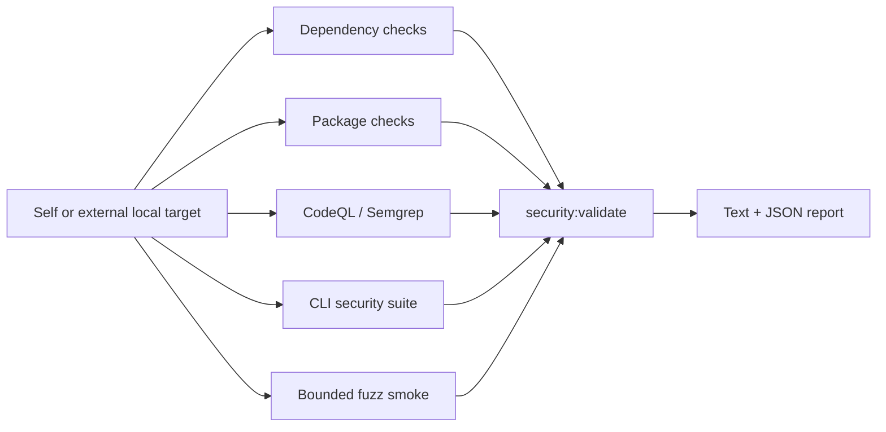

# Security Validation Framework

## Scope

The implemented framework performs automated security validation for local CLI/package projects. It checks whether the target remains safe to inspect and package and whether CLI boundaries fail safely. It is not a hosted-web-application scanner and is not a complete manual pentest framework.

Current security properties include:

- local-first and database-free operation
- read-only treatment of user source files
- writes limited to explicit artifact/output locations
- safe path and subprocess handling
- parseable machine output and stderr/stdout separation
- package-content and dependency hygiene
- bounded handling of malformed or large inputs

## Implemented validation layers

| Layer | Implementation |
|---|---|
| Dependency checks | `npm audit`, runtime-only audit, `npm ls`, `npm outdated`, and optional OSV-Scanner |
| Package checks | `npm pack --dry-run` parsing and forbidden-content detection |
| CLI adversarial checks | path boundaries, read-only boundaries, malformed artifacts, JSON output, subprocess/DOT safety, and bounded data-volume scenarios |
| Static scans | CodeQL availability/execution integration and Semgrep integration |
| Fuzz smoke | deterministic bounded targets for security-sensitive parsers and helpers |
| Validation gate | normalized findings, skips, four-category verdict, and text/JSON reports |



## Target-aware validation

All principal security commands accept an optional `--target <path>`. Without it, the lab validates itself. With it, the lab remains the tool root and the selected local project becomes the validation target.

```powershell
npm run security:validate
npm run security:validate -- --target <path>
```

Target resolution reads available package, lockfile, and git metadata without modifying target source files. Reports identify tool and target roots and are written under `reports/security` by default. For an external target, `security:validate` runs the target's `npm run test:security` in the target root when that script exists. Missing target security scripts and optional tool availability are represented explicitly in results.

Target-aware behavior is implemented in:

- `src/securityValidation/validate/resolveTarget.ts`
- `src/securityValidation/validate/runCliSecuritySuiteCheck.ts`
- `src/securityValidation/validate/runSecurityValidation.ts`
- `scripts/security/validate.ts`

## Commands

| Command | Current behavior |
|---|---|
| `npm run security:deps` | Dependency and vulnerability checks |
| `npm run security:package` | Tarball content checks |
| `npm run security:codeql` | CodeQL integration; structured skip when unavailable |
| `npm run security:semgrep` | Semgrep integration; structured skip when unavailable |
| `npm run test:security` | Automated security and adversarial test suite |
| `npm run test:fuzz:smoke` | Bounded deterministic fuzz checks |
| `npm run security:validate` | Orchestrates checks and writes the security report |

See [COMMANDS.md](COMMANDS.md) for arguments and examples.

## Module map

```text
src/securityValidation/
  types.ts
  config.ts
  commandRunner.ts
  artifacts.ts
  dependencies/
  packageChecks/
  cliAdversarial/
  staticScans/
  fuzz/
  validate/
    resolveTarget.ts
    runCliSecuritySuiteCheck.ts
    runSecurityValidation.ts
    verdict.ts
  report/

scripts/security/
  runDependencyChecks.ts
  runPackageChecks.ts
  runCodeql.ts
  runSemgrep.ts
  runFuzzSmoke.ts
  validate.ts

tests/security/
tests/fuzz/
```

## Reports and verdicts

`security:validate` writes:

- `reports/security/<prefix>-security-validation.txt`
- `reports/security/<prefix>-security-validation.json`

Supported verdicts are:

- ready for release preparation
- not ready: security blocker remains
- ready except optional manual checks
- inconclusive: audit environment incomplete

Optional scanners can be recorded as skipped. A skip is not silently converted into a pass, and its effect is reflected in the verdict and report.

## Current limitations

- The adversarial suite provides meaningful automated CLI/package coverage, but it is not exhaustive attack simulation.
- Some checks depend on locally installed tools or network-backed package metadata.
- CodeQL's full analysis can depend on the configured environment; availability checks and CI integration do not guarantee identical local coverage.
- Symlink and junction scenarios can be operating-system dependent.
- Informational architectural assertions are not equivalent to dynamic network or secret-leakage proofs.
- A human-led manual pentest workflow is planned for `v0.4.0`, not implemented.

## Planned fortification and manual testing

The `v0.2.1` direction is to strengthen attack scenarios, target coverage, and security evidence while keeping `security:validate` backward compatible.

The audit track planned for `v0.3.x` will consume current security results in unified audit reports without replacing this standalone gate. The manual pentest framework planned for `v0.4.0` will sit beside automated validation and must label human procedures and evidence separately from automated checks.

## Relationship to experiments

Security validation is additive. It does not replace the experiment plugin runtime, controlled experiment behavior, agent adapters, reports, plots, screenshots, or gallery. Both tracks reuse shared target and report infrastructure where appropriate.
