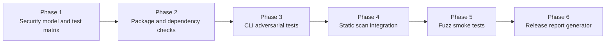

# Security Validation Framework

This document defines the security-validation framework owned by my-dev-kit-lab for local CLI/package release preparation.

The framework is a lab-owned validation and evidence layer. It is not a normal end-user feature of my-dev-kit-lab, and it does not change the current experiment baseline or the planned generic experiment-plugin architecture. Its purpose is to help determine whether a local CLI/package remains safe to run on local repositories before release candidates are promoted.

By default, `security:validate` validates my-dev-kit-lab itself (self-validation). With `--target <path>`, it can validate any local project directory — reporting tool metadata separately from the target under test.

---

## Security model

The framework validates whether my-dev-kit remains:

- local-first
- deterministic
- read-only with respect to user source files
- network-free during normal CLI operation
- LLM-free
- database-free
- safe to run on local repositories

Because my-dev-kit is a local CLI/package rather than a hosted web app, the correct testing model is CLI/package adversarial testing. This framework is not intended to be an OWASP ZAP or Burp-style web application pentest stack.

---

## Scope boundary

### In scope

- Local CLI arguments and command execution paths
- Repository indexing and retrieval behavior
- Artifact readers and generated artifact handling
- Package contents and publication safety
- Dependency and supply-chain review
- Static security scan coverage
- Release evidence and security verdict reporting

### Out of scope

- Hosted service penetration testing
- Browser-session security testing
- Authentication/session management testing for a web app
- Long-running fuzz infrastructure as a release prerequisite in the initial phase

---

## Threat model

The main adversarial assumptions are practical rather than hypothetical:

- A careless user passes malformed, hostile, or unexpected CLI arguments.
- A repository contains unusual paths, giant files, malformed generated artifacts, secrets, or symlink/junction edge cases.
- A release accidentally ships unsafe package contents, generated lab artifacts, or machine-specific files.
- A code path introduces unsafe subprocess execution, unsafe Graphviz invocation, path traversal, or destructive file cleanup behavior.
- Warnings, progress logs, or malformed error handling corrupt machine-readable JSON output.

The framework should provide evidence that my-dev-kit stays within its intended trust boundaries even when inputs are hostile or malformed.

---

## Validation layers

### 1. Static application security testing

Implemented tools:

- CodeQL (local CLI availability check; full analysis via GitHub Actions)
- Semgrep (local binary or npx fallback; `.semgrep.yml` config)

Primary focus areas:

- `child_process` usage
- unsafe shell execution
- unsafe Graphviz invocation
- path traversal
- unsafe `fs.rm` or recursive deletion
- unsafe `path.resolve` / `path.join` usage
- unbounded file reads
- unbounded JSON artifact generation
- accidental secret indexing
- tainted CLI arguments flowing into filesystem writes or subprocess calls

Purpose:
Find code-level vulnerability patterns before release candidates move forward.

### 2. Dependency and supply-chain audit

Implemented tools:

- `npm audit`
- `npm audit --omit=dev`
- OSV-Scanner (optional; skipped when unavailable)
- `npm outdated`
- `npm ls --all`
- `npm pack --dry-run`

Primary focus areas:

- runtime dependency vulnerabilities
- dev dependency vulnerabilities that affect build or release
- suspicious lifecycle scripts
- accidental package tarball inclusion of generated or private artifacts
- generated `.my-dev-kit` artifacts
- local tarballs
- smoke folders
- private planning notes
- reports not intended for users
- `.env` files, secrets, tokens, or credentials
- machine-specific files

Purpose:
Detect vulnerable dependencies and prevent unsafe package publication.

### 3. CLI adversarial test harness

Implemented tools:

- Vitest test runner
- temporary test directories (auto-cleaned)
- deterministic `fake-adversarial-cli.js` fixture (CI-safe; no network; no source writes)
- real CLI opt-in via `MY_DEV_KIT_SECURITY_TARGET_COMMAND` environment variable

Primary attack surface:

- `--root`
- `--src`
- `--out`
- `--index`
- `--file`
- `--node`
- `--symbol`
- `--contains`
- `--query`
- `--graph`
- `--format`
- `--path`
- `--react-region`
- `--include-local-component-tree`
- `--include-prop-flow`
- `--include-event-handlers`

Representative test categories:

- path traversal
- arbitrary file read attempts
- arbitrary file write attempts
- unsafe output paths
- unsafe index paths
- symlink/junction escape
- generated artifact cleanup deleting user files
- malformed JSON artifacts
- unsupported schema versions
- huge source files or literals
- deeply nested TSX
- Graphviz label escaping
- shell metacharacters in labels and paths
- JSON stdout/stderr corruption
- warnings or progress contaminating JSON stdout
- read-only boundary violations
- generated artifacts containing secrets
- indexing ignored or generated directories

Purpose:
Act like an attacker or careless user and verify that the CLI fails safely.

### 4. Fuzzing

Implemented (smoke-level, bounded, deterministic):

- Custom seeded fuzz harness (`src/securityValidation/fuzz/fuzzHarness.ts`)
- Seeded PRNG (Mulberry32) for reproducible CI runs

Implemented fuzz targets:

- manifest reader (JSON mutations)
- code-graph reader (JSON mutations)
- npm audit parser
- npm ls parser
- npm outdated parser
- npm pack dry-run parser
- DOT label escaping helper
- path normalization with traversal inputs
- source retrieval windowing logic

Purpose:
Stress parsers and artifact readers with malformed or randomized input.

Fuzzing is bounded and smoke-level. Release validation does not depend on long-running fuzz jobs.

### 5. Release security report

Implemented. Each validation run generates:

- `reports/security/<prefix>-security-validation.txt` — human-readable report
- `reports/security/<prefix>-security-validation.json` — machine-readable structured report

The `<prefix>` is derived automatically from the target: `v0.2.1` for self-validation, `my-dev-kit-v1.2.0` for scoped packages, `biolit-v1` for name-only packages, or the directory basename when no package.json is present.

Report sections:

1. Executive summary
2. Branch and commit audited
3. Package name and version
4. Security model
5. CodeQL result
6. Semgrep result
7. npm audit result
8. OSV-Scanner result
9. Package tarball inspection
10. CLI / file-system / path traversal tests
11. Source read-only boundary tests
12. Graphviz/subprocess safety tests
13. JSON stdout/stderr safety tests
14. Network boundary check
15. Secret leakage check
16. Artifact content safety check
17. Symlink/ignored-folder behavior
18. Invalid input/error-message behavior
19. Fuzz smoke result
20. Findings by severity
21. Release verdict
22. Recommended next step

Purpose:
Produce a stable release-gate artifact that can be reviewed alongside normal release validation.

---

## Expected safe behavior

The framework verifies that:

- the CLI fails safely with clear error messages
- JSON mode returns valid JSON errors where supported
- source files are not modified
- writes are limited to explicit artifact or output paths
- generated artifact refresh does not delete non-generated user files
- DOT output does not require Graphviz
- SVG/PNG behavior is safe when Graphviz is missing
- subprocess execution avoids shell-string interpolation
- output paths and labels do not allow command injection
- warnings and progress stay on stderr rather than corrupting JSON stdout
- external target `test:security` runs in the target project root rather than the tool root
- external-target reports retain command cwd, exit code, stdout/stderr summaries, and target package metadata

---

## Severity categories

- `Blocker` - must fix before release
- `Major` - should fix before release
- `Minor` - can fix in a patch release or documentation follow-up
- `Informational` - no direct release impact
- `Skipped` - environment did not allow the check

---

## Release verdicts

- `ready for release preparation`
- `not ready: security blocker remains`
- `ready except optional manual checks`
- `inconclusive: audit environment incomplete`

---

## Current implementation status

| Module | Status |
|---|---|
| `src/securityValidation/types.ts` | **Implemented** — severity, verdict, check result, finding, validation summary types |
| `src/securityValidation/config.ts` | **Implemented** — default config with forbidden patterns and timeouts |
| `src/securityValidation/testMatrix.ts` | **Implemented** — structured test matrix with 30+ planned adversarial test entries |
| `tests/security/securityValidationTypes.test.ts` | **Implemented** — enumeration completeness checks |
| `tests/security/securityValidationTestMatrix.test.ts` | **Implemented** — test matrix structure and uniqueness checks |
| `src/securityValidation/commandRunner.ts` | **Implemented** — subprocess runner (no shell interpolation) |
| `src/securityValidation/artifacts.ts` | **Implemented** — structured artifact writer |
| `src/securityValidation/index.ts` | **Implemented** — public API surface |
| `src/securityValidation/dependencies/` | **Implemented** — npm audit, ls, outdated parsers; OSV-Scanner runner |
| `src/securityValidation/packageChecks/` | **Implemented** — npm pack --dry-run parser; forbidden-content detector |
| `scripts/security/runDependencyChecks.ts` | **Implemented** — entrypoint for `security:deps` |
| `scripts/security/runPackageChecks.ts` | **Implemented** — entrypoint for `security:package` |
| `src/securityValidation/cliAdversarial/tempWorkspace.ts` | **Implemented** — temp workspace creation, file snapshots, diff detection |
| `src/securityValidation/cliAdversarial/adversarialCliConfig.ts` | **Implemented** — fake/real CLI target config; `MY_DEV_KIT_SECURITY_TARGET_COMMAND` opt-in |
| `src/securityValidation/cliAdversarial/pathCases.ts` | **Implemented** — path traversal, absolute, spaces, metachar, unicode, long, missing test inputs |
| `src/securityValidation/cliAdversarial/runAdversarialCheck.ts` | **Implemented** — `spawn` (no shell) harness runner; finding builder |
| `src/securityValidation/cliAdversarial/pathBoundaryChecks.ts` | **Implemented** — --root/--out/--index traversal, spaces, absolute, unicode, escape detection |
| `src/securityValidation/cliAdversarial/readOnlyBoundaryChecks.ts` | **Implemented** — source not modified, writes limited to output, index containment, cleanup safety |
| `tests/fixtures/fake-adversarial-cli.js` | **Implemented** — deterministic fake CLI for CI adversarial tests (no network, no source writes) |
| `tests/security/cliAdversarialPathBoundary.test.ts` | **Implemented** — 23 tests: harness infra, escape detection, traversal, safe paths |
| `tests/security/cliAdversarialReadOnlyBoundary.test.ts` | **Implemented** — 13 tests: source not modified, writes limited, index containment, cleanup safety |
| `src/securityValidation/cliAdversarial/malformedArtifactFixtures.ts` | **Implemented** — malformed manifest, code-graph, unsupported schema version fixture content |
| `src/securityValidation/cliAdversarial/malformedArtifactChecks.ts` | **Implemented** — malformed manifest (all cases), code-graph, schema version, missing index dir |
| `src/securityValidation/cliAdversarial/jsonStdoutChecks.ts` | **Implemented** — JSON parseable, stderr/stdout separation, failure JSON error, progress isolation |
| `src/securityValidation/cliAdversarial/subprocessSafetyChecks.ts` | **Implemented** — shell metachar injection check, DOT label escaper (`escapeDotLabel`) |
| `src/securityValidation/cliAdversarial/dataVolumeChecks.ts` | **Implemented** — large file (5k lines), many files (100), deeply nested dirs (10 levels) |
| `tests/security/cliAdversarialMalformedArtifacts.test.ts` | **Implemented** — 14 tests |
| `tests/security/cliAdversarialJsonStdout.test.ts` | **Implemented** — 9 tests |
| `tests/security/cliAdversarialSubprocessSafety.test.ts` | **Implemented** — 14 tests |
| `tests/security/cliAdversarialDataVolume.test.ts` | **Implemented** — 8 tests |
| `src/securityValidation/staticScans/codeql.ts` | **Implemented** — CodeQL CLI availability check; skipped gracefully when absent |
| `src/securityValidation/staticScans/semgrep.ts` | **Implemented** — Semgrep scan with npx fallback; `.semgrep.yml` config; JSON output parser |
| `src/securityValidation/fuzz/randomInput.ts` | **Implemented** — seeded PRNG, JSON mutation helpers, path traversal inputs |
| `src/securityValidation/fuzz/fuzzHarness.ts` | **Implemented** — bounded fuzz runner; crashes become structured findings |
| `src/securityValidation/fuzz/fuzzTargets.ts` | **Implemented** — 9 fuzz targets covering parsers, DOT escaping, path normalization |
| `src/securityValidation/validate/resolveTarget.ts` | **Implemented** — `SecurityValidationTarget` type; `resolveValidationTarget()`, `reportFilenamePrefix()`, `targetDescription()` helpers |
| `src/securityValidation/validate/runCliSecuritySuiteCheck.ts` | **Implemented** — self-vs-target `test:security` execution, command cwd/exit metadata, missing-script handling |
| `src/securityValidation/validate/verdict.ts` | **Implemented** — verdict calculation from check results and findings |
| `src/securityValidation/validate/runSecurityValidation.ts` | **Implemented** — orchestrator for all security checks; target-aware (accepts `targetPath?`) |
| `src/securityValidation/report/securityReportTypes.ts` | **Implemented** — SecurityReport, SecurityReportSection, SecurityReportMetadata types |
| `src/securityValidation/report/renderSecurityReport.ts` | **Implemented** — text and JSON report renderers |
| `scripts/security/runCodeql.ts` | **Implemented** — entrypoint for `security:codeql` |
| `scripts/security/runSemgrep.ts` | **Implemented** — entrypoint for `security:semgrep` |
| `scripts/security/runFuzzSmoke.ts` | **Implemented** — entrypoint for `test:fuzz:smoke` |
| `scripts/security/validate.ts` | **Implemented** — entrypoint for `security:validate` |
| `tests/security/staticScanChecks.test.ts` | **Implemented** — CodeQL/Semgrep skip gracefully; parseSemgrepJson unit tests |
| `tests/security/securityValidateGate.test.ts` | **Implemented** — verdict calculation; text and JSON report rendering |
| `tests/security/securityValidationTarget.test.ts` | **Implemented** — self-mode, external target, error cases, reportFilenamePrefix, targetDescription (23 tests) |
| `tests/security/cliSecuritySuiteCheck.test.ts` | **Implemented** — external target cwd, pass/fail exit codes, missing target script, path-with-spaces |
| `tests/fuzz/fuzzSmoke.test.ts` | **Implemented** — PRNG, individual fuzz targets, runAllFuzzTargets (23 tests) |

---

## Available commands

### Implemented

```bash
npm run security:deps
```

Runs npm audit (full), npm audit --omit=dev (runtime only), npm outdated, npm ls --all, and OSV-Scanner (if available). Writes structured results to `reports/security/`. Exits non-zero on blocker findings.

```bash
npm run security:package
```

Runs npm pack --dry-run and checks the file list for forbidden contents (lab-output, .my-dev-kit, .env files, private docs, node_modules, tarballs). Writes structured results to `reports/security/`. Exits non-zero on blocker or major findings.

```bash
npm run test:security
```

Runs all security-validation unit tests (type completeness, test matrix structure, dependency parsers, package content checks, CLI adversarial path boundary and read-only boundary tests). Does not require network access, external tools, or a globally installed my-dev-kit.

By default, adversarial tests run against `tests/fixtures/fake-adversarial-cli.js` (deterministic, CI-safe). To run against a real my-dev-kit CLI, set `MY_DEV_KIT_SECURITY_TARGET_COMMAND=<path-to-cli>` before running the test suite.

### Also implemented (v0.1.4)

```bash
npm run security:codeql
```

Checks local CodeQL CLI availability. Skipped with structured reason if not installed. Full analysis via GitHub Actions.

```bash
npm run security:semgrep
```

Runs Semgrep against `src/` using `.semgrep.yml`. Falls back to npx if local binary unavailable. Skipped with structured reason if both unavailable.

```bash
npm run test:fuzz:smoke
```

Runs 9 bounded fuzz targets (50 iterations each, seeded PRNG). Completes in under 1 second. No network, no external tools, no source file writes.

```bash
npm run security:validate
```

Orchestrates all security checks and writes `reports/security/<prefix>-security-validation.txt` and `.json`. Returns a structured verdict. Accepts `--target <path>` to validate any local project. See `docs/COMMANDS.md` for full option details.

In self mode, the validator runs the lab's own `npm run test:security` suite in the tool root. In external-target mode, it resolves the target root, reads the target `package.json`, detects `scripts.test:security`, and runs `npm run test:security` in the target project root when that script exists. Reports retain the executed command, command cwd, exit code, and stdout/stderr summaries.

Packed-package validation is required before publish for this workflow. The validator must be run from an installed tarball as well as from the source checkout so npm-package execution differences are caught before release.

---

## Npm published baseline

my-dev-kit-lab v0.1.0 is published on npm as `@dailephd/my-dev-kit-lab`. The published package exposes a CLI bin `my-dev-kit-lab` that runs the final demo workflow.

The security-validation framework is post-v0.1.0 work. Its foundation, dependency checks, package-content checks, and initial tests are now implemented after the v0.1.0 baseline release.

Baseline verification commands:

```bash
npm view @dailephd/my-dev-kit-lab@0.1.0 version
npm view @dailephd/my-dev-kit-lab@0.1.0 bin
```

Security scripts such as `security:deps`, `security:package`, `security:codeql`, `security:semgrep`, and `security:validate` are post-v0.1.0 additions. They should not be referenced in user-facing v0.1.0 documentation as current capabilities, but they are part of the current v0.2.1 scope.

---

## Module map

The following paths describe the current security-validation module layout, including both implemented modules and planned future areas.

```
src/securityValidation/
  types.ts                     Security model types: severity, verdict, check result, finding, summary
  config.ts                    Report paths, timeouts, forbidden patterns, optional tool toggles
  commandRunner.ts             Structured subprocess executor for security check commands
  artifacts.ts                 Artifact writer for structured JSON check results
  index.ts                     Public API surface for the securityValidation module
  dependencies/
    runDependencyChecks.ts     Orchestrate npm audit, npm outdated, npm ls, OSV-Scanner
    parseNpmAudit.ts           Parse npm audit JSON output into SecurityCheckResult
    parseNpmLs.ts              Parse npm ls --all output into SecurityCheckResult
    parseNpmOutdated.ts        Parse npm outdated output into SecurityCheckResult
    runOsvScanner.ts           Run OSV-Scanner if available; skip with reason if not
  packageChecks/
    runPackageChecks.ts        Orchestrate npm pack --dry-run and forbidden-content scan
    parseNpmPackDryRun.ts      Parse npm pack --dry-run output into file list
    forbiddenPackageContents.ts Detect lab-output, .my-dev-kit, .env, and other unsafe inclusions
  staticScans/                 (implemented: Phase 4 — CodeQL and Semgrep wrappers)
    codeql.ts                  CodeQL CLI availability check; skips gracefully when absent
    semgrep.ts                 Semgrep scan with npx fallback; JSON output parser
  fuzz/                        (implemented: Phase 5 — bounded parser fuzz targets)
    randomInput.ts             Seeded PRNG, JSON mutations, path traversal inputs
    fuzzHarness.ts             Bounded fuzz runner; crashes become structured findings
    fuzzTargets.ts             9 fuzz targets: parsers, DOT escaping, path normalization
  validate/                    (implemented: Phase 6a — orchestrator, verdict, target resolution)
    resolveTarget.ts           SecurityValidationTarget type; resolveValidationTarget, reportFilenamePrefix, targetDescription
    runSecurityValidation.ts   Orchestrates all security checks; target-aware (accepts targetPath?)
    verdict.ts                 Calculates release verdict from check results and findings
  report/                      (implemented: Phase 6b — text and JSON report renderer)
    securityReportTypes.ts     SecurityReport, SecurityReportSection, metadata types
    renderSecurityReport.ts    Human-readable and JSON report renderers
  cliAdversarial/              (implemented: Phase 3a+3b — path/read-only boundaries + malformed/subprocess/data-volume)
    tempWorkspace.ts             Temp workspace factory; file snapshot and diff helpers
    adversarialCliConfig.ts      CLI target config; MY_DEV_KIT_SECURITY_TARGET_COMMAND opt-in
    pathCases.ts                 Path test input catalog (traversal, absolute, spaces, metachar, unicode)
    runAdversarialCheck.ts       spawn-based (shell:false) check runner; finding builder
    pathBoundaryChecks.ts        Path traversal, unicode, spaces, absolute, escape detection checks
    readOnlyBoundaryChecks.ts    Source not modified, writes limited to output, index containment, cleanup safety
    malformedArtifactFixtures.ts Malformed manifest, code-graph, unsupported schema version fixture content
    malformedArtifactChecks.ts   Checks for malformed pre-placed artifacts; missing index dir
    jsonStdoutChecks.ts          JSON stdout parseable; stderr isolation; failure JSON error; progress isolation
    subprocessSafetyChecks.ts    Shell metachar injection check; DOT label escaper (escapeDotLabel)
    dataVolumeChecks.ts          Large file (5k lines), many files (100), deeply nested dirs (10 levels)
  fuzz/                        (planned: Phase 5 — bounded parser fuzz targets)
  report/                      (planned: Phase 6 — release security report generator)

scripts/security/
  runDependencyChecks.ts       npm script entrypoint for security:deps
  runPackageChecks.ts          npm script entrypoint for security:package
  runCodeql.ts                 npm script entrypoint for security:codeql
  runSemgrep.ts                npm script entrypoint for security:semgrep
  runFuzzSmoke.ts              npm script entrypoint for test:fuzz:smoke
  validate.ts                  npm script entrypoint for security:validate

tests/security/
  securityValidationTypes.test.ts         Type and enumeration completeness checks
  securityValidationTestMatrix.test.ts    Test matrix structure and uniqueness checks
  dependencyChecks.test.ts                Parse and runner unit tests for dependency checks
  packageContentChecks.test.ts            Forbidden-content detection unit tests
  cliAdversarialPathBoundary.test.ts      Path traversal, safe paths, escape detection (23 tests)
  cliAdversarialReadOnlyBoundary.test.ts  Source not modified, write containment, cleanup safety (13 tests)
  cliAdversarialMalformedArtifacts.test.ts Malformed artifacts, schema version, missing index (14 tests)
  cliAdversarialJsonStdout.test.ts        JSON stdout parseable; stderr/stdout separation; failure error (9 tests)
  cliAdversarialSubprocessSafety.test.ts  DOT label escaping logic; shell metachar injection (14 tests)
  cliAdversarialDataVolume.test.ts        Large file, many files, deeply nested dirs (8 tests)
  staticScanChecks.test.ts               CodeQL/Semgrep skip gracefully; parseSemgrepJson unit tests (14 tests)
  securityValidateGate.test.ts           Verdict calculation; text and JSON report rendering (20 tests)
  securityValidationTarget.test.ts       Self-mode, external target, error cases, reportFilenamePrefix, targetDescription (23 tests)

tests/fuzz/
  fuzzSmoke.test.ts            PRNG determinism, individual targets, runAllFuzzTargets (23 tests)

reports/security/              Generated security check artifacts (not committed)
  dependency-checks.json
  package-checks.json
  raw/                         Raw command stdout/stderr captured during checks
```

---

## Branch and version sequence

| Branch | Purpose |
|---|---|
| `feature/security-validation-planning` | Prompt 1: implementation plan and framework doc |
| `feature/security-validation-foundation` | Prompt 2: types, config, and test matrix |
| `feature/security-package-validation` | Prompt 3: dependency and package-content checks |
| `feature/security-cli-adversarial-tests` | Historical implementation branch for the CLI adversarial harness path/read-only phases |
| `feature/security-malformed-artifacts` | Prompt 5: malformed artifacts, JSON stdout/stderr safety, subprocess/DOT label safety, data-volume smoke |
| `feature/security-validation-release-gate` | Prompts 6–8: static scans, fuzz smoke, security:validate, release report |

No npm version bump is needed for Prompts 1–3. These are development branches targeting a future v0.1.1 or later release.

---

## Relationship to the existing experiment and evidence pipeline

The security-validation framework is additive. It does not replace or modify:

- the raw-vs-indexed controlled experiment pipeline
- fake-agent deterministic demo behavior
- Codex and Claude adapter support
- report, plot, screenshot, visualization demo, and gallery workflows
- benchmark metadata and correctness scoring

It also does not depend on the future generic experiment-plugin framework. The two tracks are parallel and independent.

Security artifacts are written to `reports/security/` and kept separate from experiment artifacts in `lab-output/`.

---

## Acceptance criteria by phase

### Phase 1: Security model and test matrix (Prompt 1–2)

- Security model documents local-first, deterministic, read-only, network-free, LLM-free, and database-free boundaries
- Threat model explicitly distinguishes CLI/package adversarial testing from web-application pentesting
- TypeScript types exist for severity, verdict, check result, finding, and validation summary
- Test matrix covers path traversal, read-only boundaries, malformed artifacts, JSON stdout/stderr, Graphviz safety, secret leakage, scale, and CLI arguments
- Each test matrix entry has a unique id, category, attack surface, expected behavior, severity, and implementation status

### Phase 2: Package and dependency checks (Prompt 3)

- `npm run security:deps` runs npm audit, npm audit --omit=dev, npm outdated, npm ls --all, and OSV-Scanner (if available)
- `npm run security:package` runs npm pack --dry-run and detects forbidden package contents
- Structured JSON results are written to `reports/security/dependency-checks.json` and `reports/security/package-checks.json`
- Unavailable optional tools (OSV-Scanner) are marked skipped, not failed
- Tests run without network access or OSV-Scanner installation

### Phase 3: CLI adversarial tests (Prompt 4–5)

**Prompt 4 (implemented):**

- Temp workspace factory with file snapshot and diff detection for write boundary verification
- Fake adversarial CLI fixture (`tests/fixtures/fake-adversarial-cli.js`) for deterministic CI testing without network or global installs
- `MY_DEV_KIT_SECURITY_TARGET_COMMAND` env var for opt-in real CLI testing
- Path boundary checks: `--root`, `--out`, `--index` path traversal; absolute paths; paths with spaces; unicode paths; escape detection self-test
- Read-only boundary checks: source files not modified; writes limited to output dir; index write containment; artifact refresh does not delete user files
- 36 new tests across `cliAdversarialPathBoundary.test.ts` (23) and `cliAdversarialReadOnlyBoundary.test.ts` (13)
- All subprocess invocations use `spawn` with `shell: false` — no shell interpolation

**Prompt 5 (implemented):**

- Malformed artifact fixture library (manifest: 5 cases; code graph: 3 cases; schema version: 3 cases)
- Checks for pre-placed malformed manifest, code-graph, unsupported schema version, missing index directory
- JSON stdout/stderr safety: parseable JSON check, stderr/stdout separation, failure JSON error object, progress isolation
- Subprocess safety: shell metachar injection detection; DOT label escaping logic (`escapeDotLabel`) for `"`, `\`, `\n`, `<>{}|`
- Data-volume smoke checks: large file (5,000 lines), many files (100), deeply nested dirs (10 levels)
- 45 new tests across 4 test files (14 + 9 + 14 + 8)

### Phase 4: Static scan integration (Prompts 6–8, implemented)

- `src/securityValidation/staticScans/codeql.ts` — CodeQL local CLI check; skipped when absent
- `src/securityValidation/staticScans/semgrep.ts` — Semgrep with npx fallback; `.semgrep.yml` covers subprocess safety, path traversal, unsafe deletion, secret leakage
- Both scanners return structured results; absence is `skipped`, not `failed`

### Phase 5: Fuzz smoke tests (Prompts 6–8, implemented)

- `src/securityValidation/fuzz/` — custom seeded harness with 9 targets
- Time-bounded (< 1s at default settings); release validation does not depend on long-running fuzz jobs
- Crashes become structured `SecurityFinding` entries; expected validation errors are not treated as crashes

### Phase 6: Release report generator (implemented)

- `npm run security:validate` orchestrates all prior phases
- Report is written to `reports/security/<prefix>-security-validation.txt` and `reports/security/<prefix>-security-validation.json`
- Report includes executive summary, all 22 report sections, findings by severity, release verdict, and recommended next step
- Verdict: one of four options (ready / not-ready / ready-except-optional / inconclusive)

---

## Initial implementation phases



These phases are also tracked in [ROADMAP.md](ROADMAP.md). The release-security track is intended to support release preparation for my-dev-kit without replacing my-dev-kit-lab's experiment and evidence mission.
