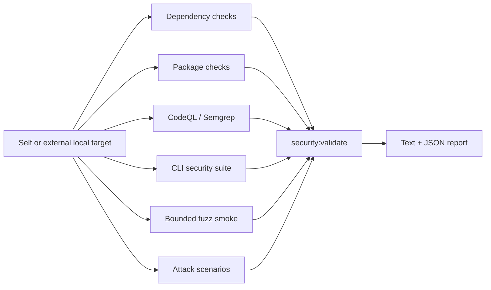

# Security Validation Framework

## Scope

The implemented framework performs automated security validation for local CLI/package projects. It checks whether the target remains safe to inspect and package and whether CLI boundaries fail safely. It is not a hosted-web-application scanner and it is not a manual pentest framework.

Current security properties include:

- local-first and database-free operation
- read-only treatment of user source files
- writes limited to explicit artifact/output locations
- safe path and subprocess handling
- parseable machine output and stderr/stdout separation
- package-content and dependency hygiene
- bounded handling of malformed or large inputs
- profile-aware check selection and scoped-run reporting
- text-report sanitization and JSON structural-injection guarding
- non-destructive validation of target source files by default

Evidence semantics are intentionally conservative. A `SecurityFinding` is a confirmed result under a specific automated rule and may be adapted into an `AuditIssue`. Android `CandidateEvidence` is review-only evidence: it is not a confirmed vulnerability, not a `SecurityFinding`, and never maps directly to an `AuditIssue`.

Android validation is static and non-destructive by default. Its nineteen default checks start zero Gradle operations, zero external-tool processes, and zero network operations. Requested Gradle operations and external tools come from closed allowlists; network access requires a separate explicit opt-in.

## Implemented validation layers

| Layer | Implementation |
|---|---|
| Dependency checks | `npm audit`, runtime-only audit, `npm ls`, `npm outdated`, and optional OSV-Scanner |
| Package checks | `npm pack --dry-run` parsing and forbidden-content detection |
| CLI adversarial checks | path boundaries, read-only boundaries, malformed artifacts, JSON output, subprocess/DOT safety, and bounded data-volume scenarios |
| Attack scenarios | boundary, subprocess, secrets, and network scenarios with profile filtering, payload corpus, evidence, and redaction |
| Static scans | CodeQL availability/execution integration and Semgrep integration |
| Fuzz smoke | deterministic bounded targets for security-sensitive parsers and helpers |
| Validation gate | normalized findings, skips, four-category verdict, fail-on thresholds, verdict-impact reasoning, and text/JSON reports |



## Target-aware validation

All principal security commands accept an optional `--target <path>`. Without it, the lab validates itself. With it, the lab remains the tool root and the selected local project becomes the validation target.

```powershell
npm run security:validate
npm run security:validate -- --target <path>
```

Target resolution reads available package, lockfile, and Git metadata without modifying target source files. Reports identify tool and target roots and default to `reports/security`.

For an external target, `security:validate` runs the target's `npm run test:security` from that target when the script exists. Missing target scripts and optional tools remain explicit in the results.

Validation records target-mutation evidence. It does not clean, reset, or otherwise hide a mutation after the run; an unexpected change must remain visible and affect interpretation.

Target-aware behavior is implemented in:

- `src/securityValidation/validate/resolveTarget.ts`
- `src/securityValidation/validate/runCliSecuritySuiteCheck.ts`
- `src/securityValidation/validate/runSecurityValidation.ts`
- `scripts/security/validate.ts`

## Commands

| Command | Current behavior |
|---|---|
| `npm run security:deps` | Dependency and vulnerability checks |
| `npm run security:package` | Tarball content checks |
| `npm run security:codeql` | CodeQL integration; structured skip when unavailable |
| `npm run security:semgrep` | Semgrep integration; structured skip when unavailable |
| `npm run test:security` | Automated security and adversarial test suite |
| `npm run test:fuzz:smoke` | Bounded deterministic fuzz checks |
| `npm run security:validate` | Orchestrates checks and writes the security report |

See [COMMANDS.md](COMMANDS.md) for arguments and examples.

`security:validate` accepts:
- `--checks deps,package,static,cli-adversarial,fuzz,boundary,subprocess,secrets,network`
- `--profile node-cli-package|local-tool|npm-package|android`
- `--format text|json|text,json`
- `--fail-on blocker|high|medium|low`
- `--out <path>`
- `--report-prefix <name>`

Default behavior is intentionally split:
- No `--profile` and no `--checks`: `deps,package,static,cli-adversarial,fuzz`
- `--profile` without `--checks`: uses that profile's default checks
- Explicit `--checks`: always overrides profile defaults

## Module map

```text
src/securityValidation/
  types.ts
  config.ts
  commandRunner.ts
  artifacts.ts
  dependencies/
  packageChecks/
  cliAdversarial/
  staticScans/
  fuzz/
  validate/
    resolveTarget.ts
    runCliSecuritySuiteCheck.ts
    runSecurityValidation.ts
    verdict.ts
    cliOptions.ts
  attackScenarios/
    attackScenario.ts
    attackResult.ts
    attackProfile.ts
    attackRunner.ts
    payloadCorpus.ts
    exploitEvidence.ts
    reportSchemaGuard.ts
    profiles/
    scenarios/
  report/

scripts/security/
  runDependencyChecks.ts
  runPackageChecks.ts
  runCodeql.ts
  runSemgrep.ts
  runFuzzSmoke.ts
  validate.ts

tests/security/
tests/fuzz/
```

## Reports and verdicts

`security:validate` writes:

- `reports/security/<prefix>-security-validation.txt`
- `reports/security/<prefix>-security-validation.json`

Supported verdicts are:

- ready for release preparation
- not ready: security blocker remains
- ready except optional manual checks
- inconclusive: audit environment incomplete

Optional scanners can be recorded as skipped. A skip is not silently converted into a pass, and its effect is reflected in the verdict and report.

Current attack-scenario coverage:
- `boundary`: target sandbox, package boundary, output boundary, path traversal, config injection, report poisoning
- `subprocess`: subprocess injection
- `secrets`: secret leakage
- `network`: network/local-first assumption

Current profiles:
- `node-cli-package`
- `local-tool`
- `npm-package`
- `android`

Current report/schema details:
- JSON report includes `attackScenarios` and `verdictReasonSummary`
- `verdictImpact` metadata flows from each scenario into the verdict-reason summary
- JSON structural-injection checks compare a clean baseline report with a payload-bearing report, so legitimate additive fields are allowed while payload-created trusted top-level fields are still flagged
- Text report rendering strips ANSI/control-byte content from evidence and recommendations before printing

## Current limitations

- The adversarial suite provides meaningful automated CLI/package coverage, but it is not exhaustive attack simulation.
- Secret scanning is bounded and cannot prove exhaustive secret absence across every possible file or encoding.
- The network/local-first scenario is a bounded static assumption check, not proof of runtime network isolation.
- Profile-specific behavior beyond profile-based selection/default checks is not implemented.
- Package-boundary severity is currently applied at the result level, not per evidence item.
- Some checks depend on locally installed tools or network-backed package metadata.
- CodeQL's full analysis can depend on the configured environment; availability checks and CI integration do not guarantee identical local coverage.
- Symlink and junction scenarios can be operating-system dependent.
- Informational architectural assertions are not equivalent to dynamic network or secret-leakage proofs.
- Manual pentest is deferred until after `v1.0.0`. It is a human-led workflow and is not required for automated Android security validation.
- Runtime behavior, device/emulator testing, APK/AAB inspection, signing verification, Play Console or policy validation, remote Firebase state, Digital Asset Links ownership, automatic fixes, and exhaustive security proof remain outside current scope.

## Fortification status and audit relationship

The current framework keeps automated security validation, the generic audit framework, language-aware code-rot analysis, and Android validation as distinct responsibilities. Their release history is recorded in [CHANGELOG.md](../CHANGELOG.md); the latest release is v0.4.2.

`security:validate` remains the standalone, focused security command. `npm run audit -- --types security` uses an adapter rather than another scanner family. The adapter calls the same exported `runSecurityValidation()` function, maps confirmed findings into the shared issue model, and adds `securitySummary` to audit reports.

Security reports under `reports/security/` remain the complete original output. Audit reports link to them through `securitySummary.reportPaths` instead of duplicating their contents. Neither command invokes the other as a subprocess, and both remain independently runnable.

The audit framework's `code-rot` audit type separately includes a `security-validation-assumption-rot` detector. That detector checks documentation claims about this framework; it does not perform security validation and is unrelated to the `security` audit type. Java/Kotlin code-rot analysis must not be interpreted as Android or JVM security validation.

## Relationship to experiments

Security validation is additive. It does not replace the experiment plugin runtime, controlled experiment behavior, agent adapters, reports, plots, screenshots, or gallery. Both tracks reuse shared target and report infrastructure where appropriate.

The planned `v0.4.3` stage-specific bounded-context and workflow-instruction evaluation work (see [ROADMAP.md](ROADMAP.md)) is a separate, lab-owned track layered on the experiment-plugin runtime, not on security validation. It must not weaken, replace, or be conflated with `security:validate`, the code-rot audit framework, or their verdicts; both existing systems are required to regress cleanly under that future patch.
