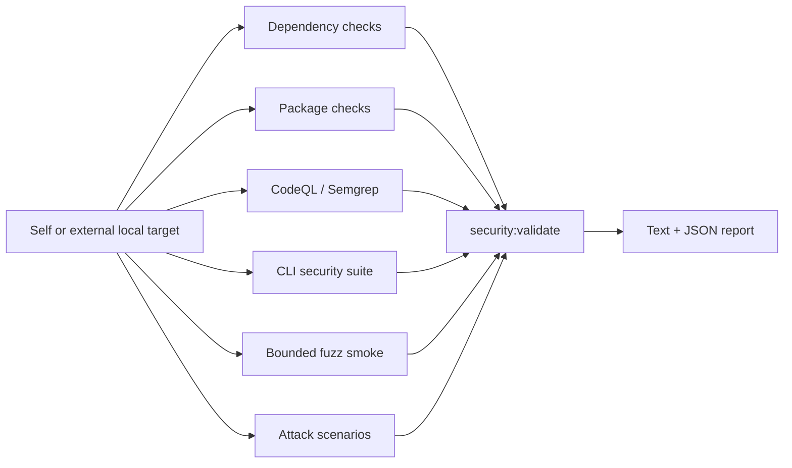

# Security Validation Framework

## Scope

The implemented framework performs automated security validation for local CLI/package projects. It checks whether the target remains safe to inspect and package and whether CLI boundaries fail safely. It is not a hosted-web-application scanner and it is not a manual pentest framework.

Current security properties include:

- local-first and database-free operation
- read-only treatment of user source files
- writes limited to explicit artifact/output locations
- safe path and subprocess handling
- parseable machine output and stderr/stdout separation
- package-content and dependency hygiene
- bounded handling of malformed or large inputs
- profile-aware check selection and scoped-run reporting
- text-report sanitization and JSON structural-injection guarding

## Implemented validation layers

| Layer | Implementation |
|---|---|
| Dependency checks | `npm audit`, runtime-only audit, `npm ls`, `npm outdated`, and optional OSV-Scanner |
| Package checks | `npm pack --dry-run` parsing and forbidden-content detection |
| CLI adversarial checks | path boundaries, read-only boundaries, malformed artifacts, JSON output, subprocess/DOT safety, and bounded data-volume scenarios |
| Attack scenarios | boundary, subprocess, secrets, and network scenarios with profile filtering, payload corpus, evidence, and redaction |
| Static scans | CodeQL availability/execution integration and Semgrep integration |
| Fuzz smoke | deterministic bounded targets for security-sensitive parsers and helpers |
| Validation gate | normalized findings, skips, four-category verdict, fail-on thresholds, verdict-impact reasoning, and text/JSON reports |



## Target-aware validation

All principal security commands accept an optional `--target <path>`. Without it, the lab validates itself. With it, the lab remains the tool root and the selected local project becomes the validation target.

```powershell
npm run security:validate
npm run security:validate -- --target <path>
```

Target resolution reads available package, lockfile, and git metadata without modifying target source files. Reports identify tool and target roots and are written under `reports/security` by default. For an external target, `security:validate` runs the target's `npm run test:security` in the target root when that script exists. Missing target security scripts and optional tool availability are represented explicitly in results.

Target-aware behavior is implemented in:

- `src/securityValidation/validate/resolveTarget.ts`
- `src/securityValidation/validate/runCliSecuritySuiteCheck.ts`
- `src/securityValidation/validate/runSecurityValidation.ts`
- `scripts/security/validate.ts`

## Commands

| Command | Current behavior |
|---|---|
| `npm run security:deps` | Dependency and vulnerability checks |
| `npm run security:package` | Tarball content checks |
| `npm run security:codeql` | CodeQL integration; structured skip when unavailable |
| `npm run security:semgrep` | Semgrep integration; structured skip when unavailable |
| `npm run test:security` | Automated security and adversarial test suite |
| `npm run test:fuzz:smoke` | Bounded deterministic fuzz checks |
| `npm run security:validate` | Orchestrates checks and writes the security report |

See [COMMANDS.md](COMMANDS.md) for arguments and examples.

`security:validate` accepts:
- `--checks deps,package,static,cli-adversarial,fuzz,boundary,subprocess,secrets,network`
- `--profile node-cli-package|local-tool|npm-package`
- `--format text|json|text,json`
- `--fail-on blocker|high|medium|low`
- `--out <path>`
- `--report-prefix <name>`

Default behavior is intentionally split:
- No `--profile` and no `--checks`: `deps,package,static,cli-adversarial,fuzz`
- `--profile` without `--checks`: uses that profile's default checks
- Explicit `--checks`: always overrides profile defaults

## Module map

```text
src/securityValidation/
  types.ts
  config.ts
  commandRunner.ts
  artifacts.ts
  dependencies/
  packageChecks/
  cliAdversarial/
  staticScans/
  fuzz/
  validate/
    resolveTarget.ts
    runCliSecuritySuiteCheck.ts
    runSecurityValidation.ts
    verdict.ts
    cliOptions.ts
  attackScenarios/
    attackScenario.ts
    attackResult.ts
    attackProfile.ts
    attackRunner.ts
    payloadCorpus.ts
    exploitEvidence.ts
    reportSchemaGuard.ts
    profiles/
    scenarios/
  report/

scripts/security/
  runDependencyChecks.ts
  runPackageChecks.ts
  runCodeql.ts
  runSemgrep.ts
  runFuzzSmoke.ts
  validate.ts

tests/security/
tests/fuzz/
```

## Reports and verdicts

`security:validate` writes:

- `reports/security/<prefix>-security-validation.txt`
- `reports/security/<prefix>-security-validation.json`

Supported verdicts are:

- ready for release preparation
- not ready: security blocker remains
- ready except optional manual checks
- inconclusive: audit environment incomplete

Optional scanners can be recorded as skipped. A skip is not silently converted into a pass, and its effect is reflected in the verdict and report.

Current attack-scenario coverage:
- `boundary`: target sandbox, package boundary, output boundary, path traversal, config injection, report poisoning
- `subprocess`: subprocess injection
- `secrets`: secret leakage
- `network`: network/local-first assumption

Current profiles:
- `node-cli-package`
- `local-tool`
- `npm-package`

Current report/schema details:
- JSON report includes `attackScenarios` and `verdictReasonSummary`
- `verdictImpact` metadata flows from each scenario into the verdict-reason summary
- JSON structural-injection checks compare a clean baseline report with a payload-bearing report, so legitimate additive fields are allowed while payload-created trusted top-level fields are still flagged
- Text report rendering strips ANSI/control-byte content from evidence and recommendations before printing

## Current limitations

- The adversarial suite provides meaningful automated CLI/package coverage, but it is not exhaustive attack simulation.
- Secret scanning is bounded and cannot prove exhaustive secret absence across every possible file or encoding.
- The network/local-first scenario is a bounded static assumption check, not proof of runtime network isolation.
- Profile-specific behavior beyond profile-based selection/default checks is not implemented.
- Package-boundary severity is currently applied at the result level, not per evidence item.
- Some checks depend on locally installed tools or network-backed package metadata.
- CodeQL's full analysis can depend on the configured environment; availability checks and CI integration do not guarantee identical local coverage.
- Symlink and junction scenarios can be operating-system dependent.
- Informational architectural assertions are not equivalent to dynamic network or secret-leakage proofs.
- Manual pentest is deferred until after `v1.0.0`. It is a human-led workflow and is not required for automated Android security validation.

## Fortification status and audit relationship

`v0.4.1` is the current published npm baseline (package metadata `0.4.1`). The v0.3.x releases remain the published audit/code-rot history. It keeps the `v0.2.2` security-validation fortification and the `v0.3.0` generic audit framework as a separate tool, and builds on the `v0.3.1` language-aware TypeScript/JavaScript code-rot substrate and the `v0.3.2` security-validation audit adapter. `v0.3.3` extended code-rot support to Java/Kotlin, but it does not add Java/Kotlin security validation, Android validation, or any new `security:validate` behavior. `v0.3.4` does not change security command names or the security report schema.

`security:validate` remains standalone and is the primary, focused command for security validation. `npm run audit -- --types security` is now implemented as an *adapter*, not a new security-scanner family: it calls `runSecurityValidation()` (the same exported function `security:validate` calls) directly, maps the resulting findings into the shared audit issue model, and adds a `securitySummary` field to the audit JSON/text report. Security reports under `reports/security/` remain the original, unchanged output — the audit report links to them (via `securitySummary.reportPaths`) rather than duplicating their contents. `npm run audit` does not shell out to `security:validate`, and `security:validate` does not call the audit framework; the two commands remain independently runnable, and the adapter does not replace or redesign `security:validate`.

The audit framework's `code-rot` audit type separately includes a `security-validation-assumption-rot` detector, which only checks whether documentation makes stale or inaccurate claims about the security-validation framework; it does not itself perform any security validation and is unrelated to the `security` audit type / adapter described above. Android automated security validation is implemented and published through v0.4.1. The Android-aware extension of the existing security audit adapter is implemented on the v0.4.2 feature branch but remains unreleased. The published `v0.3.3` Java/Kotlin code-rot work must not be read as Android or JVM security-validation support.

## Relationship to experiments

Security validation is additive. It does not replace the experiment plugin runtime, controlled experiment behavior, agent adapters, reports, plots, screenshots, or gallery. Both tracks reuse shared target and report infrastructure where appropriate.
