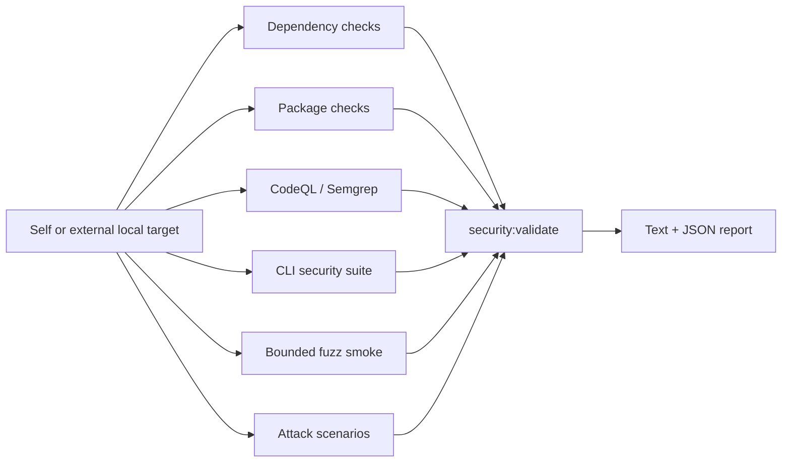

# Security Validation Framework

## Scope

The implemented framework performs automated security validation for local CLI/package projects. It checks whether the target remains safe to inspect and package and whether CLI boundaries fail safely. It is not a hosted-web-application scanner and it is not a manual pentest framework.

Current security properties include:

- local-first and database-free operation
- read-only treatment of user source files
- writes limited to explicit artifact/output locations
- safe path and subprocess handling
- parseable machine output and stderr/stdout separation
- package-content and dependency hygiene
- bounded handling of malformed or large inputs
- profile-aware check selection and scoped-run reporting
- text-report sanitization and JSON structural-injection guarding
- non-destructive validation of target source files by default

Evidence semantics are intentionally conservative. A `SecurityFinding` is a confirmed result under a specific automated rule and may be adapted into an `AuditIssue`. Android `CandidateEvidence` is review-only evidence: it is not a confirmed vulnerability, not a `SecurityFinding`, and never maps directly to an `AuditIssue`.

Android validation is static and non-destructive by default. Its nineteen default checks start zero Gradle operations, zero external-tool processes, and zero network operations. Requested Gradle operations and external tools come from closed allowlists; network access requires a separate explicit opt-in.

## Implemented validation layers

| Layer | Implementation |
|---|---|
| Dependency checks | `npm audit`, runtime-only audit, `npm ls`, `npm outdated`, and optional OSV-Scanner |
| Package checks | `npm pack --dry-run` parsing and forbidden-content detection |
| CLI adversarial checks | path boundaries, read-only boundaries, malformed artifacts, JSON output, subprocess/DOT safety, and bounded data-volume scenarios |
| Attack scenarios | boundary, subprocess, secrets, and network scenarios with profile filtering, payload corpus, evidence, and redaction |
| Static scans | Local CodeQL CLI availability preflight, GitHub-hosted full CodeQL analysis, and Semgrep integration |
| Fuzz smoke | deterministic bounded targets for security-sensitive parsers and helpers |
| Validation gate | normalized findings, skips, four-category verdict, fail-on thresholds, verdict-impact reasoning, and text/JSON reports |


```mermaid
flowchart LR
  Target[Self or external local target] --> Dependency[Dependency checks]
  Target --> Package[Package checks]
  Target --> Static[CodeQL / Semgrep]
  Target --> CLI[CLI security suite]
  Target --> Fuzz[Bounded fuzz smoke]
  Target --> Scenarios[Attack scenarios]
  Dependency --> Gate[security:validate]
  Package --> Gate
  Static --> Gate
  CLI --> Gate
  Fuzz --> Gate
  Scenarios --> Gate
  Gate --> Report[Text + JSON report]
```

## Target-aware validation

All principal security commands accept an optional `--target <path>`. Without it, the lab validates itself. With it, the lab remains the tool root and the selected local project becomes the validation target.

```powershell
npm run security:validate
npm run security:validate -- --target <path>
```

Target resolution reads available package, lockfile, and Git metadata without modifying target source files. Reports identify tool and target roots and default to `reports/security`.

For an external target, `security:validate` runs the target's `npm run test:security` from that target when the script exists. Missing target scripts and optional tools remain explicit in the results.

Validation records target-mutation evidence. It does not clean, reset, or otherwise hide a mutation after the run; an unexpected change must remain visible and affect interpretation.

Target-aware behavior is implemented in:

- `src/securityValidation/validate/resolveTarget.ts`
- `src/securityValidation/validate/runCliSecuritySuiteCheck.ts`
- `src/securityValidation/validate/runSecurityValidation.ts`
- `scripts/security/validate.ts`

## Commands

| Command | Current behavior |
|---|---|
| `npm run security:deps` | Dependency and vulnerability checks |
| `npm run security:package` | Tarball content checks |
| `npm run security:codeql` | Local CodeQL CLI availability/integration preflight; structured skip when unavailable |
| `npm run security:semgrep` | Semgrep integration; structured skip when unavailable |
| `npm run test:security` | Automated security and adversarial test suite |
| `npm run test:fuzz:smoke` | Bounded deterministic fuzz checks |
| `npm run security:validate` | Orchestrates checks and writes the security report |

See [COMMANDS.md](COMMANDS.md) for arguments and examples.

`security:validate` accepts:
- `--checks deps,package,static,cli-adversarial,fuzz,boundary,subprocess,secrets,network`
- `--profile node-cli-package|local-tool|npm-package|android`
- `--format text|json|text,json`
- `--fail-on blocker|high|medium|low`
- `--out <path>`
- `--report-prefix <name>`

Default behavior is intentionally split:
- No `--profile` and no `--checks`: `deps,package,static,cli-adversarial,fuzz`
- `--profile` without `--checks`: uses that profile's default checks
- Explicit `--checks`: always overrides profile defaults

## Module map

```text
src/securityValidation/
  types.ts
  config.ts
  commandRunner.ts
  artifacts.ts
  dependencies/
  packageChecks/
  cliAdversarial/
  staticScans/
  fuzz/
  validate/
    resolveTarget.ts
    runCliSecuritySuiteCheck.ts
    runSecurityValidation.ts
    verdict.ts
    cliOptions.ts
  attackScenarios/
    attackScenario.ts
    attackResult.ts
    attackProfile.ts
    attackRunner.ts
    payloadCorpus.ts
    exploitEvidence.ts
    reportSchemaGuard.ts
    profiles/
    scenarios/
  report/

scripts/security/
  runDependencyChecks.ts
  runPackageChecks.ts
  runCodeql.ts
  runSemgrep.ts
  runFuzzSmoke.ts
  validate.ts

tests/security/
tests/fuzz/
```

## Reports and verdicts

`security:validate` writes:

- `reports/security/<prefix>-security-validation.txt`
- `reports/security/<prefix>-security-validation.json`

Supported verdicts are:

- ready for release preparation
- not ready: security blocker remains
- ready except optional manual checks
- inconclusive: audit environment incomplete

Optional scanners can be recorded as skipped. A skip is not silently converted into a pass, and its effect is reflected in the verdict and report.

### CodeQL coverage contract

CodeQL has separate local and hosted responsibilities:

- **Local preflight:** `npm run security:codeql` checks whether a local CodeQL CLI can be resolved and responds to a version request. If unavailable, its result is `skipped`, never `passed`. A functional local CLI result confirms availability only; it does not build or analyze a repository database.
- **GitHub full analysis:** [`.github/workflows/codeql.yml`](../.github/workflows/codeql.yml) uses CodeQL advanced setup for the JavaScript/TypeScript implementation and GitHub Actions workflows, then uploads analysis to GitHub Code Scanning.
- **Release readiness:** requires a successful CodeQL workflow for the exact candidate SHA, GitHub-recorded CodeQL analyses for that SHA and expected language/category coverage, and review of open applicable CodeQL alerts. Unresolved alerts must be surfaced for explicit classification or correction; they are not auto-dismissed.

The local `security:validate` verdict remains deterministic and local. `READY EXCEPT OPTIONAL MANUAL CHECKS` may include a skipped local CodeQL preflight; that verdict alone is not release-readiness evidence. Release readiness separately requires the exact-SHA GitHub analysis and alert review described above.

Current attack-scenario coverage:
- `boundary`: target sandbox, package boundary, output boundary, path traversal, config injection, report poisoning
- `subprocess`: subprocess injection
- `secrets`: secret leakage
- `network`: network/local-first assumption

Current profiles:
- `node-cli-package`
- `local-tool`
- `npm-package`
- `android`

Current report/schema details:
- JSON report includes `attackScenarios` and `verdictReasonSummary`
- `verdictImpact` metadata flows from each scenario into the verdict-reason summary
- JSON structural-injection checks compare a clean baseline report with a payload-bearing report, so legitimate additive fields are allowed while payload-created trusted top-level fields are still flagged
- Text report rendering strips ANSI/control-byte content from evidence and recommendations before printing

## Current limitations

- The adversarial suite provides meaningful automated CLI/package coverage, but it is not exhaustive attack simulation.
- Secret scanning is bounded and cannot prove exhaustive secret absence across every possible file or encoding.
- The network/local-first scenario is a bounded static assumption check, not proof of runtime network isolation.
- Profile-specific behavior beyond profile-based selection/default checks is not implemented.
- Package-boundary severity is currently applied at the result level, not per evidence item.
- Some checks depend on locally installed tools or network-backed package metadata.
- Local CodeQL CLI availability does not prove full analysis. The version-controlled GitHub advanced-setup workflow owns full repository analysis; each release candidate still requires its own successful run and alert review.
- Symlink and junction scenarios can be operating-system dependent.
- Informational architectural assertions are not equivalent to dynamic network or secret-leakage proofs.
- Manual pentest is deferred until after `v1.0.0`. It is a human-led workflow and is not required for automated Android security validation.
- Runtime behavior, device/emulator testing, APK/AAB inspection, signing verification, Play Console or policy validation, remote Firebase state, Digital Asset Links ownership, automatic fixes, and exhaustive security proof remain outside current scope.

## Fortification status and audit relationship

The current framework keeps automated security validation, the generic audit framework, language-aware code-rot analysis, and Android validation as distinct responsibilities. Their release history is recorded in [CHANGELOG.md](../CHANGELOG.md). The v0.4.6 release added an installed CLI route (`my-dev-kit-lab security validate`) that calls the same standalone command owner as `npm run security:validate`, with implicit report output rooted under the installed CLI's writable workspace instead of the package root. The subsequent v0.4.7, v0.4.8, and v0.4.9 releases do not change any security check, verdict rule, or evidence semantic described in this document. Current release identity is maintained in [CURRENT_STATE.md](CURRENT_STATE.md), while `npm run security:validate` from a source checkout remains available alongside the installed CLI route.

`security:validate` remains the standalone, focused security command. `npm run audit -- --types security` uses an adapter rather than another scanner family. The adapter calls the same exported `runSecurityValidation()` function, maps confirmed findings into the shared issue model, and adds `securitySummary` to audit reports.

Security reports under `reports/security/` remain the complete original output. Audit reports link to them through `securitySummary.reportPaths` instead of duplicating their contents. Neither command invokes the other as a subprocess, and both remain independently runnable.

The audit framework's `code-rot` audit type separately includes a `security-validation-assumption-rot` detector. That detector checks documentation claims about this framework; it does not perform security validation and is unrelated to the `security` audit type. Java/Kotlin code-rot analysis must not be interpreted as Android or JVM security validation.

## Relationship to experiments

Security validation is additive. It does not replace the experiment plugin runtime, controlled experiment behavior, agent adapters, reports, plots, screenshots, or gallery. Both tracks reuse shared target and report infrastructure where appropriate.

The `v0.4.3` stage-specific bounded-context and workflow-instruction evaluation work (published — see [ROADMAP.md](ROADMAP.md)) is a separate, lab-owned track layered on the experiment-plugin runtime, not on security validation. It does not weaken, replace, or conflate with `security:validate` or the code-rot audit framework; both existing systems regress cleanly under this implementation, verified through the focused `v0.4.3` and evaluation/experiment test suites, as well as the full pre-release readiness regression (including `security:validate` and `npm run audit`) that ran before publication.

### Agent-success-rate safety boundaries (v0.9.0)

The `agent-success-rate` experiment (added in v0.9.0) runs benchmark tasks and, only on explicit opt-in, an external coding-agent CLI. It is an experiment, not a security validator, and it does not turn automated validation into manual penetration testing. Its boundaries are:

- **Controlled projects only:** it evaluates two bundled, dependency-free benchmark projects; `--target` is rejected, and canonical projects and the installed package are never written to.
- **Guarded disposable copies:** every attempt runs in a fresh copy created and removed under ownership checks; a cleanup failure is reported, prevents a clean success, and never triggers a repair.
- **Source-only provider context:** the provider receives the public task text and source context. Tests, trusted checks, behavior-fact definitions, edit scopes, and reference patches stay evaluator-side; repair feedback uses a fixed vocabulary plus the untrusted previous diff.
- **No direct agent editing:** the provider returns a unified diff over standard input; the Lab validates it against a patch path policy (allowed paths only, protected files and traversal rejected), checks it with Git, and applies it itself. Protected-file integrity is verified after the patch.
- **Restricted invocation:** providers run only with explicit `--agent` and `--include-real-agents`, with fixed restricted argument lists, a timeout (default 240000 ms, maximum 1800000 ms), and an empty neutral working directory.
- **Process-error handling:** the shared measured-command runner records errors from child output streams on the command result, so a failed process start is a reported failure and not an unhandled exception.

Limits: the neutral working directory is not full operating-system isolation, the provider inherits the host environment and account permissions, and the Lab does not guarantee prevention of every malicious provider action. Very long Windows paths are not made to work; they end as controlled infrastructure failures.
